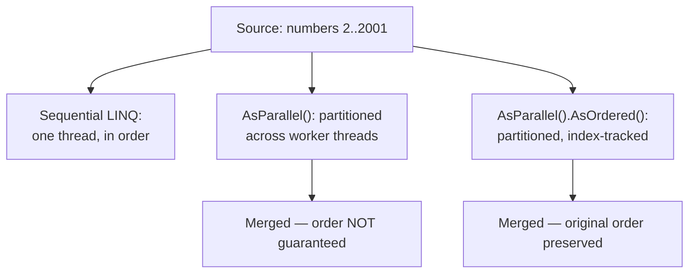
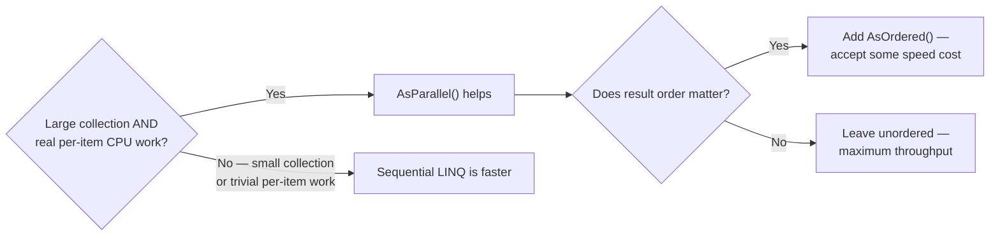

# PLINQ — Parallel LINQ

## Introduction

Before reading this lesson, you should already be comfortable with **[Parallel.Invoke](../07-concurrency-parallel-async/07-20-parallel-invoke.md)** and, more broadly, with `Parallel.For`/`Parallel.ForEach` from two lessons back. Both of those are explicit, imperative loops — you write the `for` or `foreach` yourself and hand the runtime the body to parallelize. This lesson introduces a declarative alternative: if the work you want to parallelize is already expressed as a LINQ query — a `Where`, a `Select`, an `OrderBy` — you can often parallelize the *entire query* with a single extra call, no rewritten loop required.

By the end of this lesson, you will be able to:

- Turn an existing LINQ query into a parallelized query with `.AsParallel()`
- Preserve the original element ordering through a parallel query with `.AsOrdered()`, and explain its performance cost
- Recognize when PLINQ helps — CPU-bound per-element work over a large collection
- Recognize when PLINQ hurts — small collections, where coordination overhead exceeds any benefit
- Drop back to sequential execution mid-query with `.AsSequential()` when it's the better choice

## PLINQ — A Layman's Perspective

Picture a teacher facing a stack of ten thousand standardized exam papers, each needing the same multi-step treatment: check whether the student passed a minimum threshold, compute a letter grade, and set the paper aside. Working through the stack alone, one paper at a time, following the same checklist for each, is the ordinary way a single LINQ query already runs — a filter step, then a transform step, applied to one item after another until the stack is empty.

Now imagine handing bundles of that same stack to four other teachers, each given the exact same checklist, all grading simultaneously. The whole batch gets through far faster, because four people are genuinely applying the checklist to four different papers at the same instant. But there's an immediate practical question this raises: when all five teachers bring their graded bundles back to be combined into one final stack, does it matter which paper ends up on top? If the answer is "no, I just need every paper graded, in whatever order they land," you're done — just gather all five bundles into one pile. But if the answer is "yes, these need to come back in exactly the original hand-in order, because a separate roster is numbered to match," then someone has to do extra bookkeeping — tracking each paper's original position and re-sorting the combined pile to match it. That bookkeeping is real work, and it eats into the very speed advantage that having five teachers gave you in the first place.

And there's a second, equally important question this analogy raises: is it even worth pulling in four extra teachers for a bundle of *five* exam papers? Rounding everyone up, explaining the checklist, and reassembling five separate hand-backs takes longer than one teacher just grading five papers directly. The coordination itself has a cost, and for a small enough stack, that cost swallows the entire benefit. PLINQ faces exactly this same trade-off every time you call `.AsParallel()`: spreading a LINQ query's per-item work across several workers helps enormously on a huge collection doing real work per item, costs a little extra to keep results in original order, and can actually make a small query slower than just leaving it alone.

## PLINQ — A Programming Language Perspective

**PLINQ** — Parallel LINQ — is implemented by `System.Linq.ParallelEnumerable` in the `System.Linq` namespace. Calling the extension method `.AsParallel()` on any `IEnumerable<T>` returns a `ParallelQuery<T>`, and every standard LINQ operator chained after it (`Where`, `Select`, `OrderBy`, and the rest) now executes across multiple threads from the `ThreadPool` instead of running sequentially on the calling thread. By default, a `ParallelQuery<T>`'s results are **not guaranteed to preserve the original source order** — PLINQ favors raw throughput over ordering unless told otherwise. Calling `.AsOrdered()` on the parallel query switches on order-preservation: PLINQ tracks each element's original index through the pipeline and merges results back into that order before handing them to you, at some cost to parallel speedup. `.AsSequential()` exits back to ordinary, single-threaded LINQ partway through a chain, and `.WithDegreeOfParallelism(n)` caps how many threads the query is allowed to use. None of this is new to C# 14 — PLINQ has existed since .NET 4.0 — but it remains a directly relevant, low-effort way to parallelize a CPU-bound LINQ pipeline in .NET 10.

## How to Use AsParallel and AsOrdered in C#

The safest way to see the ordering difference is to compare an unordered parallel query against one explicitly marked `.AsOrdered()`. Because an unordered parallel query's result sequence isn't guaranteed to match the source order, the example below only compares its *count* against the sequential version — the ordered version, by contrast, is safe to print directly, since `.AsOrdered()` guarantees it matches the original sequence.


*Figure 1: `.AsParallel()` alone merges results as they finish; `.AsOrdered()` pays extra to merge them back into source order.*

```csharp
// Program.cs — .NET 10 / C# 14
int[] numbers = Enumerable.Range(2, 2000).ToArray();

List<int> sequentialPrimes = numbers.Where(IsPrime).ToList();
List<int> parallelPrimes = numbers.AsParallel().Where(IsPrime).ToList();

Console.WriteLine($"Sequential found {sequentialPrimes.Count} primes.");
Console.WriteLine($"Parallel (unordered) found {parallelPrimes.Count} primes.");
// parallelPrimes' element order is not guaranteed to match 'numbers' order —
// only the count is safe to compare directly here.

List<int> orderedParallelPrimes = numbers.AsParallel().AsOrdered().Where(IsPrime).ToList();
Console.WriteLine($"First 5 primes via AsOrdered (matches original sequence order): {string.Join(", ", orderedParallelPrimes.Take(5))}");

static bool IsPrime(int number)
{
    if (number < 2) return false;
    for (int divisor = 2; divisor * divisor <= number; divisor++)
    {
        if (number % divisor == 0) return false;
    }
    return true;
}
```

**Console Output:**

```text
Sequential found 303 primes.
Parallel (unordered) found 303 primes.
First 5 primes via AsOrdered (matches original sequence order): 2, 3, 5, 7, 11
```

Both the sequential and unordered-parallel queries agree on *how many* primes exist below 2002 — 303 — because `.AsParallel()` never changes what a query computes, only how the work is scheduled and in what order results arrive. The `AsOrdered` query pays PLINQ's index-tracking cost, and in exchange it's safe to print its first five elements directly, knowing with certainty they'll be `2, 3, 5, 7, 11` — the same order they'd appear in with no parallelism involved at all.

## Real-Time Example: Nightly ISBN Validation in Library/Inventory Management

We extend the Library/Inventory Management domain with a nightly catalog-import job that validates the ISBN-13 checksum of every book record received from a supplier feed — a per-item computation that's genuinely CPU-bound, making it a reasonable PLINQ candidate even though this illustrative catalog is small. `.AsOrdered()` is used deliberately here, because the validation report below needs to read back in the same order the catalog was received, for an operator cross-checking it against the supplier's own manifest.

```csharp
// Program.cs — .NET 10 / C# 14 — Real-Time Example
List<BookRecord> catalog =
[
    new BookRecord("9780134685991", "Effective Java"),
    new BookRecord("9780132350884", "Clean Code"),
    new BookRecord("9780201633610", "Design Patterns"),
    new BookRecord("9780000000009", "Damaged Import Record"),
    new BookRecord("9780596007126", "Head First Design Patterns"),
    new BookRecord("9781491950357", "Building Microservices")
];

List<(BookRecord Book, bool IsValid)> validation = catalog
    .AsParallel()
    .AsOrdered() // Preserve catalog order for the report below.
    .Select(book => (Book: book, IsValid: HasValidIsbn13Checksum(book.Isbn)))
    .ToList();

Console.WriteLine("Nightly catalog ISBN validation report:");
foreach (var (book, isValid) in validation)
{
    string status = isValid ? "OK" : "INVALID CHECKSUM";
    Console.WriteLine($"  {book.Isbn} — {book.Title}: {status}");
}

int invalidCount = validation.Count(v => !v.IsValid);
Console.WriteLine($"{invalidCount} record(s) flagged for re-import.");

static bool HasValidIsbn13Checksum(string isbn)
{
    if (isbn.Length != 13 || !isbn.All(char.IsDigit)) return false;

    int sum = 0;
    for (int i = 0; i < 12; i++)
    {
        int digit = isbn[i] - '0';
        sum += (i % 2 == 0) ? digit : digit * 3;
    }

    int checkDigit = (10 - (sum % 10)) % 10;
    return checkDigit == (isbn[12] - '0');
}

record BookRecord(string Isbn, string Title);
```

**Console Output:**

```text
Nightly catalog ISBN validation report:
  9780134685991 — Effective Java: OK
  9780132350884 — Clean Code: OK
  9780201633610 — Design Patterns: OK
  9780000000009 — Damaged Import Record: INVALID CHECKSUM
  9780596007126 — Head First Design Patterns: OK
  9781491950357 — Building Microservices: OK
1 record(s) flagged for re-import.
```

`.AsOrdered()` is what makes it safe for this report to read top-to-bottom in exactly the order the supplier feed sent the records, even though the checksum for each book was potentially computed on a completely different thread from its neighbors. In a real import pipeline, a catalog batch is thousands of records rather than six, and that's exactly where PLINQ's per-record checksum work — genuinely CPU-bound, genuinely independent — starts to noticeably outrun a single-threaded loop.

## PLINQ vs Sequential LINQ

The decision to reach for `.AsParallel()` comes down to the same two questions raised throughout this lesson: is there enough per-item work to make splitting it across threads worthwhile, and does the result need to come back in original order? A large collection where each element requires real, independent CPU work — parsing, validating, scoring, hashing — is PLINQ's sweet spot; ordinary sequential LINQ is single-threaded by design and simply can't use a second core no matter how much work is queued up. But PLINQ's partitioning, thread dispatch, and result-merging all cost something, and for a handful of elements — or elements that are trivially cheap to process — that overhead can easily exceed whatever time parallel execution saves, making the sequential version faster in practice. `.AsOrdered()` narrows the gap further still: preserving order requires tracking and re-merging by original index, which is strictly more work than accepting results in whatever order they finish.


*Figure 2: Whether PLINQ helps at all, and whether `.AsOrdered()` is worth its cost, both depend on the shape of the actual workload.*

| Aspect | Sequential LINQ | PLINQ (`.AsParallel()`) |
|---|---|---|
| Execution | Single thread, one element at a time | Partitioned across multiple threads |
| Result order (default) | Always matches source order | Not guaranteed, unless `.AsOrdered()` is added |
| Best suited for | Small collections, or cheap per-element work | Large collections with real per-element CPU work |
| Overhead | Effectively none | Partitioning, thread dispatch, and (if ordered) index-tracking |
| Opting back out | N/A | `.AsSequential()` mid-chain |

## Types and Variants of PLINQ Operators in C#

1. **[Parallel.For and Parallel.ForEach](../07-concurrency-parallel-async/07-19-parallel-for-and-foreach.md)** — the imperative, explicit-loop counterpart to PLINQ's declarative query style.
2. **`.WithDegreeOfParallelism(n)`** — capping how many threads a PLINQ query uses, PLINQ's equivalent of `MaxDegreeOfParallelism`.
3. **`.AsSequential()`** — dropping back to ordinary sequential LINQ partway through a query chain.
4. **`.WithCancellation(token)`** — cooperatively cancelling a running PLINQ query.
5. **`ParallelExecutionMode.ForceParallelism`** — overriding PLINQ's own heuristic, which sometimes runs a query sequentially anyway when the input looks too small to benefit.
6. **[Task Parallel Library Patterns](../07-concurrency-parallel-async/07-22-task-parallel-library-patterns.md)** — the broader umbrella that `Parallel`, `Task`, and PLINQ all sit under.

## What You've Learned & What's Next

`.AsParallel()` turns an ordinary LINQ query into one whose per-element work is spread across multiple threads, trading away guaranteed result ordering for throughput unless you explicitly add `.AsOrdered()` back in. Like every tool in this sub-area, it earns its keep on large collections doing genuine CPU-bound per-element work, and can actively hurt performance on small or cheap workloads where its coordination overhead dominates.

Continue your learning journey with **[Task Parallel Library Patterns](../07-concurrency-parallel-async/07-22-task-parallel-library-patterns.md)**, where we step back and look at `Task`, `Parallel`, and PLINQ as three faces of one underlying library, and build a multi-stage parallel pipeline out of `Task`s.

---
*Applies to: .NET 10 / C# 14. Last reviewed 2026-08-16.*
