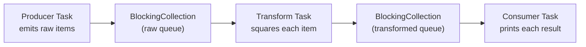
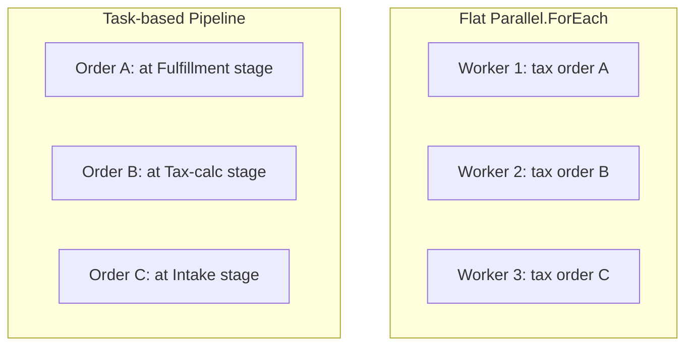

# Task Parallel Library Patterns

## Introduction

Before reading this lesson, you should already be comfortable with **[PLINQ — Parallel LINQ](../07-concurrency-parallel-async/07-21-plinq-parallel-linq.md)**, `Parallel.Invoke`, and `Parallel.For`/`Parallel.ForEach`. It's worth naming something those three lessons have in common that hasn't been said out loud yet: every one of them is built on the same underlying machinery — the Task Parallel Library. This lesson steps back to see that umbrella clearly, and then goes a level higher still, to a pattern that combines `Task`s directly rather than reaching for `Parallel` or PLINQ at all: a multi-stage **pipeline**, where different pieces of work sit at different stages simultaneously.

By the end of this lesson, you will be able to:

- Explain that `Task`, `Parallel`, and PLINQ are three faces of one underlying library — the TPL
- Build a multi-stage parallel pipeline using `Task`s, where each stage's output feeds the next
- Use `BlockingCollection<T>` to hand work safely between pipeline stages
- Recognize when a pipeline pattern is a better fit than a flat `Parallel.For`/`Parallel.ForEach` loop
- Shut a pipeline down cleanly once the producer has no more work to hand off

## Task Parallel Library Patterns — A Layman's Perspective

Picture a car wash with three distinct stations set up in a row: a wash station, a wax station, and a dry station, each staffed by its own dedicated worker. A car doesn't wait at the entrance until every car ahead of it has completely finished all three stations before it's allowed to start — it simply pulls into the wash station as soon as that station is free, while the car ahead of it has already moved on to waxing, and the car ahead of *that* one is already being dried. At any given moment, three different cars are three different stages into the process, all making progress at the exact same time, even though there's only one worker at each individual station.

This is a fundamentally different shape from the apple-inspection warehouse a few lessons back. There, every worker did the *same* job — inspect an apple — to a different apple. Here, every worker does a *different* job, and any one car passes through all of them in sequence. The speedup doesn't come from splitting one job across many hands; it comes from letting several cars be at several different stages simultaneously, so the wash station never sits idle waiting for the dry station to finish with an earlier car. A car wash that instead insisted on "wash every car first, then wax every car, then dry every car" would work correctly, but it would waste the wax and dry stations entirely while the wash-everyone phase runs, and waste the wash and wax stations while the dry-everyone phase runs.

There's one more detail that makes a real car wash work smoothly rather than descend into chaos: cars can't simply be shoved from one station straight into the next the instant the first worker is done — there needs to be a small, safe holding area between stations, so a car finishing the wash doesn't have to wait for the wax worker to be looking, and the wax worker doesn't have to sprint over and grab it mid-motion. That holding area is exactly what a thread-safe queue provides between two pipeline stages in code: a safe handoff point that lets one stage keep producing without needing to block on the next stage being ready to receive, right up until the queue tells everyone downstream, "that's the last car — nothing more is coming."

## Task Parallel Library Patterns — A Programming Language Perspective

The **Task Parallel Library (TPL)**, in the `System.Threading.Tasks` namespace, is the umbrella term for .NET's task-based concurrency and parallelism model. `Task`/`Task<T>` represent a single unit of asynchronous or parallel work; the `Parallel` class (`Parallel.For`, `Parallel.ForEach`, `Parallel.Invoke`) provides data-parallel and fixed-action loop constructs built on top of `Task`; and PLINQ (`System.Linq.ParallelEnumerable`) provides a declarative, query-based entry point into the same underlying thread-pool scheduler. All three ultimately schedule work as `Task` instances onto the shared `ThreadPool`.

A **pipeline** is a higher-level pattern built directly from `Task`s rather than from `Parallel` or PLINQ: each stage of a multi-step process runs as its own long-lived `Task`, consuming items from one thread-safe collection and producing items into another. `System.Collections.Concurrent.BlockingCollection<T>` is the collection typically used for this handoff — its `Add` method is safe to call from a producer thread, its `GetConsumingEnumerable()` method blocks a consumer until an item is available, and its `CompleteAdding()` method signals "no more items are coming," letting a consumer's `foreach` loop end gracefully instead of blocking forever. Unlike a flat `Parallel.ForEach` loop, where every worker does the same job to a different item, a pipeline lets *different* items sit at *different* stages of a multi-step job simultaneously.

## How to Build a Task-Based Pipeline in C#

A minimal three-stage pipeline needs two `BlockingCollection<T>` instances — one handing raw items from the producer to the transformer, one handing transformed items from the transformer to the consumer — and one long-running `Task` per stage.


*Figure 1: Each stage runs as its own `Task`, handing items to the next stage through a `BlockingCollection<T>`.*

```csharp
// Program.cs — .NET 10 / C# 14
using System.Collections.Concurrent;

using BlockingCollection<int> rawNumbers = new();
using BlockingCollection<int> squaredNumbers = new();

Task producer = Task.Run(() =>
{
    foreach (int n in Enumerable.Range(1, 5))
    {
        Console.WriteLine($"[Producer]   emitting {n}");
        rawNumbers.Add(n);
        Thread.Sleep(30); // Simulates a slower upstream data source.
    }
    rawNumbers.CompleteAdding();
});

Task transformer = Task.Run(() =>
{
    foreach (int n in rawNumbers.GetConsumingEnumerable())
    {
        int squared = n * n;
        Console.WriteLine($"[Transform]  {n} -> {squared}");
        squaredNumbers.Add(squared);
    }
    squaredNumbers.CompleteAdding();
});

Task consumer = Task.Run(() =>
{
    foreach (int squared in squaredNumbers.GetConsumingEnumerable())
    {
        Console.WriteLine($"[Consumer]   received {squared}");
    }
});

Task.WaitAll(producer, transformer, consumer);
Console.WriteLine("Pipeline complete.");
```

**Console Output:**

```text
[Producer]   emitting 1
[Transform]  1 -> 1
[Consumer]   received 1
[Producer]   emitting 2
[Transform]  2 -> 4
[Consumer]   received 2
[Producer]   emitting 3
[Transform]  3 -> 9
[Consumer]   received 3
[Producer]   emitting 4
[Transform]  4 -> 16
[Consumer]   received 4
[Producer]   emitting 5
[Transform]  5 -> 25
[Consumer]   received 5
Pipeline complete.
```

Because all three stages run as genuinely concurrent `Task`s, the exact interleaving of lines from different stages is not strictly guaranteed by the runtime — here the producer's deliberate 30ms pause between items gives the transform and consumer stages ample time to fully drain each item before the next one arrives, which is what produces this clean, one-item-at-a-time pattern in practice. `GetConsumingEnumerable()` is what lets the transformer and consumer *block* efficiently while waiting for the next item rather than spinning in a loop checking for one, and `CompleteAdding()` on each queue is what lets both downstream `foreach` loops end on their own once the upstream stage is truly finished, rather than hanging forever waiting for one more item that will never come.

## Real-Time Example: An Order-Confirmation Pipeline in E-Commerce Order Processing

We extend the E-Commerce Order Processing domain with a three-stage pipeline: an intake stage receives raw incoming orders, a tax-calculation stage computes each order's tax and total, and a fulfillment stage confirms the charge. Structuring this as a pipeline means the tax calculation for order 1 can be running while intake is still receiving order 2 — a real overlap a flat loop wouldn't give you.

```csharp
// Program.cs — .NET 10 / C# 14 — Real-Time Example
using System.Collections.Concurrent;
using System.Globalization;

using BlockingCollection<IncomingOrder> incomingOrders = new();
using BlockingCollection<ConfirmedOrder> confirmedOrders = new();

const decimal TaxRate = 0.08m;

Task intake = Task.Run(() =>
{
    IncomingOrder[] batch =
    [
        new IncomingOrder("ORD-20001", 120.00m),
        new IncomingOrder("ORD-20002", 45.50m),
        new IncomingOrder("ORD-20003", 310.25m),
        new IncomingOrder("ORD-20004", 89.99m)
    ];

    foreach (IncomingOrder order in batch)
    {
        Console.WriteLine($"[Intake]     {order.OrderId} received — subtotal {Usd(order.Subtotal)}");
        incomingOrders.Add(order);
        Thread.Sleep(25); // Simulates orders arriving from the storefront over time.
    }
    incomingOrders.CompleteAdding();
});

Task taxCalculation = Task.Run(() =>
{
    foreach (IncomingOrder order in incomingOrders.GetConsumingEnumerable())
    {
        decimal tax = Math.Round(order.Subtotal * TaxRate, 2);
        decimal total = order.Subtotal + tax;
        var confirmed = new ConfirmedOrder(order.OrderId, order.Subtotal, tax, total);
        Console.WriteLine($"[Tax calc]   {order.OrderId} — tax {Usd(tax)}, total {Usd(total)}");
        confirmedOrders.Add(confirmed);
    }
    confirmedOrders.CompleteAdding();
});

Task fulfillment = Task.Run(() =>
{
    foreach (ConfirmedOrder confirmed in confirmedOrders.GetConsumingEnumerable())
    {
        Console.WriteLine($"[Fulfillment] {confirmed.OrderId} confirmed — charging {Usd(confirmed.Total)}");
    }
});

Task.WaitAll(intake, taxCalculation, fulfillment);
Console.WriteLine("All orders moved through the pipeline.");

static string Usd(decimal amount) => amount.ToString("C", CultureInfo.GetCultureInfo("en-US"));

record IncomingOrder(string OrderId, decimal Subtotal);
record ConfirmedOrder(string OrderId, decimal Subtotal, decimal Tax, decimal Total);
```

**Console Output:**

```text
[Intake]     ORD-20001 received — subtotal $120.00
[Tax calc]   ORD-20001 — tax $9.60, total $129.60
[Fulfillment] ORD-20001 confirmed — charging $129.60
[Intake]     ORD-20002 received — subtotal $45.50
[Tax calc]   ORD-20002 — tax $3.64, total $49.14
[Fulfillment] ORD-20002 confirmed — charging $49.14
[Intake]     ORD-20003 received — subtotal $310.25
[Tax calc]   ORD-20003 — tax $24.82, total $335.07
[Fulfillment] ORD-20003 confirmed — charging $335.07
[Intake]     ORD-20004 received — subtotal $89.99
[Tax calc]   ORD-20004 — tax $7.20, total $97.19
[Fulfillment] ORD-20004 confirmed — charging $97.19
All orders moved through the pipeline.
```

As with the earlier pipeline example, the 25ms gap the intake stage leaves between orders is what keeps this output clean and predictable — each order is fully taxed and confirmed well before the next one arrives. In a production system handling a steady stream of orders rather than a fixed batch of four, this same structure keeps every stage continuously busy: tax calculation never sits idle waiting for a whole batch to finish intake first, and fulfillment never waits on the entire batch to be taxed before confirming the first one.

## Pipeline Pattern vs a Flat Parallel.ForEach Loop

A flat `Parallel.ForEach` loop and a `Task`-based pipeline both achieve concurrency, but they distribute *what kind* of work happens at the same instant very differently. In a flat loop, every worker thread is doing the *same* job — computing one order's tax, say — just on a different order; at any instant, several orders are all at the *same* stage. In a pipeline, every stage is doing a *different* job, and at any instant several orders are typically each at a *different* stage — one being received, one being taxed, one being confirmed, all simultaneously. A flat loop fits naturally when the work genuinely has just one step to parallelize; a pipeline fits naturally when the work has several distinct steps, each with its own cost profile, and you want later steps to start on earlier items without waiting for a whole batch to clear the previous step first.


*Figure 2: A flat loop has many items at the same stage at once; a pipeline has many items at different stages at once.*

| Aspect | Flat `Parallel.ForEach` | Task-based Pipeline |
|---|---|---|
| Structure | One stage, many workers on different items | Several stages, each a dedicated `Task` |
| Best fit | A single step of uniform, independent work | A multi-step process where each step differs in cost or nature |
| Throughput characteristic | Scales with number of cores available | Scales with the slowest individual stage |
| Data handoff | None needed — each worker owns its item start to finish | `BlockingCollection<T>` (or similar) between stages |
| Shutdown | Ends automatically when the loop's collection is exhausted | Requires `CompleteAdding()` to propagate down the chain |

## Types and Variants of TPL-Based Patterns in C#

1. **[Parallel.For and Parallel.ForEach](../07-concurrency-parallel-async/07-19-parallel-for-and-foreach.md)** — the flat, single-stage counterpart to a multi-stage pipeline.
2. **[PLINQ — Parallel LINQ](../07-concurrency-parallel-async/07-21-plinq-parallel-linq.md)** — a declarative, query-based alternative for simpler per-element transforms.
3. **TPL Dataflow (`System.Threading.Tasks.Dataflow`)** — a dedicated library purpose-built for pipeline- and mesh-shaped concurrent processing, more feature-rich than a hand-rolled `BlockingCollection` pipeline.
4. **`Channel<T>` (`System.Threading.Channels`)** — a modern, async-first alternative to `BlockingCollection<T>` for producer/consumer handoff.
5. **`Task.ContinueWith`** — chaining a single item's stages together directly, rather than running each stage as its own long-lived loop.
6. **[Data Partitioning and Degree of Parallelism](../07-concurrency-parallel-async/07-23-data-partitioning-degree-of-parallelism.md)** — how the runtime decides how much work each concurrent worker or stage actually gets.

## What You've Learned & What's Next

`Task`, `Parallel`, and PLINQ are three different entry points into the same Task Parallel Library, and a pipeline is a pattern built directly from `Task`s and a thread-safe queue like `BlockingCollection<T>` — letting different items sit at different stages of a multi-step process at the same time, rather than parallelizing a single flat step the way `Parallel.ForEach` does.

Continue your learning journey with **[Data Partitioning and Degree of Parallelism](../07-concurrency-parallel-async/07-23-data-partitioning-degree-of-parallelism.md)**, where we look underneath `Parallel.For`, `Parallel.ForEach`, and PLINQ at how the runtime actually decides how to chunk data across cores — and why throwing more parallelism at a problem doesn't always make it faster.

---
*Applies to: .NET 10 / C# 14. Last reviewed 2026-08-16.*
