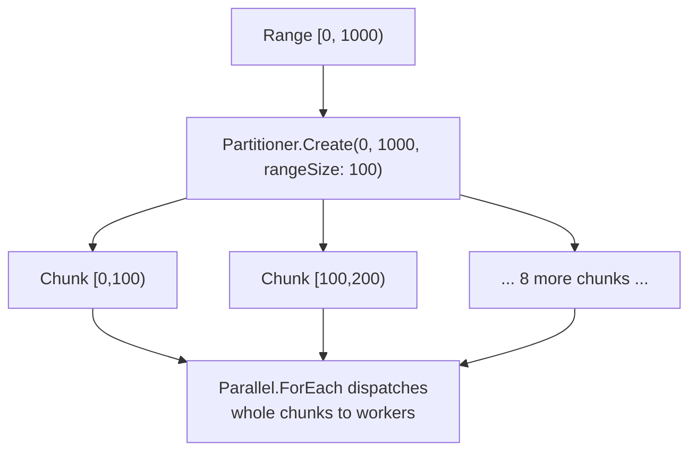
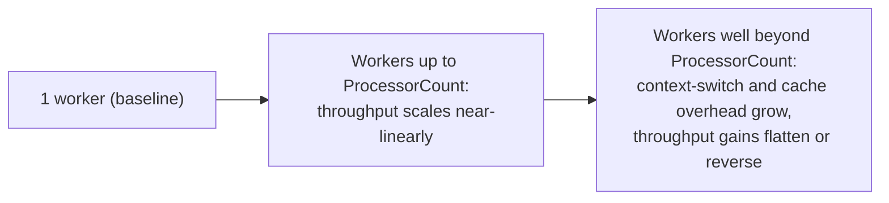

# Data Partitioning and Degree of Parallelism

## Introduction

Before reading this lesson, you should already be comfortable with **[Task Parallel Library Patterns](../07-concurrency-parallel-async/07-22-task-parallel-library-patterns.md)**, `Parallel.For`/`Parallel.ForEach`, and PLINQ. Every one of those lessons has quietly relied on the runtime making a decision it never asked your permission for: how exactly does a range of a thousand numbers, or a list of a thousand orders, get divided up among however many worker threads are actually available? This lesson opens up that decision — how partitioning works, how to override it with `Partitioner.Create`, and why simply cranking up the number of workers doesn't always make anything faster.

By the end of this lesson, you will be able to:

- Explain how `Parallel.For`/`Parallel.ForEach` and PLINQ automatically partition a range or collection across worker threads
- Use `Partitioner.Create` to control how a collection is chunked into partitions
- Read `Environment.ProcessorCount` to understand the ceiling on genuine parallelism a machine offers
- Explain why increasing the degree of parallelism doesn't always increase throughput
- Choose a chunking strategy appropriate to the size and uniformity of the per-item work

## Data Partitioning and Degree of Parallelism — A Layman's Perspective

Picture a large orchard with a thousand trees to harvest and a farm manager deciding exactly how to divide that work among four available pickers. One option: hand out one tree at a time, and make each picker walk back to the manager for a new assignment the instant they finish. That guarantees every picker always has work suited exactly to what's left, but it means a huge fraction of the day gets spent walking back and forth rather than actually picking — the coordination itself becomes the bottleneck. A second option: hand each of the four pickers a whole, fixed 250-tree row up front, and let them work through it entirely on their own. That removes almost all the walking, but it creates a different risk — if one particular row happens to have all the hardest-to-reach, most heavily laden trees, that one picker falls badly behind while the other three finish their rows early and end up standing around with nothing to do.

Neither extreme is right in general; the correct chunk size depends on how uniform the trees actually are. If every tree in the orchard takes roughly the same effort, handing out big rows up front is clearly better — there's no real risk of one picker getting unlucky, and the walking overhead all but disappears. If some trees are dramatically harder than others and you can't tell which ones in advance, smaller chunks let the manager keep rebalancing as pickers finish, at the cost of more frequent check-ins.

There's a third mistake this same orchard makes plenty of real farms actually make: assuming that hiring forty pickers instead of four harvests the orchard ten times faster. Eventually, pickers start needing the same ladders, bump into each other reaching for the same branches, and spend real time just working around one another — and the orchard, being a fixed physical space, simply cannot usefully host forty independent workers at once no matter how many you hire. Past a certain point, adding pickers stops shortening the harvest and starts actively getting in its own way. `Parallel.For`, `Parallel.ForEach`, and PLINQ face exactly the same three trade-offs — chunk size, load balance, and a hard ceiling on how many workers a machine can genuinely run at the same instant — every time they divide up a piece of work.

## Data Partitioning and Degree of Parallelism — A Programming Language Perspective

`Parallel.For`, `Parallel.ForEach`, and PLINQ all rely on an underlying `Partitioner<T>` (from `System.Collections.Concurrent`) to decide how a source range or collection gets divided into chunks handed to worker threads. Left to their defaults, they use a built-in heuristic — range partitioning for arrays and numeric ranges, chunk partitioning for general enumerables — sized based on the collection's length and `Environment.ProcessorCount`. The static class `Partitioner` exposes `Partitioner.Create` overloads that let you override that heuristic explicitly: one overload, `Partitioner.Create(int fromInclusive, int toExclusive, int rangeSize)`, carves a numeric range into contiguous chunks of a size you choose; another, `Partitioner.Create<TSource>(IList<TSource> list, bool loadBalance)`, chunks an existing list, optionally rebalancing chunks dynamically as workers finish early. `Environment.ProcessorCount` reports the number of logical cores available on the current machine — the practical ceiling on how many chunks can genuinely execute at the same physical instant, regardless of how many the partitioner or `MaxDegreeOfParallelism` requests.

## How to Use Partitioner.Create in C#

The example below carves a numeric range into ten explicit chunks of one hundred each, rather than letting `Parallel.ForEach` decide chunk size on its own, and hands each chunk to a worker as a single unit of dispatch.


*Figure 1: A range partitioner hands out contiguous chunks as single units of work, instead of one index at a time.*

```csharp
// Program.cs — .NET 10 / C# 14
using System.Collections.Concurrent;

Console.WriteLine($"Logical processor count: {Environment.ProcessorCount} (yours may differ)");

const int itemCount = 1_000;
long[] digitSums = new long[itemCount];

// Partition the range [0, 1000) into explicit chunks of 100 each, instead of
// letting Parallel.ForEach guess a chunk size on its own.
var rangePartitioner = Partitioner.Create(0, itemCount, rangeSize: 100);

Parallel.ForEach(rangePartitioner, range =>
{
    for (int i = range.Item1; i < range.Item2; i++)
    {
        digitSums[i] = SumOfDigits(i);
    }
});

long total = digitSums.Sum();
Console.WriteLine($"Sum of all digit-sums for 0..{itemCount - 1}: {total}");

static long SumOfDigits(int number)
{
    long sum = 0;
    while (number > 0)
    {
        sum += number % 10;
        number /= 10;
    }
    return sum;
}
```

**Console Output:**

```text
Logical processor count: 8 (yours may differ)
Sum of all digit-sums for 0..999: 13500
```

`Partitioner.Create(0, 1000, rangeSize: 100)` carves the range into ten contiguous chunks of one hundred indices each; `Parallel.ForEach` then hands out whole chunks, one per dispatch, instead of one index at a time — cutting the coordination overhead down to ten hand-offs total across however many workers are used, rather than a thousand. `Environment.ProcessorCount` tells you the realistic ceiling on how many of those chunks can run at the exact same instant on this machine; requesting more concurrent workers than that ceiling doesn't create more genuine parallelism, it just adds time-sliced concurrency and scheduling overhead on top of the same number of cores.

## Real-Time Example: Overdue Fine Recalculation in Library/Inventory Management

We extend the Library/Inventory Management domain with a nightly job that recalculates overdue fines across the library's outstanding loan records. Because each loan's fine calculation costs roughly the same small amount of work, we let the list's own `IList<T>`-based partitioner decide chunking with `loadBalance: true`, rather than reaching for a fixed range partitioner.

```csharp
// Program.cs — .NET 10 / C# 14 — Real-Time Example
using System.Collections.Concurrent;
using System.Globalization;

List<LoanRecord> overdueLoans =
[
    new LoanRecord("LN-501", "Clean Architecture", 12),
    new LoanRecord("LN-502", "The Pragmatic Programmer", 3),
    new LoanRecord("LN-503", "Domain-Driven Design", 45),
    new LoanRecord("LN-504", "Refactoring", 0),
    new LoanRecord("LN-505", "Working Effectively with Legacy Code", 60)
];

var fines = new ConcurrentDictionary<string, decimal>();

// Let the list's own IList<T> partitioner decide chunking, rather than a
// fixed range partitioner — appropriate here because each loan's fine
// calculation costs roughly the same amount of work.
var loanPartitioner = Partitioner.Create(overdueLoans, loadBalance: true);

ParallelOptions options = new() { MaxDegreeOfParallelism = Environment.ProcessorCount };

Parallel.ForEach(loanPartitioner, options, loan =>
{
    fines[loan.LoanId] = CalculateFine(loan.DaysOverdue);
});

Console.WriteLine("Overdue fine recalculation:");
decimal totalFines = 0m;
foreach (LoanRecord loan in overdueLoans)
{
    decimal fine = fines[loan.LoanId];
    totalFines += fine;
    Console.WriteLine($"  {loan.LoanId} — {loan.BookTitle} ({loan.DaysOverdue} days): {Usd(fine)}");
}

Console.WriteLine($"Total fines assessed: {Usd(totalFines)}");

static decimal CalculateFine(int daysOverdue)
{
    const decimal perDayRate = 0.25m;
    const decimal maxFine = 10.00m;
    decimal fine = daysOverdue * perDayRate;
    return Math.Min(fine, maxFine);
}

static string Usd(decimal amount) => amount.ToString("C", CultureInfo.GetCultureInfo("en-US"));

record LoanRecord(string LoanId, string BookTitle, int DaysOverdue);
```

**Console Output:**

```text
Overdue fine recalculation:
  LN-501 — Clean Architecture (12 days): $3.00
  LN-502 — The Pragmatic Programmer (3 days): $0.75
  LN-503 — Domain-Driven Design (45 days): $10.00
  LN-504 — Refactoring (0 days): $0.00
  LN-505 — Working Effectively with Legacy Code (60 days): $10.00
Total fines assessed: $23.75
```

`MaxDegreeOfParallelism = Environment.ProcessorCount` deliberately caps this batch job at the machine's actual core count, rather than letting it request more workers than the hardware can genuinely run at once — a five-loan batch here barely notices the difference, but a real library system recalculating fines across tens of thousands of active loans nightly would. Reading results back through `ConcurrentDictionary<string, decimal>`, keyed by `LoanId`, and printing in the original list's order keeps the report readable regardless of which worker happened to process which loan first.

## More Parallelism vs More Throughput

It's tempting to treat "degree of parallelism" as a dial that only ever helps when turned up, but every one of this lesson's warehouse and orchard analogies points to the same ceiling: a machine has a fixed number of logical cores, reported by `Environment.ProcessorCount`, and that number is the real limit on how much work can execute at the exact same physical instant. Requesting a `MaxDegreeOfParallelism` at or below that count lets the runtime place each worker on its own core, and throughput scales close to linearly as you add workers, up to that ceiling. Requesting meaningfully more workers than that doesn't create more simultaneous execution — it creates more *threads competing for the same cores*, and every one of those threads now pays for context switches, cache-line contention as they fight over the same CPU caches, and scheduling overhead the OS spends just deciding whose turn it is next. Past the ceiling, more parallelism can make a CPU-bound workload measurably *slower*, not faster, exactly like the orchard's forty pickers getting in each other's way.


*Figure 2: Throughput climbs with degree of parallelism only up to the number of logical cores available — beyond that, overhead starts eating the gains.*

Chunk size interacts with this same ceiling. Very small chunks (down to one item per dispatch) maximize load balancing — no worker ever sits idle while another struggles with an unusually expensive item — but they maximize coordination overhead too, since every chunk handed out is a fresh dispatch. Very large chunks minimize that overhead but risk exactly the uneven-row problem from the orchard: one worker stuck with a disproportionately expensive chunk while others finish early and idle. `Partitioner.Create`'s `rangeSize` and `loadBalance` parameters exist precisely to let you tune that trade-off once the default heuristic's guess doesn't fit your workload's actual shape.

| Aspect | Degree of parallelism at or below `ProcessorCount` | Degree of parallelism well above `ProcessorCount` |
|---|---|---|
| Simultaneous execution | Genuinely possible — one worker per core | Not possible — workers now share cores via time-slicing |
| Throughput trend | Scales close to linearly with worker count | Flattens, then often reverses, as overhead grows |
| Context-switching cost | Minimal | Grows with every extra worker beyond the core count |
| Cache behavior | Each worker largely keeps its own core's cache warm | Workers contend for the same limited CPU caches |
| Typical symptom of overdoing it | Not applicable | CPU usage near 100% but wall-clock time gets *worse* |

## Types and Variants of Partitioning in C#

1. **[Parallel.For and Parallel.ForEach](../07-concurrency-parallel-async/07-19-parallel-for-and-foreach.md)** — the loop constructs whose default partitioning this lesson looks underneath.
2. **`Partitioner.Create` range overload** — explicit contiguous range partitioning with a fixed chunk size, as used in this lesson's first example.
3. **`Partitioner.Create` IList/IEnumerable overload** — chunk partitioning for a collection rather than a numeric range, as used in the Real-Time Example.
4. **`OrderablePartitioner<T>`** — a specialized partitioner base type that also preserves original element ordering information.
5. **[Parallel vs Concurrent — Comparison](../07-concurrency-parallel-async/07-24-parallel-vs-concurrent-comparison.md)** — stepping back to the conceptual distinction this lesson's machinery ultimately serves.

## What You've Learned & What's Next

`Parallel.For`, `Parallel.ForEach`, and PLINQ divide work into chunks using a `Partitioner<T>`, defaulting to a built-in heuristic that `Partitioner.Create` lets you override when a workload's size or uniformity calls for it. `Environment.ProcessorCount` marks the real ceiling on genuine simultaneous execution — past it, more workers add overhead, not speed.

Continue your learning journey with **[Parallel vs Concurrent — Comparison](../07-concurrency-parallel-async/07-24-parallel-vs-concurrent-comparison.md)**, where we step back from mechanics entirely and pin down, precisely, one of the most commonly confused distinctions in this whole area of programming.

---
*Applies to: .NET 10 / C# 14. Last reviewed 2026-08-16.*
