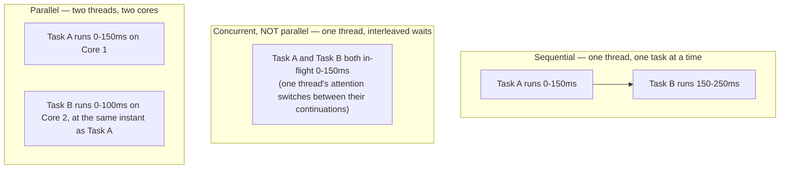
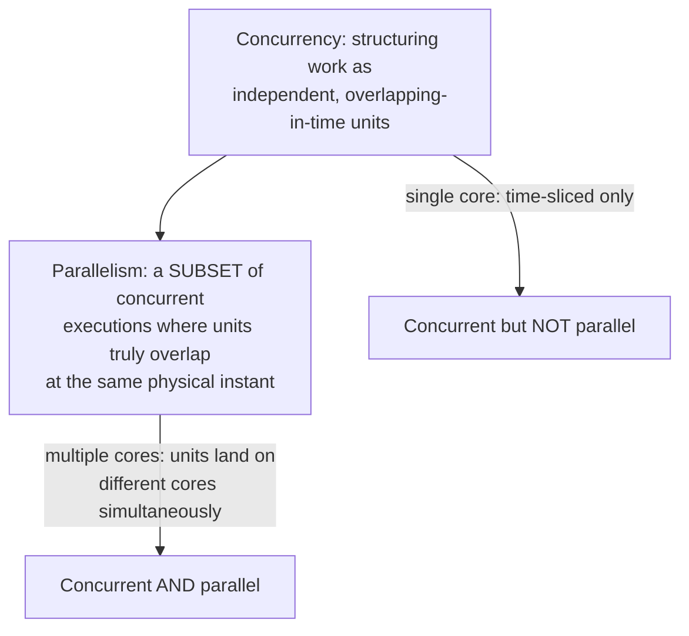

# Parallel vs Concurrent — Comparison

## Introduction

Before reading this lesson, you should already be comfortable with **[Data Partitioning and Degree of Parallelism](../07-concurrency-parallel-async/07-23-data-partitioning-degree-of-parallelism.md)** and, really, with the entire arc of lessons 07-19 through 07-23 — `Parallel.For`/`Parallel.ForEach`, `Parallel.Invoke`, PLINQ, the Task Parallel Library as a whole, and how the runtime partitions work across cores. Every one of those lessons has been quietly using the word "parallel" with real precision. This lesson makes that precision explicit, and puts it up against a second word — "concurrent" — that gets used almost interchangeably with "parallel" in casual conversation far more often than it should be. The two are related, but they are not the same thing, and mixing them up leads directly to picking the wrong tool for a job.

By the end of this lesson, you will be able to:

- Define "parallel" precisely: multiple things happening at the exact same physical instant, requiring multiple cores
- Define "concurrent" precisely: multiple things making progress over overlapping time periods, achievable even on a single core
- Demonstrate concurrency without parallelism using `async`/`await`
- Demonstrate genuine parallelism using `Parallel.ForEach`
- Explain why every parallel program is concurrent, but not every concurrent program is parallel
- Map .NET's tools — `Thread`, `Parallel`, `Task`, `async`/`await` — to whichever of the two concepts each one most directly serves

## Parallel vs Concurrent — A Layman's Perspective

Picture a single street performer juggling three balls. At any exact instant, physics only allows one ball to actually be touching the juggler's hands — the other two are in the air. And yet, watched over any few-second stretch, all three balls are clearly "in progress" continuously: none of them ever gets forgotten long enough to drop, because the juggler's attention sweeps between all three fast enough that each one gets caught and re-thrown well before it would otherwise fall. Nothing about this act involves two things happening at the literal same instant — it's one pair of hands, doing one thing at a time, switching fast enough that three things are nevertheless all making steady progress across the same span of time. That's concurrency, in its purest form, and notice that it required nothing but a single juggler.

Now picture identical twins, each juggling their own single ball. At the exact same instant, both twins genuinely have a ball in hand, both genuinely mid-throw, both genuinely doing real, simultaneous physical work — because there are actually two separate people now, not one person switching attention. That's parallelism: not "in progress at the same time" in the loose sense the single juggler already achieved, but truly *happening* at the same physical instant, which is only possible because there are two independent workers instead of one.

Here's the detail worth sitting with, because it's exactly where the confusion usually creeps in: from a short distance, a single skilled juggler handling three balls can look almost as impressive as the two twins each handling one — all the balls stay in the air either way, and a casual observer might describe both scenes as "three balls being juggled at once." But only one of those two scenes involves genuine simultaneity, and the practical consequences of that difference are real. If you needed to juggle three hundred balls, hiring three hundred twins (three hundred CPU cores) would let all three hundred be airborne at the literal same instant — but you don't have three hundred cores lying around. What you *can* do is train one juggler to handle far more balls than seems physically possible, by being extremely good at rapidly switching attention between whichever ball most urgently needs catching — which is exactly what `async`/`await` lets a single thread do with hundreds of pending network waits, without needing hundreds of separate workers at all.

## Parallel vs Concurrent — A Programming Language Perspective

**Concurrency** is a structural, logical property of how a program is organized: the ability to have more than one unit of work in progress during overlapping time periods, regardless of whether the underlying hardware executes any two of them at the literal same instant. **Parallelism** is a physical, hardware-execution property: two or more units of work genuinely executing at the same instant, which strictly requires at least two independent execution units — two CPU cores, or two logical cores via simultaneous multithreading.

C# provides no keyword that means "make this parallel" directly — parallelism is always an *emergent outcome* of running a concurrency construct (`Thread`, `Task`, `Parallel`) on hardware that happens to have more than one core available to place work on. `async`/`await` is squarely a concurrency mechanism: an `await`ed operation that hasn't completed yet returns control to its caller, and the very thread that had been running it is free to do other work in the meantime — no second core is required for this to work, and often no second thread is either. `Parallel.For`, `Parallel.ForEach`, and PLINQ, by contrast, are concurrency mechanisms specifically aimed at *achieving* parallelism: they deliberately distribute independent CPU-bound work across as many threads as the machine's core count reasonably supports, so that, hardware permitting, genuine simultaneous execution actually happens.

## How to Tell Concurrency and Parallelism Apart in Code

The clearest way to see the difference is to watch what a single thread does while it "waits" for something, versus what happens when a CPU-bound loop is deliberately spread across several threads.


*Figure 1: Sequential work never overlaps; concurrent work overlaps in time even on one thread; parallel work overlaps at the same physical instant across multiple cores.*

```csharp
// Program.cs — .NET 10 / C# 14
using System.Diagnostics;

Console.WriteLine($"Logical processor count: {Environment.ProcessorCount} (yours may differ)");

Stopwatch clock = Stopwatch.StartNew();

Task<string> emailWait = SimulateEmailProviderAsync();
Task<string> smsWait = SimulateSmsProviderAsync();

string[] results = await Task.WhenAll(emailWait, smsWait);
clock.Stop();

foreach (string result in results)
{
    Console.WriteLine(result);
}

bool overlapped = clock.ElapsedMilliseconds < 200; // Sequential would take ~250ms+
Console.WriteLine($"Both waits overlapped in time rather than running one after another: {overlapped}");

static async Task<string> SimulateEmailProviderAsync()
{
    await Task.Delay(150);
    return "[Email] provider acknowledged";
}

static async Task<string> SimulateSmsProviderAsync()
{
    await Task.Delay(100);
    return "[SMS] provider acknowledged";
}
```

**Console Output:**

```text
Logical processor count: 8 (yours may differ)
[Email] provider acknowledged
[SMS] provider acknowledged
Both waits overlapped in time rather than running one after another: True
```

Both simulated provider calls are "in flight" from t=0, but neither one ever occupies a thread that just sits blocked waiting — `await Task.Delay(...)` frees the thread entirely until its timer fires. `Task.WhenAll` doesn't run the two waits one after another; it lets both be pending at once, which is exactly why the combined wait finishes in roughly 150ms (the longer of the two) rather than 250ms (their sum) — concurrency, achieved here without a single extra thread ever being blocked, and without needing more than one CPU core at all.

## Real-Time Example: Parallel vs Concurrent in Banking/ATM Overnight Processing

We extend the Banking/ATM domain with two pieces of a bank's overnight batch job, run back to back, that illustrate both sides of this lesson directly. Phase one recalculates monthly interest for a batch of accounts — pure CPU-bound math, independent per account, genuinely parallelized with `Parallel.ForEach` across cores. Phase two runs a fraud check against each of those same accounts through a third-party API — pure I/O-bound waiting, handled concurrently with `async`/`await`, without requiring one thread per account at all.

```csharp
// Program.cs — .NET 10 / C# 14 — Real-Time Example
using System.Collections.Concurrent;
using System.Globalization;

List<Account> accounts =
[
    new Account("ACC-3001", 12500.00m, 2.4m),
    new Account("ACC-3002", 875.50m, 1.8m),
    new Account("ACC-3003", 42300.00m, 3.0m)
];

// Phase 1 — genuinely PARALLEL: interest is pure CPU-bound math, independent
// per account, so multiple cores can compute several accounts at the exact
// same physical instant.
var monthlyInterest = new ConcurrentDictionary<string, decimal>();
Parallel.ForEach(accounts, account =>
{
    monthlyInterest[account.AccountNumber] = CalculateMonthlyInterest(account);
});

Console.WriteLine("Phase 1 — interest recalculated in parallel across CPU cores:");
foreach (Account account in accounts)
{
    Console.WriteLine($"  {account.AccountNumber}: {Usd(monthlyInterest[account.AccountNumber])}");
}

// Phase 2 — CONCURRENT but NOT necessarily parallel: each fraud check just
// waits on a third-party API response, so all the accounts can be "in
// flight" on one thread at once without ever executing at the same instant.
Console.WriteLine();
Console.WriteLine("Phase 2 — fraud checks awaited concurrently, not in sequence:");
Task<string>[] fraudChecks = accounts
    .Select(account => RunFraudCheckAsync(account))
    .ToArray();

string[] fraudResults = await Task.WhenAll(fraudChecks);
foreach (string result in fraudResults)
{
    Console.WriteLine($"  {result}");
}

static decimal CalculateMonthlyInterest(Account account) =>
    Math.Round(account.Balance * (account.AnnualRatePercent / 100m / 12m), 2);

static async Task<string> RunFraudCheckAsync(Account account)
{
    await Task.Delay(50); // Simulated third-party fraud-check API latency.
    return $"{account.AccountNumber}: cleared";
}

static string Usd(decimal amount) => amount.ToString("C", CultureInfo.GetCultureInfo("en-US"));

record Account(string AccountNumber, decimal Balance, decimal AnnualRatePercent);
```

**Console Output:**

```text
Phase 1 — interest recalculated in parallel across CPU cores:
  ACC-3001: $25.00
  ACC-3002: $1.31
  ACC-3003: $105.75

Phase 2 — fraud checks awaited concurrently, not in sequence:
  ACC-3001: cleared
  ACC-3002: cleared
  ACC-3003: cleared
```

Phase 1 and Phase 2 look almost identical on the page — a collection, a per-item operation, a result printed for each account — but they represent opposite ends of this lesson's distinction. Phase 1's work is CPU-bound, so spreading it across cores with `Parallel.ForEach` genuinely finishes it faster on a multi-core machine. Phase 2's work is I/O-bound waiting, so there's nothing for extra cores to do; `Task.WhenAll` simply lets every fraud check be pending at once, concurrently, however many threads that happens to use under the hood. Treating Phase 2 like Phase 1 — spinning up a blocked thread per account to wait on the fraud API — would waste threads accomplishing nothing extra; treating Phase 1 like Phase 2 — awaiting each interest calculation one at a time with nothing to actually wait on — would just add overhead with no benefit.

## Parallel vs Concurrent — The Full Comparison

The asymmetry at the heart of this whole lesson is worth stating as plainly as possible: **every parallel program is concurrent, but not every concurrent program is parallel.** Parallelism is a specific, stronger claim — genuine simultaneity, which is only physically possible with multiple execution units — while concurrency is the broader, weaker claim that merely requires overlapping *progress*, something a single core can deliver perfectly well by rapidly switching between tasks. A single-core machine can run a fully concurrent program — many threads, many pending `Task`s, all making progress over time — and never once achieve true parallelism, because there's simply nowhere for a second thing to happen at the same instant. A multi-core machine can run that same concurrent program and *also* get genuine parallelism out of it, if and only if the program's structure lets independent pieces of work actually land on different cores simultaneously, which is precisely what `Parallel.For`, `Parallel.ForEach`, and PLINQ are built to arrange.

This is exactly why the question "is my program concurrent?" and the question "is my program parallel?" have different, independently useful answers, and why conflating them leads to real mistakes. A team that describes `async`/`await` as "making things run in parallel" will eventually reach for it to speed up a CPU-bound bottleneck — recalculating a huge report, say — and be baffled when performance doesn't improve at all, because `async`/`await` never asked a second core to do anything; it only ever freed a thread from *waiting*, and there was nothing to wait on in a CPU-bound calculation. Conversely, a team that reaches for `Parallel.ForEach` to fire off a thousand outbound network calls "concurrently" will end up with a thousand threads sitting blocked, one per call, which is a far more expensive way to achieve the same overlapping progress that a handful of `async`/`await` calls would achieve for free. The nature of the work — whether it's genuinely keeping a CPU busy, or genuinely just waiting on something external — is what should decide which of these two properties you're actually trying to get, and therefore which .NET construct you reach for.

There's a subtler point worth closing on: parallelism is not something C# code ever directly requests — it's an emergent property of running a concurrency construct on hardware that happens to have spare cores. `Parallel.ForEach` doesn't force two accounts' interest calculations onto two separate cores; it hands the OS scheduler two independent, ready-to-run threads and *lets* the scheduler place them on separate cores if any are free. On a single-core virtual machine, that exact same code would still run correctly, still be concurrent, and simply never achieve true parallelism — the code doesn't change, only what the hardware underneath it is able to do with it.


*Figure 2: Parallelism is not a rival concept to concurrency — it's the subset of concurrent execution where multiple cores let work genuinely overlap at the same instant.*

| Aspect | Concurrent | Parallel |
|---|---|---|
| Definition | Multiple units of work making progress over overlapping time | Multiple units of work executing at the exact same physical instant |
| Requires multiple CPU cores | No — achievable via time-slicing on a single core | Yes — by definition, requires at least two execution units |
| Relationship to the other | The broader, structural property | A specific, stronger subset of concurrency |
| Primary .NET tool | `async`/`await`, `Task` | `Parallel.For`/`ForEach`, PLINQ, multiple `Thread`s/`Task`s scheduled across cores |
| Best suited for | I/O-bound waiting (network, disk, database) | CPU-bound computation (heavy math, bulk transforms) |
| Example from this lesson | Phase 2 — fraud checks awaited via `Task.WhenAll` | Phase 1 — interest recalculated via `Parallel.ForEach` |

## The Parallel Programming Sub-Area So Far

1. **[Parallel.For and Parallel.ForEach](../07-concurrency-parallel-async/07-19-parallel-for-and-foreach.md)** — parallelizing a CPU-bound loop over a range or collection.
2. **[Parallel.Invoke](../07-concurrency-parallel-async/07-20-parallel-invoke.md)** — running a fixed, known set of independent actions concurrently.
3. **[PLINQ — Parallel LINQ](../07-concurrency-parallel-async/07-21-plinq-parallel-linq.md)** — parallelizing a LINQ query pipeline with `.AsParallel()`.
4. **[Task Parallel Library Patterns](../07-concurrency-parallel-async/07-22-task-parallel-library-patterns.md)** — the umbrella `Task`/`Parallel`/PLINQ all sit under, and the parallel pipeline pattern.
5. **[Data Partitioning and Degree of Parallelism](../07-concurrency-parallel-async/07-23-data-partitioning-degree-of-parallelism.md)** — how work is actually divided across cores, and why more workers isn't always faster.

## What You've Learned & What's Next

Concurrency is the broader, structural property of organizing work so independent units can make progress over overlapping time, achievable even on a single core; parallelism is the narrower, physical property of two or more units genuinely executing at the same instant, which strictly requires multiple cores. Every parallel program is therefore concurrent, but plenty of perfectly good concurrent programs — anything built primarily on `async`/`await` for I/O-bound waiting — are never parallel at all, and don't need to be.

Continue your learning journey with **[Synchronous vs Asynchronous Execution — Comparison](../07-concurrency-parallel-async/07-25-sync-vs-async-execution-comparison.md)**, the closing lesson of this sub-area, where we apply this same thinking to a single, very concrete pair of calls — one blocking, one awaited — and see exactly what each one does to the thread that makes it.

---
*Applies to: .NET 10 / C# 14. Last reviewed 2026-08-16.*
