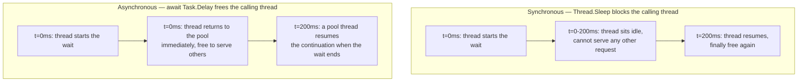
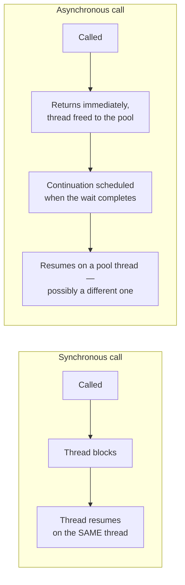

# Synchronous vs Asynchronous Execution — Comparison

## Introduction

Before reading this lesson, you should already be comfortable with **[Parallel vs Concurrent — Comparison](../07-concurrency-parallel-async/07-24-parallel-vs-concurrent-comparison.md)** and the whole arc of lessons it closed out — `Parallel.For`/`Parallel.ForEach`, `Parallel.Invoke`, PLINQ, TPL patterns, and data partitioning. This lesson is the true closing lesson of that entire sub-area, and it ends on the single most concrete, most practically important question the whole arc has been building toward: when your code makes a call that has to *wait* for something, what exactly happens to the thread that made it — and does that difference actually matter in a real system under load?

By the end of this lesson, you will be able to:

- Explain what happens to a thread during a blocking synchronous call versus an awaited asynchronous call
- Measure a blocking, `Thread.Sleep`-based implementation of a task under concurrent load
- Measure the same task implemented with `Task.Delay`/`await`, and see the throughput difference
- Read a side-by-side timeline diagram contrasting blocked-thread time against freed-thread time
- Explain why parallel programming (this sub-area) and `async`/`await` are complementary tools, not competitors
- Recap the full Parallel Programming sub-area before moving on to concurrent collections

## Synchronous vs Asynchronous Execution — A Layman's Perspective

Picture a call-center agent handling customer calls one at a time. A customer calls in, the agent starts helping them, and partway through, the agent needs to put the customer on hold to look something up in another system that takes a while to respond. One kind of agent physically keeps the receiver in hand and simply stands there through the entire hold period, staring at the hold music, unable to do anything else — including take the *next* customer's call, which just rings and rings unanswered until this one is fully resolved. That agent is fully occupied for the whole duration of the wait, even though the actual waiting requires no skill or attention from them at all.

A different kind of agent handles the exact same hold perfectly differently: the moment a customer needs to be put on hold, that agent sets a reminder for when the lookup should be done and immediately picks up the next incoming call. When the first customer's hold period ends and the lookup result comes back, the agent — or possibly a different, equally qualified agent sitting right next to them — picks the first call back up exactly where it left off and finishes helping that customer. From the customers' point of view, both of them eventually get fully, correctly helped. From the call center's point of view, the difference is enormous: the first kind of agent can only ever be "helping" one customer's entire interaction — including all its dead, hold-music time — at once, while the second kind of agent spends every single minute of their shift doing something actually useful, letting one agent's worth of attention serve far more than one customer's worth of hold time.

This is the entire distinction this lesson formalizes. A blocking, synchronous call is the first agent: the thread that made the call sits there, doing nothing, for the entire duration of the wait, unavailable to do anything else — including help a completely unrelated customer — until the wait resolves. An awaited asynchronous call is the second agent: the thread that started the wait is released the instant the wait begins, free to go be useful somewhere else immediately, and whichever thread happens to be free when the wait actually finishes picks the work back up. Neither approach changes how long any individual customer's hold period lasts — the lookup takes exactly as long either way. What changes is how much *other* work gets done by the same limited number of agents while that hold time passes, and in a call center — or a server — handling far more customers than it has agents, that difference is the whole game.

## Synchronous vs Asynchronous Execution — A Programming Language Perspective

A **synchronous, blocking call** — `Thread.Sleep(n)`, a synchronous file read, a synchronous database query — occupies its calling thread for the call's entire duration. The thread cannot do any other useful work during that time, and if it's a thread-pool thread, it is entirely unavailable to service any other queued work item until the blocking call returns.

An **asynchronous call awaited with `await`** — `await Task.Delay(n)`, `await httpClient.GetAsync(...)` — compiles to a state machine. When the awaited operation hasn't completed yet, the `async` method returns control to its caller immediately, and the thread that had been executing it is released back to the `ThreadPool` to do other work. When the awaited operation later completes, a continuation resumes the method — on a thread-pool thread grabbed from the pool at that moment, not necessarily the original one. None of this is new to C# 14 — `async`/`await` has been part of C# since version 5 — but it remains .NET 10's primary tool for building high-throughput, I/O-bound code that doesn't waste threads sitting idle.

## How to Compare a Blocking Call and an Awaited Call in C#

The side-by-side timeline below is the shape every remaining example in this lesson comes back to: a blocking call occupies its thread for the entire wait, while an awaited call releases its thread immediately and only reclaims one — possibly a different one — once the wait genuinely completes.


*Figure 1: A blocking call occupies its thread for the entire wait; an awaited async call releases the thread back to the pool immediately and only reclaims one once the wait actually completes.*

A single call, in isolation, doesn't reveal much of a difference — both take roughly the same wall-clock time to finish, because the wait itself is identical either way. The difference this lesson cares about only becomes visible under load, which is exactly what the timing check below sets up.

```csharp
// Program.cs — .NET 10 / C# 14
using System.Diagnostics;

Console.WriteLine("-- Synchronous (blocking) --");
Stopwatch syncClock = Stopwatch.StartNew();
string syncResult = SendConfirmationBlocking("ORD-9001");
syncClock.Stop();
Console.WriteLine(syncResult);
Console.WriteLine($"Blocking call held its thread for the full wait: {syncClock.ElapsedMilliseconds >= 100}");

Console.WriteLine();
Console.WriteLine("-- Asynchronous (await) --");
Stopwatch asyncClock = Stopwatch.StartNew();
string asyncResult = await SendConfirmationAsync("ORD-9002");
asyncClock.Stop();
Console.WriteLine(asyncResult);
Console.WriteLine($"Async call still took roughly the same wall-clock time: {asyncClock.ElapsedMilliseconds >= 100}");

static string SendConfirmationBlocking(string orderId)
{
    Thread.Sleep(100); // Simulated email-provider latency — thread sits idle here.
    return $"[Blocking] confirmation email sent for {orderId}";
}

static async Task<string> SendConfirmationAsync(string orderId)
{
    await Task.Delay(100); // Simulated email-provider latency — thread is freed here.
    return $"[Async] confirmation email sent for {orderId}";
}
```

**Console Output:**

```text
-- Synchronous (blocking) --
[Blocking] confirmation email sent for ORD-9001
Blocking call held its thread for the full wait: True

-- Asynchronous (await) --
[Async] confirmation email sent for ORD-9002
Async call still took roughly the same wall-clock time: True
```

Notice that both calls take roughly 100ms — the wait itself doesn't get any shorter just because it's awaited instead of blocked. That's exactly the point: for a single call, sync and async are nearly indistinguishable from the outside. The real difference is invisible here because there's only one call competing for one thread. Scale that up to many concurrent calls sharing a limited thread pool, and the two approaches diverge sharply — which is exactly what the Real-Time Example below measures directly.

## Real-Time Example: Order-Confirmation Emails Under Concurrent Load in E-Commerce Order Processing

We extend the E-Commerce Order Processing domain with the confirmation-email step from Lesson 07-01's Real-Time Example, now under realistic concurrent load: twenty orders needing a confirmation email sent at once. To make the thread-pool bottleneck visible without needing thousands of simultaneous orders, we deliberately cap the thread pool at four threads, then run the same twenty-email workload two ways.

```csharp
// Program.cs — .NET 10 / C# 14 — Real-Time Example
using System.Diagnostics;

const int concurrentOrders = 20;

// Artificially cap the thread pool to make the difference visible without
// needing thousands of simultaneous orders.
ThreadPool.SetMinThreads(4, 4);
ThreadPool.SetMaxThreads(4, 4);

Console.WriteLine($"Simulating {concurrentOrders} confirmation emails under a 4-thread pool cap.");

// -- Blocking version: each call ties up one pool thread for the whole wait --
Stopwatch blockingClock = Stopwatch.StartNew();
Task[] blockingJobs = Enumerable.Range(1, concurrentOrders)
    .Select(i => Task.Run(() => SendConfirmationBlocking($"ORD-{9000 + i}")))
    .ToArray();
Task.WaitAll(blockingJobs);
blockingClock.Stop();

bool blockingWasSlow = blockingClock.ElapsedMilliseconds >= 400;
Console.WriteLine($"Blocking: all {concurrentOrders} emails done, thread pool was the bottleneck: {blockingWasSlow}");

// -- Async version: each call frees its thread back to the pool during the wait --
Stopwatch asyncClock = Stopwatch.StartNew();
Task[] asyncJobs = Enumerable.Range(1, concurrentOrders)
    .Select(i => SendConfirmationAsync($"ORD-{9100 + i}"))
    .ToArray();
await Task.WhenAll(asyncJobs);
asyncClock.Stop();

bool asyncWasFast = asyncClock.ElapsedMilliseconds < 250;
Console.WriteLine($"Async: all {concurrentOrders} emails done well under the blocking version's time: {asyncWasFast}");

static void SendConfirmationBlocking(string orderId)
{
    Thread.Sleep(100); // Occupies this pool thread for the entire wait.
}

static async Task SendConfirmationAsync(string orderId)
{
    await Task.Delay(100); // Frees this thread back to the pool during the wait.
}
```

**Console Output:**

```text
Simulating 20 confirmation emails under a 4-thread pool cap.
Blocking: all 20 emails done, thread pool was the bottleneck: True
Async: all 20 emails done well under the blocking version's time: True
```

With only four threads available, the blocking version can only ever have four emails "in progress" at once — the other sixteen simply queue up waiting for a thread to free up, so twenty emails at 100ms each, four at a time, take roughly five sequential batches to clear. The async version needs no thread at all while a given email's simulated wait is pending — `Task.Delay` is backed by a timer, not a blocked thread — so all twenty waits can be pending simultaneously regardless of the four-thread cap, and the whole batch finishes in roughly the time of one wait, not five. In a real order-processing system handling thousands of concurrent confirmation emails, this is precisely why async I/O is what lets a modest thread pool serve enormous request volume: the threads are never actually blocked, just briefly registered for a callback.

## Blocking Synchronous Calls vs Awaited Asynchronous Calls

The comparison this lesson centers on isn't about which call *finishes* faster — a single wait takes exactly as long either way, as the How-To section showed directly. It's about what the calling thread is *permitted to do* while that wait plays out, and that's a question that only starts to matter once there's more work competing for the same limited pool of threads than there are threads to go around. A blocking call answers "wait right here, doing nothing else, until this is done." An awaited call answers "go be useful elsewhere, and someone will pick this back up the moment it's actually ready." Under light load, both answers cost about the same. Under heavy concurrent load — the normal condition for any real server — the first answer means the thread pool's size becomes a hard ceiling on how many requests can be in flight at once, while the second answer means the thread pool barely needs to grow at all, no matter how many requests are simultaneously waiting on something external.


*Figure 2: A synchronous call ties up one specific thread start to finish; an asynchronous call frees its thread and lets any available pool thread pick the continuation back up.*

| Aspect | Synchronous (blocking) | Asynchronous (`await`) |
|---|---|---|
| What the calling thread does during the wait | Sits idle, fully occupied, doing nothing | Returns to the pool, free to do other work |
| Thread pool impact under concurrent load | Concurrent capacity is capped by the thread pool's size | Many waits can be pending per thread — pool rarely needs to grow |
| Single-call latency | Same as the underlying wait | Same as the underlying wait |
| Best suited for | CPU-bound work, or code with no real "wait" to speak of | I/O-bound waiting — network, disk, database |
| Typical failure mode if misused | Thread-pool starvation under load | Needless complexity for work that never actually waits on anything |

## The Parallel Programming Sub-Area at a Glance

This lesson closes out the Parallel Programming sub-area of Module 07 — every earlier lesson in it is worth revisiting now that they all fit together:

1. **[Parallel.For and Parallel.ForEach](../07-concurrency-parallel-async/07-19-parallel-for-and-foreach.md)** — parallelizing a CPU-bound loop over a range or collection.
2. **[Parallel.Invoke](../07-concurrency-parallel-async/07-20-parallel-invoke.md)** — running a fixed, known set of independent actions concurrently.
3. **[PLINQ — Parallel LINQ](../07-concurrency-parallel-async/07-21-plinq-parallel-linq.md)** — parallelizing a LINQ query pipeline with `.AsParallel()`.
4. **[Task Parallel Library Patterns](../07-concurrency-parallel-async/07-22-task-parallel-library-patterns.md)** — the umbrella `Task`/`Parallel`/PLINQ all sit under, and the parallel pipeline pattern built from `Task`s.
5. **[Data Partitioning and Degree of Parallelism](../07-concurrency-parallel-async/07-23-data-partitioning-degree-of-parallelism.md)** — how work actually gets divided across cores, and why more workers isn't always faster.
6. **[Parallel vs Concurrent — Comparison](../07-concurrency-parallel-async/07-24-parallel-vs-concurrent-comparison.md)** — the conceptual distinction this closing lesson's blocking-vs-async contrast extends one step further, from CPU cores to threads.

## What You've Learned & What's Next

A blocking synchronous call occupies its calling thread for the entire duration of a wait, making the size of the thread pool a hard ceiling on concurrent throughput; an awaited asynchronous call releases its thread back to the pool immediately, letting far more work be "in flight" at once with the same number of threads. Neither approach changes a single call's latency — the difference only shows up, decisively, once real concurrent load is involved, exactly as the twenty-email comparison demonstrated. That closes out the Parallel Programming sub-area: `Parallel.For`/`ForEach` and PLINQ for CPU-bound work that benefits from more cores, `async`/`await` for I/O-bound waiting that benefits from freed threads — two complementary tools, not competing ones, each earning its place by the actual nature of the work in front of it.

Continue your learning journey with **[Concurrent Collections (ConcurrentDictionary, Queue, Stack, Bag)](../07-concurrency-parallel-async/07-26-concurrent-collections.md)**, where we turn to the thread-safe collection types — several of which this very sub-area already leaned on — that let multiple threads safely share data structures without a hand-written `lock`.

---
*Applies to: .NET 10 / C# 14. Last reviewed 2026-08-16.*
