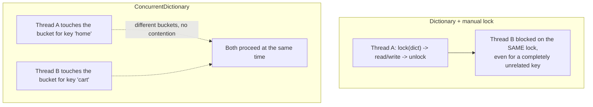
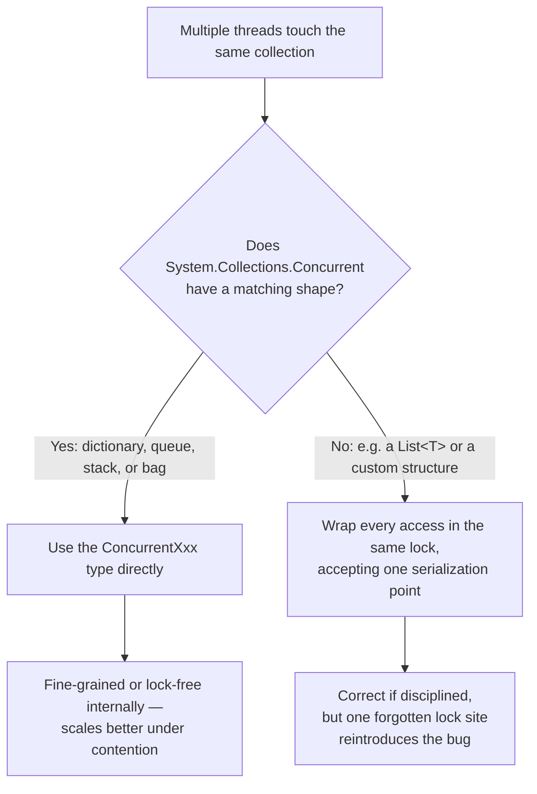

# Concurrent Collections (ConcurrentDictionary, Queue, Stack, Bag)

## Introduction

Before reading this lesson, you should already be comfortable with **[Synchronous vs Asynchronous Execution — Comparison](../07-concurrency-parallel-async/07-25-sync-vs-async-execution-comparison.md)** and, more broadly, with the fact that .NET code now routinely has many logical threads of execution alive at once — worker threads from the thread pool, `Parallel` loop bodies, and asynchronous continuations resuming on whichever thread happens to be free. This lesson turns to a question that cuts across synchronous and asynchronous code alike: what happens when more than one of those threads touches the *same shared collection* at the same time?

`Dictionary<TKey,TValue>`, `Queue<T>`, `Stack<T>`, and every other collection in `System.Collections.Generic` were designed for single-threaded access. Nothing stops you from sharing one across threads, but nothing protects you either — and this lesson opens Module 07's final sub-area, "Concurrent Collections & Channels," by introducing the purpose-built, thread-safe alternatives that live in `System.Collections.Concurrent`.

By the end of this lesson, you will be able to:

- Explain why a plain `Dictionary`, `Queue`, or `Stack` corrupts or throws when mutated from multiple threads without synchronization
- Identify the four core concurrent collection types — `ConcurrentDictionary<TKey,TValue>`, `ConcurrentQueue<T>`, `ConcurrentStack<T>`, `ConcurrentBag<T>` — and what each is shaped for
- Use `GetOrAdd` and `AddOrUpdate` to perform an atomic check-then-act operation on a `ConcurrentDictionary` without a manual `lock`
- Contrast a hand-written `lock`-wrapped `Dictionary` against a purpose-built concurrent collection, for both correctness and performance
- Recognize when a concurrent collection alone is enough, and when it needs to be paired with a blocking or async-aware wrapper (covered in the next two lessons)

## Concurrent Collections — A Layman's Perspective

Picture an office with a single, large, paper ledger sitting on one desk, and a single receptionist standing beside it. Every employee who needs to look something up in the ledger, or write a new entry, has to queue at that one desk and wait their turn — even if two employees want completely unrelated pages. One employee updating "customer 4471's phone number" blocks another employee who only wants to *read* "customer 9002's address," because there's exactly one desk, one ledger, and one receptionist enforcing "only one person touches this at a time." That queue is safe — nobody's handwriting ever overlaps illegibly on the same line — but it's also needlessly slow, because most of those waits have nothing to do with each other.

Now picture the office replacing that single ledger with a wall of labeled pigeonhole mail slots, one slot per customer, and several clerks free to work at once. A clerk filing a note into customer 4471's slot and a different clerk pulling a note from customer 9002's slot never need to wait on each other at all — they're reaching into completely different compartments. The wall itself is still built to prevent two clerks from colliding on the *same* slot at the same instant, but that protection is narrow and local, not one giant lock over the entire wall. That's the internal idea behind `ConcurrentDictionary<TKey,TValue>`: it behaves like a dictionary from the outside, but internally it's built more like that wall of pigeonholes than like one ledger with one guard.

The other three concurrent collections map to equally physical scenes. A busy kitchen's order-ticket rail — new tickets clipped on at one end, the cook always pulling the *oldest* ticket off the other end — is `ConcurrentQueue<T>`: strict first-in-first-out, safe for several hands to clip on and pull off simultaneously. A stack of freshly washed plates — you only ever add to the top and take from the top — is `ConcurrentStack<T>`: strict last-in-first-out. And a big bowl of raffle tickets, where anyone can drop one in or grab one out and nobody cares *which* ticket comes out, only that grabbing is safe and fast, is `ConcurrentBag<T>` — no ordering guarantee at all, deliberately, in exchange for being the fastest option when the same worker tends to both add and remove its own items.

The thread that matters across all four: none of them make multithreading a good idea by themselves. What they guarantee is that *if* several threads are going to share one collection, the collection itself won't let their actions corrupt each other or crash the program — the same guarantee the pigeonhole wall gives the office, without forcing every single lookup through one overworked receptionist.

## Concurrent Collections — A Programming Language Perspective

The `System.Collections.Concurrent` namespace provides collections whose members are individually thread-safe: any number of threads may call their methods concurrently without external locking. This is fundamentally different from `System.Collections.Generic` types, whose members assume single-threaded access — concurrent reads are usually tolerated, but a concurrent write racing another write or a read can corrupt internal state, silently produce wrong results, or throw an `InvalidOperationException` (typically "Collection was modified"). `ConcurrentDictionary<TKey,TValue>` achieves its safety through internally partitioned locking — a configurable number of internal locks, each guarding a subset of the dictionary's buckets, so unrelated keys rarely contend — combined with largely lock-free reads via `Volatile` reads of internal state. `ConcurrentQueue<T>` and `ConcurrentStack<T>` go further, using lock-free algorithms built on `Interlocked.CompareExchange` for their core operations. `ConcurrentBag<T>` maintains a small per-thread work queue, making same-thread produce-and-consume nearly lock-free, at the cost of no ordering guarantee.

## How to Use Concurrent Collections in C#

The operation that most distinguishes these types from a manually locked `Dictionary` is the atomic check-then-act method: `GetOrAdd(key, valueFactory)` reads an existing value or atomically creates one if absent, and `AddOrUpdate(key, addValue, updateValueFactory)` atomically inserts a new value or transforms the existing one — both without you ever writing a `lock` block or racing another thread between your "check" and your "act."


*Figure 1: A manual lock serializes every access through one gate; ConcurrentDictionary lets unrelated keys proceed independently.*

```csharp
// Program.cs — .NET 10 / C# 14
using System.Collections.Concurrent;

ConcurrentDictionary<string, int> hitCounts = new();

string[] pages = ["home", "cart", "home", "checkout", "home", "cart"];

Parallel.ForEach(pages, page =>
{
    // AddOrUpdate is atomic: no other thread can observe or act on a partially
    // applied increment, even when many threads hit the same key at once.
    hitCounts.AddOrUpdate(page, addValue: 1, updateValueFactory: (_, existing) => existing + 1);
});

foreach (var (page, count) in hitCounts.OrderBy(kvp => kvp.Key))
{
    Console.WriteLine($"{page}: {count} hit(s)");
}
```

**Console Output:**

```text
cart: 2 hit(s)
checkout: 1 hit(s)
home: 3 hit(s)
```

Every page in the array is processed by whichever thread the `Parallel.ForEach` scheduler assigns it to, and several of those threads increment the *same* key ("home" three times, "cart" twice) with no guarantee about which runs first. Because `AddOrUpdate` performs the "read current count, add one" step atomically, the final totals are exactly right regardless of interleaving — no increment is ever lost, and no thread ever sees or overwrites a stale value mid-update. A plain `Dictionary<string,int>` given the same workload would, at best, throw during `Parallel.ForEach`, and at worst silently under-count, because two threads could both read the same starting value before either writes back its increment.

## Real-Time Example: Concurrent Inventory Reservation in E-Commerce Order Processing

We extend the E-Commerce Order Processing domain with a small batch of incoming orders that must reserve stock concurrently — a realistic shape for a warehouse system processing a burst of checkouts at once. Stock levels live in a `ConcurrentDictionary<string,int>` keyed by SKU; each order's reservation attempt runs inside a `Parallel.ForEach`, using a compare-and-swap retry loop built on `TryUpdate` so that two threads reserving different SKUs never wait on each other, and two threads reserving the *same* SKU never corrupt its count.

```csharp
// Program.cs — .NET 10 / C# 14 — Real-Time Example
using System.Collections.Concurrent;

ConcurrentDictionary<string, int> stock = new()
{
    ["SKU-100"] = 50,
    ["SKU-200"] = 5,
    ["SKU-300"] = 12
};

List<(string OrderId, string Sku, int Quantity)> incomingOrders =
[
    ("ORD-1", "SKU-100", 10),
    ("ORD-2", "SKU-200", 3),
    ("ORD-3", "SKU-300", 20),
    ("ORD-4", "SKU-100", 15),
    ("ORD-5", "SKU-999", 1),
    ("ORD-6", "SKU-200", 1)
];

ConcurrentDictionary<string, string> orderResults = new();

Parallel.ForEach(incomingOrders, order =>
{
    orderResults[order.OrderId] = TryReserveStock(stock, order.Sku, order.Quantity)
        ? $"{order.OrderId}: reserved {order.Quantity} x {order.Sku}"
        : $"{order.OrderId}: REJECTED ({order.Sku} unavailable in requested quantity)";
});

Console.WriteLine("-- Order processing results --");
foreach (var order in incomingOrders)
{
    Console.WriteLine(orderResults[order.OrderId]);
}

Console.WriteLine();
Console.WriteLine("-- Final stock levels --");
foreach (var (sku, qty) in stock.OrderBy(kvp => kvp.Key))
{
    Console.WriteLine($"{sku}: {qty} remaining");
}

static bool TryReserveStock(ConcurrentDictionary<string, int> stock, string sku, int quantity)
{
    while (true)
    {
        if (!stock.TryGetValue(sku, out int currentQty) || currentQty < quantity)
        {
            return false;
        }

        int updatedQty = currentQty - quantity;
        if (stock.TryUpdate(sku, updatedQty, currentQty))
        {
            return true; // Nobody else changed the value between our read and our write.
        }
        // Another thread updated stock concurrently between our read and our TryUpdate;
        // currentQty is now stale, so loop and retry against a fresh read.
    }
}
```

**Console Output:**

```text
-- Order processing results --
ORD-1: reserved 10 x SKU-100
ORD-2: reserved 3 x SKU-200
ORD-3: REJECTED (SKU-300 unavailable in requested quantity)
ORD-4: reserved 15 x SKU-100
ORD-5: REJECTED (SKU-999 unavailable in requested quantity)
ORD-6: reserved 1 x SKU-200

-- Final stock levels --
SKU-100: 25 remaining
SKU-200: 1 remaining
SKU-300: 12 remaining
```

`ORD-1` and `ORD-4` both reserve against `SKU-100` from different worker threads, and `ORD-2`/`ORD-6` both reserve against `SKU-200` — yet the final counts (`50 - 10 - 15 = 25` and `5 - 3 - 1 = 1`) come out exactly right no matter which thread the scheduler happens to run first, because `TryUpdate`'s retry loop guarantees no reservation is ever lost or double-counted. `ORD-3` and `ORD-5` fail cleanly instead of corrupting shared state. Storing each order's outcome in `orderResults` and printing afterward, in the original order, keeps this lesson's console output deterministic even though the reservations themselves ran in parallel — a pattern worth reusing whenever you need to prove out concurrent logic with an exact, reproducible transcript.

## Concurrent Collections vs. a Manually Locked Regular Collection

It is entirely possible to make a plain `Dictionary<TKey,TValue>` thread-safe yourself: wrap every single read and write in `lock (syncRoot) { ... }`, using the same `syncRoot` object everywhere. Done with perfect discipline, this works. The problem is exactly that qualifier — "with perfect discipline" — across every file, every future change, and every developer who touches the class later. Miss locking around even one access site, anywhere in the codebase, and the collection becomes unsafe again, often in a way that only shows up under production load, not in a quick local test.

`ConcurrentDictionary` and its siblings remove that discipline requirement entirely: thread safety is a property of the type itself, not of how carefully every caller remembers to use it. They also tend to outperform a single coarse `lock` under real contention, because a manual lock serializes *all* access — even two threads working with entirely unrelated keys have to wait for each other — while `ConcurrentDictionary`'s internal partitioning lets unrelated keys proceed independently, and its reads are largely lock-free. The trade-off is narrower flexibility: a concurrent collection only guarantees that *its own* operations are atomic, not a sequence of several operations across it or across multiple collections — if you need "reserve stock AND log an audit entry" to happen as one indivisible unit, you still need an explicit `lock` (or a higher-level primitive) around that composite operation.


*Figure 2: Reach for a purpose-built concurrent collection first; fall back to a manual lock only when no matching shape exists.*

| Aspect | `Dictionary<TKey,TValue>` + manual lock | `ConcurrentDictionary<TKey,TValue>` |
|---|---|---|
| Thread safety | Only as safe as every access site remembering to lock | Built in — every public member is thread-safe on its own |
| Locking granularity | One lock guards the entire collection | Internally partitioned across multiple locks, plus largely lock-free reads |
| Check-then-act operations | Must manually lock around the whole read-modify-write | Atomic `GetOrAdd`/`AddOrUpdate`/`TryUpdate` built in |
| Risk of a missed lock site | High — one forgotten `lock` anywhere corrupts state | None — safety doesn't depend on caller discipline |
| Read-heavy workload performance | Readers still queue behind the single lock | Reads proceed largely without blocking each other |
| Best fit | Composite, multi-step atomic transactions | The default choice for a shared dictionary, queue, stack, or bag |

## Types of Concurrent Collections in C#

1. **`ConcurrentDictionary<TKey,TValue>`** — thread-safe key/value store with atomic `GetOrAdd`/`AddOrUpdate`/`TryUpdate`; the type this lesson's examples center on.
2. **`ConcurrentQueue<T>`** — thread-safe FIFO queue; the default backing collection **[`BlockingCollection<T>`](../07-concurrency-parallel-async/07-27-blockingcollection-t.md)** wraps when you construct it with no collection argument.
3. **`ConcurrentStack<T>`** — thread-safe LIFO stack; swap it in as `BlockingCollection<T>`'s backing store when last-in-first-out ordering fits the workload better than FIFO.
4. **`ConcurrentBag<T>`** — thread-safe, unordered bag optimized for the case where the same thread both produces and consumes its own items.
5. **[`BlockingCollection<T>`](../07-concurrency-parallel-async/07-27-blockingcollection-t.md)** — adds blocking `Add`/`Take` semantics and completion signaling on top of any of the four collections above.
6. **[`System.Threading.Channels`](../07-concurrency-parallel-async/07-28-system-threading-channels.md)** — the modern, async-first alternative to `BlockingCollection<T>`, covered two lessons ahead.

## What You've Learned & What's Next

`System.Collections.Concurrent` gives you four thread-safe collection shapes — dictionary, queue, stack, and bag — each built with internal locking or lock-free algorithms so that any number of threads can call their members concurrently without corrupting shared state, and `ConcurrentDictionary`'s `GetOrAdd`/`AddOrUpdate`/`TryUpdate` turn check-then-act operations atomic without a manual `lock`. Compared to hand-locking a plain collection, this trades a small amount of flexibility for safety that doesn't depend on every caller remembering to do the right thing.

Continue your learning journey with **[BlockingCollection\<T\>](../07-concurrency-parallel-async/07-27-blockingcollection-t.md)**, where we take one of these same concurrent collections and add the missing piece this lesson didn't cover: making a consumer thread *wait* when the collection is empty, instead of polling it in a loop.

---
*Applies to: .NET 10 / C# 14. Last reviewed 2026-08-16.*
