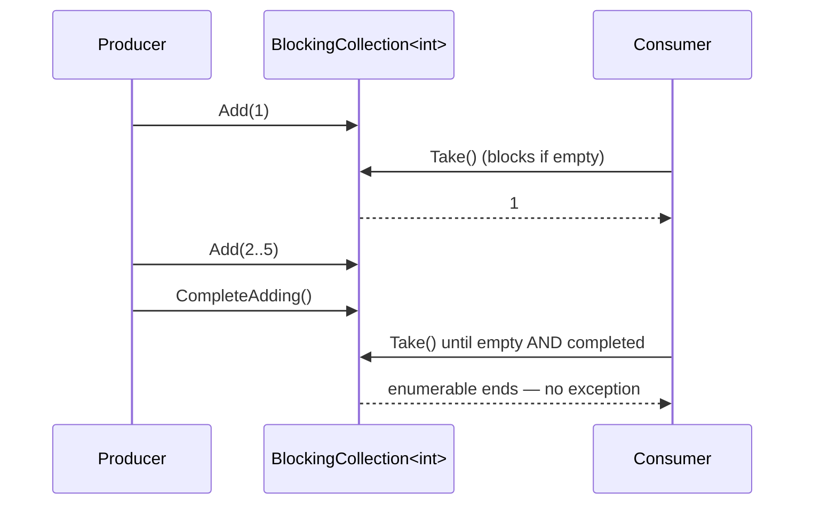
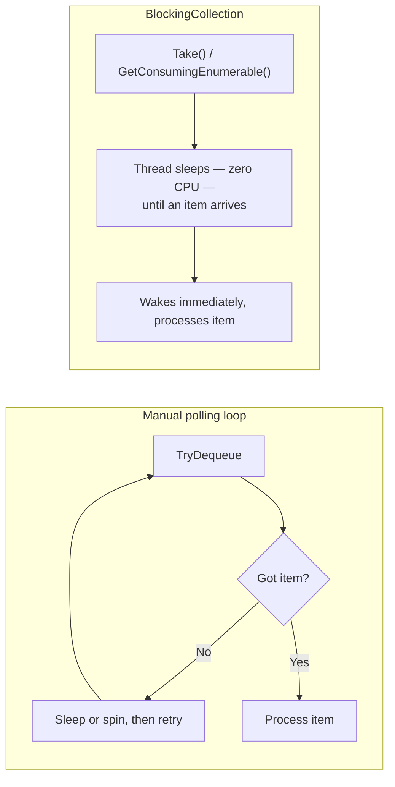

# BlockingCollection<T>

## Introduction

Before reading this lesson, you should already be comfortable with **[Concurrent Collections (ConcurrentDictionary, Queue, Stack, Bag)](../07-concurrency-parallel-async/07-26-concurrent-collections.md)**, and specifically with `ConcurrentQueue<T>`'s `TryDequeue` — a method that returns `false` immediately if the queue happens to be empty, leaving the caller to decide what to do next. That "decide what to do next" gap is exactly this lesson's subject. If a consumer thread calls `TryDequeue` in a loop and it keeps returning `false`, the consumer is left either burning CPU cycles by immediately trying again (busy-waiting) or adding an arbitrary `Thread.Sleep` and hoping the delay is about right — neither is a real answer to "wait efficiently until there's actually something to do."

`BlockingCollection<T>` closes that gap. It wraps one of the concurrent collections from the previous lesson and adds the one behavior none of them have on their own: a consumer calling `Take` (or iterating `GetConsumingEnumerable()`) genuinely *blocks* — using no CPU — until an item is available, and a producer calling `Add` on a capacity-limited collection genuinely blocks until there's room.

By the end of this lesson, you will be able to:

- Explain what problem `BlockingCollection<T>` solves that a bare `ConcurrentQueue<T>` does not
- Use `Add` and `Take` and understand their blocking semantics in both directions
- Apply a bounded capacity to create backpressure, so a fast producer can't run unboundedly ahead of a slow consumer
- Signal "no more items are coming" correctly with `CompleteAdding()`, and consume everything remaining with `GetConsumingEnumerable()`
- Contrast a hand-rolled polling loop over a concurrent collection against `BlockingCollection<T>`'s built-in wait/signal behavior

## BlockingCollection<T> — A Layman's Perspective

Picture a small bakery counter with a cooling rack that holds exactly three trays of fresh bread at a time. The baker in the back keeps producing loaves, but the rack physically cannot hold a fourth tray — so the moment it's full, the baker has to stop and wait, tray in hand, until a customer takes one away and frees up space. That's not a flaw in the bakery's design; it's deliberate. It keeps the baker from piling up more bread than the counter can display, and it naturally paces production to match how fast customers are actually buying.

Now picture the customer's side of the same counter. A customer walks up when the rack happens to be completely empty — nothing baked yet today. A badly run shop would have that customer repeatedly knock on the counter every few seconds asking "is it ready yet? Is it ready yet?" — wasting the customer's time and the shop's patience on constant, mostly pointless check-ins. A well-run shop instead has the customer simply wait quietly at the counter, and the moment a fresh tray lands, the customer is served immediately, with no repeated asking involved. That quiet, efficient waiting — as opposed to constant knocking — is the entire difference this lesson is about.

Finally, picture the shop closing for the day. The baker doesn't just wander off mid-shift; there's a specific, unambiguous signal — flipping the sign in the window to "CLOSED" — that tells any customer still waiting "there is nothing more coming, ever, for today; if the rack is empty when you see this sign, stop waiting." Without that sign, a customer who arrived just as the last loaf sold out would have no way to know whether to keep waiting for a loaf that will never come, or leave. The sign removes that ambiguity entirely, for everyone, the instant it's flipped.

That bakery counter — a bounded rack, quiet waiting instead of constant knocking, and an unambiguous "no more coming" sign — is exactly what `BlockingCollection<T>` gives a producer and a consumer thread in code. The rack's capacity limit is the collection's *bounded capacity*, forcing a producer to slow down rather than pile up unlimited work. The customer's quiet waiting is what `Take` and `GetConsumingEnumerable()` do instead of a hand-written polling loop. And the "CLOSED" sign is `CompleteAdding()` — a single, explicit call that tells every waiting consumer, unambiguously, that once the collection empties out, there is nothing left to wait for.

## BlockingCollection<T> — A Programming Language Perspective

`System.Collections.Concurrent.BlockingCollection<T>` is a wrapper that adds blocking producer-consumer semantics on top of any type implementing `IProducerConsumerCollection<T>` — by default a `ConcurrentQueue<T>` (FIFO), but a `ConcurrentBag<T>` or `ConcurrentStack<T>` can be supplied to the constructor instead when a different ordering fits better. `Add(item)` inserts an item, blocking the calling thread if the collection was constructed with a `boundedCapacity` that has been reached, until a consumer removes something. `Take()` removes and returns an item, blocking the calling thread if the collection is currently empty, until a producer adds one — or until `CompleteAdding()` has been called and no items remain, at which point `Take()` throws `InvalidOperationException` instead of blocking forever. `GetConsumingEnumerable()` wraps repeated `Take` calls in a `foreach`-friendly `IEnumerable<T>` that simply ends, rather than throwing, once the collection is both completed and empty — the idiomatic way most consumer code is actually written. This type has been part of the Task Parallel Library since .NET Framework 4 and is not version-gated in .NET 10.

## How to Use BlockingCollection<T> in C#

A producer thread adds items, optionally blocked by a bounded capacity; a consumer thread drains them with `GetConsumingEnumerable()`, which blocks efficiently whenever the collection is momentarily empty and exits cleanly once the producer signals completion.


*Figure 1: The producer adds and signals completion; the consumer's GetConsumingEnumerable() blocks between items and ends cleanly after CompleteAdding().*

```csharp
// Program.cs — .NET 10 / C# 14
using System.Collections.Concurrent;

BlockingCollection<int> queue = new(boundedCapacity: 2);

Thread producer = new(() =>
{
    for (int item = 1; item <= 5; item++)
    {
        queue.Add(item); // Blocks once 2 items are already waiting to be consumed.
    }

    queue.CompleteAdding(); // Signals "no more items are coming."
});

producer.Start();

Console.WriteLine("Consumer waiting for items...");

foreach (int item in queue.GetConsumingEnumerable())
{
    Console.WriteLine($"Consumed: {item}");
}

producer.Join();
Console.WriteLine("Producer finished; consumer exited automatically after CompleteAdding().");
```

**Console Output:**

```text
Consumer waiting for items...
Consumed: 1
Consumed: 2
Consumed: 3
Consumed: 4
Consumed: 5
Producer finished; consumer exited automatically after CompleteAdding().
```

The consumer's `foreach` blocks efficiently whenever the queue is temporarily empty or momentarily at capacity from the producer's side — no CPU is spent spinning during those waits. Because the backing collection defaults to `ConcurrentQueue<T>`, items come out in the same order they went in: `1` through `5`. Once the producer's loop finishes and calls `CompleteAdding()`, the `foreach` over `GetConsumingEnumerable()` simply stops after the last item is consumed, rather than throwing or blocking forever — that clean termination is the entire reason `CompleteAdding()` exists.

## Real-Time Example: A Library Front Desk Processing Checkout Requests

We extend the Library/Inventory Management domain with a front desk that accepts checkout requests from patrons throughout the day and a single clerk who processes them strictly in the order they arrived. The `requestQueue` is bounded to 3 pending requests at a time — beyond that, the front desk simply cannot hold more waiting requests, so new arrivals must pause until the clerk catches up. The clerk consumes with `GetConsumingEnumerable()`, checks the shared `catalog` for remaining copies, and either checks the book out or rejects the request.

```csharp
// Program.cs — .NET 10 / C# 14 — Real-Time Example
using System.Collections.Concurrent;

BlockingCollection<CheckoutRequest> requestQueue = new(boundedCapacity: 3);

Dictionary<string, (string Title, int CopiesAvailable)> catalog = new()
{
    ["ISBN-001"] = ("Clean Code", 2),
    ["ISBN-002"] = ("The Pragmatic Programmer", 1),
    ["ISBN-003"] = ("Design Patterns", 0)
};

Thread frontDesk = new(() =>
{
    CheckoutRequest[] incoming =
    [
        new("Asha", "ISBN-001"),
        new("Brian", "ISBN-002"),
        new("Chen", "ISBN-001"),
        new("Dana", "ISBN-003"),
        new("Elin", "ISBN-001")
    ];

    foreach (CheckoutRequest request in incoming)
    {
        requestQueue.Add(request); // Blocks once 3 requests are already pending.
    }

    requestQueue.CompleteAdding();
});

frontDesk.Start();

Console.WriteLine("Library open — processing checkout requests as they arrive...");
Console.WriteLine();

foreach (CheckoutRequest request in requestQueue.GetConsumingEnumerable())
{
    (string title, int copiesAvailable) = catalog[request.Isbn];

    if (copiesAvailable > 0)
    {
        catalog[request.Isbn] = (title, copiesAvailable - 1);
        string copyWord = copiesAvailable - 1 == 1 ? "copy" : "copies";
        Console.WriteLine($"Checked out \"{title}\" to {request.PatronName} ({copiesAvailable - 1} {copyWord} remaining)");
    }
    else
    {
        Console.WriteLine($"{request.PatronName}'s request for \"{title}\" REJECTED — no copies available");
    }
}

frontDesk.Join();
Console.WriteLine();
Console.WriteLine("All requests processed; library front desk closed for the day.");

record CheckoutRequest(string PatronName, string Isbn);
```

**Console Output:**

```text
Library open — processing checkout requests as they arrive...

Checked out "Clean Code" to Asha (1 copy remaining)
Checked out "The Pragmatic Programmer" to Brian (0 copies remaining)
Checked out "Clean Code" to Chen (0 copies remaining)
Dana's request for "Design Patterns" REJECTED — no copies available
Elin's request for "Clean Code" REJECTED — no copies available

All requests processed; library front desk closed for the day.
```

Requests are processed in exactly the order patrons submitted them, because `GetConsumingEnumerable()` drains the default FIFO `ConcurrentQueue<T>` backing store one at a time on a single clerk thread — there's no risk of two requests being evaluated against the catalog simultaneously and double-selling the same last copy. The bounded capacity of 3 means the front desk thread would itself pause if more than three requests piled up before the clerk caught up — a realistic cap on how much unprocessed work a real front desk queue should ever be allowed to accumulate. Dana's and Elin's rejections show the clerk correctly refusing a checkout rather than letting `CopiesAvailable` go negative.

## BlockingCollection<T> vs. a Manual Polling Loop over ConcurrentQueue<T>

Before `BlockingCollection<T>`, a consumer working directly against a `ConcurrentQueue<T>` has exactly one tool for "wait until something shows up": call `TryDequeue` repeatedly until it returns `true`. Written naively, that loop spins as fast as the CPU allows, burning an entire core checking an empty queue over and over. Written more carefully, it adds a `Thread.Sleep` between attempts — but now every item sits waiting for up to that sleep duration even when it arrives the instant after a check, trading CPU usage for added latency. Neither version has a clean way to signal "the producer is completely done" either; that requires a separate flag the consumer has to remember to check, and getting its interaction with the empty-queue check exactly right is easy to get subtly wrong.

`BlockingCollection<T>` replaces all of that hand-rolled logic with a single, correct implementation: `Take`/`GetConsumingEnumerable()` use an internal wait handle, so the consuming thread is genuinely put to sleep by the OS and woken only when there's real work — no spinning, no arbitrary sleep duration, no added latency beyond the time it actually takes to wake a waiting thread. `CompleteAdding()` and the enumerator's clean termination remove the separate "are we really done" flag entirely. The one thing a manual polling loop can do that `BlockingCollection<T>` doesn't do for you automatically is a truly custom wait strategy — but for the overwhelming majority of producer-consumer scenarios, that flexibility isn't needed, and the built-in type is simply less code and fewer places to get the synchronization wrong.


*Figure 2: A polling loop trades CPU cycles or latency for simplicity; BlockingCollection<T> blocks the thread efficiently and wakes it exactly when needed.*

| Aspect | Manual polling loop over `ConcurrentQueue<T>` | `BlockingCollection<T>` |
|---|---|---|
| Waiting when empty | Busy-spin (wastes CPU) or `Thread.Sleep` (adds latency) | Blocks via an internal wait handle — no CPU spin, minimal latency |
| Signaling "no more items" | A separate manual flag, checked carefully alongside emptiness | Built in — `CompleteAdding()` / `IsAddingCompleted` |
| Backpressure (limiting pending work) | Must hand-build with a separate counting semaphore | `boundedCapacity` constructor parameter, enforced by `Add` automatically |
| Cancellation support | Must be wired in manually | `CancellationToken` overloads on `Add`, `Take`, and `GetConsumingEnumerable` |
| Code you have to write and maintain | A full wait/signal implementation | A few lines using one well-tested type |

## Types and Related Members of BlockingCollection<T>

1. **[`ConcurrentQueue<T>`](../07-concurrency-parallel-async/07-26-concurrent-collections.md)** — the default backing collection, giving FIFO ordering out of the box.
2. **`ConcurrentBag<T>` / `ConcurrentStack<T>` as a backing store** — pass either to `BlockingCollection<T>`'s constructor for unordered or LIFO consumption instead of FIFO.
3. **`GetConsumingEnumerable(CancellationToken)`** — the same consuming enumerable, but stoppable early via cancellation rather than only via `CompleteAdding()`.
4. **`BlockingCollection.AddToAny` / `TakeFromAny`** — static methods for producing to or consuming from whichever of several collections is ready first.
5. **[System.Threading.Channels](../07-concurrency-parallel-async/07-28-system-threading-channels.md)** — the modern, async-first alternative that replaces blocking waits with `await`, covered next.
6. **[Producer-Consumer Patterns](../07-concurrency-parallel-async/07-29-producer-consumer-patterns.md)** — the general pattern this lesson and the next both implement, compared side by side.

## What You've Learned & What's Next

`BlockingCollection<T>` wraps a concurrent collection with the two behaviors a bare `ConcurrentQueue<T>` doesn't provide: a consumer's `Take`/`GetConsumingEnumerable()` blocks efficiently instead of polling, and a bounded producer's `Add` applies real backpressure instead of accepting unlimited work — with `CompleteAdding()` providing an unambiguous, built-in "nothing more is coming" signal that a hand-rolled polling loop has to reinvent on its own.

Continue your learning journey with **[System.Threading.Channels](../07-concurrency-parallel-async/07-28-system-threading-channels.md)**, where we replace `BlockingCollection<T>`'s synchronous, thread-blocking `Add`/`Take` with an async-first `WriteAsync`/`ReadAsync` pair built for `async`/`await` code rather than dedicated producer and consumer threads.

---
*Applies to: .NET 10 / C# 14. Last reviewed 2026-08-16.*
