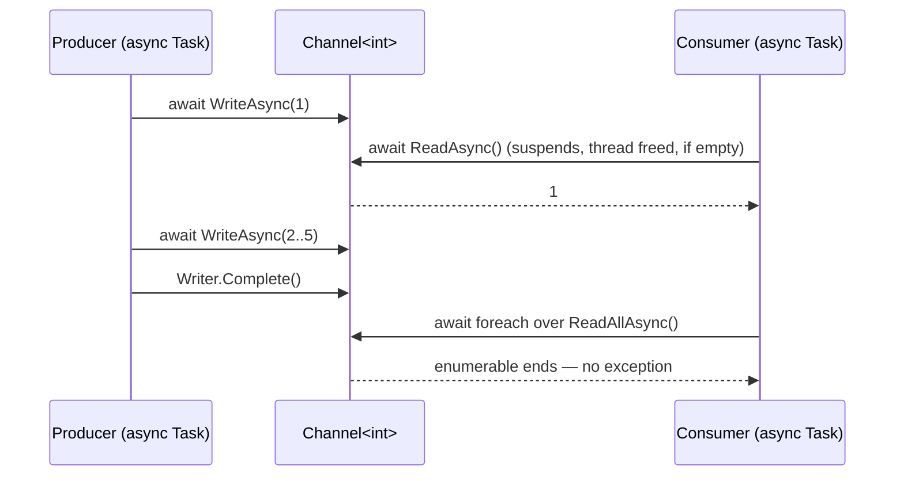
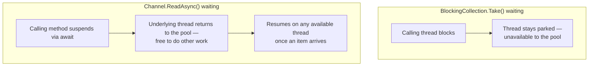

# System.Threading.Channels

## Introduction

Before reading this lesson, you should already be comfortable with **[BlockingCollection\<T\>](../07-concurrency-parallel-async/07-27-blockingcollection-t.md)** — a producer calling `Add`, a consumer calling `Take` or iterating `GetConsumingEnumerable()`, both blocking the calling thread efficiently when there's nothing to do. That word "blocking" is doing a lot of work in that sentence, and it's the entire reason this lesson exists. A blocked thread is still a thread — it's parked, holding onto a spot on the thread pool (or a dedicated OS thread) and doing nothing useful, for however long the wait lasts. In code built around `async`/`await`, that's exactly the cost this curriculum's earlier async lessons taught you to avoid.

`System.Threading.Channels` solves the same producer-consumer problem `BlockingCollection<T>` solves, but built for `async`/`await` from the ground up: instead of a producer's `Add` and a consumer's `Take` blocking a thread, a `Channel<T>`'s `WriteAsync` and `ReadAsync` *await* — suspending the calling method without occupying a thread at all while there's nothing to do.

By the end of this lesson, you will be able to:

- Explain what a thread loses by blocking on `BlockingCollection<T>` that an `await` on a `Channel<T>` does not lose
- Create a bounded or unbounded `Channel<T>` and use its `ChannelWriter<T>` and `ChannelReader<T>` halves
- Write items with `WriteAsync` and read them with `ReadAsync` or `await foreach` over `ReadAllAsync()`
- Apply bounded-channel backpressure so a fast producer can't overwhelm a slower consumer
- Explain why `System.Threading.Channels` is generally the preferred choice over `BlockingCollection<T>` in new `async`-based code

## System.Threading.Channels — A Layman's Perspective

Picture two very different ways a coffee shop can handle "your order isn't ready yet." The old-style deli counter has you place your order and then simply stand there, right at the counter, watching the sandwich get made — you can't step away, sit down, browse your phone, or do literally anything else, because standing there *is* your entire job until the sandwich appears. If ten customers order at once, ten people are now standing shoulder to shoulder at the counter, each one fully occupied doing nothing but waiting.

A modern coffee shop app works completely differently. You place your order on your phone, and instead of planting yourself at the counter, you're told "we'll notify you the instant it's ready." You go sit down, catch up on messages, chat with a friend, order something else at a completely different counter — you're free to do anything, because *waiting* no longer consumes your full attention or occupies a physical spot at the counter. The moment your order is actually ready, a notification pulls you right back, and you pick it up. Nothing about "your order isn't ready yet" tied you down in the meantime.

That's the entire difference between `BlockingCollection<T>` and a `Channel<T>`. A thread calling `BlockingCollection<T>.Take()` when nothing is available is the deli-counter customer: parked, unavailable for any other work, until an item shows up. A method calling `await channel.Reader.ReadAsync()` when nothing is available is the coffee-app customer: it steps away entirely — the thread it was running on goes back into circulation, free to run some other piece of work — and only resumes, on whichever thread happens to be free at that moment, once an item genuinely arrives.

This matters more than it might first seem, because threads are a genuinely limited resource — a typical process has a thread pool sized for the number of CPU cores available, not an unlimited supply. Ten deli-counter customers means ten threads permanently tied up, unavailable to do any of the other work the application needs done, for as long as the wait lasts. Ten coffee-app customers means zero threads tied up while waiting — the same handful of threads can serve all ten "orders," picking each one back up only at the exact moment there's real work to do. In a program handling hundreds or thousands of concurrent waits — exactly the shape of a busy web server or a background processing pipeline — that difference between "parked" and "stepped away" is the difference between a system that scales and one that runs out of threads.

## System.Threading.Channels — A Programming Language Perspective

A **`Channel<T>`**, from the `System.Threading.Channels` namespace, is an asynchronous, thread-safe FIFO pipe with two halves: a **`ChannelWriter<T>`**, exposing `WriteAsync(T item)` and the synchronous-fast-path `TryWrite(T item)`, and a **`ChannelReader<T>`**, exposing `ReadAsync()`, `TryRead(out T item)`, and `ReadAllAsync()` — an `IAsyncEnumerable<T>` built for `await foreach`. `Channel.CreateUnbounded<T>()` creates a channel with no capacity limit; `Channel.CreateBounded<T>(capacity)` applies a limit, and once full, a writer's `WriteAsync` call *asynchronously* awaits available space rather than blocking a thread, governed by `BoundedChannelOptions.FullMode` (the default, `Wait`, is the async analog of `BlockingCollection<T>`'s bounded `Add`). Both `WriteAsync` and `ReadAsync` return `ValueTask`/`ValueTask<T>` rather than `Task`/`Task<T>`, avoiding an allocation on the common path where data or space is already available. `System.Threading.Channels` originated as a NuGet package and has been part of the shared framework since .NET Core 3.0 — it is not new in .NET 10, but it remains the modern, recommended choice for any producer-consumer scenario built around `async`/`await`.

## How to Use Channel<T> in C#

Writing to and reading from a channel is symmetric with `BlockingCollection<T>`'s `Add`/`Take` shape, but every blocking call becomes an `await`. `Writer.Complete()` plays the same role `CompleteAdding()` played previously, and `Reader.ReadAllAsync()` mirrors `GetConsumingEnumerable()`, this time consumable with `await foreach`.


*Figure 1: WriteAsync/ReadAsync mirror BlockingCollection<T>'s Add/Take, but suspend via await instead of blocking a thread.*

```csharp
// Program.cs — .NET 10 / C# 14
using System.Threading.Channels;

Channel<int> channel = Channel.CreateBounded<int>(capacity: 2);

Task producerTask = Task.Run(async () =>
{
    for (int item = 1; item <= 5; item++)
    {
        await channel.Writer.WriteAsync(item); // Awaits (no thread blocked) once 2 items are pending.
    }

    channel.Writer.Complete(); // Signals "no more items are coming."
});

Task consumerTask = Task.Run(async () =>
{
    await foreach (int item in channel.Reader.ReadAllAsync())
    {
        Console.WriteLine($"Read: {item}");
    }
});

await Task.WhenAll(producerTask, consumerTask);
Console.WriteLine("Channel drained; both producer and consumer completed.");
```

**Console Output:**

```text
Read: 1
Read: 2
Read: 3
Read: 4
Read: 5
Channel drained; both producer and consumer completed.
```

The output looks identical in shape to the `BlockingCollection<T>` example from the previous lesson — items come out in the order they went in, and the consumer stops cleanly once the producer signals completion — but the mechanism underneath is entirely different. While the channel was empty or full, `WriteAsync` and `ReadAsync` suspended their `async` methods without occupying an OS thread at all; the thread pool was free to run other work during every one of those waits. `Task.WhenAll` only completes once both the producer's writing loop and the consumer's `await foreach` have finished, which is why the final line reliably prints last.

## Real-Time Example: An Overnight Banking Transaction Pipeline

We extend the Banking/ATM domain with an overnight batch job that applies a queued list of deposits and withdrawals to account balances. Transactions are written to a bounded `Channel<Transaction>` — capacity 2, so the batch job never lets more than two unapplied transactions pile up — and a single consumer applies each one in order, rejecting a withdrawal that would overdraw the account rather than letting the balance go negative.

```csharp
// Program.cs — .NET 10 / C# 14 — Real-Time Example
using System.Globalization;
using System.Threading.Channels;

Channel<Transaction> channel = Channel.CreateBounded<Transaction>(capacity: 2);

Dictionary<string, decimal> balances = new()
{
    ["AC-1001"] = 500.00m,
    ["AC-1002"] = 150.00m
};

Task producerTask = Task.Run(async () =>
{
    Transaction[] incoming =
    [
        new("AC-1001", 200.00m, TransactionType.Deposit),
        new("AC-1002", 50.00m, TransactionType.Withdrawal),
        new("AC-1001", 1000.00m, TransactionType.Withdrawal),
        new("AC-1002", 75.00m, TransactionType.Deposit),
        new("AC-1002", 200.00m, TransactionType.Withdrawal)
    ];

    foreach (Transaction transaction in incoming)
    {
        await channel.Writer.WriteAsync(transaction); // Awaits once 2 transactions are pending.
    }

    channel.Writer.Complete();
});

Task consumerTask = Task.Run(async () =>
{
    await foreach (Transaction transaction in channel.Reader.ReadAllAsync())
    {
        decimal balance = balances[transaction.AccountId];

        if (transaction.Type == TransactionType.Deposit)
        {
            balance += transaction.Amount;
            balances[transaction.AccountId] = balance;
            Console.WriteLine($"{transaction.AccountId}: deposited {Usd(transaction.Amount)} -> new balance {Usd(balance)}");
        }
        else if (balance >= transaction.Amount)
        {
            balance -= transaction.Amount;
            balances[transaction.AccountId] = balance;
            Console.WriteLine($"{transaction.AccountId}: withdrew {Usd(transaction.Amount)} -> new balance {Usd(balance)}");
        }
        else
        {
            Console.WriteLine($"{transaction.AccountId}: withdrawal of {Usd(transaction.Amount)} REJECTED — insufficient funds (balance {Usd(balance)})");
        }
    }
});

await Task.WhenAll(producerTask, consumerTask);

Console.WriteLine();
Console.WriteLine("Overnight batch complete — final balances:");
foreach (var (accountId, balance) in balances.OrderBy(kvp => kvp.Key))
{
    Console.WriteLine($"{accountId}: {Usd(balance)}");
}

static string Usd(decimal amount) => amount.ToString("C", CultureInfo.GetCultureInfo("en-US"));

enum TransactionType { Deposit, Withdrawal }

record Transaction(string AccountId, decimal Amount, TransactionType Type);
```

**Console Output:**

```text
AC-1001: deposited $200.00 -> new balance $700.00
AC-1002: withdrew $50.00 -> new balance $100.00
AC-1001: withdrawal of $1,000.00 REJECTED — insufficient funds (balance $700.00)
AC-1002: deposited $75.00 -> new balance $175.00
AC-1002: withdrawal of $200.00 REJECTED — insufficient funds (balance $175.00)

Overnight batch complete — final balances:
AC-1001: $700.00
AC-1002: $175.00
```

Transactions are applied in exactly the order they were queued, since the bounded channel preserves FIFO ordering and a single consumer applies them one at a time — no risk of two withdrawals against the same account racing each other and both succeeding against a balance that could only cover one. The bounded capacity of 2 means the producer would itself suspend, without blocking a thread, if it ever got more than two transactions ahead of the consumer — realistic backpressure for an overnight batch job that shouldn't buffer unlimited unapplied work in memory. This is exactly the kind of pipeline — bounded, ordered, asynchronous — that `System.Threading.Channels` was designed for.

## BlockingCollection<T> vs. Channel<T>

Both types solve the identical producer-consumer problem, and the API surface is intentionally similar — `Add`/`WriteAsync`, `Take`/`ReadAsync`, `CompleteAdding`/`Complete`, `GetConsumingEnumerable`/`ReadAllAsync` — precisely so that switching between them is mostly a matter of adding or removing `await`. The decision that actually matters is what happens to the calling thread while there's nothing to do. `BlockingCollection<T>` parks an entire thread, which is fine and simple when a small, fixed number of dedicated worker threads own the producing and consuming — a background service with one or two long-running threads, for instance. `Channel<T>` suspends only the `async` method, freeing the underlying thread back to the pool, which matters enormously once you're inside `async`/`await` code already — an ASP.NET Core request handler, a `Task`-based pipeline, anything already structured around awaiting rather than blocking.

There's a compounding effect worth naming directly: mixing the two badly — calling `BlockingCollection<T>.Take()` from inside an `async` method, for instance — blocks a thread-pool thread that the runtime expected to be freed by an `await`, and doing that at scale is a classic way to exhaust a thread pool under load. Because most new code in .NET 10 is `async`-first by default, `System.Threading.Channels` has become the generally preferred choice for new producer-consumer code; `BlockingCollection<T>` remains a legitimate choice specifically when the producer and consumer are genuinely synchronous, dedicated threads rather than `async` methods.


*Figure 2: A blocked thread stays parked and unusable; an awaited read frees the thread while the wait is pending.*

| Aspect | `BlockingCollection<T>` | `Channel<T>` |
|---|---|---|
| API style | Synchronous — `Add`/`Take` block the calling thread | Asynchronous — `WriteAsync`/`ReadAsync` return awaitables |
| Cost while waiting | Occupies a thread until an item/space is available | Frees the thread back to the pool while suspended |
| Natural fit | Dedicated producer/consumer threads | `async`/`await` code — ASP.NET Core, `Task`-based pipelines |
| Backpressure | `boundedCapacity` blocks `Add` | `BoundedChannelOptions` with a configurable `FullMode` |
| Completion signal | `CompleteAdding()` / `IsAddingCompleted` | `Writer.Complete()`; `ReadAllAsync()` ends cleanly |
| Introduced | .NET Framework 4 (Task Parallel Library) | .NET Core 3.0 (`System.Threading.Channels`) |

## Types and Variants of System.Threading.Channels

1. **`Channel.CreateUnbounded<T>()`** — no capacity limit; writers never wait, at the cost of unbounded memory if the consumer falls behind.
2. **`Channel.CreateBounded<T>(capacity)`** — the type used in this lesson's examples, applying real backpressure once full.
3. **`BoundedChannelOptions.FullMode`** — configures what a bounded channel does when full: `Wait` (default), `DropOldest`, `DropNewest`, or `DropWrite`.
4. **`ChannelWriter<T>` / `ChannelReader<T>`** — the split halves that let you hand a producer only write access and a consumer only read access.
5. **[BlockingCollection\<T\>](../07-concurrency-parallel-async/07-27-blockingcollection-t.md)** — the synchronous, thread-blocking counterpart this lesson compared Channels against.
6. **[Producer-Consumer Patterns](../07-concurrency-parallel-async/07-29-producer-consumer-patterns.md)** — the general pattern both types implement, examined side by side with a third, hand-rolled approach.

## What You've Learned & What's Next

`System.Threading.Channels` solves the same producer-consumer problem as `BlockingCollection<T>`, but every wait is an `await` instead of a blocked thread — a `Channel<T>`'s `WriteAsync` and `ReadAsync` suspend the calling method without occupying a thread, which is why Channels are the generally preferred choice for producer-consumer code in modern, `async`-first .NET applications.

Continue your learning journey with **[Producer-Consumer Patterns](../07-concurrency-parallel-async/07-29-producer-consumer-patterns.md)**, where we step back from any single API and look at the producer-consumer *pattern* itself — implemented with `BlockingCollection<T>`, with `Channel<T>`, and with a plain locked queue, side by side, to see how much of this design is really about the pattern rather than the primitive.

---
*Applies to: .NET 10 / C# 14. Last reviewed 2026-08-16.*
