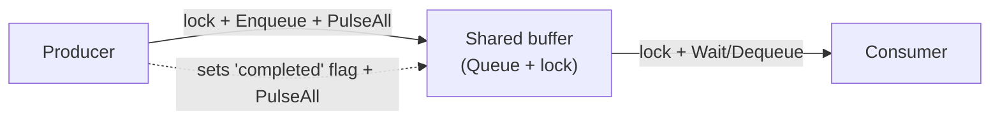
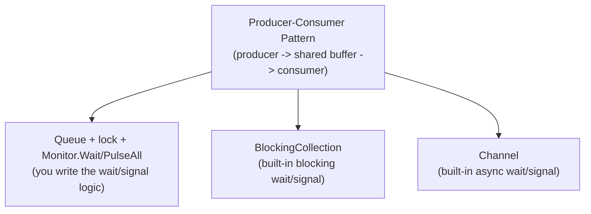

# Producer-Consumer Patterns

## Introduction

Before reading this lesson, you should already be comfortable with **[BlockingCollection\<T\>](../07-concurrency-parallel-async/07-27-blockingcollection-t.md)** and **[System.Threading.Channels](../07-concurrency-parallel-async/07-28-system-threading-channels.md)** — two lessons that, on the surface, looked like they were teaching two different types. Look again at both lessons' examples side by side, though, and a producer added items, a consumer removed them, and a completion signal told the consumer when to stop — in exactly that shape, twice in a row. That repetition wasn't an accident. Both lessons were teaching the *same design pattern* through two different primitives.

This lesson steps back from any single API and names that pattern directly: the **producer-consumer pattern**, one of the most common shapes in concurrent programming. We'll implement it a third way — by hand, with nothing but a `Queue<T>`, a `lock`, and `Monitor.Wait`/`Monitor.PulseAll` — specifically so the parts that `BlockingCollection<T>` and `Channel<T>` do *for* you become fully visible, and so it's unmistakable that the pattern itself never changed across all three lessons — only the plumbing did.

By the end of this lesson, you will be able to:

- Define the producer-consumer pattern in terms of its three structural roles: producer(s), a shared buffer, and consumer(s)
- Explain the four guarantees any correct implementation must provide, regardless of primitive
- Build a producer-consumer pipeline by hand using `lock` and `Monitor.Wait`/`Monitor.PulseAll`, and recognize it as what `BlockingCollection<T>` does internally
- Compare a hand-rolled lock+queue, `BlockingCollection<T>`, and `Channel<T>` side by side and state what changes and what stays the same
- Recognize single-producer/single-consumer, multiple-producer, and multiple-consumer as variants of the same underlying pattern

## Producer-Consumer Patterns — A Layman's Perspective

A restaurant kitchen makes the pattern obvious the moment you stop thinking about specific equipment and just watch what happens. A waiter takes an order at the table — that's the producer, generating a piece of work. The waiter doesn't walk into the kitchen and personally cook the dish; they drop the order off somewhere the cooks can pick it up from, and go back to serving tables. A cook — the consumer — picks up the next order whenever they're free and turns it into a finished plate. Neither the waiter nor the cook needs to know exactly what the other is doing at any given instant; they're connected only through whatever sits between them holding the orders.

What sits between them is the interesting part, and it's exactly where this lesson's three implementations differ without the *overall arrangement* changing at all. It could be a simple spike rail — a physical spindle where tickets get skewered in order, and a cook manually checks it, over and over, "is there anything new?" That's slow and wasteful, the kitchen equivalent of a thread spinning in a busy-wait loop, but it technically works. It could be a proper pass-through window with a bell — the waiter clips the ticket and rings a bell, and the cook, who was doing something else entirely, is alerted the instant there's new work and comes straight over. That's the deli-counter, blocking-wait version. Or it could be the fully modern kitchen display system — tickets appear on a screen the instant they're entered, cooks glance up only when notified, and nobody's standing at a window at all. Three completely different pieces of hardware; the exact same restaurant workflow underneath every one of them.

That's the whole point of this lesson. Whether the "something between them" is a spike rail, a bell window, or a digital display, the kitchen still needs the same four things to actually work: orders must never fall on the floor and get lost, no order should ever get cooked twice by two confused cooks, the rail/window/screen itself must never let two people grab the exact same ticket at the exact same instant, and there needs to be some way to say "the kitchen is closing — stop waiting for new tickets that aren't coming." Every version of this lesson's code — the hand-built one, `BlockingCollection<T>`, and `Channel<T>` — is really just a different piece of hardware satisfying those same four requirements.

## Producer-Consumer Patterns — A Programming Language Perspective

The **producer-consumer pattern** structures concurrent work as one or more **producers** generating work items, one or more **consumers** processing them, and a **shared buffer** between them that decouples the rate of production from the rate of consumption. Any correct implementation, regardless of the primitive used, must provide four guarantees: no item is ever lost, no item is ever processed twice, concurrent access to the shared buffer never corrupts it, and consumers have an unambiguous way to learn that no further items are coming so they can stop waiting. A hand-rolled implementation satisfies all four using a plain `Queue<T>`, a `lock` object guarding every access, and `Monitor.Wait`/`Monitor.PulseAll` to make a consumer sleep efficiently on an empty queue and wake the instant a producer adds something — precisely the mechanism `BlockingCollection<T>` (Lesson 07-27) implements internally, and that `Channel<T>` (Lesson 07-28) re-implements again using `async`/`await` suspension instead of thread blocking.

## How to Build a Producer-Consumer Pipeline by Hand

Every implementation of this pattern has the same three-part shape: a producer that adds to a shared buffer, a consumer that waits on that buffer and removes from it, and a signal that tells the consumer when to stop. Here, the buffer is a plain `Queue<int>`, the wait/signal mechanism is `Monitor.Wait`/`Monitor.PulseAll` under a `lock`, and completion is a simple `bool` flag — everything `BlockingCollection<T>` gives you for free, written out by hand.


*Figure 1: The same three roles — producer, shared buffer, consumer — appear regardless of which primitive implements the buffer.*

```csharp
// Program.cs — .NET 10 / C# 14
object gate = new();
Queue<int> buffer = new();
bool completed = false;

Thread producer = new(() =>
{
    for (int item = 1; item <= 5; item++)
    {
        lock (gate)
        {
            buffer.Enqueue(item);
            Monitor.PulseAll(gate); // Wake any consumer waiting on an empty buffer.
        }
    }

    lock (gate)
    {
        completed = true;
        Monitor.PulseAll(gate); // Wake any consumer waiting, so it can observe completion.
    }
});

producer.Start();

while (true)
{
    int item;
    lock (gate)
    {
        while (buffer.Count == 0 && !completed)
        {
            Monitor.Wait(gate); // Release the lock and block efficiently until pulsed.
        }

        if (buffer.Count == 0 && completed)
        {
            break;
        }

        item = buffer.Dequeue();
    }

    Console.WriteLine($"Consumed: {item}");
}

producer.Join();
Console.WriteLine("Producer finished; consumer exited after observing completion.");
```

**Console Output:**

```text
Consumed: 1
Consumed: 2
Consumed: 3
Consumed: 4
Consumed: 5
Producer finished; consumer exited after observing completion.
```

`Monitor.Wait(gate)` releases the lock and suspends the consumer efficiently — the same "no CPU spinning" behavior `BlockingCollection<T>.Take()` gives you — and `Monitor.PulseAll(gate)` wakes it back up the instant either a new item or the completion flag becomes visible. The `while (buffer.Count == 0 && !completed)` check, rather than a plain `if`, matters: a woken thread must always re-check the condition itself, because between being pulsed and re-acquiring the lock, another thread could have already taken the item. Every one of these details — the retry loop, the shared flag, the lock discipline — is exactly what `BlockingCollection<T>` hides behind `Add`, `Take`, and `CompleteAdding()`.

## Real-Time Example: Order Fulfillment with Two Concurrent Workers

We extend the E-Commerce Order Processing domain with an order-fulfillment stage: a single intake process feeds a bounded `Channel<Order>`, and *two* independent warehouse workers consume from the same channel concurrently — a multiple-consumer variant of the pattern. Each order's shipping outcome depends only on its own total and express flag, never on which worker happens to process it or in what order relative to other orders, so the result is fully deterministic even though two consumers race to pull work from the same channel.

```csharp
// Program.cs — .NET 10 / C# 14 — Real-Time Example
using System.Collections.Concurrent;
using System.Threading.Channels;

Channel<Order> channel = Channel.CreateBounded<Order>(capacity: 3);
ConcurrentDictionary<string, string> results = new();

List<Order> incoming =
[
    new("ORD-201", 42.50m, IsExpress: false),
    new("ORD-202", 89.00m, IsExpress: true),
    new("ORD-203", 15.00m, IsExpress: false),
    new("ORD-204", 120.00m, IsExpress: false),
    new("ORD-205", 30.00m, IsExpress: true),
    new("ORD-206", 75.00m, IsExpress: false)
];

Task producerTask = Task.Run(async () =>
{
    foreach (Order order in incoming)
    {
        await channel.Writer.WriteAsync(order);
    }

    channel.Writer.Complete();
});

Task RunWorkerAsync() => Task.Run(async () =>
{
    await foreach (Order order in channel.Reader.ReadAllAsync())
    {
        string shipping = order.Total >= 75.00m ? "FREE shipping" : "$5.99 standard shipping";
        string suffix = order.IsExpress ? " (expedited — express order)" : "";
        results[order.OrderId] = $"{order.OrderId}: {shipping}{suffix}";
    }
});

Task worker1 = RunWorkerAsync();
Task worker2 = RunWorkerAsync();

await Task.WhenAll(producerTask, worker1, worker2);

Console.WriteLine("-- Fulfillment results --");
foreach (Order order in incoming)
{
    Console.WriteLine(results[order.OrderId]);
}

int freeShipping = incoming.Count(o => o.Total >= 75.00m);
int expressHandled = incoming.Count(o => o.IsExpress);
Console.WriteLine();
Console.WriteLine($"Processed {incoming.Count} orders across 2 concurrent workers " +
    $"({freeShipping} free shipping, {incoming.Count - freeShipping} standard, {expressHandled} express).");

record Order(string OrderId, decimal Total, bool IsExpress);
```

**Console Output:**

```text
-- Fulfillment results --
ORD-201: $5.99 standard shipping
ORD-202: FREE shipping (expedited — express order)
ORD-203: $5.99 standard shipping
ORD-204: FREE shipping
ORD-205: $5.99 standard shipping (expedited — express order)
ORD-206: FREE shipping

Processed 6 orders across 2 concurrent workers (3 free shipping, 3 standard, 2 express).
```

Both `worker1` and `worker2` call `ReadAllAsync()` against the same `channel.Reader` — `Channel<T>` supports multiple concurrent readers by default, splitting the work between them automatically with no risk of the same order reaching both workers. Because each order's outcome depends only on its own data, it doesn't matter which worker happened to grab which order, or in what interleaving — the results, collected into a `ConcurrentDictionary` and printed back in the original intake order, come out identical every run. Splitting fulfillment across two workers like this is exactly how a real warehouse scales fulfillment throughput without touching the intake logic at all.

## Three Implementations, One Pattern

Line up the hand-rolled version, `BlockingCollection<T>`, and `Channel<T>` and the structural equivalence is exact: every one of them has something that plays the role of "add to the buffer," something that plays the role of "wait for and remove from the buffer," and something that plays the role of "signal no more items are coming." What differs is entirely how much of that machinery you write yourself and whether waiting blocks a thread or suspends an `async` method.

The hand-rolled `Queue<T>` + `lock` + `Monitor` version is the only one of the three with no dependency beyond the base class library, and it's worth having built once so the other two stop feeling like magic — but it is also the version most likely to contain a subtle bug: forgetting the `while` re-check after `Monitor.Wait`, forgetting `PulseAll` on the completion path, or forgetting a lock around one access site anywhere in a larger codebase. `BlockingCollection<T>` removes that risk for synchronous, thread-based producers and consumers, at the cost of a parked thread during every wait. `Channel<T>` removes the same risk for `async`-based code, at the cost of needing `async`/`await` throughout the producer and consumer methods. None of the three is "more correct" than the others when used as intended — they satisfy the same four guarantees through different plumbing, and the right choice depends on what your producers and consumers already are: raw threads, or `async` methods.


*Figure 2: Three different implementations of the identical structural pattern — the buffer, and how waiting works, is all that changes.*

| Role in the pattern | Hand-rolled `Queue<T>` + `lock` | `BlockingCollection<T>` | `Channel<T>` |
|---|---|---|---|
| Shared buffer | `Queue<T>`, guarded manually | Wraps a `ConcurrentQueue<T>` (or similar) internally | Internal buffered channel |
| Producer adds an item | `lock` + `Enqueue` + `Monitor.PulseAll` | `Add` (blocks if bounded and full) | `WriteAsync` (awaits if bounded and full) |
| Consumer waits for an item | `Monitor.Wait` in a `while` loop | `Take` / `GetConsumingEnumerable()` (blocks) | `ReadAsync` / `ReadAllAsync()` (awaits) |
| Completion signal | A manual `bool` flag + `PulseAll` | `CompleteAdding()` / `IsAddingCompleted` | `Writer.Complete()` |
| Thread cost while waiting | Blocks a thread | Blocks a thread | Suspends without blocking a thread |
| Risk of a subtle bug | Highest — every detail is hand-written | Low — one well-tested type | Low — one well-tested type |
| Best fit | Learning what the other two do internally | Dedicated synchronous worker threads | `async`/`await`-based pipelines |

## Variants of the Producer-Consumer Pattern

1. **Single-producer/single-consumer (SPSC)** — the simplest variant, used in this lesson's hand-rolled example; one thread writes, one thread reads.
2. **Multiple-producer/single-consumer (MPSC)** — several sources feed one processing thread, such as several intake channels merging into one order-fulfillment worker.
3. **Single-producer/multiple-consumer (SPMC)** — one source, several workers competing for items, used in this lesson's Real-Time Example.
4. **Multiple-producer/multiple-consumer (MPMC)** — the fully general case; both `BlockingCollection<T>` and `Channel<T>` support any number of producers and consumers safely without extra code.
5. **[BlockingCollection\<T\>](../07-concurrency-parallel-async/07-27-blockingcollection-t.md)** — the synchronous, thread-blocking implementation of this pattern covered two lessons back.
6. **[System.Threading.Channels](../07-concurrency-parallel-async/07-28-system-threading-channels.md)** — the asynchronous implementation of the identical pattern, covered in the previous lesson.

## What You've Learned & What's Next

The producer-consumer pattern is defined by three roles — producers, a shared buffer, and consumers — and four guarantees any correct implementation must satisfy: no lost items, no duplicate processing, safe concurrent access, and an unambiguous completion signal. A hand-rolled `Queue<T>` with `lock` and `Monitor.Wait`/`PulseAll`, `BlockingCollection<T>`, and `Channel<T>` are three different pieces of plumbing satisfying those exact same guarantees — the pattern itself never changes, only how much of the wait/signal machinery you write yourself and whether waiting blocks a thread or suspends an `async` method.

Continue your learning journey with **[Choosing the Right Concurrency Primitive](../07-concurrency-parallel-async/07-30-choosing-right-concurrency-primitive.md)**, the capstone of Module 07, where every primitive covered across the entire module — threads, locks, semaphores, `Parallel`, `async`/`await`, concurrent collections, and the producer-consumer types from these last three lessons — comes together into one decision framework.

---
*Applies to: .NET 10 / C# 14. Last reviewed 2026-08-16.*
