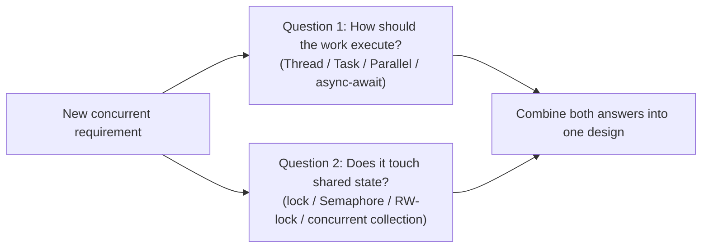
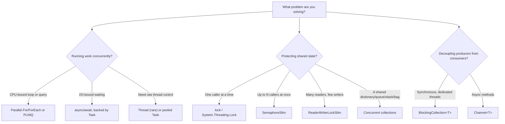

# Choosing the Right Concurrency Primitive

## Introduction

Before reading this lesson, you should already be comfortable with **[Producer-Consumer Patterns](../07-concurrency-parallel-async/07-29-producer-consumer-patterns.md)** and, really, with the entire arc of Module 07: raw `Thread`s and the `ThreadPool`, the hazards of race conditions and deadlocks, `lock`/`Monitor` and `Mutex`, `SemaphoreSlim` and `ReaderWriterLockSlim`, the Task Parallel Library and `Parallel.For`/PLINQ, `async`/`await`, and — across the last four lessons — concurrent collections, `BlockingCollection<T>`, `Channel<T>`, and the producer-consumer pattern they all implement. That is a genuinely large toolbox, and this lesson, the module's capstone, asks the question every prior lesson quietly deferred: given all of it, how do you actually decide what to reach for on a real project?

There's no single "best" primitive in this list — each one exists because it solves a problem the others solve poorly or not at all. The skill this lesson builds isn't memorizing one more API; it's recognizing, quickly and confidently, *which kind* of problem you're facing, because that recognition is what points you at the right tool.

By the end of this lesson, you will be able to:

- Separate any concurrency decision into two independent questions: how work should execute, and how shared state should be protected
- Choose correctly among `Thread`, the `ThreadPool`, and `Task` for how a piece of work runs
- Choose correctly among `lock`, the new `Lock` type, `SemaphoreSlim`, and `ReaderWriterLockSlim` for how shared state gets protected
- Choose correctly between `Parallel.For`/PLINQ and `async`/`await` based on whether work is CPU-bound or I/O-bound
- Choose correctly between `BlockingCollection<T>` and `Channel<T>` for a producer-consumer pipeline
- Combine two or more primitives correctly within a single realistic application, as real systems require

## Choosing a Concurrency Primitive — A Layman's Perspective

Think about a skilled contractor's toolbox on the first day of a job versus the last day of an apprenticeship. On day one, a hammer is the only tool that feels familiar, so everything looks like a nail — a stripped screw gets hammered flush, a loose bracket gets hammered instead of bolted, and most of it technically "works" in the sense that the job eventually gets finished, badly, with cracked wood and bent fasteners along the way. By the end of the apprenticeship, the same person glances at a job for about two seconds and already knows: this needs a torque wrench, not a hammer; this needs a drill with a specific bit, not a screwdriver; this one actually is a nail, so the hammer was right all along. Nothing about the toolbox changed between day one and the end of the apprenticeship — every tool was sitting right there the whole time. What changed was the ability to look at the *job* first, and let the job's shape dictate the tool, instead of grabbing whatever's already in hand.

Concurrency in .NET works exactly this way, and Module 07 has been building your toolbox one tool at a time: a hammer for pure raw thread control, a nail gun for a pool of ready reusable workers, a torque wrench for making sure two people never turn the same bolt at the same instant, a wider wrench for letting several people work at once but never more than a fixed number, a special wrench that lets many people read a gauge simultaneously but only one adjust it, a table saw for slicing one big pile of identical work into many pieces run side by side, and two different kinds of conveyor belt for handing finished pieces from one worker to another — one where the receiving worker stands and waits at the belt, one where the receiving worker gets paged the instant something arrives and is free to do something else until then.

A real job on a real site rarely needs just one of these. A single overnight renovation might need the table saw for cutting a batch of boards to length, the special one-writer-many-readers wrench for reading a shared measurement everyone consults, and a conveyor belt to move finished pieces from the cutting station to the assembly station — three different tools, three different jobs, one single evening's work. That's precisely the shape of this lesson's Real-Time Example: a single overnight banking batch job that correctly reaches for three different primitives for three genuinely different sub-problems, because a real system, unlike a tutorial's isolated examples, is never really just one job.

## Choosing a Concurrency Primitive — A Programming Language Perspective

Every primitive covered in Module 07 answers one of two genuinely separate questions, and conflating them is the single most common source of a wrong choice. The first question is **execution**: how should this specific piece of work actually run — on a raw `Thread`, on a pooled `ThreadPool`/`Task` worker, split across cores with `Parallel.For`/PLINQ for CPU-bound computation, or suspended efficiently with `async`/`await` for I/O-bound waiting? The second question is entirely independent: **coordination** — does this work touch state that something else might touch at the same time, and if so, does it need exclusive access (`lock`, the newer `System.Threading.Lock`), capped concurrent access (`SemaphoreSlim`), reader-favoring access (`ReaderWriterLockSlim`), a ready-made thread-safe collection, or a full producer-consumer hand-off (`BlockingCollection<T>`, `Channel<T>`)? `System.Threading.Lock`, introduced in C# 13 and available on .NET 9 and later (including .NET 10), is worth calling out specifically: it's a purpose-built, faster alternative to locking on a plain `object`, and the `lock` statement itself recognizes it and uses its dedicated API automatically — a rare case of an existing keyword getting measurably faster for free.

## How to Choose and Apply a Concurrency Primitive

Every decision in this lesson reduces to asking the execution question and the coordination question separately, then combining the answers — never trying to answer both at once with a single primitive.


*Figure 1: Every concurrency decision is really two independent questions — execution and coordination — answered separately and then combined.*

As a concrete instance of the coordination question, here is the newest addition to the toolbox: `System.Threading.Lock`, used exactly like a plain `object` lock, but faster.

```csharp
// Program.cs — .NET 10 / C# 14
using System.Threading;

Lock cashDrawerLock = new(); // System.Threading.Lock — introduced in C# 13 / .NET 9.
int cashOnHand = 200;

Parallel.For(0, 5, _ =>
{
    lock (cashDrawerLock) // The 'lock' statement recognizes Lock and uses its faster API automatically.
    {
        cashOnHand += 10;
    }
});

Console.WriteLine($"Final cash on hand: ${cashOnHand}");
```

**Console Output:**

```text
Final cash on hand: $250
```

Five parallel iterations each add 10 to `cashOnHand` under the same `Lock` instance, so regardless of which iteration the `Parallel.For` scheduler happens to run first, every increment is serialized correctly and the final total is exactly `200 + 5 × 10 = 250`. Nothing about using `Lock` instead of a plain `object` changed the code's shape — the `lock` statement's syntax is identical either way — but `Lock` is purpose-built for exactly this job, rather than being an `object` merely being repurposed as a lock token the way `lock (someObject)` has always required.

## Real-Time Example: An Overnight Banking Batch Job Using Three Primitives

We bring together the Banking/ATM domain's transaction pipeline from the previous two lessons into one realistic overnight batch job that correctly combines three different primitives, each solving a genuinely different sub-problem: a bounded `Channel<Transaction>` decouples intake from processing (the producer-consumer problem from Lessons 07-28/07-29); a `SemaphoreSlim` caps how many simulated external fraud-check API calls run at once, regardless of how many worker tasks are processing transactions (a bounded-concurrency problem `lock` cannot express); and a `ConcurrentDictionary<string,decimal>` serves as the shared balance store three concurrent workers safely update at once (the shared-state problem from Lesson 07-26).

```csharp
// Program.cs — .NET 10 / C# 14 — Real-Time Example
using System.Collections.Concurrent;
using System.Globalization;
using System.Threading.Channels;

ConcurrentDictionary<string, decimal> balances = new()
{
    ["AC-3001"] = 1000.00m,
    ["AC-3002"] = 250.00m,
    ["AC-3003"] = 4000.00m
};

ConcurrentDictionary<string, string> auditLog = new();

// Caps how many fraud-check calls to the (simulated) external API run at once,
// no matter how many consumer workers are processing transactions.
SemaphoreSlim fraudCheckThrottle = new(initialCount: 2, maxCount: 2);

Channel<Transaction> pipeline = Channel.CreateBounded<Transaction>(capacity: 4);

List<Transaction> incoming =
[
    new("TXN-01", "AC-3001", 300.00m, TransactionType.Deposit),
    new("TXN-02", "AC-3002", 100.00m, TransactionType.Withdrawal),
    new("TXN-03", "AC-3003", 5000.00m, TransactionType.Withdrawal),
    new("TXN-04", "AC-3001", 50.00m, TransactionType.Withdrawal),
    new("TXN-05", "AC-3002", 400.00m, TransactionType.Deposit),
    new("TXN-06", "AC-3003", 750.00m, TransactionType.Withdrawal)
];

Task producerTask = Task.Run(async () =>
{
    foreach (Transaction transaction in incoming)
    {
        await pipeline.Writer.WriteAsync(transaction);
    }

    pipeline.Writer.Complete();
});

Task RunWorkerAsync() => Task.Run(async () =>
{
    await foreach (Transaction transaction in pipeline.Reader.ReadAllAsync())
    {
        await fraudCheckThrottle.WaitAsync();
        try
        {
            await PerformFraudCheckAsync(transaction); // At most 2 of these run concurrently.
        }
        finally
        {
            fraudCheckThrottle.Release();
        }

        ApplyTransaction(transaction);
    }
});

Task worker1 = RunWorkerAsync();
Task worker2 = RunWorkerAsync();
Task worker3 = RunWorkerAsync();

await Task.WhenAll(producerTask, worker1, worker2, worker3);

Console.WriteLine("-- Overnight batch results --");
foreach (Transaction transaction in incoming)
{
    Console.WriteLine(auditLog[transaction.TransactionId]);
}

Console.WriteLine();
Console.WriteLine("-- Final account balances --");
foreach (var (accountId, balance) in balances.OrderBy(kvp => kvp.Key))
{
    Console.WriteLine($"{accountId}: {Usd(balance)}");
}

void ApplyTransaction(Transaction transaction)
{
    while (true)
    {
        decimal currentBalance = balances[transaction.AccountId];

        if (transaction.Type == TransactionType.Deposit)
        {
            decimal updated = currentBalance + transaction.Amount;
            if (balances.TryUpdate(transaction.AccountId, updated, currentBalance))
            {
                auditLog[transaction.TransactionId] =
                    $"{transaction.TransactionId}: deposited {Usd(transaction.Amount)} to {transaction.AccountId}";
                return;
            }
        }
        else if (currentBalance >= transaction.Amount)
        {
            decimal updated = currentBalance - transaction.Amount;
            if (balances.TryUpdate(transaction.AccountId, updated, currentBalance))
            {
                auditLog[transaction.TransactionId] =
                    $"{transaction.TransactionId}: withdrew {Usd(transaction.Amount)} from {transaction.AccountId}";
                return;
            }
        }
        else
        {
            auditLog[transaction.TransactionId] =
                $"{transaction.TransactionId}: withdrawal of {Usd(transaction.Amount)} from {transaction.AccountId} REJECTED — insufficient funds";
            return;
        }
        // Another worker updated this account concurrently between our read and our
        // TryUpdate — currentBalance is stale, so loop and retry against a fresh read.
    }
}

static async Task PerformFraudCheckAsync(Transaction transaction)
{
    await Task.Delay(20); // Simulated latency of an external fraud-check API call.
}

static string Usd(decimal amount) => amount.ToString("C", CultureInfo.GetCultureInfo("en-US"));

enum TransactionType { Deposit, Withdrawal }

record Transaction(string TransactionId, string AccountId, decimal Amount, TransactionType Type);
```

**Console Output:**

```text
-- Overnight batch results --
TXN-01: deposited $300.00 to AC-3001
TXN-02: withdrew $100.00 from AC-3002
TXN-03: withdrawal of $5,000.00 from AC-3003 REJECTED — insufficient funds
TXN-04: withdrew $50.00 from AC-3001
TXN-05: deposited $400.00 to AC-3002
TXN-06: withdrew $750.00 from AC-3003

-- Final account balances --
AC-3001: $1,250.00
AC-3002: $550.00
AC-3003: $3,250.00
```

Three workers pull transactions off the same channel concurrently, yet the results are exactly reproducible: each transaction's own accept/reject outcome depends only on its own account and amount, never on which worker or what order handled it, and `TryUpdate`'s retry loop guarantees no concurrent balance update is ever lost. The `SemaphoreSlim` never appears directly in the output, but it's doing real work the whole time — without it, all six transactions could hammer the simulated fraud-check API simultaneously; with it, at most two calls are ever in flight, exactly the kind of external-dependency protection a real overnight batch job needs. Three primitives, three distinct jobs, one coherent pipeline — precisely the point of this entire lesson.

## The Full Module 07 Decision Guide

This is the comparison this whole lesson has been building toward: every primitive Module 07 covered, organized by the problem it solves, with concrete guidance for when to reach for it.

| Primitive | Category | Use this when... |
|---|---|---|
| `Thread` | Raw execution | You need direct control over an OS thread's lifetime or priority — rare in modern application code |
| `ThreadPool` | Raw execution | You need a pooled worker without managing a thread's lifetime yourself — mostly superseded by `Task` |
| `Task` / `Task<T>` | Execution + composition | The default choice for background or asynchronous work — composable, awaitable, propagates exceptions |
| `Parallel.For` / `Parallel.ForEach` | Data parallelism | A CPU-bound loop over an in-memory collection should be split across cores |
| PLINQ (`.AsParallel()`) | Data parallelism | You already have a LINQ query over an in-memory collection and want one-line parallelization |
| `async`/`await` | Asynchrony | The work is I/O-bound (network, disk, database) and a thread shouldn't be blocked while waiting |
| `lock` (`Monitor`) | Mutual exclusion | Simple, exclusive one-thread-at-a-time access to shared state |
| `System.Threading.Lock` (C# 13+) | Mutual exclusion | The same job as `lock`, on .NET 9/10, for measurably better performance |
| `SemaphoreSlim` | Bounded concurrency | Up to *N* callers should be allowed through at once — capping concurrent external calls, for example |
| `ReaderWriterLockSlim` | Read-heavy shared state | Many concurrent readers and occasional writers, where readers shouldn't block each other |
| Concurrent collections (Lesson 07-26) | Shared collection | A dictionary/queue/stack/bag is shared across threads and built-in atomic operations suffice |
| `BlockingCollection<T>` | Producer-consumer | Producers and consumers are synchronous, dedicated threads, and blocking waits are acceptable |
| `Channel<T>` | Producer-consumer | Producers and consumers are `async` methods, and backpressure without blocking a thread is wanted |


*Figure 2: The three questions Module 07's entire toolbox answers — execution, shared-state protection, and producer-consumer hand-off — rarely have just one right answer across a whole application at once.*

## Module 07 at a Glance

This decision guide rests on every lesson in the module — each one is worth revisiting now that they all fit together:

1. **[The Thread Class](../07-concurrency-parallel-async/07-02-the-thread-class.md)** — the raw execution unit every higher-level primitive in this module is ultimately built on.
2. **[Race Conditions and Deadlocks](../07-concurrency-parallel-async/07-04-race-conditions-and-deadlocks.md)** — the two hazards every coordination primitive in this table exists to prevent.
3. **[lock and Monitor](../07-concurrency-parallel-async/07-05-lock-and-monitor.md)** — the baseline mutual-exclusion primitive this lesson's `Lock` example builds on directly.
4. **[Synchronous vs Asynchronous Execution — Comparison](../07-concurrency-parallel-async/07-25-sync-vs-async-execution-comparison.md)** — the execution-side half of the two-question framework this lesson formalizes.
5. **[BlockingCollection\<T\>](../07-concurrency-parallel-async/07-27-blockingcollection-t.md)** — the synchronous producer-consumer primitive used when dedicated threads, not `async` methods, own the work.
6. **[System.Threading.Channels](../07-concurrency-parallel-async/07-28-system-threading-channels.md)** — the asynchronous producer-consumer primitive this lesson's Real-Time Example builds its pipeline on.

## What You've Learned & What's Next

Every concurrency decision in .NET reduces to two independent questions — how should this work execute, and does it touch shared state that needs protecting — and Module 07's entire toolbox exists to answer one or the other, never both at once with a single primitive. `Thread`, `ThreadPool`, `Task`, `Parallel`, and `async`/`await` answer the execution question; `lock`, `Lock`, `SemaphoreSlim`, `ReaderWriterLockSlim`, concurrent collections, `BlockingCollection<T>`, and `Channel<T>` answer the coordination question — and a realistic system, like this lesson's overnight banking batch job, routinely needs answers to both, more than once, in the same program.

Continue your learning journey with **[Introduction to Memory Management in .NET](../08-memory-management/08-01-introduction-to-memory-management.md)**, the first lesson of Module 08, where the focus shifts from *coordinating* work across threads to understanding what happens to the memory that work allocates — the garbage collector, the stack versus the heap, and how .NET reclaims what your program no longer needs.

---
*Applies to: .NET 10 / C# 14. Last reviewed 2026-08-16.*
