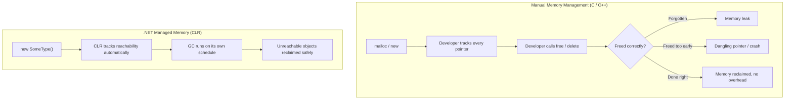

# Introduction to Memory Management in .NET

## Introduction

Before reading this lesson, you should already be comfortable with **[Choosing the Right Concurrency Primitive](../07-concurrency-parallel-async/07-30-choosing-right-concurrency-primitive.md)**, and really with the whole arc of Module 07 — how .NET schedules and coordinates work across threads. This lesson opens Module 08 and shifts the focus from *coordinating* work to understanding what happens to the memory that work allocates along the way. Every `Order`, every `Account`, every `Book` object you've created across every prior module had to live somewhere in memory, and something had to eventually clean it up. This lesson is about that "something."

By the end of this lesson, you will be able to:

- Explain what "managed memory" means in the context of the .NET Common Language Runtime (CLR)
- Contrast automatic (garbage-collected) memory management with manual memory management as used in languages like C and C++
- Describe, at a high level, what the garbage collector (GC) actually does
- Explain why understanding memory management still matters even though .NET automates it
- Recognize the performance implications of GC activity, including GC pauses

## Memory Management — A Layman's Perspective

Imagine two ways of living somewhere. The first is owning a standalone house. You are responsible for everything: you schedule the plumber, you remember to renew the home insurance, you mow the lawn, and — critically — when a room is empty and you're not using it anymore, nothing happens to it automatically. If you forget to turn off the water heater in a room you've stopped using, it just keeps running, quietly wasting energy, until you personally notice and turn it off. Forget for long enough, and the waste piles up: that's a leak, plain and simple, and it's entirely on you to catch it.

The second way is living in a large serviced apartment building with a housekeeping staff. You still move into rooms, use them, fill them with your belongings, and eventually move out. But you don't personally have to remember to strip the bed, take out the trash, or notify the building that a room is now empty. Housekeeping does periodic rounds. When they find a room nobody is staying in anymore — no one is referencing it as "theirs" — they clean it, reset it, and it becomes available again for a future guest, all without you lifting a finger. That's an enormous convenience, and it's the reason most guests never think about housekeeping at all.

But here's the part that matters for this lesson: living in the serviced building doesn't mean the housekeeping is *free* or *invisible*. If the building has thousands of rooms and housekeeping only sweeps periodically, there are moments where the halls are busy with cleaning carts and a newly arriving guest has to wait slightly longer for their room to be readied. The bigger and busier the building, the more those housekeeping rounds cost in time, even though no guest ever personally has to clean anything. And a guest who understands roughly how housekeeping's rounds work — that leaving a room in a lightly used state gets it cleaned faster than one crammed with junk — can still make life easier for everyone, even without doing the cleaning themselves.

.NET's garbage collector is exactly this housekeeping staff. You allocate objects (move into rooms) constantly and never explicitly free the ones you're done with (check out); the CLR notices which objects nothing refers to anymore and reclaims their memory automatically, in the background, on its own schedule. That's a genuine convenience compared to a language like C++, where you are the sole owner of the house and personally responsible for every allocation and every deallocation. But — just like the serviced building — that automation isn't invisible. The garbage collector's rounds cost CPU time and can, in the worst case, momentarily pause your application while it works. Understanding how it operates doesn't mean doing its job for it; it means writing code that makes its rounds faster and less disruptive.

## Memory Management — A Programming Language Perspective

In .NET, "managed memory" refers to memory allocated on the **managed heap**, a region the CLR itself owns and tracks, as opposed to memory a program manages directly through explicit allocation and deallocation calls. When your code executes `new SomeClass()`, the CLR allocates space for that object on the managed heap and keeps track of every **root** — a local variable, a static field, a CPU register — that could reach it. The **garbage collector (GC)** is the CLR subsystem responsible for periodically identifying objects that no root can reach anymore (unreachable, i.e., "garbage") and reclaiming their memory, compacting the heap in the process. This is fundamentally different from manual memory management in C or C++, where `malloc`/`free` or `new`/`delete` place the entire burden of tracking an allocation's lifetime on the developer, with no runtime safety net if that tracking goes wrong. Managed memory trades a small amount of runtime overhead and reduced control for the elimination of an entire class of bugs: dangling pointers, double-frees, and most memory leaks.

## How Managed Memory Allocation and Collection Work

Every reference-type instance you create in C# — a `class`, a `string`, an array, a boxed value type — is allocated on the managed heap. The CLR tracks which objects are still reachable from a root; once an object becomes unreachable, it is eligible for collection, though *when* the GC actually reclaims it is not something your code controls directly.


*Figure 1: The life of a managed object — allocation and collection are both handled by the CLR, not by explicit developer calls.*

The following example allocates an object, drops the only reference to it, and uses a `WeakReference` — a reference that does not keep an object alive — to observe, after forcing a collection, that the object is really gone.

```csharp
// Program.cs — .NET 10 / C# 14
using System;

object? invoiceStub = new();
WeakReference tracker = new(invoiceStub);

invoiceStub = null; // Drop the only strong reference; the object is now unreachable.

GC.Collect();
GC.WaitForPendingFinalizers();

Console.WriteLine($"Object still alive after GC: {tracker.IsAlive}");
```

**Console Output:**

```text
Object still alive after GC: False
```

Nothing in this program ever called anything resembling `free()`. The moment `invoiceStub` was set to `null`, the object it pointed to had no reachable root left, making it eligible for collection. Forcing a full collection with `GC.Collect()` (something real applications almost never do explicitly — more on that in the next lesson) reclaimed it, and `tracker.IsAlive` confirms it's gone. This is the entire mental model of managed memory in miniature: you stop referencing something, and the runtime eventually cleans it up.

## Real-Time Example: Order Batches in an E-Commerce Order Processing System

We start the case study that will run through this module: an **E-Commerce Order Processing** system that periodically processes a batch of `Order` records for end-of-day settlement. Each nightly batch can involve tens of thousands of orders, and once a batch has been processed and written to a downstream system, none of those `Order` objects are needed anymore — they become exactly the kind of "garbage" the GC exists to reclaim.

```csharp
// Program.cs — .NET 10 / C# 14 — Real-Time Example
using System;
using System.Collections.Generic;

List<Order> ProcessDailyOrders(int count)
{
    var processed = new List<Order>(capacity: count);
    for (int i = 1; i <= count; i++)
    {
        processed.Add(new Order($"ORD-{i:D5}", i * 10.0m));
    }
    return processed;
}

long peakBeforeRelease = GC.GetTotalMemory(forceFullCollection: false);

List<Order>? batch = ProcessDailyOrders(50_000);
Console.WriteLine($"Orders processed this batch: {batch.Count}");

long peakDuringBatch = GC.GetTotalMemory(forceFullCollection: false);
Console.WriteLine($"Memory grew while the batch was live: {peakDuringBatch > peakBeforeRelease}");

batch = null; // The batch has been settled; nothing references these Order objects anymore.

GC.Collect();
GC.WaitForPendingFinalizers();

long afterRelease = GC.GetTotalMemory(forceFullCollection: true);
Console.WriteLine($"Memory reclaimed after releasing the batch: {afterRelease < peakDuringBatch}");

record Order(string OrderId, decimal Total);
```

**Console Output:**

```text
Orders processed this batch: 50000
Memory grew while the batch was live: True
Memory reclaimed after releasing the batch: True
```

No part of `ProcessDailyOrders` or the code that calls it ever manually frees an `Order`. Instead, the pattern that matters is *reference lifetime*: as long as `batch` points at the list, every `Order` inside it is reachable and safe. The instant `batch` is set to `null`, all 50,000 objects become unreachable in one stroke, and the next collection reclaims all of them at once. In a real order-processing service handling this every few minutes around the clock, this cycle — allocate a batch, use it, drop it — repeats constantly, which is exactly why the next lessons dig into *how* the GC organizes that reclamation efficiently instead of treating every object identically.

## Managed Memory vs. Manual Memory Management

The core trade-off between .NET's managed memory and C/C++'s manual memory management is *who* is responsible for tracking an allocation's lifetime, and *what* happens when that tracking is wrong. In manual memory management, the developer decides exactly when memory is freed; get it right, and you get precise, predictable control over performance with zero collection overhead. Get it wrong — free too early, and you get a dangling pointer that can corrupt memory in ways that are notoriously hard to debug; forget to free at all, and you get a leak that quietly consumes memory until the process runs out. Managed memory removes that entire failure mode by never letting an object be freed while something can still reach it, at the cost of not letting the developer choose the exact moment reclamation happens.


*Figure 2: Manual memory management gives full control at the risk of leaks and dangling pointers; managed memory removes that risk at the cost of GC overhead and reduced timing control.*

| Aspect | Managed Memory (.NET/CLR) | Manual Memory Management (C/C++) |
|---|---|---|
| Who frees memory | The garbage collector, automatically | The developer, explicitly (`free`/`delete`) |
| Timing of reclamation | Non-deterministic — whenever the GC decides to run | Deterministic — exactly when the developer calls free |
| Common failure mode | GC pauses under heavy allocation pressure | Memory leaks, dangling pointers, double-frees |
| Typical overhead | Background GC work, occasional pauses | None beyond the allocation/free calls themselves |

## What This Module Covers

Memory management in .NET is a broad enough topic that this module breaks it into several focused lessons, each building on the last:

1. **[Stack vs Heap](../08-memory-management/08-02-stack-vs-heap.md)** — where value types and reference types actually live in memory, and why it affects performance.
2. **[Garbage Collection Generations](../08-memory-management/08-03-garbage-collection-generations.md)** — how the GC organizes objects by age to avoid scanning the entire heap every time.
3. **[IDisposable and the using Statement](../08-memory-management/08-04-idisposable-and-using-statement.md)** — deterministic cleanup for the unmanaged resources the GC can't clean up on its own.
4. **[Finalizers in C#](../08-memory-management/08-05-finalizers-in-csharp.md)** — the safety net that runs when `Dispose()` is never called.
5. **[Span\<T\> and Memory\<T\>](../08-memory-management/08-06-span-t-and-memory-t.md)** — modern, allocation-reducing types for working with contiguous memory efficiently.

## What You've Learned & What's Next

.NET's managed memory model automates the single hardest and most error-prone part of memory management — knowing exactly when an allocation is safe to reclaim — by tracking reachability instead of relying on explicit developer bookkeeping. That automation is genuinely valuable, but it isn't free: the garbage collector's work still costs CPU time and can pause your application, which is why understanding how it operates remains a real, practical skill even in a fully managed language.

Continue your learning journey with **[Stack vs Heap](../08-memory-management/08-02-stack-vs-heap.md)**, where we go one level deeper into exactly *where* in memory your data lives — the fast, short-lived stack versus the garbage-collected heap — and why that distinction shapes so much of .NET's performance behavior.

---
*Applies to: .NET 10 / C# 14. Last reviewed 2026-08-16.*
