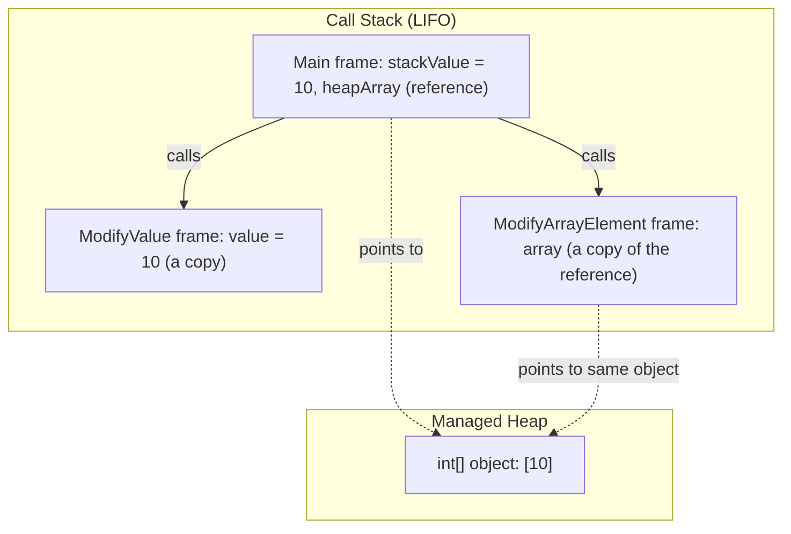
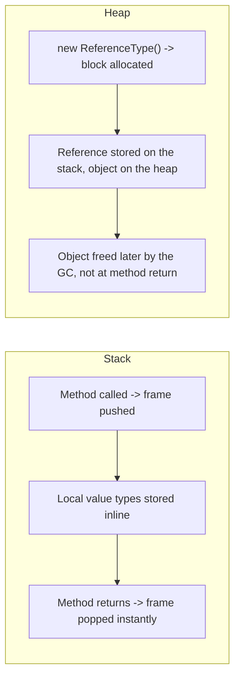

# Stack vs Heap

## Introduction

Before reading this lesson, you should already be comfortable with **[Introduction to Memory Management in .NET](../08-memory-management/08-01-introduction-to-memory-management.md)**, particularly the idea that reference-type objects live on the managed heap and get reclaimed by the garbage collector once nothing references them anymore. This lesson answers the question that naturally follows: if the heap is where objects live, where does everything *else* live — the local variables, the method parameters, the `int`s and `bool`s your program is constantly juggling? The answer is the **stack**, and the relationship between the two is the single most foundational memory concept in all of .NET.

By the end of this lesson, you will be able to:

- Explain what the call stack is and how it grows and shrinks as methods are called and return
- Explain what the managed heap is and how it differs from the stack in allocation and lifetime
- State the general rule for where value types and reference types are stored
- Identify the common exceptions to that general rule — closures, async state machines, and arrays of structs
- Predict, for a given piece of code, whether a mutation is visible to the caller based on stack-copy vs heap-reference semantics

## Stack vs Heap — A Layman's Perspective

Picture a cafeteria's tray dispenser next to a large self-service warehouse. The tray dispenser holds a stack of trays: you take the top tray, and when you're done, you put it back on top. Trays only ever get added or removed from the top, in a strict last-in-first-out order — nobody digs a tray out from the middle of the stack. Because of that rigid, predictable order, taking a tray or returning one is instantaneous: no searching, no bookkeeping, just a single motion at the top of the pile.

The warehouse works completely differently. Items are placed on whatever shelf has room, tracked in a big inventory ledger, and can be picked up and put back in any order, from anywhere, by anyone holding a claim ticket for that item. Finding space for a new pallet takes real work — a warehouse worker has to check the ledger, find an open shelf, and record where the pallet went. And critically, items in the warehouse don't automatically disappear when the person who dropped them off leaves the building; they sit there, taking up space, until someone confirms nobody needs them anymore and clears the shelf.

.NET's call stack is the tray dispenser. Every time your code calls a method, a new "frame" is pushed onto the stack holding that method's local variables and parameters; the moment the method returns, its frame is popped off instantly, in perfect last-in-first-out order, and that memory is immediately available again. This is why stack allocation is essentially free — there's no searching for space, no bookkeeping, no cleanup pass required. It's a single pointer move, in either direction.

The managed heap is the warehouse. Objects created with `new` are placed wherever the CLR can find room, tracked so the runtime always knows what's out there, and — crucially — they don't vanish just because the method that created them has returned. An object placed on the heap can be handed off, passed around, stored in a field, and kept alive by any number of "claim tickets" (references) held by other parts of the program, for as long as any one of them still holds a claim. Only once every claim ticket for that item is gone does the object become eligible to be cleared off the shelf — and, as the previous lesson established, that clearing is the garbage collector's job, not something that happens the instant a method returns.

## Stack vs Heap — A Programming Language Perspective

In .NET, each thread has its own **call stack**: a contiguous, fixed-size region of memory that grows with each method call (a new **stack frame** holding parameters and local variables is pushed) and shrinks the instant that method returns (the frame is popped). Value types — `int`, `bool`, `decimal`, `struct`, `enum` — are stored inline wherever they're declared: as a local variable, they live directly in the current stack frame; as a field of a class, they live inline inside that object on the heap. Reference types — `class`, `string`, arrays, delegates — are always allocated on the **managed heap**, and what actually sits in the stack frame (or in a containing object) is only a *reference* — effectively a pointer — to that heap location. The common simplification "value types go on the stack, reference types go on the heap" is directionally correct but incomplete: a `struct` captured by a lambda closure, used inside an `async` method's state machine, or stored as an element of an array is promoted to the heap along with its containing object, because its lifetime can no longer be tied to a single method's stack frame.

## How Stack and Heap Allocation Work in Practice

The clearest way to see the stack/heap distinction is to watch what happens when you pass a value type versus a reference type into a method and mutate it there.


*Figure 1: `stackValue` and the array reference itself live in `Main`'s stack frame; the array object they refer to lives once on the heap and is reachable from any frame holding that reference.*

```csharp
// Program.cs — .NET 10 / C# 14
using System;

int stackValue = 10;
int[] heapArray = [10];

ModifyValue(stackValue);
ModifyArrayElement(heapArray);

Console.WriteLine($"stackValue after ModifyValue: {stackValue}");
Console.WriteLine($"heapArray[0] after ModifyArrayElement: {heapArray[0]}");

static void ModifyValue(int value)
{
    value = 99; // Only this method's own stack-frame copy changes.
}

static void ModifyArrayElement(int[] array)
{
    array[0] = 99; // 'array' is a copy of the reference, but it points at the same heap object.
}
```

**Console Output:**

```text
stackValue after ModifyValue: 10
heapArray[0] after ModifyArrayElement: 99
```

`stackValue` is untouched because `ModifyValue` received a brand-new copy of the integer in its own stack frame — changing that copy can never reach back into `Main`'s frame. `heapArray[0]`, by contrast, changed, because `ModifyArrayElement` received a copy of the *reference*, but that reference still points at the single array object living on the heap; mutating through it mutates the one object every reference shares.

## Real-Time Example: Fee Calculations in a Banking/ATM System

We continue the **Banking/ATM** domain, introducing a `Money` value type alongside the `Account` reference type an ATM's transaction pipeline relies on. `Money` is a `readonly struct` — a value type — used for one-off fee calculations that shouldn't be able to leak changes back into the caller, while `Account` is a `class` — a reference type — representing the single, shared, mutable balance every part of the system must agree on.

```csharp
// Program.cs — .NET 10 / C# 14 — Real-Time Example
using System;

Money withdrawalFee = new(2.50m, "USD");
Account checkingAccount = new("AC-7001", 500.00m);

Console.WriteLine($"Before ChargeSurcharge: {withdrawalFee}");
ChargeSurcharge(withdrawalFee);
Console.WriteLine($"After ChargeSurcharge:  {withdrawalFee}");

Console.WriteLine($"Before DebitAccount: {checkingAccount.Balance:F2}");
DebitAccount(checkingAccount, 200.00m);
Console.WriteLine($"After DebitAccount:  {checkingAccount.Balance:F2}");

static void ChargeSurcharge(Money fee)
{
    fee = new Money(fee.Amount + 1.00m, fee.CurrencyCode); // Mutates only this frame's local copy.
    Console.WriteLine($"  Inside ChargeSurcharge: {fee}");
}

static void DebitAccount(Account account, decimal amount)
{
    account.Balance -= amount; // Mutates the one shared Account object on the heap.
}

readonly struct Money(decimal amount, string currencyCode)
{
    public decimal Amount { get; } = amount;
    public string CurrencyCode { get; } = currencyCode;
    public override string ToString() => $"{Amount:F2} {CurrencyCode}";
}

class Account(string accountNumber, decimal balance)
{
    public string AccountNumber { get; } = accountNumber;
    public decimal Balance { get; set; } = balance;
}
```

**Console Output:**

```text
Before ChargeSurcharge: 2.50 USD
  Inside ChargeSurcharge: 3.50 USD
After ChargeSurcharge:  2.50 USD
Before DebitAccount: 500.00
After DebitAccount:  300.00
```

`withdrawalFee` is completely unaffected by `ChargeSurcharge`, because passing a `struct` by value copies it onto that method's own stack frame — exactly the safety a one-off fee calculation needs, since nothing should silently corrupt the caller's original figure. `checkingAccount.Balance`, on the other hand, genuinely changes from `500.00` to `300.00`, because `Account` is a `class`: every part of the ATM pipeline holding a reference to that one object is looking at the same heap-allocated balance, which is exactly the shared-state behavior a bank account needs — every component must see the same, single, authoritative balance.

## Stack vs Heap — Side by Side

The stack and the heap aren't competing techniques for the same job — they solve two different problems, and .NET uses both simultaneously in every running program. The stack optimizes for speed and automatic cleanup by strictly ordering allocations as method calls nest and unwind; the heap optimizes for flexible lifetime by letting an object outlive the method that created it, at the cost of needing a garbage collector to eventually reclaim it.


*Figure 2: The stack reclaims memory the instant a method returns; the heap defers reclamation to the garbage collector, whenever nothing references the object anymore.*

| Aspect | Stack | Heap |
|---|---|---|
| What's stored there | Value types as local variables/parameters, and the reference itself for reference types | Reference-type instances: class objects, strings, arrays, boxed value types |
| Allocation speed | Extremely fast — a single pointer move | Slower — the CLR must locate space and track the object |
| Deallocation | Automatic and instant when the method frame returns | Deferred — reclaimed later by the garbage collector |
| Lifetime | Tied strictly to the enclosing method call | Tied to reachability; can outlive the method that created it |
| Common exception | A closure or `async` state machine promotes captured locals to the heap | An array of `struct` elements stores each struct inline, not as separate heap objects |

## Related Value-Type and Reference-Type Concepts

Understanding stack vs heap connects directly to several concepts covered elsewhere in this curriculum:

1. **[Structs vs Classes](../02-oop/02-21-structs-vs-classes.md)** — the type-declaration-level decision that determines value-type vs reference-type semantics.
2. **[ref, out, and in Parameters](../01-fundamentals/01-18-ref-out-in-parameters.md)** — how to pass a value type by reference when copy semantics aren't what you want.
3. **[record struct: Value-Based Records](../02-oop/02-20-record-struct-value-based-records.md)** — combining value-type semantics with record-style equality and `with`-expressions.
4. **[One-Dimensional Arrays](../01-fundamentals/01-13-one-dimensional-arrays.md)** — why an array of structs stores its elements inline rather than as separate heap objects.
5. **[Garbage Collection Generations](../08-memory-management/08-03-garbage-collection-generations.md)** — what actually happens on the heap side once an object becomes unreachable.

## What You've Learned & What's Next

The stack and the heap serve two different jobs: the stack gives method calls fast, automatic, last-in-first-out memory for their local state, while the heap gives objects flexible lifetimes that can outlast the method that created them, at the cost of needing the garbage collector to eventually reclaim them. The common rule of thumb — value types on the stack, reference types on the heap — is a good starting mental model, but closures, async state machines, and struct fields inside classes all show that the real rule is about *lifetime*, not just *type*.

Continue your learning journey with **[Garbage Collection Generations](../08-memory-management/08-03-garbage-collection-generations.md)**, where we go inside the heap side of this picture and see how the GC organizes objects by age — Gen 0, Gen 1, and Gen 2 — to avoid scanning the entire heap every time it runs.

---
*Applies to: .NET 10 / C# 14. Last reviewed 2026-08-16.*
