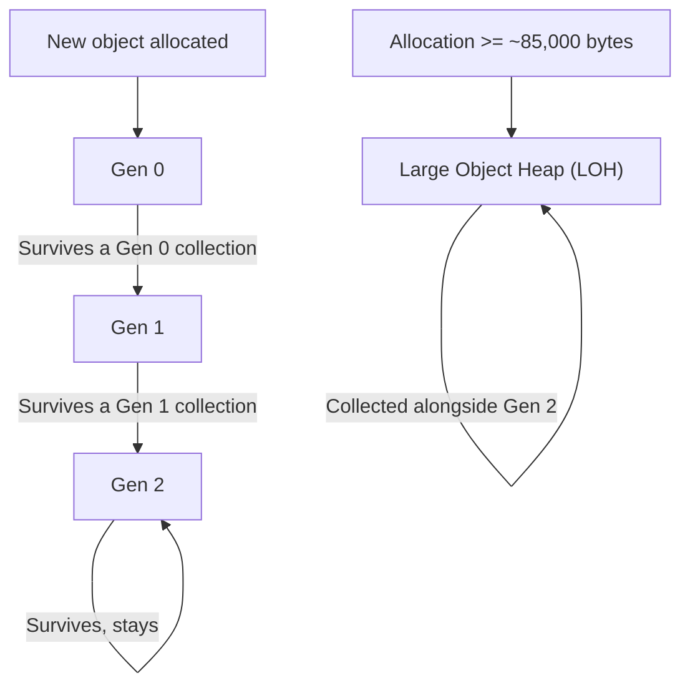
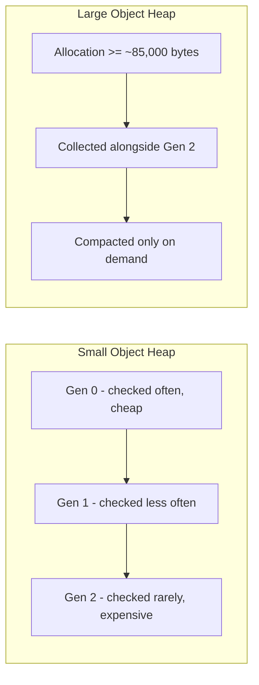

# Garbage Collection Generations

## Introduction

Before reading this lesson, you should already be comfortable with **[Stack vs Heap](../08-memory-management/08-02-stack-vs-heap.md)**, particularly the idea that reference-type objects live on the managed heap until nothing can reach them anymore. What that lesson left unanswered is *how* the garbage collector actually finds those unreachable objects efficiently — because scanning an entire multi-gigabyte heap every single time an object is dropped would be far too slow for any real application. The answer is that the GC doesn't treat every object equally; it organizes them by age into **generations**, and that organization is one of the most important performance ideas in the entire .NET runtime.

By the end of this lesson, you will be able to:

- Explain the generational hypothesis and why most objects die young
- Describe what Gen 0, Gen 1, and Gen 2 are and when each one gets collected
- Explain how an object gets promoted from one generation to the next
- Describe what the Large Object Heap (LOH) is and why large allocations are treated differently
- Explain why calling `GC.Collect()` manually is almost always the wrong move

## Garbage Collection Generations — A Layman's Perspective

Picture your desk at work. New mail and papers land on it constantly throughout the day — memos, flyers, quick sign-off forms — and the overwhelming majority of it is dealt with and thrown away within minutes or hours. Because your desk fills up so fast with things that don't stick around, you clear it off frequently, several times a day, and clearing it is quick precisely because there isn't much on it and most of what's there is genuinely disposable. Every so often, though, something lands on your desk that you're not quite done with yet — a project brief you're still reviewing — and instead of throwing it out during your next desk-clearing pass, you move it into a drawer. The drawer gets checked far less often than the desk, maybe once a week, because things don't pile up in there nearly as fast.

Rarely, something in that drawer turns out to be something you'll need for months or years — a signed contract, a reference document you consult constantly — and it graduates one more time into the archive room down the hall. The archive room is checked the least often of all, maybe once a quarter, because nearly everything that makes it there is genuinely long-lived, and sorting through a room full of filing cabinets takes real time and effort you don't want to spend unless you have to.

This is exactly the bet the .NET garbage collector makes, formalized as the **generational hypothesis**: most objects die young, and objects that have already survived one collection are increasingly likely to keep surviving. So the GC keeps a "desk" — **Generation 0** — for brand-new objects, and checks it extremely often, because it fills up fast and clearing it is cheap when almost everything there is garbage. Anything that survives a Gen 0 sweep gets promoted to the "drawer" — **Generation 1** — checked less frequently. Anything that survives *that* gets promoted to the "archive room" — **Generation 2** — checked rarely, because scanning it is the most expensive kind of collection there is, and it's only worth doing when there's good reason to believe it will actually free something up.

There's one more room in this building worth knowing about: a separate loading dock for oversized freight — furniture, pallets, anything too big and awkward to file away casually. Moving a couch every time you tidy the desk would be absurd, so it just stays on the dock, checked on its own separate, much less frequent schedule. That's the **Large Object Heap**, reserved for allocations too big to shuffle around casually.

## Garbage Collection Generations — A Programming Language Perspective

The CLR's garbage collector divides the small object heap into three generations — **Gen 0**, **Gen 1**, and **Gen 2** — based on the generational hypothesis that most objects have short lifetimes and that longer-lived objects tend to keep living. Every new object starts in Gen 0. A Gen 0 collection is fast and frequent because it only examines the smallest, newest region of the heap; any object still reachable when that collection runs is **promoted** to Gen 1. A Gen 1 collection runs less often and, when it does, also collects Gen 0; any Gen 1 survivor is promoted to Gen 2. A full Gen 2 collection examines the entire heap and is by far the most expensive, so the GC runs it as infrequently as it reasonably can. Separately, any single allocation at or above roughly 85,000 bytes bypasses Gen 0 entirely and goes straight onto the **Large Object Heap (LOH)**, which is collected alongside Gen 2 and, historically, was not compacted by default (modern .NET can compact it on demand via `GCSettings.LargeObjectHeapCompactionMode`). Because the runtime already schedules all of this adaptively based on real allocation pressure, calling `GC.Collect()` explicitly almost always does more harm than good — it forces an expensive, out-of-schedule full collection that the generational design exists specifically to avoid.

## How Generational Collection Works

An object's journey through the generations depends entirely on whether it keeps being referenced by the time each collection runs — nothing else about the object matters.


*Figure 1: Small objects start in Gen 0 and are promoted one generation at a time only if they survive a collection; large allocations skip straight to the LOH.*

The following example allocates a large number of short-lived objects without ever calling `GC.Collect()` itself, and simply observes, through `GC.CollectionCount`, that Gen 0 collections happen — and happen more often than Gen 2 collections — entirely on the runtime's own schedule.

```csharp
// Program.cs — .NET 10 / C# 14
using System;

int gen0Before = GC.CollectionCount(generation: 0);
int gen2Before = GC.CollectionCount(generation: 2);

for (int i = 0; i < 500_000; i++)
{
    object temporary = new(); // Most of these die within microseconds - the generational hypothesis in action.
}

int gen0After = GC.CollectionCount(generation: 0);
int gen2After = GC.CollectionCount(generation: 2);

Console.WriteLine($"Gen 0 collections occurred: {gen0After > gen0Before}");
Console.WriteLine($"Gen 0 ran at least as often as Gen 2: {(gen0After - gen0Before) >= (gen2After - gen2Before)}");
```

**Console Output:**

```text
Gen 0 collections occurred: True
Gen 0 ran at least as often as Gen 2: True
```

Half a million tiny, immediately-discarded objects are more than enough to trigger at least one Gen 0 collection under any GC configuration, confirming the runtime is actively managing the heap the whole time — without a single explicit `GC.Collect()` call anywhere in the program. And because nearly all of those objects die before ever surviving a collection, Gen 0 collections run at least as often as the much rarer Gen 2 collections — the generational hypothesis paying off exactly as designed.

## Real-Time Example: Nightly Reindexing in a Library/Inventory Management System

We continue the **Library/Inventory Management** domain with a nightly catalog reindex job. The library's `Book` catalog is loaded once and kept alive for the process's entire lifetime — these are genuinely long-lived objects that should eventually be promoted to Gen 2. Reindexing, however, generates a huge number of short-lived `SearchIndexEntry` objects, one per book per pass, that are discarded the instant they're used — exactly the kind of churn Gen 0 exists to absorb cheaply, without ever disturbing the long-lived catalog sitting safely in an older generation.

```csharp
// Program.cs — .NET 10 / C# 14 — Real-Time Example
using System;
using System.Collections.Generic;

List<Book> catalog =
[
    new("978-0-13-468599-1", "Effective C#"),
    new("978-1-59327-584-6", "The C# Player's Guide"),
    new("978-0-13-235088-4", "Clean Code"),
    new("978-1-4919-5025-4", "Programming C# 12"),
    new("978-0-596-00712-6", "Head First Design Patterns")
];

int gen0Before = GC.CollectionCount(generation: 0);

for (int i = 0; i < 200_000; i++)
{
    SearchIndexEntry entry = new($"TMP-{i}", catalog[i % catalog.Count].Title);
    // 'entry' is used to build the index and then discarded immediately - it dies in Gen 0.
}

int gen0After = GC.CollectionCount(generation: 0);

Console.WriteLine($"Books still in the catalog after the nightly reindex: {catalog.Count}");
Console.WriteLine($"Gen 0 collections occurred during reindexing: {gen0After > gen0Before}");

record Book(string Isbn, string Title);
record SearchIndexEntry(string EntryId, string BookTitle);
```

**Console Output:**

```text
Books still in the catalog after the nightly reindex: 5
Gen 0 collections occurred during reindexing: True
```

The `catalog` list is held by a root reference for the entire run, so every `Book` inside it survives collection after collection and, in a long-running library service, would eventually be promoted all the way to Gen 2, where it would rarely be scanned again. The 200,000 `SearchIndexEntry` objects, by contrast, never survive long enough to be promoted at all — they're created, read, and abandoned within the same iteration, so the generational GC clears them out of Gen 0 cheaply and repeatedly, without ever needing to pay the cost of scanning the catalog itself. This is precisely why generational collection scales: the expensive, long-lived catalog data is scanned rarely, while the cheap, disposable churn is scanned constantly but inexpensively.

## Gen 0/1/2 vs. the Large Object Heap

The small object heap's three generations and the Large Object Heap solve related but distinct problems. Generations exist to make collection *frequency* proportional to how likely an object is to already be garbage — new objects are checked constantly because most of them are garbage, while old objects are checked rarely because most of them aren't. The LOH exists to make collection *cost* proportional to object *size* — large objects are expensive to move in memory, so the LOH historically avoided compacting them at all, trading some memory fragmentation for avoiding the cost of relocating huge blocks on every pass.


*Figure 2: Generations optimize for how likely an object is to be garbage; the LOH optimizes for the cost of moving large blocks of memory.*

| Aspect | Gen 0 / Gen 1 / Gen 2 | Large Object Heap (LOH) |
|---|---|---|
| Who lives there | Small objects (under ~85,000 bytes), organized by survival age | Any single allocation at or above ~85,000 bytes |
| Collection frequency | Gen 0 very often, Gen 1 less often, Gen 2 rarely | Alongside Gen 2 collections only |
| Compaction | Compacted on every collecting generation | Not compacted by default; can fragment over time |
| Promotion | Objects move up a generation when they survive a collection | No promotion — an object simply stays on the LOH |
| Typical inhabitant | Ordinary objects, small collections, most application data | Large arrays, big buffers, large strings |

## Related Garbage Collector Concepts

Generational collection is the mechanism behind automatic memory reclamation, but several related concepts round out the full picture of managing memory in .NET:

1. **[Stack vs Heap](../08-memory-management/08-02-stack-vs-heap.md)** — the foundational distinction this lesson builds directly on.
2. **[IDisposable and the using Statement](../08-memory-management/08-04-idisposable-and-using-statement.md)** — deterministic cleanup for resources the generational GC cannot clean up on its own.
3. **[Finalizers in C#](../08-memory-management/08-05-finalizers-in-csharp.md)** — how objects with unmanaged resources interact with, and can extend, their time in the generations.
4. **[Span\<T\> and Memory\<T\>](../08-memory-management/08-06-span-t-and-memory-t.md)** — types designed specifically to reduce allocation pressure on Gen 0 in performance-sensitive code.

## What You've Learned & What's Next

The generational garbage collector's core insight is that most objects die young, so checking the newest objects constantly while checking the oldest objects rarely is far more efficient than treating the entire heap the same way every time. Objects are promoted from Gen 0 to Gen 1 to Gen 2 only by surviving collections, large allocations bypass this system entirely onto the Large Object Heap, and manually calling `GC.Collect()` almost always works against this carefully tuned, adaptive schedule rather than helping it.

Continue your learning journey with **[IDisposable and the using Statement](../08-memory-management/08-04-idisposable-and-using-statement.md)**, where we address the resources generational collection was never designed to handle in the first place — file handles, database connections, and other unmanaged resources that need deterministic, not eventual, cleanup.

---
*Applies to: .NET 10 / C# 14. Last reviewed 2026-08-16.*
