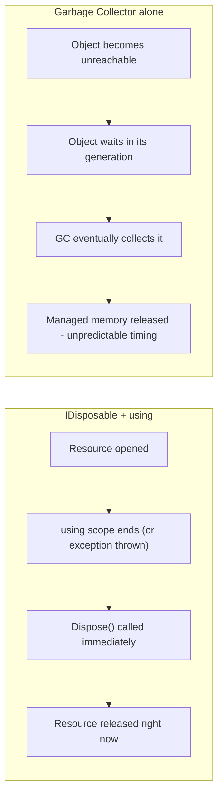

# IDisposable and the using Statement

## Introduction

Before reading this lesson, you should already be comfortable with **[Garbage Collection Generations](../08-memory-management/08-03-garbage-collection-generations.md)**, particularly the idea that the GC reclaims managed memory automatically, on its own schedule, once nothing references an object anymore. This lesson introduces the important exception to that comfort: some resources aren't just memory, and the GC has no idea how to clean them up at all. A file handle, a network socket, a database connection — these are resources owned by the operating system, not by the CLR's managed heap, and leaving them open costs something real even while your managed memory usage looks perfectly fine.

By the end of this lesson, you will be able to:

- Explain why the garbage collector cannot clean up unmanaged resources on its own
- Implement `IDisposable` and a `Dispose()` method on your own types
- Use the `using` statement (block-scoped) to guarantee deterministic cleanup
- Use the C# 8+ `using` declaration to dispose a resource at the end of its enclosing scope without extra braces
- Describe the basic shape of the Dispose pattern and why it matters even in simple cases

## IDisposable — A Layman's Perspective

Picture checking a study room key out from a library's front desk. The key unlocks a specific room reserved just for you, and as far as the front desk is concerned, that room is occupied for as long as you're holding the key — nobody else can book it. The building's automatic lighting and climate systems don't know or care whether you're still in there; they run on their own schedule regardless. But the *room itself* isn't managed by any automatic system at all. If you finish your work and simply walk out without returning the key, the front desk has no way of knowing you're done. The room stays marked as reserved indefinitely, blocking every other student who might need it, until someone eventually notices, tracks you down, and manually corrects the record.

Compare that to something like the disposable paper cup you grabbed from the water cooler on your way to the room. Nobody needs to remind you to return that. When you're done with it, you toss it in the recycling bin, and the building's cleaning staff empties that bin on their own regular rounds regardless of whose cup ended up in it. It's genuinely fine that nobody tracks that cup individually, because it's cheap, replaceable, and its cleanup doesn't block anyone else from getting one.

The study room key is exactly like an unmanaged resource — a file handle, a network socket, a database connection. It's a finite, shared resource that something outside your program is actively holding open on your behalf, and nothing automatically notices when you're done with it. Your program has to explicitly say "I'm finished" — return the key — the moment it's actually finished, not "whenever the cleaning staff happens to get around to it." The paper cup is exactly like an ordinary managed object: cheap, plentiful, and perfectly well handled by the garbage collector's own automatic rounds, with nobody needing to track any individual one.

C#'s `IDisposable` interface and the `using` statement are the mechanism for "returning the key" the instant you're done — deterministically, every single time, even if something goes wrong partway through your visit to the room.

## IDisposable — A Programming Language Perspective

`System.IDisposable` is a single-method interface — `void Dispose()` — that a type implements to signal it holds a resource requiring explicit, deterministic release rather than eventual garbage collection. Calling `Dispose()` is the type's chance to release whatever it's holding: closing a file handle, closing a socket, returning a connection to a pool. The `using` statement, in its classic block form (`using (var resource = ...) { ... }`), compiles to a `try`/`finally` block that calls `Dispose()` in the `finally`, guaranteeing cleanup even if an exception is thrown inside the block. Introduced in C# 8, the **using declaration** (`using var resource = ...;`, with no braces) ties disposal to the end of the *enclosing* scope — a method body, a block, a loop iteration — rather than requiring an explicit nested block, which keeps code flatter without giving up the deterministic guarantee.

## How to Use IDisposable and the using Statement

Any type that manages a resource needing explicit release implements `IDisposable`; any code that consumes such a type wraps its usage in a `using` statement or declaration so `Dispose()` is guaranteed to run, exception or not.

```mermaid
sequenceDiagram
    participant Code as Calling Code
    participant Gen as Compiler-Generated try/finally
    participant Res as IDisposable Resource
    Code->>Res: using (var r = new Resource())
    Code->>Gen: (compiler wraps the block)
    Gen->>Res: try { r is used }
    Code->>Res: r.DoWork()
    Gen->>Res: finally { r.Dispose(); }
    Res-->>Code: Resource released, exception or not
```
*Figure 1: The `using` statement is syntactic sugar for a `try`/`finally` block whose `finally` always calls `Dispose()`.*

```csharp
// Program.cs — .NET 10 / C# 14
using System;

Console.WriteLine("Before block");

using (SimpleResource first = new("First"))
{
    first.DoWork();
} // first.Dispose() runs here, at the closing brace.

Console.WriteLine("Between examples");

using SimpleResource second = new("Second"); // using declaration - no braces needed.
second.DoWork();

Console.WriteLine("End of Main");
// second.Dispose() runs here, at the end of this enclosing scope.

class SimpleResource(string name) : IDisposable
{
    public void DoWork() => Console.WriteLine($"{name} resource doing work.");

    public void Dispose() => Console.WriteLine($"{name} resource disposed.");
}
```

**Console Output:**

```text
Before block
First resource doing work.
First resource disposed.
Between examples
Second resource doing work.
End of Main
Second resource disposed.
```

Notice exactly where each `Dispose()` call lands. `first` is disposed the instant its `using` block's closing brace is reached — before "Between examples" ever prints. `second`, declared with the using-declaration form and no braces, isn't disposed until the entire enclosing scope ends, which is why "End of Main" prints *before* "Second resource disposed." Both forms guarantee disposal; they simply differ in exactly how much code counts as the resource's scope.

## Real-Time Example: Writing Order Receipts in an E-Commerce Order Processing System

We extend the **E-Commerce Order Processing** domain with an `OrderReceiptWriter` that wraps a `StreamWriter` — itself a wrapper around a real operating-system file handle. Every processed `Order` gets a line appended to a shared receipt file, and each `OrderReceiptWriter` must close its file handle deterministically after every order, or the fulfillment service would slowly leak open file handles as it processed orders throughout the day.

```csharp
// Program.cs — .NET 10 / C# 14 — Real-Time Example
using System;
using System.Globalization;
using System.IO;

string receiptPath = Path.Combine(Path.GetTempPath(), $"order-receipt-{Guid.NewGuid():N}.txt");

ProcessOrder(receiptPath, new Order("ORD-10042", "Wireless Mouse", 2, 24.99m));
ProcessOrder(receiptPath, new Order("ORD-10043", "USB-C Cable", 3, 9.99m));

string savedReceipt = File.ReadAllText(receiptPath);
Console.WriteLine("-- Receipt file contents --");
Console.Write(savedReceipt);

File.Delete(receiptPath);
Console.WriteLine($"Receipt file cleaned up: {!File.Exists(receiptPath)}");

static void ProcessOrder(string path, Order order)
{
    using OrderReceiptWriter receiptWriter = new(path);
    decimal lineTotal = order.Quantity * order.UnitPrice;
    receiptWriter.WriteLine(
        $"{order.OrderId}: {order.Quantity} x {order.ProductName} @ {Usd(order.UnitPrice)} = {Usd(lineTotal)}");
    Console.WriteLine($"Order {order.OrderId} written to receipt.");
} // receiptWriter.Dispose() runs here automatically, flushing and closing the file handle.

static string Usd(decimal amount) => amount.ToString("C", CultureInfo.GetCultureInfo("en-US"));

record Order(string OrderId, string ProductName, int Quantity, decimal UnitPrice);

class OrderReceiptWriter : IDisposable
{
    private readonly StreamWriter _writer;
    private bool _disposed;

    public OrderReceiptWriter(string path)
    {
        _writer = new StreamWriter(path, append: true);
    }

    public void WriteLine(string line) => _writer.WriteLine(line);

    public void Dispose()
    {
        if (_disposed)
        {
            return;
        }

        _writer.Flush();
        _writer.Dispose();
        _disposed = true;
    }
}
```

**Console Output:**

```text
Order ORD-10042 written to receipt.
Order ORD-10043 written to receipt.
-- Receipt file contents --
ORD-10042: 2 x Wireless Mouse @ $24.99 = $49.98
ORD-10043: 3 x USB-C Cable @ $9.99 = $29.97
Receipt file cleaned up: True
```

Each call to `ProcessOrder` opens the underlying file handle, appends exactly one line, and closes it again through the `using` declaration — before the next order's call ever runs. If `OrderReceiptWriter` relied on the garbage collector alone to eventually close that `StreamWriter`, a busy fulfillment service processing thousands of orders per hour could accumulate thousands of open file handles before the GC ever got around to reclaiming the wrapper objects, likely exhausting the operating system's handle limit long before that happened. Deterministic disposal is what keeps a real system like this safe under load.

## IDisposable + using vs. Relying on the Garbage Collector Alone

The GC and `IDisposable` solve two different problems, and conflating them is exactly the mistake this lesson exists to prevent. The GC reclaims *managed memory* — and only managed memory — whenever it judges the time is right, which could be milliseconds or minutes after an object becomes unreachable. `IDisposable` combined with `using` releases an *external resource* the instant your code is done with it, regardless of when the wrapper object's memory eventually gets reclaimed. A type can — and, if it wraps something like a file handle, should — do both: implement `IDisposable` for the resource, and still let the GC eventually reclaim the small managed wrapper object itself.


*Figure 2: `IDisposable` releases a resource the moment you're done with it; the GC releases managed memory only whenever it eventually decides to run.*

| Aspect | IDisposable + using | Garbage Collector alone |
|---|---|---|
| Applies to | Unmanaged resources: file handles, sockets, DB connections | Managed memory only |
| Timing | Deterministic — released the instant the `using` scope ends | Non-deterministic — whenever the GC decides to run |
| Mechanism | Compiler-generated `try`/`finally` calling `Dispose()` | The GC's generational scan-and-reclaim schedule |
| Risk if skipped | Resource leak: exhausted handles, connections, or sockets | None for memory — the GC always eventually reclaims it |
| Typical use case | Files, network connections, database connections, locks | Ordinary objects with no external resource to release |

## Related Resource-Management Concepts

`IDisposable` doesn't exist in isolation — it connects directly to error handling and to what happens when `Dispose()` is never called at all:

1. **[try, catch, finally in Depth](../05-exception-handling/05-02-try-catch-finally-in-depth.md)** — the `finally` block the `using` statement compiles down to under the hood.
2. **[Garbage Collection Generations](../08-memory-management/08-03-garbage-collection-generations.md)** — the automatic memory reclamation `IDisposable` deliberately does not rely on.
3. **[Finalizers in C#](../08-memory-management/08-05-finalizers-in-csharp.md)** — the safety net that runs if a caller forgets to call `Dispose()` at all.
4. **[Span\<T\> and Memory\<T\>](../08-memory-management/08-06-span-t-and-memory-t.md)** — allocation-conscious types that can themselves be built on top of disposable, rented memory.

## What You've Learned & What's Next

The garbage collector reclaims managed memory automatically, but it has no concept of a file handle, a socket, or a database connection — those are resources your code must release explicitly, and `IDisposable` combined with the `using` statement or `using` declaration is how C# guarantees that release happens deterministically, exception or not, the moment a resource's scope ends.

Continue your learning journey with **[Finalizers in C#](../08-memory-management/08-05-finalizers-in-csharp.md)**, where we cover what happens when a caller forgets to call `Dispose()` at all — the finalizer safety net, why it makes an object live longer, and how the full Dispose pattern combines both mechanisms correctly.

---
*Applies to: .NET 10 / C# 14. Last reviewed 2026-08-16.*
