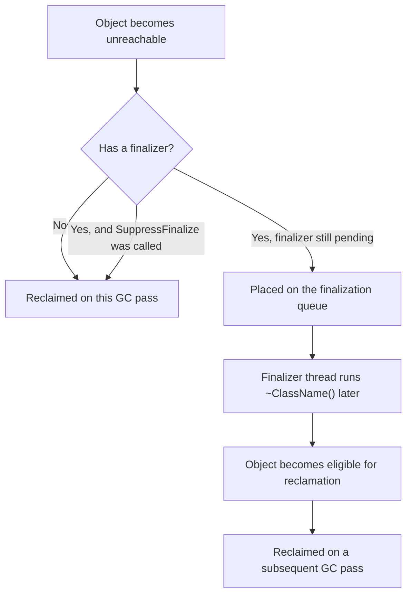
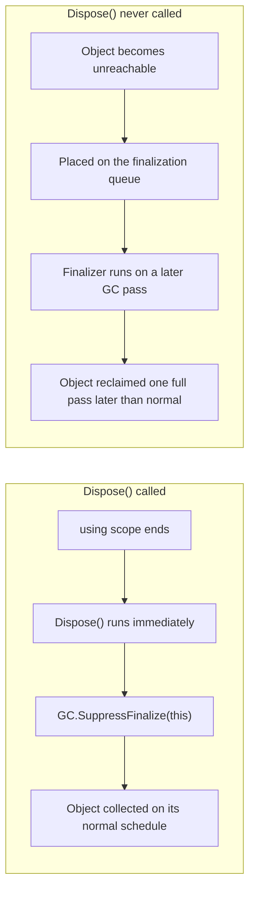

# Finalizers in C#

## Introduction

Before reading this lesson, you should already be comfortable with **[IDisposable and the using Statement](../08-memory-management/08-04-idisposable-and-using-statement.md)**, particularly the idea that `Dispose()` gives you deterministic, immediate control over releasing an unmanaged resource. This lesson addresses the uncomfortable question that naturally follows: what happens if a caller simply forgets to call `Dispose()`, or an exception unwinds past a missing `using`? C# has an answer — the **finalizer** — but it's a safety net, not a plan, and understanding exactly why it's a last resort rather than a first choice is the point of this lesson.

By the end of this lesson, you will be able to:

- Write a finalizer using the `~ClassName()` syntax
- Explain what the finalization queue is and how it defers an object's actual reclamation
- Explain why an object with a finalizer survives at least one extra GC pass compared to one without
- Implement the complete Dispose pattern, combining `IDisposable` with a finalizer as a safety net
- Use `GC.SuppressFinalize` to avoid paying the finalization cost when `Dispose()` already ran

## Finalizers — A Layman's Perspective

Continue the library study-room-key picture from the previous lesson. Most guests do the right thing: they finish their work and return the key to the front desk on their way out, and the room becomes available again immediately. But not everyone is that careful. Some guests wander off with the key still in their pocket, and the front desk has no way of forcing them to come back and hand it in.

To handle exactly this, the building runs a much less frequent night-audit process. Once a night, an audit team physically walks every floor, checks every room, and for any room still showing as "occupied" with no guest actually inside, they force the door, retrieve the key or replace the lock, and finally mark the room available again. This audit works, and it does eventually recover every forgotten room — but it's slow, it only runs once a night instead of continuously, and a room caught up in this process sits blocked for far longer than one whose key was simply returned properly at the front desk. The night-audit team would also much rather not exist at all; every room they have to process by force is one more sign that something upstream went wrong.

That night-audit process is exactly what a C# finalizer is. It's the GC's own equivalent of forcing the door: a last-resort mechanism that eventually recovers an unmanaged resource even if `Dispose()` was never called, but only on its own separate, much less frequent schedule, and only after the object has already sat there, blocked and un-reclaimed, for noticeably longer than it would have if cleanup had simply happened properly the first time. A well-behaved guest returning their key promptly is `Dispose()`; the night-audit team forcing an abandoned room is the finalizer — a genuine safety net worth having, but never something you'd want to depend on as your primary plan.

## Finalizers — A Programming Language Perspective

A **finalizer**, declared with `~ClassName()` syntax, is a method the CLR calls before reclaiming an object's memory, giving that object one last chance to release resources if `Dispose()` was never called. Under the hood, a finalizer overrides `Object.Finalize()`; you never call it directly, and you cannot control exactly when it runs. When the GC discovers that an object with a finalizer has become unreachable, it does *not* reclaim it on that pass — instead, it moves the object onto an internal **finalization queue** and promotes it to a later generation, since the object is still technically "alive" from the GC's perspective until its finalizer has run. A dedicated finalizer thread processes that queue asynchronously; only *after* the finalizer runs does the object become eligible for actual reclamation, on a subsequent GC pass. This means any object with a finalizer costs at least one extra collection cycle compared to an identical object without one — which is precisely why `GC.SuppressFinalize(this)`, called at the end of a correctly implemented `Dispose()`, matters: it tells the runtime "cleanup already happened, skip the finalization queue entirely," restoring the object to its normal, cheaper collection path.

## How to Write and Suppress a Finalizer

A finalizer should exist purely as a fallback for unmanaged cleanup, and any type that defines one should also implement `IDisposable` and call `GC.SuppressFinalize(this)` once `Dispose()` has already done the real work.


*Figure 1: An object with a pending finalizer survives an extra round trip through the finalization queue before it can actually be reclaimed.*

```csharp
// Program.cs — .NET 10 / C# 14
using System;

Console.WriteLine("Creating a resource without ever disposing it");
CreateAndDrop();
GC.Collect();
GC.WaitForPendingFinalizers();

Console.WriteLine("Creating a resource and disposing it properly");
using (FinalizableResource disposed = new("Disposed"))
{
}
GC.Collect();
GC.WaitForPendingFinalizers();

static void CreateAndDrop()
{
    FinalizableResource leaked = new("Leaked");
    // 'leaked' goes out of scope here without Dispose() ever being called.
}

class FinalizableResource : IDisposable
{
    private readonly string _name;
    private bool _disposed;

    public FinalizableResource(string name)
    {
        _name = name;
        Console.WriteLine($"{_name} resource acquired.");
    }

    public void Dispose()
    {
        if (_disposed)
        {
            return;
        }

        Console.WriteLine($"{_name} resource disposed deterministically.");
        _disposed = true;
        GC.SuppressFinalize(this);
    }

    ~FinalizableResource()
    {
        Console.WriteLine($"{_name} resource finalized by the GC.");
    }
}
```

**Console Output:**

```text
Creating a resource without ever disposing it
Leaked resource acquired.
Leaked resource finalized by the GC.
Creating a resource and disposing it properly
Disposed resource acquired.
Disposed resource disposed deterministically.
```

The "Leaked" resource is never disposed, so when it becomes unreachable it's placed on the finalization queue, and forcing a collection plus `GC.WaitForPendingFinalizers()` runs its finalizer, printing the fallback message. The "Disposed" resource, by contrast, has `Dispose()` called at the end of its `using` block, which calls `GC.SuppressFinalize(this)` — so its finalizer never runs at all, even after the same forced collection. Same class, same finalizer, completely different fate, depending entirely on whether `Dispose()` was called.

## Real-Time Example: A Hardware Connection in a Banking/ATM System

We extend the **Banking/ATM** domain with `CashDispenserConnection`, a class representing a genuinely unmanaged resource: an open connection to the ATM's physical cash-dispensing hardware. Correct code disposes this connection the instant a withdrawal completes; buggy code — the kind this lesson's finalizer exists to protect against — forgets to, and only the finalizer keeps the hardware connection from staying open indefinitely.

```csharp
// Program.cs — .NET 10 / C# 14 — Real-Time Example
using System;
using System.Globalization;

Console.WriteLine("-- ATM withdrawal: correct usage --");
ProcessWithdrawalCorrectly();

Console.WriteLine();
Console.WriteLine("-- ATM withdrawal: forgotten Dispose (developer mistake) --");
ProcessWithdrawalIncorrectly();

GC.Collect();
GC.WaitForPendingFinalizers();

static void ProcessWithdrawalCorrectly()
{
    using CashDispenserConnection dispenser = new("Dispenser-01");
    dispenser.DispenseCash(200.00m);
}

static void ProcessWithdrawalIncorrectly()
{
    CashDispenserConnection dispenser = new("Dispenser-02");
    dispenser.DispenseCash(100.00m);
    // Bug: Dispose() is never called here - the finalizer is now the only safety net left.
}

class CashDispenserConnection : IDisposable
{
    private readonly string _deviceId;
    private bool _disposed;

    public CashDispenserConnection(string deviceId)
    {
        _deviceId = deviceId;
        Console.WriteLine($"{_deviceId}: hardware connection opened.");
    }

    public void DispenseCash(decimal amount) =>
        Console.WriteLine($"{_deviceId}: dispensed {Usd(amount)}.");

    public void Dispose()
    {
        if (_disposed)
        {
            return;
        }

        Console.WriteLine($"{_deviceId}: connection closed deterministically via Dispose.");
        _disposed = true;
        GC.SuppressFinalize(this);
    }

    ~CashDispenserConnection()
    {
        Console.WriteLine($"{_deviceId}: WARNING - connection closed by finalizer; Dispose() was never called.");
    }

    private static string Usd(decimal amount) => amount.ToString("C", CultureInfo.GetCultureInfo("en-US"));
}
```

**Console Output:**

```text
-- ATM withdrawal: correct usage --
Dispenser-01: hardware connection opened.
Dispenser-01: dispensed $200.00.
Dispenser-01: connection closed deterministically via Dispose.

-- ATM withdrawal: forgotten Dispose (developer mistake) --
Dispenser-02: hardware connection opened.
Dispenser-02: dispensed $100.00.
Dispenser-02: WARNING - connection closed by finalizer; Dispose() was never called.
```

`Dispenser-01`'s connection closes the instant `ProcessWithdrawalCorrectly` finishes, exactly when a real ATM should release its hardware connection. `Dispenser-02` never gets that clean release — its `Dispose()` is simply never called — so the connection stays open until the forced collection at the end of the program runs its finalizer as a last resort. In a real ATM fleet, that warning message is exactly the kind of signal that should go to a monitoring system: every time a finalizer fires instead of `Dispose()`, it means a hardware connection sat open far longer than it should have, and something upstream needs fixing.

## Dispose() vs. the Finalizer

`Dispose()` and the finalizer both exist to release resources, but they are not equally good options, and this lesson's entire purpose is making sure that distinction is clear. `Dispose()` is deterministic, cheap, and entirely within your control — you decide exactly when it runs. The finalizer is non-deterministic, comparatively expensive, and entirely under the GC's control — it decides when, and the object pays for that uncertainty by surviving at least one extra collection pass it wouldn't otherwise need.


*Figure 2: Calling `Dispose()` and suppressing the finalizer keeps an object on its normal, cheap collection path; skipping `Dispose()` routes it through the slower finalization queue instead.*

| Aspect | Dispose() | Finalizer (`~ClassName()`) |
|---|---|---|
| Called by | Your code, explicitly (directly, or via `using`) | The GC's finalizer thread, automatically |
| Timing | Deterministic — runs exactly when you call it | Non-deterministic — runs on a later GC pass |
| Effect on object lifetime | None — collected on its normal schedule | Extends lifetime by at least one GC pass |
| Intended role | The primary, correct cleanup path | A safety net for a missing `Dispose()` call |
| Should you rely on it? | Yes — always call it, ideally via `using` | No — treat it strictly as a last resort |

## Related Cleanup and Memory Concepts

Finalizers sit at the intersection of resource cleanup and generational garbage collection, both covered elsewhere in this module:

1. **[IDisposable and the using Statement](../08-memory-management/08-04-idisposable-and-using-statement.md)** — the deterministic cleanup path a finalizer exists to back up, not replace.
2. **[Garbage Collection Generations](../08-memory-management/08-03-garbage-collection-generations.md)** — why an object with a pending finalizer is promoted and survives longer than one without.
3. **[try, catch, finally in Depth](../05-exception-handling/05-02-try-catch-finally-in-depth.md)** — the exception-safety mechanism the full Dispose pattern relies on to guarantee `Dispose()` still runs.
4. **[Span\<T\> and Memory\<T\>](../08-memory-management/08-06-span-t-and-memory-t.md)** — allocation-conscious types that avoid needing finalizers at all by minimizing heap allocation in the first place.

## What You've Learned & What's Next

A finalizer is C#'s last-resort safety net for a resource whose `Dispose()` was never called — but that safety net comes at a real cost: an object with a pending finalizer survives at least one extra GC pass, sitting in the finalization queue until its finalizer runs, before it can finally be reclaimed. The complete, correct Dispose pattern always calls `GC.SuppressFinalize(this)` at the end of `Dispose()`, precisely so that well-behaved cleanup never has to pay that extra cost.

Continue your learning journey with **[Span\<T\> and Memory\<T\>](../08-memory-management/08-06-span-t-and-memory-t.md)**, where the focus shifts from cleaning up after allocations to avoiding unnecessary allocations in the first place — working directly with contiguous memory without copying it.

---
*Applies to: .NET 10 / C# 14. Last reviewed 2026-08-16.*
