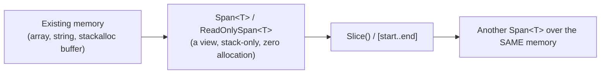
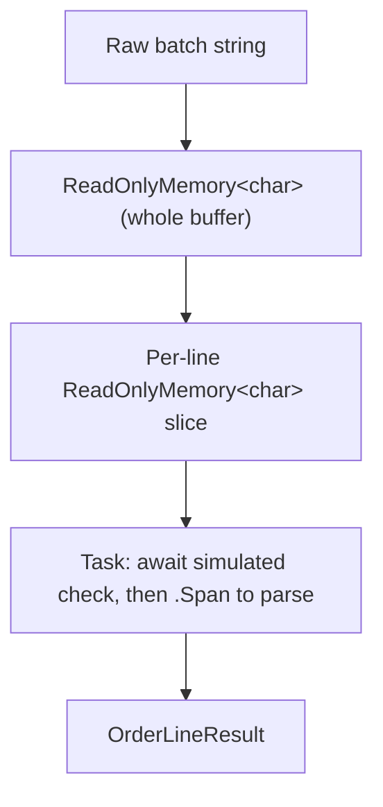
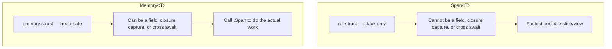

# Span<T> and Memory<T>

## Introduction

Before reading this lesson, you should already be comfortable with **[Finalizers in C#](../08-memory-management/08-05-finalizers-in-csharp.md)** and, more broadly, with this module's running theme of what the garbage collector does and does not need to worry about. Everything up to this point has been about objects that live on the heap and eventually need cleaning up. This lesson introduces two types that flip that story around: `Span<T>` and `Memory<T>` exist specifically to let code work with slices of existing memory — an array, a string, a stack-allocated buffer — without allocating anything new at all, and therefore without giving the garbage collector anything extra to track in the first place.

By the end of this lesson, you will be able to:

- Explain what `Span<T>` is and why the compiler restricts it to the stack
- Slice an array or a string with `Span<T>`/`ReadOnlySpan<T>` without allocating a new array or substring
- Allocate a temporary buffer on the stack with `stackalloc` and wrap it in a `Span<T>`
- Explain why `Span<T>` cannot be used as a class field, in a lambda closure, or across an `await`, and how `Memory<T>` removes that restriction
- Convert between `Span<T>`, `Memory<T>`, and their read-only counterparts
- Apply `Span<T>` and `Memory<T>` together in a realistic, high-throughput parsing scenario

## Span<T> and Memory<T> — A Layman's Perspective

Picture a single, enormous reference book chained to a reading desk in an old library — too heavy and too valuable to ever be removed from that desk, let alone photocopied every time someone needs to consult ten pages of it. A researcher who needs pages 40 through 55 doesn't ask the librarian to copy those pages into a new, separate booklet. Instead, the researcher picks up a lightweight cardboard viewing frame, holds it over exactly pages 40 through 55, and reads directly through the frame at the original book. Nothing was copied. Nothing new was created. The frame is just a window that says "look here, and only here," and when the researcher is done, the frame gets set down and the book is untouched, still chained to its desk, ready for the next frame to be held up over some other range of pages.

That cardboard frame is `Span<T>`. It is deliberately, almost stubbornly, tied to the desk it was made at: you cannot fold it up, seal it in an envelope, and mail it to a colleague working the night shift in another city, because the frame only makes sense held up against the actual book, at that exact desk, in that exact moment. If the book gets reshelved or the desk gets cleared while the frame is in the mail, the frame becomes meaningless — worse, dangerous, since it might now be pointing at empty air. So the library has a strict rule: viewing frames never leave the reading room, are never stored in a filing cabinet for later, and are never handed to the overnight courier. They exist for one reader, in one sitting, and then they're gone.

But sometimes the overnight colleague genuinely does need to know which pages to look at later. For that, the library offers something different: a small paper ticket that just says "Volume 12, pages 40 through 55." That ticket is cheap to write, perfectly safe to mail, safe to pin to a corkboard, safe to hand off to whoever's on shift when the request finally gets processed. The ticket itself is useless for actually reading anything — nobody can read a page off a ticket — but the moment the overnight colleague is standing at the right desk with the right book in front of them, they can turn that ticket back into a viewing frame and start reading immediately, still without a single page ever being copied.

That ticket is `Memory<T>`. It's the mailable, storable, hand-off-safe cousin of the viewing frame — safe to keep as a field, safe to pass into a method that won't run until later, safe to carry across the gap of an overnight wait. It does no actual reading itself; it exists purely so that, later, at the right moment, it can be turned back into the real viewing frame — a `Span<T>` — to do the work the frame was built for. Neither one ever needed a photocopier. That's the entire idea this lesson builds on: a way to look at, and even parse, existing memory precisely, without allocating a single new copy of it.

## Span<T> and Memory<T> — A Programming Language Perspective

`Span<T>`, defined in the `System` namespace, is a `readonly ref struct` that provides a type-safe, bounds-checked view over a contiguous region of memory — a managed array, a slice of a `string` (as `ReadOnlySpan<char>`), or a block of memory allocated with `stackalloc`. Because it is a `ref struct`, an instance of `Span<T>` can only ever live on the stack: the compiler forbids boxing it, storing it as a field of an ordinary class, capturing it in a lambda closure, or holding it across an `await` point, because none of those operations can guarantee the memory it points to is still valid when execution resumes there. `Memory<T>` is an ordinary struct — not a `ref struct` — that instead stores a reference to an array (or a `MemoryManager<T>`) plus an offset and length, so it can live on the heap, be stored as a field, be captured by a closure, and be passed across `async` method boundaries freely. Calling its `.Span` property produces a `Span<T>` for the current synchronous scope, where the actual work happens. Both types expose `Slice()` (and range indexers, `[start..end]`) that produce a new view over the *same* backing memory — never a copy.

## How to Use Span<T> and Memory<T> in C#

`ReadOnlySpan<char>` is the most common entry point: slicing a `string` with it never allocates a new string, because the span just tracks an offset and a length into the original character data. `stackalloc` pairs naturally with `Span<T>` for a small, short-lived buffer that would otherwise require a heap-allocated array.


*Figure 1: Slicing a `Span<T>` never allocates — every slice is just a new offset/length pair over the same original memory.*

```csharp
// Program.cs — .NET 10 / C# 14
using System.Globalization;

ReadOnlySpan<char> orderLine = "SKU-1029:5:19.99";

int firstColon = orderLine.IndexOf(':');
int secondColon = orderLine.LastIndexOf(':');

ReadOnlySpan<char> sku = orderLine[..firstColon];
int quantity = int.Parse(orderLine[(firstColon + 1)..secondColon]);
decimal unitPrice = decimal.Parse(orderLine[(secondColon + 1)..], CultureInfo.InvariantCulture);

Console.WriteLine($"SKU: {sku}, Quantity: {quantity}, Unit Price: {Usd(unitPrice)}");

Span<int> runningTotals = stackalloc int[3];
runningTotals[0] = quantity;
runningTotals[1] = quantity * 2;
runningTotals[2] = quantity * 3;

int sum = 0;
foreach (int value in runningTotals)
{
    sum += value;
}

Console.WriteLine($"Stack-allocated buffer sum: {sum}");

static string Usd(decimal amount) => amount.ToString("C", CultureInfo.GetCultureInfo("en-US"));
```

**Console Output:**

```text
SKU: SKU-1029, Quantity: 5, Unit Price: $19.99
Stack-allocated buffer sum: 30
```

Not one substring or new array was allocated anywhere in this example. `orderLine[..firstColon]` and the two `Parse` calls all operate on slices of the *original* string's character data, and `int.Parse`/`decimal.Parse` have dedicated overloads that accept a `ReadOnlySpan<char>` directly — no intermediate `Substring()` call is needed at all. `stackalloc int[3]` reserves space for three integers directly on the stack frame, wrapped by `runningTotals` as a `Span<int>`; that memory is automatically reclaimed the instant the enclosing method returns, the same way any other stack-allocated local is.

## Real-Time Example: Span<T> and Memory<T> in E-Commerce Order Processing

We extend the E-Commerce Order Processing domain with a bulk order-line importer: a single raw text buffer containing several `SKU:Quantity:UnitPrice` lines arrives from an upstream system, and each line needs an asynchronous fraud/inventory check before it's totalled. Because `Span<T>` cannot cross an `await`, the buffer is held as `ReadOnlyMemory<char>` and split into per-line `ReadOnlyMemory<char>` slices with zero string allocations; each async worker then calls `.Span` on its own slice to do the actual parsing.


*Figure 2: `Memory<T>` carries each line's slice across the `await`; `.Span` is only ever touched in the synchronous parsing step on either side.*

```csharp
// Program.cs — .NET 10 / C# 14 — Real-Time Example
using System.Globalization;

string rawBatch =
    "SKU-1029:5:19.99\n" +
    "SKU-2044:2:249.50\n" +
    "SKU-3087:10:4.25";

ReadOnlyMemory<char> batchMemory = rawBatch.AsMemory();
ReadOnlySpan<char> fullSpan = batchMemory.Span;

List<Task<OrderLineResult>> processingTasks = [];
int start = 0;
for (int i = 0; i <= batchMemory.Length; i++)
{
    if (i == batchMemory.Length || fullSpan[i] == '\n')
    {
        processingTasks.Add(ProcessOrderLineAsync(batchMemory[start..i]));
        start = i + 1;
    }
}

OrderLineResult[] results = await Task.WhenAll(processingTasks);

Console.WriteLine("-- Batch import results --");
foreach (OrderLineResult result in results)
{
    Console.WriteLine(
        $"{result.Sku}: {result.Quantity} unit(s) @ {Usd(result.UnitPrice)} = {Usd(result.LineTotal)}");
}

Console.WriteLine();
Console.WriteLine($"Batch total: {Usd(results.Sum(r => r.LineTotal))}");

static async Task<OrderLineResult> ProcessOrderLineAsync(ReadOnlyMemory<char> lineMemory)
{
    await Task.Delay(5); // Simulated async fraud/inventory check.

    // Memory<T> safely crossed the 'await' above; Span<T> could not have.
    ReadOnlySpan<char> line = lineMemory.Span;

    int firstColon = line.IndexOf(':');
    int secondColon = line.LastIndexOf(':');

    string sku = line[..firstColon].ToString();
    int quantity = int.Parse(line[(firstColon + 1)..secondColon]);
    decimal unitPrice = decimal.Parse(line[(secondColon + 1)..], CultureInfo.InvariantCulture);

    return new OrderLineResult(sku, quantity, unitPrice, quantity * unitPrice);
}

static string Usd(decimal amount) => amount.ToString("C", CultureInfo.GetCultureInfo("en-US"));

record OrderLineResult(string Sku, int Quantity, decimal UnitPrice, decimal LineTotal);
```

**Console Output:**

```text
-- Batch import results --
SKU-1029: 5 unit(s) @ $19.99 = $99.95
SKU-2044: 2 unit(s) @ $249.50 = $499.00
SKU-3087: 10 unit(s) @ $4.25 = $42.50

Batch total: $641.45
```

The batch is scanned exactly once, using `fullSpan[i]` to find each newline, and every line is handed off as a `ReadOnlyMemory<char>` slice — a cheap offset/length pair, not a copied substring. Only inside `ProcessOrderLineAsync`, after the simulated async check completes, does the code briefly become a `Span<T>` again (via `.Span`) to run the same allocation-free parsing shown in the previous section. In a real import pipeline processing thousands of order lines per batch, this pattern — `Memory<T>` for anything that must survive an `await`, `Span<T>` for the actual byte-for-byte work — is the difference between one allocation per batch and one allocation per line.

## Span<T> vs Memory<T>

The two types are not competitors; they are partners that trade off in exactly one dimension — where the reference is allowed to live. `Span<T>` is faster and more restrictive: being a `ref struct`, the JIT can reason about its lifetime entirely at compile time and never needs to involve the garbage collector, but that same restriction means it can never be stored anywhere that outlives the current synchronous stack frame. `Memory<T>` gives up a small amount of that performance ceiling — accessing the underlying data through `.Span` has a tiny bit more indirection than a `Span<T>` created directly — in exchange for being usable anywhere an ordinary struct is: as a field, in a closure, or across an `await`.


*Figure 3: `Span<T>` trades flexibility for raw speed; `Memory<T>` trades a small amount of speed for the flexibility `Span<T>` cannot offer.*

| Aspect | `Span<T>` | `Memory<T>` |
|---|---|---|
| CLR type | `readonly ref struct` | ordinary `struct` |
| Can be a field of a class | No | Yes |
| Can be captured by a lambda / cross an `await` | No | Yes |
| Backing memory it can wrap | Array, `stackalloc` buffer, or string slice | Array or `MemoryManager<T>` (no `stackalloc`) |
| Typical role | Doing the actual work — parsing, copying, comparing | Holding a view safely until work can happen |

## Types of Span<T> and Memory<T> Concepts to Explore Next

`Span<T>` and `Memory<T>` connect to several other performance-oriented topics across this curriculum:

1. **[Arrays Revisited: Performance and Pitfalls](../03-collections-generics/03-02-arrays-revisited.md)** — the contiguous backing memory a `Span<T>` most commonly wraps.
2. **[Strings in C#](../01-fundamentals/01-15-strings-in-csharp.md)** — why `string`'s immutability is exactly why `ReadOnlySpan<char>`, not `Span<char>`, is what you slice it into.
3. **[`stackalloc` and Stack-Allocated Memory](../13-reflection-sourcegen-lowlevel/13-10-stackalloc-and-stack-memory.md)** — a full deep-dive on the `stackalloc` syntax this lesson's example only introduced.
4. **[Advanced Span\<T\>/Memory\<T\> Usage](../13-reflection-sourcegen-lowlevel/13-12-advanced-span-memory-usage.md)** — pipelines, `MemoryPool<T>`, and interop-level techniques built directly on this lesson's foundation.
5. **[Span\<T\>/Memory\<T\> Performance Deep-Dive](../12-advanced-concepts/12-32-span-memory-performance-deep-dive.md)** — benchmarked, measured evidence for the allocation savings this lesson only asserts.
6. **[Async Streams with IAsyncEnumerable\<T\>](../07-concurrency-parallel-async/07-17-async-streams-iasyncenumerable.md)** — a complementary async-friendly mechanism for streaming whole sequences, rather than a single buffer.

## What You've Learned & What's Next

`Span<T>` is a stack-only, zero-allocation view over contiguous memory — an array, a string, or a `stackalloc` buffer — that trades flexibility for speed by forbidding anything that could outlive the current synchronous call. `Memory<T>` is its heap-safe counterpart: a small, storable, mailable reference to the same kind of memory that can survive as a field, a closure capture, or an `await`, and that hands back a `Span<T>` via `.Span` the moment real work needs to happen.

Continue your learning journey with **[Boxing and Unboxing](../08-memory-management/08-07-boxing-and-unboxing.md)**, where we look at the opposite kind of hidden cost — what happens when a value type *does* get copied onto the heap, often without anyone writing code that obviously asked for it.

---
*Applies to: .NET 10 / C# 14. Last reviewed 2026-08-16.*
