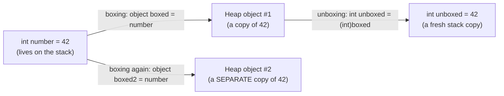
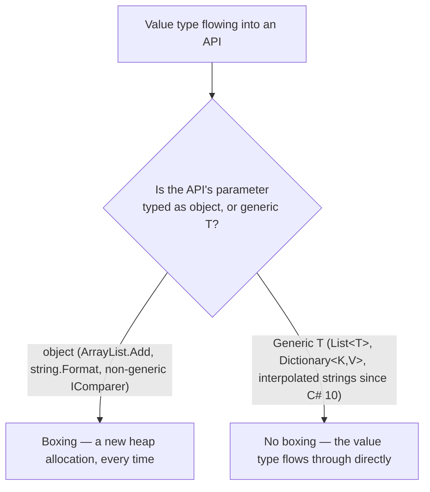

# Boxing and Unboxing

## Introduction

Before reading this lesson, you should already be comfortable with **[Span\<T\> and Memory\<T\>](../08-memory-management/08-06-span-t-and-memory-t.md)** and, further back in this module, with the basic split between stack-allocated value types and heap-allocated reference types. The previous lesson was about avoiding new allocations entirely by viewing existing memory in place. This lesson is about the opposite failure mode: a value type — an `int`, a `decimal`, a `struct` — quietly getting copied onto the heap anyway, usually without anyone writing a line of code that looks like it asked for that to happen.

By the end of this lesson, you will be able to:

- Explain exactly what boxing is and when the compiler inserts it implicitly
- Explain unboxing and why it requires an explicit cast
- Identify the hidden heap allocation and performance cost boxing introduces
- Recognize the common places boxing still sneaks into C# code, including non-generic collections and `object`-typed APIs
- Explain why modern generic APIs and interpolated strings largely avoid the boxing that older, `object`-based APIs cannot

## Boxing and Unboxing — A Layman's Perspective

Picture a small, loose coin — a single quarter — that needs to travel through a postal system built entirely around standard-size parcels. The postal system has one rule: nothing ships unless it's inside a parcel box, because that's the only shape its conveyor belts, scanners, and shelves know how to handle. So before the quarter can go anywhere, a worker has to fetch an empty parcel box, place the quarter inside it, seal it, and label it. Only then can the system move it. The coin itself didn't change — it's still just a quarter — but it's now riding inside a box it never actually needed, purely because the system wasn't built to carry loose coins directly.

That packaging step costs something every single time it happens. Fetching a box, sealing it, labeling it — none of that is free, and none of it was necessary for the coin itself, which would have been just as spendable loose in someone's pocket. Worse, if two identical quarters both need to travel through the system on the same day, two separate boxes get built — one for each — even though the coins inside are worth exactly the same amount. Anyone glancing at the two sealed boxes side by side has no way of knowing, without opening both, that the coins inside are identical; all they can tell for certain is that the boxes themselves are two distinct, separate parcels.

Getting the coin back out at the far end costs something too. The recipient can't just use the box as if it were money — a sealed cardboard parcel doesn't buy anything at a vending machine. Someone has to open it, physically remove the quarter, and hand over the loose coin itself before it's usable the way a quarter is meant to be used. That unwrapping step is every bit as deliberate an action as the original wrapping was; nothing happens by accident in either direction.

That's the entire picture. The quarter is a value type — a plain, small, self-contained piece of data. The parcel box is `object`, the universal reference-type wrapper that .NET's `object`-based APIs are built around. Wrapping the coin so it can travel through a system that only understands parcels is **boxing**: a genuine heap allocation, created the moment a value type is used somewhere that expects `object`, even though nobody wrote anything that looks like `new` in their own code. Unwrapping it back out — the cast that turns the parcel back into a usable coin — is **unboxing**, and it too costs something: a value has to be copied back out of the heap object and onto the stack before it can be used as the plain value type it always was underneath the packaging.

## Boxing and Unboxing — A Programming Language Perspective

**Boxing** is the implicit conversion the C# compiler inserts whenever a value type (a primitive like `int`, a `struct`, an `enum`) is used in a context that requires `object` or an interface the value type implements. The runtime allocates a new object on the managed heap, copies the value type's bits into it, and returns a reference to that new object. **Unboxing** is the reverse, explicit conversion: casting an `object` back to the specific value type it holds, which copies the value back out of the heap object. Unboxing an incompatible type throws `InvalidCastException` at run time, because the check can only happen then — the value type information is erased behind `object` until that point. Every individual boxing operation allocates a *new*, distinct heap object, even for two boxed copies of the identical value — two boxed `42`s are `Equals`-equal but never `ReferenceEquals`-equal. This is exactly the cost `List<T>`, `Dictionary<TKey, TValue>`, and other generic APIs were built to eliminate, since a generic type parameter substitutes the concrete type directly, with no `object` conversion required at all.

## How to Recognize Boxing and Unboxing in C#

Boxing happens the moment a value type is assigned to an `object`-typed variable, passed to an `object`-typed parameter, or stored through a non-generic interface. Unboxing happens the moment that `object` is cast back to a concrete value type.


*Figure 1: Every boxing operation allocates a new, distinct heap object — even for two identical values — and unboxing copies the value back out again.*

```csharp
// Program.cs — .NET 10 / C# 14
int number = 42;

object boxedFirst = number;  // boxing: a new heap allocation
object boxedSecond = number; // boxing again: a SEPARATE heap allocation, same value

Console.WriteLine($"Same boxed instance? {ReferenceEquals(boxedFirst, boxedSecond)}");
Console.WriteLine($"Values equal? {boxedFirst.Equals(boxedSecond)}");

int unboxed = (int)boxedFirst; // unboxing: copy the value back out
Console.WriteLine($"Unboxed value: {unboxed}");

boxedFirst = 99; // rebinds 'boxedFirst' to a brand-new boxed 99 — 'number' is untouched
Console.WriteLine($"Original number is still: {number}");
```

**Console Output:**

```text
Same boxed instance? False
Values equal? True
Unboxed value: 42
Original number is still: 42
```

`boxedFirst` and `boxedSecond` both hold `42`, yet `ReferenceEquals` reports `False`, proving two separate heap objects were allocated — one per boxing operation — even though `Equals` correctly reports the *values* as equal. Reassigning `boxedFirst = 99` boxes a brand-new object and points `boxedFirst` at it; it never reaches back into `number`, because `number` was only ever copied into the original boxed object, not linked to it.

## Real-Time Example: Boxing in a Banking/ATM Transaction Audit Log

We extend the Banking/ATM domain with a transaction audit log recording deposit amounts. The legacy version uses `ArrayList` (`System.Collections`), boxing every `decimal` it stores; the modern version uses `List<decimal>` (`System.Collections.Generic`), storing each amount directly with no boxing at all — the same contrast Module 03 drew between `ArrayList`/`Hashtable` and their generic replacements, now applied to a numeric audit trail rather than a lookup table.

```csharp
// Program.cs — .NET 10 / C# 14 — Real-Time Example
using System.Collections;
using System.Globalization;

Console.WriteLine("--- Legacy: ArrayList-based transaction audit log ---");
ArrayList legacyAuditLog = new ArrayList
{
    150.00m, // deposit #1 — boxed into its own heap object
    150.00m, // deposit #2 — same amount, but a SEPARATE boxed heap object
    42.50m,
    "VOID"   // a stray marker that should never have ended up in a decimal log
};

Console.WriteLine(
    $"Same boxed instance for two equal $150.00 entries? {ReferenceEquals(legacyAuditLog[0], legacyAuditLog[1])}");
Console.WriteLine($"Values equal? {legacyAuditLog[0]!.Equals(legacyAuditLog[1])}");

decimal legacyTotal = 0m;
foreach (object? entry in legacyAuditLog)
{
    try
    {
        legacyTotal += (decimal)entry!; // unboxing; throws for the "VOID" string
    }
    catch (InvalidCastException)
    {
        Console.WriteLine("Skipped a non-decimal entry — caught only at run time.");
    }
}
Console.WriteLine($"Legacy audit total: {Usd(legacyTotal)}");

Console.WriteLine();
Console.WriteLine("--- Modern: List<decimal>-based transaction audit log ---");
List<decimal> auditLog = [150.00m, 150.00m, 42.50m];
// auditLog.Add("VOID"); // would not compile — List<decimal> never boxes and never accepts a stray type

Console.WriteLine($"Modern audit total: {Usd(auditLog.Sum())}");

static string Usd(decimal amount) => amount.ToString("C", CultureInfo.GetCultureInfo("en-US"));
```

**Console Output:**

```text
--- Legacy: ArrayList-based transaction audit log ---
Same boxed instance for two equal $150.00 entries? False
Values equal? True
Skipped a non-decimal entry — caught only at run time.
Legacy audit total: $342.50

--- Modern: List<decimal>-based transaction audit log ---
Modern audit total: $342.50
```

Both logs arrive at the identical correct total, `$342.50`, but the `ArrayList` version paid for it twice over: once in the boxing allocation behind every single `Add` call — confirmed by the two equal-valued deposits occupying two distinct heap objects — and once again in the run-time `InvalidCastException` needed just to defend against a stray non-decimal entry that `List<decimal>` could never have accepted in the first place. In a real overnight batch job auditing thousands of transactions, that's thousands of avoidable heap allocations and a defensive `try`/`catch` doing a job the compiler could have done for free.

## Boxed Storage vs Generic (Direct) Storage

The choice here is really about which era of C# API a value type is passed into. Any API written against `object` — a non-generic collection, a non-generic interface like the old `IComparer`, a `params object[]` parameter — forces boxing onto every value type that touches it, because `object` is the only shape those APIs know how to hold. A generic API — `List<T>`, `Dictionary<TKey, TValue>`, `IComparer<T>`, `Func<T>` — substitutes the real, concrete type parameter at compile time instead, so a value type flows through it directly, with no `object` conversion and no extra heap allocation at all. Modern C#'s interpolated strings occupy a specific middle ground worth calling out directly: since C# 10, `$"{someInt}"` is compiled against `DefaultInterpolatedStringHandler`, whose `AppendFormatted<T>` overloads are themselves generic and avoid boxing value-type holes entirely — a real, version-gated improvement over the classic `string.Format(format, object[] args)` overload, which still boxes every value-type argument passed to it because its parameter is declared as `object`.


*Figure 2: The deciding factor is never the value type itself — it's whether the API it's passed into was written against `object` or against a generic type parameter.*

| Aspect | Boxed (`object`-typed) storage | Generic (`T`-typed) storage |
|---|---|---|
| Heap allocation per value | Yes — one per boxing operation | No |
| Type safety | Checked only at run time, via casts | Checked at compile time |
| Equal values, same reference? | Never (`ReferenceEquals` is always `False`) | N/A — no boxed reference exists |
| Typical APIs | `ArrayList`, `Hashtable`, `string.Format(string, object[])`, non-generic `IComparer` | `List<T>`, `Dictionary<TKey,TValue>`, `IComparer<T>`, interpolated strings (C# 10+) |

## Types of Boxing-Related Concerns to Explore Next

Boxing connects directly to several other topics across this curriculum, both where it originates and how modern C# avoids it:

1. **[Generic Collections vs Non-Generic (Legacy) Collections](../03-collections-generics/03-18-generic-vs-non-generic-collections.md)** — the canonical real-world source of boxing this lesson traces back to.
2. **[Structs vs Classes](../02-oop/02-21-structs-vs-classes.md)** — why only value types box in the first place, and reference types never do.
3. **[Introduction to Generics](../03-collections-generics/03-15-introduction-to-generics.md)** — how a generic type parameter substitutes for `object` and eliminates boxing entirely.
4. **[Stack vs Heap](../08-memory-management/08-02-stack-vs-heap.md)** — the foundational lesson on exactly where a boxed value ends up living.
5. **[`StringBuilder` and String Interpolation](../01-fundamentals/01-16-stringbuilder-and-interpolation.md)** — the modern interpolated-string mechanism that sidesteps the boxing this lesson describes.
6. **[Span\<T\>/Memory\<T\> Performance Deep-Dive](../12-advanced-concepts/12-32-span-memory-performance-deep-dive.md)** — measured benchmarks that make boxing's allocation cost concrete rather than asserted.

## What You've Learned & What's Next

Boxing wraps a value type in a brand-new heap-allocated object the instant it's used somewhere typed as `object` — a non-generic collection, a legacy interface, an older `object`-based API — and it happens silently, without any code that visibly allocates anything. Unboxing reverses it explicitly, at the cost of a run-time type check that can throw `InvalidCastException` if the guess was wrong. Generic APIs, and modern interpolated strings since C# 10, sidestep the entire cost by keeping the concrete type intact all the way through.

Continue your learning journey with **[Weak References](../08-memory-management/08-08-weak-references.md)**, where we look at a very different kind of relationship an object can have with the garbage collector — one where a reference exists, but doesn't stop that object from being collected anyway.

---
*Applies to: .NET 10 / C# 14. Last reviewed 2026-08-16.*
