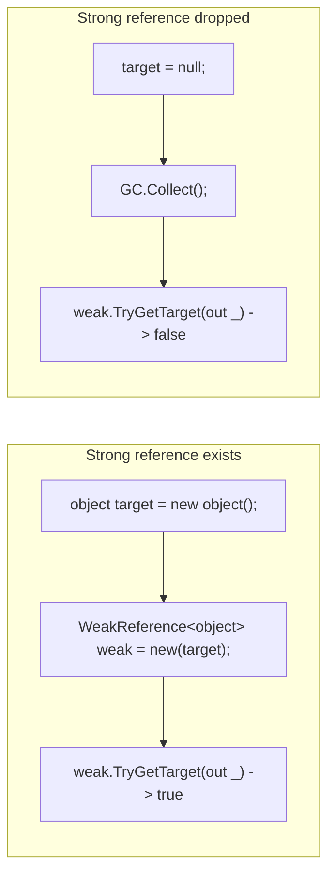
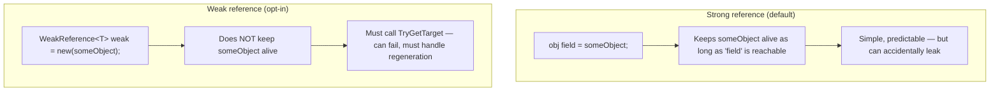

# Weak References

## Introduction

Before reading this lesson, you should already be comfortable with **[Boxing and Unboxing](../08-memory-management/08-07-boxing-and-unboxing.md)** and, throughout this module, with the basic contract of the garbage collector: an object stays alive for as long as something reachable still references it. Every reference you've written so far in this curriculum has been what this lesson calls a **strong reference** — one that the GC treats as a reason, on its own, to keep an object alive. This lesson introduces the one deliberate exception to that rule: a reference that points at an object without giving the GC any reason to spare it.

By the end of this lesson, you will be able to:

- Explain the difference between a strong reference and a weak reference
- Use `WeakReference<T>` to hold a reference the garbage collector is still free to reclaim
- Explain why `TryGetTarget` can legitimately fail, and how to handle that failure
- Recognize caching as the primary real-world use case for weak references
- Connect this lesson's general-purpose `WeakReference<T>` to the event-specific weak event pattern from Module 06

## Weak References — A Layman's Perspective

Picture a small public library's reading room, which keeps a handful of this month's most-requested magazines out on an open browsing shelf so regular visitors can grab one without waiting at the counter. Shelf space is limited, though, and the room only fits so many magazines at once. So the librarian keeps a small note taped under the front desk for each magazine currently out on the shelf — something like "Issue #245 is on the browsing shelf, third row." A visitor who wants that issue can check the note, walk over, and pick it up directly.

Here's the important part: that note is only a hint, never a reservation. If the librarian is doing a routine tidy of the shelf and decides Issue #245 hasn't been touched in a while, it gets pulled to make room for something newer — and nobody consults the note first, because the note was never a claim on the shelf space, just a convenience for finding something that happened to still be there. The next visitor who checks the note and walks over finds an empty spot. That's not a bug in the librarian's system; it's exactly how it was designed to work. The visitor simply requests the magazine from the back-room archive again, and a fresh copy goes back out onto the shelf, ready for the note to point at it once more.

Now contrast that with an actual reservation slip — the kind a visitor fills out to have a specific book held at the counter under their name for pickup. That slip *is* a claim: as long as it exists, the librarian will not give that book to anyone else or return it to general circulation, no matter how long it sits there unclaimed. A room full of old, forgotten reservation slips is a real problem — books that could otherwise be back in circulation instead sit reserved indefinitely, purely because nobody ever tore up the slip.

That's the entire distinction this lesson is about. An ordinary object reference in C# behaves like the reservation slip: as long as it exists, the object it points to cannot be reclaimed, whether or not anyone's actually still using it. A **weak reference** behaves like the note taped under the desk: a convenient way to find something *if it's still there*, but never a reason, by itself, for the garbage collector to keep it around. Both are useful — the reservation slip when you genuinely need to guarantee something stays put, the note when you'd rather let the system reclaim the space the moment it's needed for something else, and simply regenerate what was lost.

## Weak References — A Programming Language Perspective

`WeakReference` and its generic counterpart `WeakReference<T>`, both in the `System` namespace, wrap a reference to an object without counting as a strong reference for garbage collection purposes. Holding a `WeakReference<T>` does not keep its target alive; the GC is free to collect the target the moment no *strong* reference to it remains anywhere else in the application, regardless of how many weak references still point at it. Because the target might already be gone by the time you look, `WeakReference<T>` never exposes its target through a simple property — instead, `TryGetTarget(out T target)` returns `true` and yields the live object if it's still reachable, or `false` if the garbage collector has already reclaimed it. There is no way to "revive" a collected target; if `TryGetTarget` returns `false`, the only option is to recreate whatever the reference used to point to. This makes `WeakReference<T>` a deliberate, opt-in escape hatch from the GC's normal reachability rules — useful precisely when you want to observe or reuse an object *if* it's still around, without that observation itself being the reason it stays around.

## How to Use WeakReference\<T\> in C#

Wrapping an object in a `WeakReference<T>` lets you check on it later without keeping it alive yourself. The example below holds a strong reference initially, confirms the weak reference still resolves, then drops the strong reference and forces a collection to show the weak reference losing its target.


*Figure 1: A `WeakReference<T>` resolves successfully only as long as some other, strong reference keeps its target reachable.*

```csharp
// Program.cs — .NET 10 / C# 14
object? strongReference = new object();
WeakReference<object> weakReference = new(strongReference);

Console.WriteLine($"Still alive with a strong reference held? {weakReference.TryGetTarget(out _)}");

strongReference = null; // drop the only strong reference
GC.Collect();
GC.WaitForPendingFinalizers();

Console.WriteLine($"Still alive after the strong reference was dropped? {weakReference.TryGetTarget(out _)}");
```

**Console Output:**

```text
Still alive with a strong reference held? True
Still alive after the strong reference was dropped? False
```

While `strongReference` is still assigned, the object has a normal, GC-recognized reason to stay alive, and `TryGetTarget` resolves it without trouble. The moment `strongReference` is set to `null`, that reason disappears — the `WeakReference<object>` was never itself a reason to keep the object alive — and the forced collection reclaims it, so the second `TryGetTarget` call correctly reports `False`.

## Real-Time Example: A Weak-Reference Cover Image Cache in Library/Inventory Management

We extend the Library/Inventory Management domain with a `CoverImageCache` that serves book cover images from memory when it can, but never *forces* those images to stay resident — exactly the browsing-shelf behavior from this lesson's analogy. Each cached image is held only through a `WeakReference<byte[]>`; if nothing else in the application is still using that image when memory is reclaimed, the cache simply reloads it from disk on the next request.

```csharp
// Program.cs — .NET 10 / C# 14 — Real-Time Example
CoverImageCache cache = new();

Console.WriteLine(cache.Load("978-0132350884")); // first request: not cached yet

byte[]? currentlyDisplayed = cache.TryGetCached("978-0132350884"); // a UI screen holds this strong reference
GC.Collect();
GC.WaitForPendingFinalizers();
Console.WriteLine(cache.Load("978-0132350884")); // still displayed elsewhere, so still cached

currentlyDisplayed = null; // the UI screen closes; no strong reference remains anywhere
GC.Collect();
GC.WaitForPendingFinalizers();
Console.WriteLine(cache.Load("978-0132350884")); // nothing held it alive — reloaded from disk

class CoverImageCache
{
    private readonly Dictionary<string, WeakReference<byte[]>> _weakCache = new();

    public byte[]? TryGetCached(string isbn) =>
        _weakCache.TryGetValue(isbn, out WeakReference<byte[]>? weakImage) &&
        weakImage.TryGetTarget(out byte[]? image)
            ? image
            : null;

    public string Load(string isbn)
    {
        if (TryGetCached(isbn) is byte[] cachedImage)
        {
            return $"{isbn}: served {cachedImage.Length}-byte cover from cache.";
        }

        byte[] freshImage = new byte[2048]; // simulated cover image bytes loaded from disk
        _weakCache[isbn] = new WeakReference<byte[]>(freshImage);
        return $"{isbn}: reloaded {freshImage.Length}-byte cover from disk and re-cached.";
    }
}
```

**Console Output:**

```text
978-0132350884: reloaded 2048-byte cover from disk and re-cached.
978-0132350884: served 2048-byte cover from cache.
978-0132350884: reloaded 2048-byte cover from disk and re-cached.
```

The first request is always a miss, since the cache starts empty. The second request happens while `currentlyDisplayed` — standing in for a UI screen actively showing that cover — still holds a genuine strong reference to the same byte array, so even a forced collection can't reclaim it, and the cache serves it directly. Only after `currentlyDisplayed` is set to `null`, removing the last strong reference anywhere in the program, does the next forced collection actually reclaim the image — at which point the cache correctly detects the miss and reloads it. In a real catalog application serving thousands of cover images, this is precisely the behavior you want: a cache that helps when it can, but never itself becomes the reason the application runs out of memory holding onto images nobody is looking at anymore.

## Strong References vs Weak References

The choice isn't about which kind of reference is "better" — a program built entirely out of weak references would be unusable, since nothing would ever reliably stay alive. It's about identifying the specific relationships where you want observation without ownership. A strong reference is the default for good reason: it's simple, and an object graph built from strong references is exactly as long-lived as you'd expect just by reading the code. A weak reference is the deliberate exception, reserved for exactly two situations: a cache that should never prevent memory from being reclaimed, and a subscriber relationship — as in Module 06's weak event pattern — where a long-lived publisher shouldn't be the reason a short-lived subscriber never gets collected.


*Figure 2: A strong reference is the simple, predictable default; a weak reference is an intentional opt-out, chosen only where regenerating a lost target is acceptable.*

| Aspect | Strong reference (default) | Weak reference (`WeakReference<T>`) |
|---|---|---|
| Keeps target alive | Yes, as long as the reference itself is reachable | No — the GC may reclaim the target regardless |
| Access to target | Direct member access | Must call `TryGetTarget`, which can return `false` |
| Typical use | Ordinary object graphs and ownership | Caches, weak event subscribers, lookup-only relationships |
| Main risk if misused | Accidentally keeps something alive too long (a leak) | A cache entry vanishes and must be regenerated on demand |

## Types of Weak-Reference-Adjacent Concepts to Explore Next

Weak references sit at the intersection of caching and garbage collection, and connect to several other lessons across this curriculum:

1. **[The Weak Event Pattern](../06-delegates-events/06-09-weak-event-pattern.md)** — the concrete, event-subscription-specific application this lesson's general-purpose `WeakReference<T>` generalizes from.
2. **[Diagnosing Memory Leaks](../08-memory-management/08-09-diagnosing-memory-leaks.md)** — where an unintended *strong* reference, not a weak one, is the most common real-world leak cause.
3. **[`Frozen*` Collections for Read-Heavy Scenarios](../03-collections-generics/03-12-frozen-collections.md)** — a different, immutability-based approach to fast lookups, worth contrasting with a weak-reference cache.
4. **[Garbage Collection Generations](../08-memory-management/08-03-garbage-collection-generations.md)** — the foundational lesson on when and why the GC actually decides an object is eligible for collection.
5. **[`IDisposable` and the `using` Statement](../08-memory-management/08-04-idisposable-and-using-statement.md)** — the disciplined, deterministic alternative to a weak reference when cleanup timing genuinely matters.
6. **[GC Server vs Workstation Modes](../08-memory-management/08-10-gc-server-vs-workstation.md)** — this module's capstone, tying together how the GC actually decides when to reclaim the objects this lesson's weak references point at.

## What You've Learned & What's Next

A `WeakReference<T>` lets an object be reclaimed by the garbage collector even while something still nominally "references" it, by deliberately not counting as a reason to keep that object alive. `TryGetTarget` is the only safe way to use one, precisely because its target might legitimately already be gone — a trade-off worth making for caches that should never cause a memory problem of their own, and for subscriber relationships where a long-lived publisher shouldn't dictate a short-lived subscriber's lifetime.

Continue your learning journey with **[Diagnosing Memory Leaks](../08-memory-management/08-09-diagnosing-memory-leaks.md)**, where we look at the far more common opposite problem — objects that stay alive far longer than intended, not because of any weak reference, but because a plain, ordinary strong reference was never let go of.

---
*Applies to: .NET 10 / C# 14. Last reviewed 2026-08-16.*
