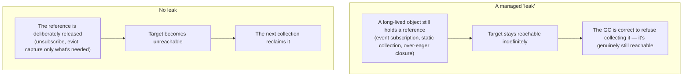
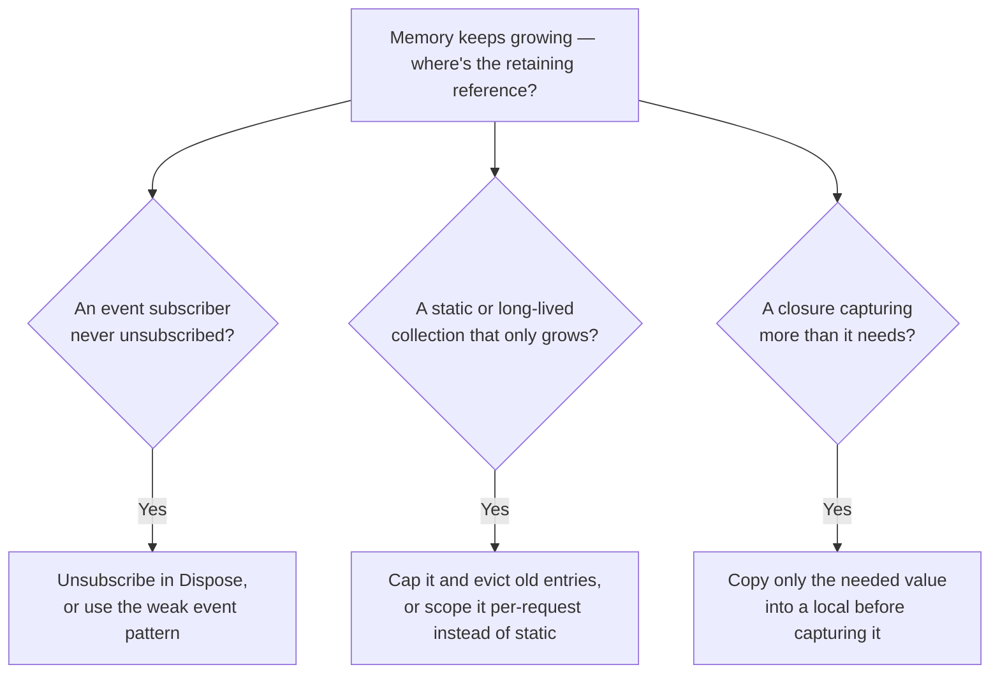

# Diagnosing Memory Leaks

## Introduction

Before reading this lesson, you should already be comfortable with **[Weak References](../08-memory-management/08-08-weak-references.md)** and, across this module, with the garbage collector's one unbreakable rule: an object is collected only once nothing reachable references it anymore. That rule raises an obvious question — if the GC is always correct about reachability, how does a .NET application ever "leak" memory at all? This lesson answers that question directly: a managed leak is never a bug in the garbage collector. It's a reference that a developer forgot was still there.

By the end of this lesson, you will be able to:

- Explain precisely what a "memory leak" means in a garbage-collected language, as distinct from an unmanaged leak
- Recognize forgotten event subscriptions as a leak pattern
- Recognize static or otherwise long-lived collections that only ever grow as a leak pattern
- Recognize over-capturing closures as a leak pattern
- Describe, conceptually, what tools like `dotnet-counters`, `dotnet-gcdump`, and a memory profiler are each used for when hunting a suspected leak

## Diagnosing Memory Leaks — A Layman's Perspective

Picture a self-storage facility that rents out units with a simple auto-renewal policy: unless you actively cancel, the unit keeps renewing every month, and the facility keeps that physical space reserved and off-limits to anyone else. A tenant moves everything out, fully intending to cancel that same week — but the cancellation call never happens. Six months later, the unit is still locked, still billed, still occupying a slot in the facility's limited floor space, and from the facility's point of view, absolutely nothing has gone wrong: the account is exactly as active as it's always been. Nobody broke anything. Nobody forgot to check whether the account was "supposed" to be active — the account genuinely still is active, on paper, because the one thing that would have deactivated it never happened.

That's the first shape this problem takes, and it maps directly onto a forgotten event subscription: a long-lived object (the storage facility) keeps a subscriber (the rented unit) alive indefinitely, simply because nobody ever called the equivalent of "cancel my account" — in code, `-=` to unsubscribe.

A second shape looks different on the surface but comes from the same root cause. Picture a facility logbook meant to record every vehicle currently parked in the lot, where someone writes a new line every time a car pulls in — and where, for whatever reason, nobody ever crosses a line out when a car actually leaves. The logbook only ever gets longer. Six months in, it's a thick binder recording thousands of cars that left months ago, none of which are still in the lot, and yet the logbook insists otherwise, because nothing about "adding a new line" was ever paired with "removing an old one" once it stopped applying. That's a long-lived collection that only ever grows — a cache or tracking list, often `static`, that keeps accepting new entries without ever evicting stale ones.

The third shape is subtler still. Imagine asking a courier to grab a single receipt sitting on a cluttered desk, and the courier, in a hurry, just grabs the entire desk drawer the receipt happened to be sitting in, because it was easier than digging the one item out — and now hauls around a drawer full of unrelated paperwork it never actually needed, just because that paperwork happened to be reachable from the one item it grabbed. That's an over-capturing closure: a small function that only needed one value ends up dragging along an entire enclosing object, simply because of *how* it referenced that value, not because it truly needed everything else attached to it.

## Diagnosing Memory Leaks — A Programming Language Perspective

In a garbage-collected language, a "memory leak" does not mean memory that's unreachable and unfreed — the GC guarantees that never happens. It means memory that remains *reachable*, and therefore un-collectible, purely because of a reference nobody intended to keep around. Three patterns account for the overwhelming majority of real-world .NET leaks: a long-lived publisher holding a strong reference to a subscriber that was meant to be short-lived (an un-unsubscribed event handler); a `static` field or otherwise application-lifetime collection that only ever has entries added to it, never removed; and a lambda or local function that captures an entire enclosing object merely because it referenced one of that object's members, rather than capturing just the value it actually needed. In every case, the fix is conceptually identical: locate the retaining reference — the GC root path keeping the object alive — and deliberately break it.

## How to Reason About a Suspected Memory Leak

Once memory growth is suspected, the practical next step is usually a live counter tool like `dotnet-counters` to watch heap size and allocation rate over time, followed by a heap snapshot tool like `dotnet-gcdump` (or a graphical memory profiler in Visual Studio or JetBrains Rider) to capture *what* is retained and, critically, the exact chain of references — the "path to root" — keeping it alive. This lesson stays conceptual about those tools; the diagnostic instinct that matters first is knowing which three shapes of retaining reference to look for.


*Figure 1: A managed "leak" is never memory the GC failed to find — it's memory a forgotten reference is still, correctly, keeping reachable.*

```csharp
// Program.cs — .NET 10 / C# 14
Func<int>? leakyClosure = CreateLeakyClosure(out WeakReference<LargeReport> tracker);

GC.Collect();
GC.WaitForPendingFinalizers();
Console.WriteLine($"Large buffer still alive (leaky closure)? {tracker.TryGetTarget(out _)}");

leakyClosure = null; // release the closure itself
GC.Collect();
GC.WaitForPendingFinalizers();
Console.WriteLine($"Large buffer still alive after releasing the closure? {tracker.TryGetTarget(out _)}");

static Func<int> CreateLeakyClosure(out WeakReference<LargeReport> tracker)
{
    LargeReport report = new(new byte[1024 * 1024], itemCount: 5);
    tracker = new WeakReference<LargeReport>(report);

    // References 'report.ItemCount', which forces the compiler to capture the whole
    // 'report' object — including its 1 MB buffer — not just the int this lambda needs.
    return () => report.ItemCount;
}

class LargeReport(byte[] buffer, int itemCount)
{
    public byte[] Buffer { get; } = buffer;
    public int ItemCount { get; } = itemCount;
}
```

**Console Output:**

```text
Large buffer still alive (leaky closure)? True
Large buffer still alive after releasing the closure? False
```

As long as `leakyClosure` is assigned, the compiler-generated closure object it points to holds a strong reference to the entire `report` instance — 1 MB buffer included — purely because the lambda reads `report.ItemCount`, a member access that requires holding `report` itself, not just an `int`. Only once `leakyClosure` itself is released does that chain break, and the forced collection can finally reclaim the whole `LargeReport`, buffer and all.

## Real-Time Example: An Unbounded vs Bounded Tracker in E-Commerce Order Processing

We extend the E-Commerce Order Processing domain with a recently-viewed-products tracker — a common feature that logs which SKUs a shopper has recently looked at. The leaky version stores every view ever recorded in a `static` list for the lifetime of the application; the fixed version caps how many entries it retains, evicting the oldest one whenever a new view arrives.

```csharp
// Program.cs — .NET 10 / C# 14 — Real-Time Example
string[] viewedProducts =
[
    "SKU-1001", "SKU-1002", "SKU-1003", "SKU-1004", "SKU-1005",
    "SKU-1006", "SKU-1007", "SKU-1008", "SKU-1009", "SKU-1010"
];

Console.WriteLine("--- Leaky: unbounded static tracker ---");
foreach (string sku in viewedProducts)
{
    LeakyRecentlyViewedTracker.RecordView(sku);
}
Console.WriteLine($"Tracked entries after {viewedProducts.Length} views: {LeakyRecentlyViewedTracker.Count}");

foreach (string sku in viewedProducts) // a second browsing session, same shopper
{
    LeakyRecentlyViewedTracker.RecordView(sku);
}
Console.WriteLine($"Tracked entries after {viewedProducts.Length * 2} views: {LeakyRecentlyViewedTracker.Count}");

Console.WriteLine();
Console.WriteLine("--- Fixed: bounded recently-viewed tracker ---");
BoundedRecentlyViewedTracker fixedTracker = new(capacity: 3);
foreach (string sku in viewedProducts)
{
    fixedTracker.RecordView(sku);
}
Console.WriteLine($"Tracked entries after {viewedProducts.Length} views (capacity 3): {fixedTracker.Count}");
Console.WriteLine($"Currently retained: {string.Join(", ", fixedTracker.CurrentlyTracked)}");

static class LeakyRecentlyViewedTracker
{
    private static readonly List<string> _allViewsEver = [];

    public static void RecordView(string sku) => _allViewsEver.Add(sku);

    public static int Count => _allViewsEver.Count;
}

class BoundedRecentlyViewedTracker(int capacity)
{
    private readonly Queue<string> _recent = new();

    public void RecordView(string sku)
    {
        if (_recent.Count == capacity)
        {
            _recent.Dequeue(); // evict the oldest entry — memory never grows past 'capacity'
        }
        _recent.Enqueue(sku);
    }

    public int Count => _recent.Count;

    public IEnumerable<string> CurrentlyTracked => _recent;
}
```

**Console Output:**

```text
--- Leaky: unbounded static tracker ---
Tracked entries after 10 views: 10
Tracked entries after 20 views: 20

--- Fixed: bounded recently-viewed tracker ---
Tracked entries after 10 views (capacity 3): 3
Currently retained: SKU-1008, SKU-1009, SKU-1010
```

`LeakyRecentlyViewedTracker`'s backing list is `static`, which means it is itself a GC root for the entire application's lifetime — every SKU ever recorded stays reachable, and therefore uncollectible, forever, exactly as the second browsing session's doubled count demonstrates. `BoundedRecentlyViewedTracker` records exactly as many views, but its `Queue<string>` never exceeds `capacity`, evicting the oldest SKU the moment a new one arrives — memory use is flat regardless of whether ten shoppers or ten million have passed through. On a real storefront processing continuous traffic, the leaky version is a slow, steadily worsening memory problem that a tool like `dotnet-counters` would show as a heap size that never comes back down between garbage collections — a strong signal to go looking for exactly this kind of unbounded `static` collection.

## Managed "Leaks" vs Traditional Unmanaged Leaks

Calling this a "leak" at all is a slightly borrowed term, and the borrowing is worth being precise about. In an unmanaged language, a leak means memory that was allocated and never freed, and for which the pointer needed to free it may since have been overwritten or gone out of scope entirely — the memory is genuinely lost, un-findable except through OS-level or specialized tooling. In .NET, nothing is ever truly lost this way: every leaked object remains reachable from some GC root, which means it is, by definition, directly inspectable — a heap snapshot can always show you the exact chain of references keeping it alive. The bug isn't invisible; it's simply unnoticed.


*Figure 2: The three most common managed-leak patterns, and the fix for each.*

| Aspect | Traditional (unmanaged) leak | Managed ("GC-visible") leak |
|---|---|---|
| Root cause | Memory allocated, then the only reference to free it was lost | Memory still reachable via a forgotten reference |
| Is the leaked memory "findable"? | Not directly — the address itself may be gone | Yes — always reachable from a GC root, so it is inspectable in a heap dump |
| Typical fix | Add the missing `free()`/`delete` call | Break the retaining reference (unsubscribe, evict, capture less) |
| Typical diagnostic tool | Valgrind, AddressSanitizer | `dotnet-gcdump`, `dotnet-counters`, a memory profiler |

## Types of Diagnostic Concepts to Explore Next

Diagnosing a managed leak connects directly to several other lessons across this curriculum, both for the patterns that cause them and the tools that expose them:

1. **[Weak References](../08-memory-management/08-08-weak-references.md)** — one systematic fix for the forgotten-event-subscriber leak pattern.
2. **[The Weak Event Pattern](../06-delegates-events/06-09-weak-event-pattern.md)** — the concrete, event-specific version of that same fix.
3. **[Closures in C#](../06-delegates-events/06-07-closures-in-csharp.md)** — the foundational lesson on exactly what a lambda captures, and why, which this lesson's closure-leak example depends on.
4. **[`IDisposable` and the `using` Statement](../08-memory-management/08-04-idisposable-and-using-statement.md)** — the disciplined cleanup pattern that prevents most of these leaks before they ever start.
5. **[Diagnostic Tools: `dotnet-trace` and `dotnet-counters`](../12-advanced-concepts/12-36-dotnet-trace-and-counters.md)** — the deep-dive on the live diagnostic tooling this lesson only introduces conceptually.
6. **[Profiling .NET Applications](../12-advanced-concepts/12-31-profiling-dotnet-applications.md)** — the broader profiling lesson, including heap-snapshot analysis with `dotnet-gcdump`.

## What You've Learned & What's Next

A memory leak in a garbage-collected language is never memory the GC lost track of — it's memory that stayed correctly reachable because of a reference a developer forgot about: an event subscription never unsubscribed, a `static` collection that only ever grows, or a closure that captured far more than it needed. Diagnosing one is a matter of finding that retaining reference, and tools like `dotnet-counters` and `dotnet-gcdump` exist specifically to make that reference chain visible instead of theoretical.

Continue your learning journey with **[GC Server vs Workstation Modes](../08-memory-management/08-10-gc-server-vs-workstation.md)**, the capstone of Module 08, where we step back from individual objects entirely and look at how the garbage collector itself is configured to behave differently across an entire application's workload.

---
*Applies to: .NET 10 / C# 14. Last reviewed 2026-08-16.*
