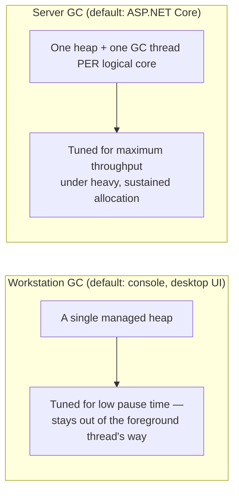
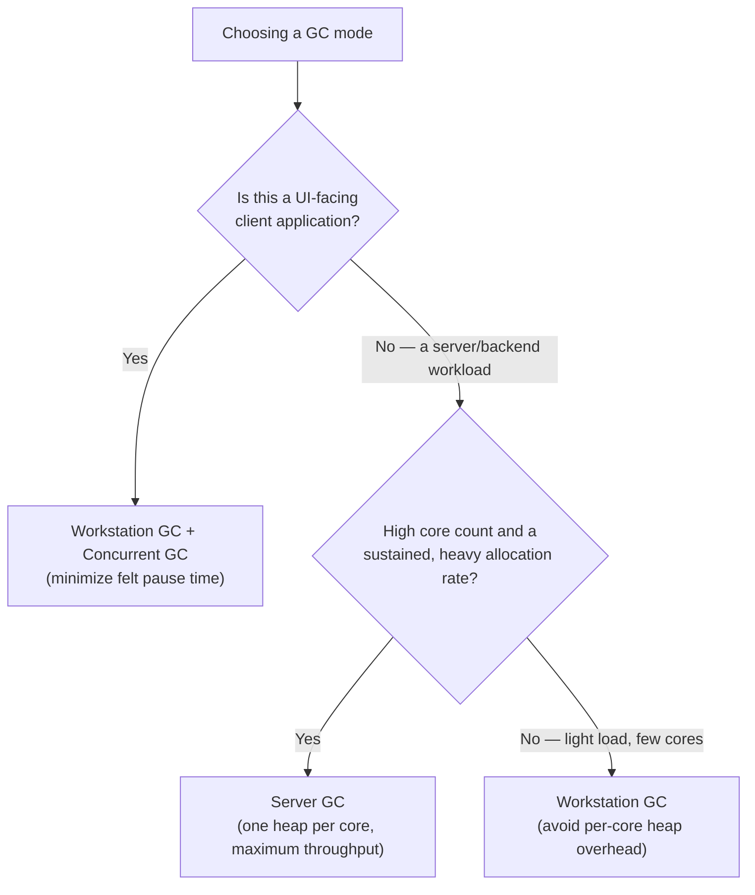

# GC Server vs Workstation Modes

## Introduction

Before reading this lesson, you should already be comfortable with **[Diagnosing Memory Leaks](../08-memory-management/08-09-diagnosing-memory-leaks.md)** and, really, with the entire arc of Module 08: the stack-versus-heap split, generational garbage collection, `IDisposable` and finalizers for deterministic and non-deterministic cleanup, `Span<T>`/`Memory<T>` for avoiding allocations outright, boxing for the allocations that sneak in anyway, and weak references and leak diagnosis for the objects that outlive their welcome. Every one of those lessons assumed the garbage collector's *behavior* was a fixed backdrop. This lesson, the module's capstone, changes that assumption: the GC itself has two fundamentally different operating modes, and choosing correctly between them is a real, application-level decision every .NET service and client eventually has to make.

By the end of this lesson, you will be able to:

- Explain the structural difference between Workstation GC (one heap) and Server GC (one heap per logical core)
- Explain what Concurrent (Background) GC adds on top of either mode
- Configure GC mode via `.csproj` (`<ServerGarbageCollection>`) and `runtimeconfig.json`
- Read the current GC mode programmatically with `System.Runtime.GCSettings`
- Reason through which mode fits a given workload's shape, rather than defaulting to whatever a project template happened to choose
- Apply that reasoning to a Banking/ATM backend service versus its desktop client application

## GC Server vs Workstation Modes — A Layman's Perspective

Picture two very different cleanup operations. The first is a single small office suite at night: one janitor, working alone, tidying one desk at a time, always pausing the moment someone's still at their desk working late, and never touching two areas at once because there's only one person and one building to look after. The job isn't to clean as much as physically possible in the shortest time — it's to clean thoroughly without ever being the reason someone couldn't finish typing a sentence. If the janitor needs to empty a bin near an occupied desk, they wait, or they do it quickly and quietly, because getting in the way even once defeats the entire point of doing the job at night in the first place.

The second is the concession level of a large stadium during a sold-out game: dozens of food stands, each doing hundreds of transactions an hour, and a cleaning crew stationed at *every single stand*, continuously, throughout the entire event — not one janitor roaming the whole level, but a dedicated crew member per stand, working in parallel with every other crew member at every other stand. Here the goal is the opposite of the office suite: raw throughput. Thousands of customers are moving through the concourse every hour, and any single stand falling behind on cleanup costs real capacity across the whole venue. Hiring one roaming janitor for the entire stadium, the way the office building does, would be absurd — by the time they got around to the fourth stand, garbage would already be piling up at the first three again. The stadium needs cleanup capacity that scales with how many stands are actually running, not with how tidy any one visitor happens to notice their own experience being.

Neither approach is wrong — they're solving different problems. The office suite has one desk that matters at any moment, and the *feel* of never being interrupted is the entire point. The stadium has dozens of stands running simultaneously, and the *volume* of transactions handled per hour is the entire point. Putting the stadium's crew-per-stand approach into the office suite would mean paying for dozens of idle cleaners most of the night. Putting the office's one-roaming-janitor approach into the stadium would mean garbage overwhelming every stand within the first inning.

That's the entire choice this lesson is about. **Workstation GC** is the office suite's approach: one heap, one set of collection work, tuned to stay out of the way of whatever the application is doing right now — ideal when there's a single user whose experience of responsiveness is the whole point. **Server GC** is the stadium's approach: one heap and one dedicated collection thread *per core*, tuned for maximum throughput when many things are genuinely happening in parallel — ideal when raw request volume, not any one interaction's felt smoothness, is what's being optimized for.

## GC Server vs Workstation Modes — A Programming Language Perspective

.NET's garbage collector runs in one of two fundamentally different modes. **Workstation GC** manages a single heap for the entire process and is tuned to minimize pause times, keeping collections short and out of the way of the application's foreground work — it is the default for console apps, and for desktop UI frameworks like WPF, WinForms, and MAUI, where a felt UI stutter is a real regression. **Server GC** creates one heap and one dedicated garbage collection thread *per logical core*, trading memory overhead and individual pause length for dramatically higher sustained throughput under heavy, parallel allocation — it is the default for ASP.NET Core and most server workloads. Independently of which mode is active, **Concurrent GC** (also called Background GC in Workstation mode) runs most of a full generation-2 collection on a background thread while the application keeps running, shortening the portion of the collection that must actually stop all managed threads. Both settings are configured the same way: `<ServerGarbageCollection>` and `<ConcurrentGarbageCollection>` in the `.csproj`, which flow into `runtimeconfig.json` as `System.GC.Server` and `System.GC.Concurrent` at build time — or `runtimeconfig.json` can be edited directly for a published application.

## How to Configure and Inspect the GC Mode

A project's `.csproj` is the normal place to set GC mode; the running application can also read its own current mode at any time through `System.Runtime.GCSettings`.


*Figure 1: Workstation GC optimizes for one responsive foreground thread; Server GC optimizes for total throughput across every core.*

```csharp
// Program.cs — .NET 10 / C# 14
using System.Runtime;

Console.WriteLine($"Server GC enabled: {GCSettings.IsServerGC}");
Console.WriteLine($"Latency mode: {GCSettings.LatencyMode}");
```

**Console Output:**

```text
Server GC enabled: False
Latency mode: Interactive
```

A default console application, with no explicit GC configuration, runs Workstation GC — `GCSettings.IsServerGC` reports `False`, and its default `GCLatencyMode` of `Interactive` reflects the same low-pause-time priority. Flipping to Server GC requires no code change at all, only project configuration:

```xml
<!-- YourProject.csproj -->
<PropertyGroup>
  <ServerGarbageCollection>true</ServerGarbageCollection>
  <ConcurrentGarbageCollection>true</ConcurrentGarbageCollection>
</PropertyGroup>
```

which is equivalent, at run time, to the following `runtimeconfig.json` entries:

```json
{
  "runtimeOptions": {
    "configProperties": {
      "System.GC.Server": true,
      "System.GC.Concurrent": true
    }
  }
}
```

With either of those in place, the same `GCSettings.IsServerGC` check above would report `True` instead — nothing about the application's own code needs to know or care which mode it's running under.

## Real-Time Example: Choosing a GC Mode for the Banking/ATM Platform

We extend the Banking/ATM domain with two very different processes from the same platform: `ATM-Backend-TransactionService`, a multi-core server handling hundreds of concurrent transaction requests from ATMs across a whole region, and `ATM-Desktop-TellerClient`, a single teller's desktop application processing one customer's request at a time. A small `GcModeAdvisor` encodes the same reasoning this lesson has been building toward, and applies it to both.

```csharp
// Program.cs — .NET 10 / C# 14 — Real-Time Example
WorkloadProfile backendService = new(
    Name: "ATM-Backend-TransactionService",
    IsUserFacingUi: false,
    ExpectedConcurrentRequests: 500,
    AvailableCores: 16);

WorkloadProfile desktopClient = new(
    Name: "ATM-Desktop-TellerClient",
    IsUserFacingUi: true,
    ExpectedConcurrentRequests: 1,
    AvailableCores: 4);

foreach (WorkloadProfile profile in new[] { backendService, desktopClient })
{
    GcRecommendation recommendation = GcModeAdvisor.Recommend(profile);
    Console.WriteLine($"{profile.Name}:");
    Console.WriteLine($"  Recommended mode: {recommendation.Mode}");
    Console.WriteLine($"  Reason: {recommendation.Reason}");
    Console.WriteLine();
}

static class GcModeAdvisor
{
    public static GcRecommendation Recommend(WorkloadProfile profile)
    {
        if (profile.IsUserFacingUi)
        {
            return new GcRecommendation(
                "Workstation GC (Concurrent)",
                "A UI-facing client must never stall on a GC pause the user can feel; " +
                "Workstation GC minimizes pause time on a single heap, and Concurrent GC " +
                "runs most Gen2 work in the background while the UI stays responsive.");
        }

        if (profile.ExpectedConcurrentRequests > 50 && profile.AvailableCores >= 8)
        {
            return new GcRecommendation(
                "Server GC",
                $"A backend service handling {profile.ExpectedConcurrentRequests} concurrent " +
                $"requests across {profile.AvailableCores} cores benefits from one heap and one " +
                "GC thread per core, maximizing throughput under sustained allocation.");
        }

        return new GcRecommendation(
            "Workstation GC",
            "Low concurrency and/or limited cores — Server GC's per-core heaps would add memory " +
            "overhead with little throughput benefit here.");
    }
}

record WorkloadProfile(string Name, bool IsUserFacingUi, int ExpectedConcurrentRequests, int AvailableCores);

record GcRecommendation(string Mode, string Reason);
```

**Console Output:**

```text
ATM-Backend-TransactionService:
  Recommended mode: Server GC
  Reason: A backend service handling 500 concurrent requests across 16 cores benefits from one heap and one GC thread per core, maximizing throughput under sustained allocation.

ATM-Desktop-TellerClient:
  Recommended mode: Workstation GC (Concurrent)
  Reason: A UI-facing client must never stall on a GC pause the user can feel; Workstation GC minimizes pause time on a single heap, and Concurrent GC runs most Gen2 work in the background while the UI stays responsive.

```

The two recommendations land on opposite modes for a reason that has nothing to do with which one is "better" in general — it's that the two processes are optimizing for genuinely different things. The backend service exists to push as many transactions through sixteen cores as possible; Server GC's one-heap-per-core design directly targets that. The teller's desktop client exists to never make one person waiting at one counter feel a stutter; Workstation GC's single, low-pause heap directly targets that instead. In a real deployment, this is exactly the reasoning that belongs in the backend service's `.csproj` (`<ServerGarbageCollection>true</ServerGarbageCollection>`) and, just as deliberately, in the desktop client's `.csproj` (leaving it `false`, or omitting it entirely).

## Workstation GC vs Server GC

The decision reduces to a single question: is this process optimizing for one thread's felt responsiveness, or for total throughput across many cores under sustained load? Almost everything else about GC tuning follows from answering that question honestly for the actual deployment target, not from copying whatever a project template happened to default to.


*Figure 2: A single decision tree covers nearly every real GC-mode choice — UI responsiveness on one branch, server throughput on the other.*

| Aspect | Workstation GC | Server GC |
|---|---|---|
| Heap layout | One heap for the whole process | One heap per logical core |
| Optimized for | Low pause time / felt responsiveness | Maximum throughput under heavy, parallel allocation |
| Typical default host | Console apps, WPF/WinForms/MAUI desktop apps | ASP.NET Core and most server workloads |
| Configuration | `<ServerGarbageCollection>false</ServerGarbageCollection>` (or omit) | `<ServerGarbageCollection>true</ServerGarbageCollection>` |
| Memory overhead | Lower — a single heap | Higher — scales with core count |

## Module 08 at a Glance

This capstone rests on every lesson in Module 08 — each one is worth revisiting now that they all fit together into a single picture of how .NET manages memory:

1. **[Introduction to Memory Management in .NET](../08-memory-management/08-01-introduction-to-memory-management.md)** — the foundation every other lesson in this module, including this one, builds on.
2. **[Garbage Collection Generations](../08-memory-management/08-03-garbage-collection-generations.md)** — the Gen0/Gen1/Gen2 model that both Workstation and Server GC run, just distributed across a different number of heaps.
3. **[`IDisposable` and the `using` Statement](../08-memory-management/08-04-idisposable-and-using-statement.md)** — deterministic cleanup that matters identically regardless of which GC mode is active.
4. **[`Span<T>` and `Memory<T>`](../08-memory-management/08-06-span-t-and-memory-t.md)** — reducing how much there is for either GC mode to collect in the first place.
5. **[Weak References](../08-memory-management/08-08-weak-references.md)** — another lever for shrinking what the GC has to manage, independent of the mode it runs in.
6. **[Diagnosing Memory Leaks](../08-memory-management/08-09-diagnosing-memory-leaks.md)** — this lesson's direct prerequisite, and the lesson whose symptoms — rising heap size, long pauses — look measurably different under Workstation versus Server GC.

## What You've Learned & What's Next

Workstation GC and Server GC are not a better and a worse option — they're tuned for opposite priorities: one heap optimized for a single thread's felt responsiveness, versus one heap per core optimized for total throughput under sustained, parallel load. Configuring either is a one-line `.csproj` change, and Concurrent GC layers on top of both to shorten the pause a collection actually needs to stop the application for. Across Module 08 as a whole, that's the real throughline: the garbage collector's promise — an object is collected once, and only once, nothing reachable references it — but *how* and *when* that promise is fulfilled is something every real .NET application, client or server, gets to choose.

Continue your learning journey with **[Introduction to File I/O in .NET](../09-file-io-serialization/09-01-introduction-to-file-io.md)**, the first lesson of Module 09, where the focus shifts from memory the runtime manages for you to a different resource entirely — files and streams — that your code must open, use, and close correctly on its own.

---
*Applies to: .NET 10 / C# 14. Last reviewed 2026-08-16.*
