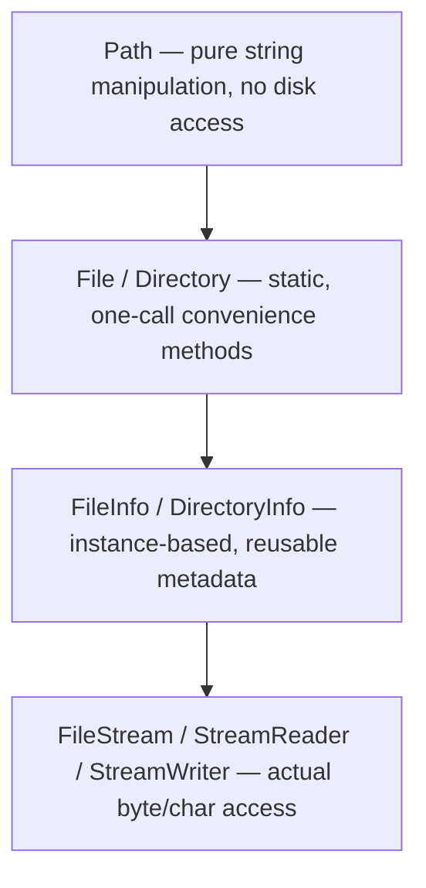
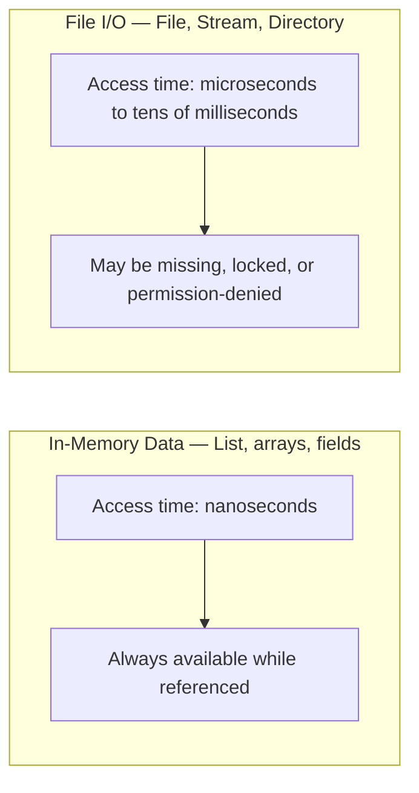

# Introduction to File I/O in .NET

## Introduction

Before reading this lesson, you should already be comfortable with **[GC Server vs Workstation Modes](../08-memory-management/08-10-gc-server-vs-workstation.md)** and, more broadly, with Module 08's central idea: the .NET runtime manages memory for you, allocating and reclaiming objects on the heap without your code ever needing to ask an operating system for permission. This lesson turns that assumption on its head. The moment your program needs to read or write a **file**, it is no longer dealing with something the runtime privately manages — it is reaching out across the process boundary to the operating system, to a physical or virtual disk, and to a filesystem that other programs, other users, and the machine's own security policy all have a say in. **File I/O** is the first resource in this curriculum that your code must explicitly request, use, and release correctly, because nothing is automatically cleaning it up for you the way the GC cleans up memory.

By the end of this lesson, you will be able to:

- Describe what the `System.IO` namespace provides and how its major types relate to one another
- Explain why file I/O is inherently slower and less predictable than in-memory operations
- Identify the failure modes unique to files — missing files, locked files, permission errors, and bad paths
- Use `File`, `FileInfo`, `Directory`, and `Path` to safely inspect the filesystem
- Handle a missing-file scenario without crashing the program
- Describe the roadmap of Module 09 and how its lessons build on one another

## File I/O — A Layman's Perspective

Imagine you work at a desk, and everything you need for the next five minutes is a sticky note you scribbled and stuck to your monitor. Reading it takes no effort at all — you glance up, it's there, it's instantly readable, and you fully control it. Nobody else can take it from you while you're looking at it, and if you throw it away, it's gone the second you decide to throw it away. This is what working with data already sitting in your program's memory feels like: instant, private, and entirely under your control.

Now imagine that instead of a sticky note, what you actually need is a folder from the shared records room down the hall. Getting it is a completely different kind of task. First, you have to walk there — that alone takes real, measurable time, unlike glancing at your monitor. Second, the folder might not even be in the room anymore — maybe it was archived, misfiled, or simply never created, and you won't know until you actually look. Third, someone else might have the folder checked out right now, and the records room's rules might say you have to wait, or aren't allowed to touch it at all without the right clearance. Fourth, the room itself might be locked, off-limits, or the building might have a policy that only certain badge holders can enter certain shelves. None of these problems exist with the sticky note on your monitor, and all of them are just an ordinary part of dealing with a shared records room.

That records room is exactly what a file on disk is to your running program. The file might not exist (`FileNotFoundException`). The folder — the directory — might not exist either (`DirectoryNotFoundException`). Someone else — another process, another user — might have the file open and locked in a way that blocks you (`IOException`). Your program might not have the clearance to read or write it at all (`UnauthorizedAccessException`). And even in the best case, where none of that goes wrong, simply walking to the records room and back takes real, measurable time compared to glancing at a sticky note — because a disk, whether spinning or solid-state, sits physically outside your program's own private workspace, and the operating system has to broker every single trip there and back.

This is the shift this whole module is about: everything before now assumed the "sticky note" case, where your data was already there, in memory, ready the instant you asked for it. From here forward, a good amount of what your code does will look more like a trip to the records room — slower by nature, occasionally disappointing, and worth handling carefully rather than assuming it will always just work.

## File I/O — A Programming Language Perspective

In .NET, file and directory access is exposed through the `System.IO` namespace. Its static convenience classes — `File` and `Directory` — offer one-call operations (`File.Exists`, `File.ReadAllText`, `Directory.CreateDirectory`) for common tasks without requiring you to manage an open handle yourself. Their instance-based counterparts — `FileInfo` and `DirectoryInfo` — represent a specific file or directory as an object, cache some of its metadata for repeated queries, and are more efficient when you need to inspect or act on the same file several times in a row. The `Path` class performs pure string manipulation on file paths (`Path.Combine`, `Path.GetTempPath`, `Path.GetExtension`) and never touches the disk at all — it is safe, fast, and platform-aware (correctly using `\` or `/` depending on the operating system). Underneath all of these, `Stream`, `FileStream`, `StreamReader`, and `StreamWriter` provide the actual byte- and character-level access, which later lessons in this module cover in depth. Every one of these APIs ultimately makes a system call into the operating system's own filesystem driver, which is precisely why file I/O behaves — and fails — so differently from ordinary in-memory code.

## How to Explore the Filesystem with System.IO

The safest way to start with file I/O is to check what's actually there before acting on it, and to use members that report clearly rather than crash unpredictably. The example below creates a temporary working directory, writes a small file into it, inspects it with `FileInfo`, and then cleans up after itself so the demo leaves nothing behind on disk.


*Figure 1: `System.IO`'s major types, from path strings with no I/O at all down to the streams that do the real reading and writing.*

```csharp
// Program.cs — .NET 10 / C# 14
string tempDir = Path.Combine(Path.GetTempPath(), "dotnet-file-io-demo");
Directory.CreateDirectory(tempDir);
string filePath = Path.Combine(tempDir, "readme.txt");

Console.WriteLine($"File exists before write: {File.Exists(filePath)}");

File.WriteAllText(filePath, "First line written by File I/O demo.");

FileInfo info = new(filePath);
Console.WriteLine($"File exists after write: {File.Exists(filePath)}");
Console.WriteLine($"File size in bytes: {info.Length}");
Console.WriteLine($"File name: {info.Name}");

// Clean up so the demo leaves no trace on disk.
File.Delete(filePath);
Directory.Delete(tempDir);
Console.WriteLine($"File exists after cleanup: {File.Exists(filePath)}");
```

**Console Output:**

```text
File exists before write: False
File exists after write: True
File size in bytes: 36
File name: readme.txt
File exists after cleanup: False
```

`Path.GetTempPath()` returns a directory guaranteed to exist and be writable on the current machine, which is why every runnable example in this module uses it rather than a hardcoded path. `File.Exists` never throws — it simply returns `true` or `false` — which makes it the right tool for checking before you act. `FileInfo` then gives repeated, cheap access to metadata like `Length` and `Name` without re-parsing the path string each time. Deleting the file and its directory at the end is not just tidiness — it demonstrates that, unlike memory, nothing about a file cleans itself up; every file your code creates is your code's responsibility to remove.

## Real-Time Example: Loading a Catalog Export in the Library/Inventory System

We start building the Library/Inventory Management domain here, with a `LoadCatalog` routine that a nightly reporting job might use to read a catalog export produced by another process. Because that export is a real file on disk rather than an in-memory object, the code has to account for the very real possibility that the export hasn't been produced yet.

```csharp
// Program.cs — .NET 10 / C# 14 — Real-Time Example
string catalogDir = Path.Combine(Path.GetTempPath(), "library-inventory-demo");
Directory.CreateDirectory(catalogDir);
string catalogPath = Path.Combine(catalogDir, "catalog-export.txt");

Console.WriteLine("Attempting to load catalog export...");
LoadCatalog(catalogPath);

Console.WriteLine();
Console.WriteLine("Publishing catalog export...");
File.WriteAllText(catalogPath, "9780134685991,Effective Java,3\n9780132350884,Clean Code,5\n");

Console.WriteLine("Attempting to load catalog export again...");
LoadCatalog(catalogPath);

// Clean up so the demo leaves no trace on disk.
File.Delete(catalogPath);
Directory.Delete(catalogDir);

static void LoadCatalog(string path)
{
    try
    {
        string[] lines = File.ReadAllLines(path);
        Console.WriteLine($"Catalog loaded: {lines.Length} title(s) found.");
        foreach (string line in lines)
        {
            string[] fields = line.Split(',');
            Console.WriteLine($"  ISBN {fields[0]}: \"{fields[1]}\" - {fields[2]} copies");
        }
    }
    catch (FileNotFoundException)
    {
        Console.WriteLine("Catalog export not found yet - the nightly export job may not have run.");
    }
}
```

**Console Output:**

```text
Attempting to load catalog export...
Catalog export not found yet - the nightly export job may not have run.

Publishing catalog export...
Attempting to load catalog export again...
Catalog loaded: 2 title(s) found.
  ISBN 9780134685991: "Effective Java" - 3 copies
  ISBN 9780132350884: "Clean Code" - 5 copies
```

The first call to `LoadCatalog` runs before the export file exists, and `File.ReadAllLines` throws `FileNotFoundException` exactly as it should — the code catches it and reports a clear, actionable message instead of letting the program crash. Only after the export is "published" (written) does the second call succeed. This is the shape of nearly every real file I/O interaction: the file might not be there yet, might never arrive, or might arrive late, and production code has to treat that as a normal, expected outcome rather than an exceptional one.

## In-Memory Operations vs File I/O Operations

An in-memory collection like a `List<Book>` and a file on disk can both "hold" the same catalog data, but they behave completely differently as resources. Memory is private to your process, always available the instant you reference it, and vanishes cleanly the moment nothing references it anymore. A file is shared infrastructure: other processes, other users, and the operating system's own permission model all have a say in whether your read or write succeeds, and none of that is guaranteed to go your way just because it did last time.


*Figure 2: In-memory data is fast and privately owned; file I/O is slower and shared with the rest of the machine.*

| Aspect | In-Memory Data | File I/O |
|---|---|---|
| Typical latency | Nanoseconds | Microseconds to tens of milliseconds |
| Availability | Guaranteed while the object is referenced | Not guaranteed — the file may be missing, moved, or locked |
| Failure modes | Effectively none, barring out-of-memory | `FileNotFoundException`, `UnauthorizedAccessException`, `IOException`, `DirectoryNotFoundException` |
| Persistence | Lost the instant the process exits | Survives process restarts and machine reboots |
| Concurrency hazard | Managed entirely by your own code | Other processes or users can read, lock, or delete the same file |

## The Roadmap for Module 09

This module builds up file handling one capability at a time, from the simplest convenience calls to the format your data actually gets stored in:

1. **[Reading and Writing Files](../09-file-io-serialization/09-02-reading-and-writing-files.md)** — the whole-file convenience methods (`File.ReadAllText`, `File.WriteAllText`, and friends) for small files.
2. **[Working with Streams](../09-file-io-serialization/09-03-working-with-streams.md)** — `FileStream`, `StreamReader`, and `StreamWriter` for large files that shouldn't be loaded into memory all at once.
3. **[Synchronous vs Asynchronous File I/O](../09-file-io-serialization/09-04-sync-vs-async-file-io.md)** — why file access is a genuinely good fit for `async`/`await`, and the anti-patterns to avoid.
4. **[System.Text.Json in Depth](../09-file-io-serialization/09-05-system-text-json-in-depth.md)** — serializing objects to and from JSON, including AOT-friendly source-generated serialization.
5. **[XML Serialization](../09-file-io-serialization/09-06-xml-serialization.md)** — the older but still widely used alternative format, and when it's still the right choice.

## What You've Learned & What's Next

File I/O differs from in-memory work in a way that matters for every line of code you write against it: it is slower, it is shared with the rest of the machine, and it can fail in ways a `List<T>` simply cannot. `System.IO` gives you a layered set of tools — `Path` for strings, `File`/`Directory` for one-off convenience calls, `FileInfo`/`DirectoryInfo` for repeated metadata access, and streams for the actual data — and treating a missing or locked file as a normal, expected outcome rather than a bug is the mindset this entire module is built on.

Continue your learning journey with **[Reading and Writing Files](../09-file-io-serialization/09-02-reading-and-writing-files.md)**, where we look closely at the simplest of those tools — the whole-file `File` convenience methods — and where their simplicity stops being enough.

---
*Applies to: .NET 10 / C# 14. Last reviewed 2026-08-16.*
