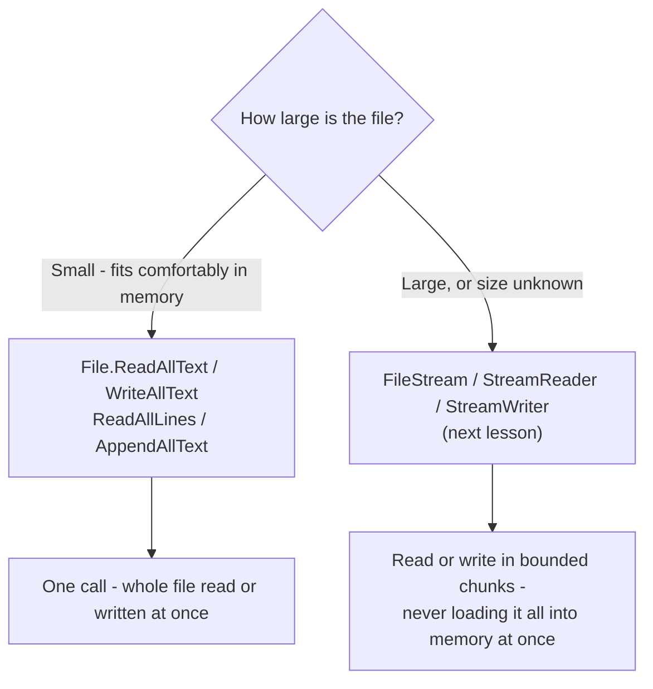
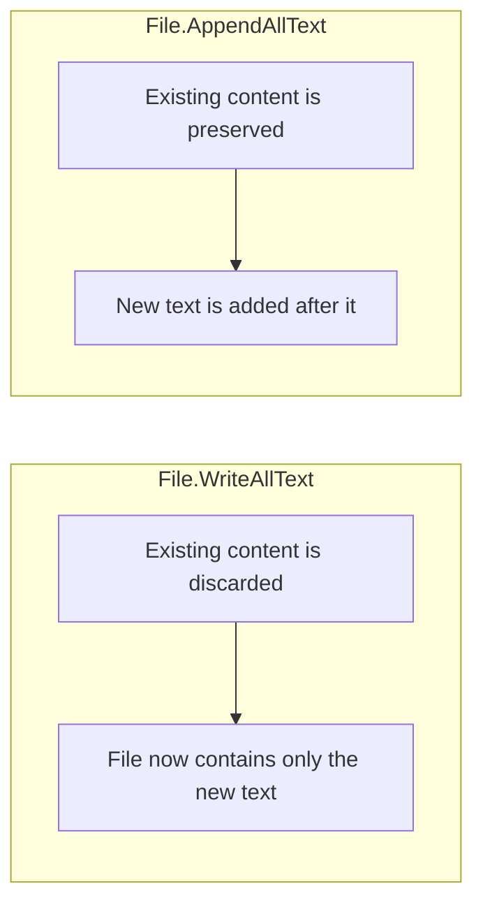

# Reading and Writing Files

## Introduction

Before reading this lesson, you should already be comfortable with **[Introduction to File I/O in .NET](../09-file-io-serialization/09-01-introduction-to-file-io.md)** — specifically, the idea that files are a shared, slower, failure-prone resource, and that `System.IO` gives you layered tools for dealing with them. This lesson starts at the simplest layer of all: the whole-file convenience methods on the static `File` class, which let you read or write an entire file's contents in a single call, with no manual stream management required.

By the end of this lesson, you will be able to:

- Read an entire file's contents with `File.ReadAllText` and `File.ReadAllLines`
- Write and overwrite a file's contents with `File.WriteAllText`
- Append to an existing file without overwriting it using `File.AppendAllText`
- Explain why these methods load the entire file into memory before returning
- Recognize when a file is small enough for these methods to be the right tool, and when it isn't

## Reading and Writing Files — A Layman's Perspective

Think about the difference between reading a short memo and reading an entire encyclopedia. When someone hands you a one-page memo, you don't ask them to read it to you one sentence at a time while you wait — you just take the whole page, read it all at once, and you're done. Asking for it "a little at a time" would be pure overhead for something that short; the whole point of a memo is that it's small enough to just take in one motion.

An encyclopedia is a different kind of object entirely. Nobody hands you the entire encyclopedia and says "just hold all of this in your head at once" — that's not how anyone actually uses one. You open it to the page you need, read that page, and set the rest down, because trying to hold the whole thing in your head simultaneously would be absurd and unnecessary for the task of looking up one entry.

`File.ReadAllText` and its companions are the "memo" approach: hand me the whole thing, all at once, and I'll deal with it as one complete piece. That's exactly the right instinct for a short configuration file, a small log, or a receipt — anything genuinely memo-sized. The trouble starts when someone uses the memo approach on the encyclopedia: asking `File.ReadAllText` to read a ten-gigabyte file means asking your program to hold that entire ten gigabytes in memory at once before it can do anything with even the first page of it. It will often still "work," in the sense that it eventually returns a very large string — but it will be slow, wasteful, and in the worst case, it will run your program out of memory entirely, for a job that never actually needed the whole encyclopedia in your head at once. That's the boundary this lesson lives right up against: convenience methods are the right call for memo-sized files, and the next lesson introduces the tool built for the encyclopedia case.

## Reading and Writing Files — A Programming Language Perspective

The static `File` class exposes whole-file convenience methods that open a file, perform the entire read or write, and close the file again, all within a single call. `File.ReadAllText(path)` returns the complete contents of a text file as one `string`. `File.ReadAllLines(path)` returns the same contents split into a `string[]`, one element per line, which is convenient for line-oriented data but still requires the whole file to be read up front to produce that array. `File.WriteAllText(path, contents)` creates the file if it doesn't exist and **overwrites** it entirely if it does — there is no partial-write behavior. `File.AppendAllText(path, contents)` instead opens the file, seeks to its end, writes the new content, and closes it, leaving whatever was already there untouched. Each of these methods fully allocates its result (or its input) in memory as a single `string` or `string[]`; none of them offers a way to process a file incrementally, which is precisely the gap `Stream`-based APIs fill.

## How to Read and Write Files with the File Class

Each of these four methods does exactly one thing, does it in a single call, and manages opening and closing the file internally — you never work with a raw handle at this level.


*Figure 1: The `File` convenience methods are the right call for small, whole files; larger files need the streaming approach covered next.*

```csharp
// Program.cs — .NET 10 / C# 14
string tempDir = Path.Combine(Path.GetTempPath(), "dotnet-read-write-demo");
Directory.CreateDirectory(tempDir);
string notesPath = Path.Combine(tempDir, "notes.txt");

File.WriteAllText(notesPath, "Line one.\n");
File.AppendAllText(notesPath, "Line two.\n");
File.AppendAllText(notesPath, "Line three.\n");

string wholeFile = File.ReadAllText(notesPath);
Console.WriteLine($"Whole file length: {wholeFile.Length} characters");

string[] allLines = File.ReadAllLines(notesPath);
Console.WriteLine($"Line count: {allLines.Length}");
foreach (string line in allLines)
{
    Console.WriteLine($"  {line}");
}

// Clean up so the demo leaves no trace on disk.
File.Delete(notesPath);
Directory.Delete(tempDir);
```

**Console Output:**

```text
Whole file length: 32 characters
Line count: 3
  Line one.
  Line two.
  Line three.
```

`File.WriteAllText` creates `notes.txt` and writes the first line, overwriting anything that might already have existed at that path. Each `File.AppendAllText` call then adds one more line without disturbing what came before. `File.ReadAllText` hands back the entire 32-character file as a single `string` in one call, while `File.ReadAllLines` re-reads the same file and splits it into three separate lines — both calls open, read, and close the file completely on their own, with no stream object ever appearing in this code.

## Real-Time Example: Order Receipts and Audit Logging in E-Commerce Order Processing

We begin the E-Commerce Order Processing domain here with a small `Order` record and two file-writing responsibilities a real checkout service has: producing a customer-facing receipt, and appending every completed order to a durable audit log that must never lose a previous entry when a new order comes in.

```csharp
// Program.cs — .NET 10 / C# 14 — Real-Time Example
using System.Globalization;

string ordersDir = Path.Combine(Path.GetTempPath(), "ecommerce-orders-demo");
Directory.CreateDirectory(ordersDir);
string receiptPath = Path.Combine(ordersDir, "receipt-1001.txt");
string auditLogPath = Path.Combine(ordersDir, "order-audit.log");

Order first = new("ORD-1001", "Priya Sharma", 249.98m);
Order second = new("ORD-1002", "Arjun Mehta", 89.50m);

WriteReceipt(receiptPath, first);
AppendToAuditLog(auditLogPath, first);
AppendToAuditLog(auditLogPath, second);

Console.WriteLine("--- Receipt contents ---");
Console.WriteLine(File.ReadAllText(receiptPath));

Console.WriteLine("--- Audit log after two orders ---");
foreach (string line in File.ReadAllLines(auditLogPath))
{
    Console.WriteLine(line);
}

AppendToAuditLog(auditLogPath, new Order("ORD-1003", "Neha Iyer", 15.00m));

Console.WriteLine("--- Audit log after a third order ---");
foreach (string line in File.ReadAllLines(auditLogPath))
{
    Console.WriteLine(line);
}

// Clean up so the demo leaves no trace on disk.
File.Delete(receiptPath);
File.Delete(auditLogPath);
Directory.Delete(ordersDir);

static void WriteReceipt(string path, Order order)
{
    string receipt = $"""
        Order Receipt
        Order ID: {order.OrderId}
        Customer: {order.CustomerName}
        Total: ${order.TotalAmount.ToString("F2", CultureInfo.InvariantCulture)}
        """;
    File.WriteAllText(path, receipt);
}

static void AppendToAuditLog(string path, Order order)
{
    string amount = order.TotalAmount.ToString("F2", CultureInfo.InvariantCulture);
    File.AppendAllText(path, $"{order.OrderId},{order.CustomerName},{amount}\n");
}

record Order(string OrderId, string CustomerName, decimal TotalAmount);
```

**Console Output:**

```text
--- Receipt contents ---
Order Receipt
Order ID: ORD-1001
Customer: Priya Sharma
Total: $249.98
--- Audit log after two orders ---
ORD-1001,Priya Sharma,249.98
ORD-1002,Arjun Mehta,89.50
--- Audit log after a third order ---
ORD-1001,Priya Sharma,249.98
ORD-1002,Arjun Mehta,89.50
ORD-1003,Neha Iyer,15.00
```

`WriteReceipt` uses `File.WriteAllText`, which is correct here because a receipt is meant to be replaced wholesale each time it's generated — there is exactly one current version. `AppendToAuditLog`, by contrast, uses `File.AppendAllText` specifically because an audit log's entire value is that earlier entries are never lost; overwriting it with each new order would silently destroy the audit trail a real e-commerce platform is legally and operationally required to keep. Choosing between "replace the whole file" and "add to what's there" is a decision every file-writing feature has to make deliberately.

## File.WriteAllText vs File.AppendAllText

Both methods take a path and a string and both return `void`, but they resolve an existing file in opposite ways. `WriteAllText` establishes the file's *entire* content as of this call, discarding whatever was there before — the right choice for anything that represents a current snapshot, like a receipt or a generated report. `AppendAllText` instead preserves history, adding only what's new — the right choice for logs, audit trails, or any file meant to grow monotonically over the life of an application.


*Figure 2: `WriteAllText` replaces a file's entire contents; `AppendAllText` preserves what was already there.*

| Aspect | `File.WriteAllText` | `File.AppendAllText` |
|---|---|---|
| Effect on existing content | Overwritten entirely | Preserved; new content added after it |
| Typical use case | Snapshots, receipts, generated reports | Logs, audit trails, event histories |
| File created if missing | Yes | Yes |
| Memory behavior | Entire new content held as one string before writing | Entire new content held as one string before appending |
| Safe for very large files | Only if the content is small enough to hold in memory | Only if the content is small enough to hold in memory |

## Types of Whole-File Access in .NET

The `File` class offers several whole-file methods beyond the four used above, each covered as this curriculum goes deeper into file handling:

1. **[Working with Streams](../09-file-io-serialization/09-03-working-with-streams.md)** — the chunked alternative for files too large to read or write all at once.
2. **[Synchronous vs Asynchronous File I/O](../09-file-io-serialization/09-04-sync-vs-async-file-io.md)** — `File.ReadAllTextAsync` and friends, for not blocking a thread while waiting on disk.
3. **[System.Text.Json in Depth](../09-file-io-serialization/09-05-system-text-json-in-depth.md)** — combining `File.ReadAllText`/`WriteAllText` with structured serialization instead of hand-built strings.
4. **[XML Serialization](../09-file-io-serialization/09-06-xml-serialization.md)** — the same whole-file read/write pattern applied to XML documents.
5. **`File.ReadAllBytes` / `File.WriteAllBytes`** — the binary counterparts to the text methods shown here, useful for images, archives, and other non-text formats.

## What You've Learned & What's Next

`File.ReadAllText`, `WriteAllText`, `ReadAllLines`, and `AppendAllText` cover a large share of everyday file handling in a single call each, and they're the right tool whenever a file is small enough to comfortably fit in memory as one string or array. Their shared limitation is exactly that: every one of them requires the entire file's contents to exist in memory, either before the call returns or before it can write, which stops being acceptable once a file grows large.

Continue your learning journey with **[Working with Streams](../09-file-io-serialization/09-03-working-with-streams.md)**, where we introduce `FileStream`, `StreamReader`, and `StreamWriter` — the abstraction that lets you process a file in bounded chunks instead of loading it all at once.

---
*Applies to: .NET 10 / C# 14. Last reviewed 2026-08-16.*
