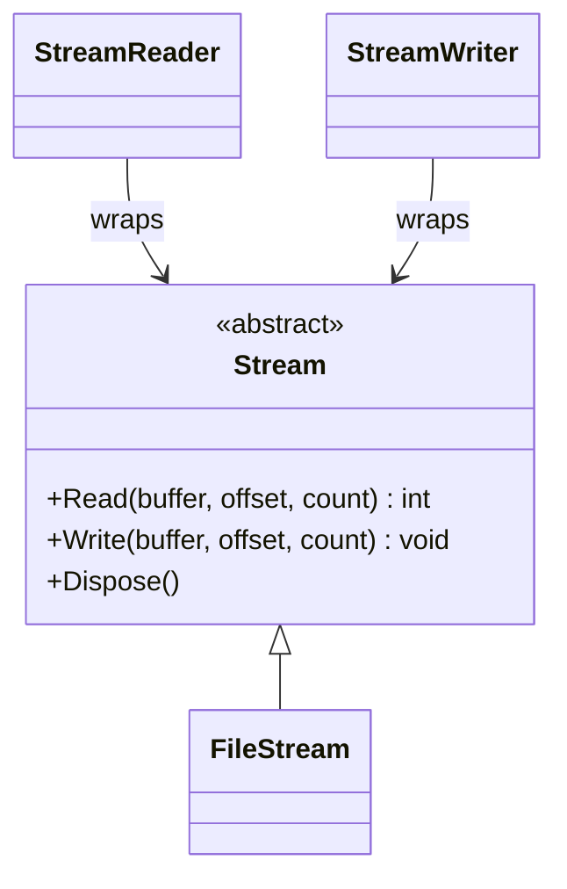
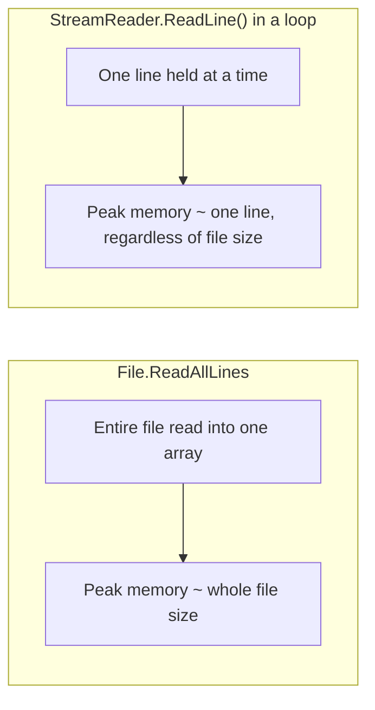

# Working with Streams

## Introduction

Before reading this lesson, you should already be comfortable with **[Reading and Writing Files](../09-file-io-serialization/09-02-reading-and-writing-files.md)** — specifically, the fact that `File.ReadAllText`, `WriteAllText`, `ReadAllLines`, and `AppendAllText` all require a file's entire contents to exist in memory at once, either before they return or before they write. This lesson introduces the abstraction those methods are themselves built on top of: the `Stream`, and its text-oriented wrappers `StreamReader` and `StreamWriter`, which let you process a file in small, bounded pieces instead.

By the end of this lesson, you will be able to:

- Explain what a `Stream` represents and how `FileStream` implements it for files on disk
- Read a file's raw bytes in fixed-size chunks using `FileStream.Read`
- Read a file line by line using `StreamReader.ReadLine` without loading the whole file at once
- Write text incrementally using `StreamWriter`
- Explain why every `Stream` must be disposed, and use `using` to guarantee it

## Working with Streams — A Layman's Perspective

Picture the difference between being handed an entire book all at once versus reading it through a mail slot, one page at a time, as someone slides pages through from the other side. When you're handed the whole book, you have everything simultaneously — that's convenient, but only if the book is short enough that holding the entire thing at once isn't a burden. When pages come through a mail slot one at a time, you never have more than a page or two in your hands at any moment, no matter how long the book actually is. A thousand-page book and a ten-page pamphlet cost you exactly the same amount of "holding" at any given instant, because you're only ever dealing with what's currently coming through the slot.

A `Stream` is that mail slot. It doesn't hand you an entire file's worth of data at once — it gives you a controlled, sequential trickle, and it's entirely up to you how much of that trickle you ask for and hold onto at any one time. A `FileStream` is the mail slot connected specifically to a file on disk: you ask it for the next chunk of raw bytes, it hands you exactly that many, and you ask again when you're ready for more. A `StreamReader` sits just behind that slot doing one extra job: turning the raw bytes coming through into readable text, one line at a time if you ask it to, so you never have to think about the encoding yourself.

There's one more detail this analogy captures well: a mail slot is a physical mechanism, and physical mechanisms need to be closed properly when you're done with them, or they jam the process for the next person. A `Stream` holds onto real, limited resources behind the scenes — an open file handle, a chunk of buffer memory, sometimes a lock the operating system is honoring on your behalf — and none of that gets released automatically just because your code moved on to the next line. Leaving a `Stream` open when you're finished with it is like walking away from the mail slot while it's still propped open: nobody else can use it properly until someone comes back and closes it. That's exactly why disposing a `Stream` — via `using`, so it happens automatically and reliably even if something goes wrong partway through — isn't an optional courtesy. It's the only way the mail slot ever actually closes.

## Working with Streams — A Programming Language Perspective

`System.IO.Stream` is the abstract base class representing a sequential source or destination of bytes, exposing `Read`, `Write`, `Seek`, and `Flush` members that every concrete stream type implements. `FileStream` is the concrete `Stream` backed by a file on disk, reading or writing raw bytes through an operating-system file handle. `StreamReader` and `StreamWriter` wrap any underlying `Stream` — most commonly a `FileStream` — and add character decoding and encoding on top of it, so callers work with `string` and `char` data rather than raw `byte[]` buffers. All three types implement `IDisposable`, because each one holds an unmanaged resource — an open file handle and its associated OS-level buffers — that the garbage collector cannot reclaim on its own timeline the way it reclaims ordinary managed memory. Wrapping any of them in a `using` statement or `using` declaration guarantees `Dispose()` runs, closing the underlying handle, even if an exception is thrown while the stream is in use.

## How to Read a File in Chunks with FileStream

Reading a file through a `FileStream` means repeatedly calling `Read` into a fixed-size buffer until it reports zero bytes read, at which point the file is exhausted — at no point does the full file exist in memory as a single block.


*Figure 1: `FileStream` is a concrete `Stream`; `StreamReader`/`StreamWriter` wrap a `Stream` to add text encoding and decoding.*

```csharp
// Program.cs — .NET 10 / C# 14
string tempDir = Path.Combine(Path.GetTempPath(), "dotnet-streams-demo");
Directory.CreateDirectory(tempDir);
string filePath = Path.Combine(tempDir, "data.txt");

using (StreamWriter writer = new(filePath) { NewLine = "\n" })
{
    for (int i = 1; i <= 100; i++)
    {
        writer.WriteLine($"Record {i}");
    }
}

long totalBytesRead = 0;
int chunksRead = 0;
byte[] buffer = new byte[256];

using (FileStream stream = new(filePath, FileMode.Open, FileAccess.Read))
{
    int bytesRead;
    while ((bytesRead = stream.Read(buffer, 0, buffer.Length)) > 0)
    {
        totalBytesRead += bytesRead;
        chunksRead++;
    }
}

Console.WriteLine($"File size: {new FileInfo(filePath).Length} bytes");
Console.WriteLine($"Total bytes read: {totalBytesRead}");
Console.WriteLine($"Chunks read (256-byte buffer): {chunksRead}");

// Clean up so the demo leaves no trace on disk.
File.Delete(filePath);
Directory.Delete(tempDir);
```

**Console Output:**

```text
File size: 992 bytes
Total bytes read: 992
Chunks read (256-byte buffer): 4
```

At no point in the reading loop does the code hold more than 256 bytes at once — the `while` loop keeps asking `stream.Read` for the next chunk, and a 992-byte file takes exactly four calls to exhaust (three full 256-byte chunks and one 224-byte remainder). Both `using` blocks matter here: the writer's `using` ensures every buffered line is actually flushed to disk before the reader ever opens the file, and the reader's `using` guarantees the `FileStream`'s handle is released the moment the loop finishes, even if `Read` had thrown partway through.

## Real-Time Example: Streaming an Order Export in E-Commerce Order Processing

We continue the E-Commerce Order Processing domain, simulating a nightly export job that writes 500 order lines to a CSV file, and a downstream reconciliation job that reads it back **line by line** with `StreamReader` — never loading all 500 rows into memory as an array the way `File.ReadAllLines` would.

```csharp
// Program.cs — .NET 10 / C# 14 — Real-Time Example
using System.Globalization;

string exportDir = Path.Combine(Path.GetTempPath(), "ecommerce-export-demo");
Directory.CreateDirectory(exportDir);
string exportPath = Path.Combine(exportDir, "order-export.csv");

// Simulate an export job writing many order lines without holding them all in memory.
using (StreamWriter writer = new(exportPath) { NewLine = "\n" })
{
    writer.WriteLine("OrderId,ProductName,Quantity,UnitPrice");
    for (int i = 1; i <= 500; i++)
    {
        writer.WriteLine($"ORD-{1000 + i},Widget-{i % 10},{(i % 5) + 1},9.99");
    }
}

Console.WriteLine($"Export file size: {new FileInfo(exportPath).Length} bytes");

int lineCount = 0;
decimal totalRevenue = 0m;

using (StreamReader reader = new(exportPath))
{
    _ = reader.ReadLine(); // skip the header row
    string? line;
    while ((line = reader.ReadLine()) is not null)
    {
        lineCount++;
        string[] fields = line.Split(',');
        int quantity = int.Parse(fields[2], CultureInfo.InvariantCulture);
        decimal unitPrice = decimal.Parse(fields[3], CultureInfo.InvariantCulture);
        totalRevenue += quantity * unitPrice;
    }
}

Console.WriteLine($"Order lines processed: {lineCount}");
Console.WriteLine($"Total revenue: ${totalRevenue.ToString("F2", CultureInfo.InvariantCulture)}");

// Clean up so the demo leaves no trace on disk.
File.Delete(exportPath);
Directory.Delete(exportDir);
```

**Console Output:**

```text
Export file size: 12539 bytes
Order lines processed: 500
Total revenue: $14985.00
```

The reconciliation loop only ever holds one line's worth of data — a single `string` and the handful of parsed values derived from it — no matter whether the export has 500 rows or five million. That's the entire point of reaching for `StreamReader` instead of `File.ReadAllLines` here: a real nightly export job's row count grows every quarter as the business grows, and code written against a stream keeps working unmodified at ten times the volume, while code that loaded the whole file into an array would eventually exhaust available memory purely from the size of that one array.

## File.ReadAllLines vs StreamReader.ReadLine

`File.ReadAllLines` and a `StreamReader` loop can produce the same logical result — every line of a file, processed in order — but they differ enormously in how much memory that processing costs at any single moment, and in how explicit the caller has to be about resource cleanup.


*Figure 2: `File.ReadAllLines` peaks at the size of the whole file; a `StreamReader` loop peaks at the size of a single line.*

| Aspect | `File.ReadAllLines` | `StreamReader.ReadLine()` loop |
|---|---|---|
| Peak memory usage | Proportional to the entire file | Proportional to a single line/buffer |
| Code required | One call | An explicit loop plus a `using` block |
| Disposal | Handled internally | Must be wrapped in `using` by the caller |
| Access pattern | Random access to any line once loaded | Strictly forward-only, one line at a time |
| Best for | Small, bounded files | Large files, or files whose size isn't known in advance |

## Types of Stream-Based I/O in .NET

`Stream` and its wrappers show up throughout the rest of this module and beyond, each covered in more depth in its own lesson:

1. **[Reading and Writing Files](../09-file-io-serialization/09-02-reading-and-writing-files.md)** — the whole-file convenience alternative, appropriate when a file is small enough to hold entirely in memory.
2. **[Synchronous vs Asynchronous File I/O](../09-file-io-serialization/09-04-sync-vs-async-file-io.md)** — `StreamReader.ReadLineAsync` and `FileStream.ReadAsync`, so waiting on disk doesn't block a thread.
3. **[System.Text.Json in Depth](../09-file-io-serialization/09-05-system-text-json-in-depth.md)** — `JsonSerializer` can read from and write directly to a `Stream`, skipping an intermediate `string` entirely.
4. **[XML Serialization](../09-file-io-serialization/09-06-xml-serialization.md)** — `XmlSerializer` follows the same Stream-based read/write pattern.
5. **[`IDisposable` and the `using` Statement](../08-memory-management/08-04-idisposable-and-using-statement.md)** — the disposal contract every `Stream`, `StreamReader`, and `StreamWriter` implements.

## What You've Learned & What's Next

A `Stream` trades the simplicity of "one call, whole file" for the ability to process a file of any size in small, bounded pieces — `FileStream` for raw bytes, `StreamReader`/`StreamWriter` for text — and every one of them holds a real, unmanaged resource that only `using` reliably releases. That combination, bounded memory use plus deterministic disposal, is what makes streams the right choice the moment a file is too large, or too unpredictable in size, for the convenience methods from the previous lesson.

Continue your learning journey with **[Synchronous vs Asynchronous File I/O](../09-file-io-serialization/09-04-sync-vs-async-file-io.md)**, where the same `Stream` types gain `async` counterparts, and waiting on a slow disk stops meaning a blocked thread.

---
*Applies to: .NET 10 / C# 14. Last reviewed 2026-08-16.*
