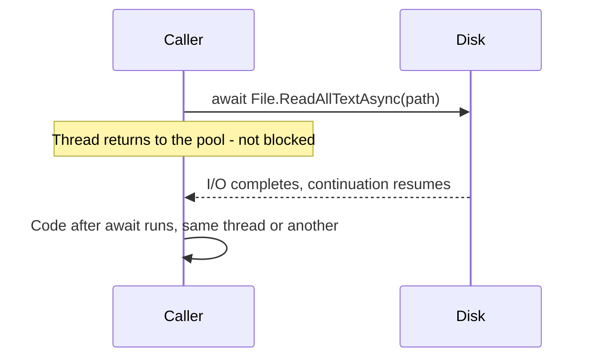
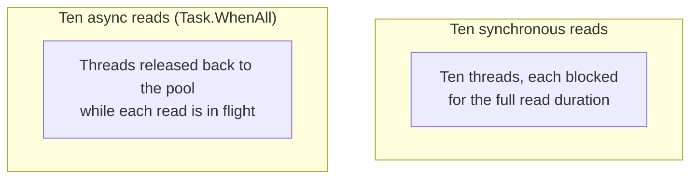

# Synchronous vs Asynchronous File I/O

## Introduction

Before reading this lesson, you should already be comfortable with **[Working with Streams](../09-file-io-serialization/09-03-working-with-streams.md)** — `Stream`, `FileStream`, `StreamReader`, and `StreamWriter`, and the discipline of disposing them with `using`. Every example so far in this module has called those APIs **synchronously**: the calling thread issues the read or write and simply sits idle until it completes. This lesson introduces their `async` counterparts, and revisits Module 07's central lesson — that `async`/`await` exists for exactly this kind of work — now applied specifically to files.

By the end of this lesson, you will be able to:

- Use `File.ReadAllTextAsync`, `File.WriteAllTextAsync`, and `StreamReader.ReadLineAsync` in place of their synchronous equivalents
- Explain why file I/O is a genuinely strong fit for `async`/`await`, rather than a case where it merely doesn't hurt
- Read multiple files concurrently using `Task.WhenAll`
- Recognize the **sync-over-async** anti-pattern (blocking on a file `Task` with `.Result` or `.Wait()`) and why it's dangerous
- Recognize the **async-over-sync** anti-pattern (wrapping a synchronous file call in `Task.Run` for no real benefit)

## Synchronous vs Asynchronous File I/O — A Layman's Perspective

Picture ordering food at two very different kinds of counters. At the first counter, you place your order and then stand there, at the counter, doing absolutely nothing else, until your food is ready — you cannot step away, cannot help another customer, cannot do anything at all, because your entire body is committed to occupying that spot until the kitchen finishes. If ten people order this way, you need ten people permanently planted at ten counters, each one frozen in place, even though every single one of them is just *waiting* and doing no actual work themselves.

At the second counter, you place your order, take a buzzer, and go sit down. While the kitchen is doing the actual cooking — the part that takes real time — you are completely free: you can chat, check your phone, help someone else find a table, anything at all. The buzzer goes off, and *then* you go back to collect your food and pick up exactly where you left off. Ten people ordering this way don't need ten people frozen in place; the same handful of staff can serve all ten, because nobody is dedicating their entire presence to standing motionless while food they have zero influence over finishes cooking.

That distinction is exactly what separates synchronous from asynchronous file I/O. When your code calls `File.ReadAllText`, the calling thread is the customer frozen at the counter — it can do nothing else until the operating system's disk read finishes, even though the thread itself has no actual work to contribute to that wait; it is purely idle, purely blocked. When your code calls `File.ReadAllTextAsync` and `await`s it, the thread is the customer with the buzzer: it returns to the thread pool the moment the read is issued, free to do other work for any other request, and only resumes running your code once the disk read has actually completed. A disk operation is, almost definitionally, a stretch of time where nothing CPU-bound is happening at all — the processor is simply waiting on a piece of hardware — which is precisely the situation `async`/`await` was built to stop wasting a thread on.

## Synchronous vs Asynchronous File I/O — A Programming Language Perspective

Nearly every synchronous method on `File`, `FileStream`, `StreamReader`, and `StreamWriter` has an `Async`-suffixed counterpart — `File.ReadAllTextAsync`, `File.WriteAllTextAsync`, `FileStream.ReadAsync`, `StreamReader.ReadLineAsync`, and so on — each returning a `Task` or `Task<T>` that completes once the underlying operating-system I/O operation finishes. File access is what Module 07 called **I/O-bound** work: the calling thread contributes no computation while waiting, it is purely blocked on hardware and the OS scheduler, which makes it one of the strongest possible cases for `async`/`await` — stronger, in fact, than most CPU-adjacent scenarios, precisely because there is truly nothing useful the blocked thread could otherwise be doing. Multiple independent async file operations can also be run concurrently with `Task.WhenAll`, letting several files load in parallel without hand-managing multiple threads.

## How to Read and Write Files Asynchronously

Every asynchronous file method mirrors its synchronous counterpart in behavior and return value — only the signature and the need for `await` change.


*Figure 1: The calling thread is freed while the disk read is in flight, and only resumes once the read completes.*

```csharp
// Program.cs — .NET 10 / C# 14
string tempDir = Path.Combine(Path.GetTempPath(), "dotnet-async-io-demo");
Directory.CreateDirectory(tempDir);
string filePath = Path.Combine(tempDir, "async-notes.txt");

await File.WriteAllTextAsync(filePath, "Line one.\nLine two.\nLine three.\n");

string contents = await File.ReadAllTextAsync(filePath);
Console.WriteLine($"Read {contents.Length} characters asynchronously.");

int lineCount = 0;
using (StreamReader reader = new(filePath))
{
    while (await reader.ReadLineAsync() is not null)
    {
        lineCount++;
    }
}
Console.WriteLine($"Line count (async streaming): {lineCount}");

// Clean up so the demo leaves no trace on disk.
File.Delete(filePath);
Directory.Delete(tempDir);
```

**Console Output:**

```text
Read 32 characters asynchronously.
Line count (async streaming): 3
```

Every operation here — the write, the whole-file read, and the line-by-line streaming read — uses its `Async` counterpart, and every one is `await`ed rather than blocked on. The calling thread is never forced to sit idle waiting on the disk; it's released back to the thread pool for the duration of each I/O operation and simply resumes this method once each one completes, in program order, exactly as the synchronous version would have — just without holding a thread hostage to do it.

## Real-Time Example: Reading Regional Order Logs Concurrently in E-Commerce Order Processing

We continue the E-Commerce Order Processing domain with three regional order logs — US, EU, and APAC — each recording completed order totals for its region. A nightly reconciliation job needs the combined total across all three, and since reading one region's log has no bearing on reading another's, all three reads run **concurrently** with `Task.WhenAll` instead of one after another.

```csharp
// Program.cs — .NET 10 / C# 14 — Real-Time Example
using System.Globalization;

string logsDir = Path.Combine(Path.GetTempPath(), "ecommerce-regional-logs-demo");
Directory.CreateDirectory(logsDir);

string[] regions = ["us", "eu", "apac"];
string[] logPaths = regions.Select(r => Path.Combine(logsDir, $"orders-{r}.log")).ToArray();

// Seed each regional log with a few completed order totals.
await File.WriteAllTextAsync(logPaths[0], "120.00\n45.50\n300.00\n");
await File.WriteAllTextAsync(logPaths[1], "89.99\n15.00\n");
await File.WriteAllTextAsync(logPaths[2], "500.00\n250.25\n75.00\n10.00\n");

Task<string>[] readTasks = logPaths.Select(File.ReadAllTextAsync).ToArray();
string[] contents = await Task.WhenAll(readTasks);

decimal grandTotal = 0m;
for (int i = 0; i < regions.Length; i++)
{
    string[] amounts = contents[i].Split('\n', StringSplitOptions.RemoveEmptyEntries);
    decimal regionTotal = amounts.Sum(a => decimal.Parse(a, CultureInfo.InvariantCulture));
    grandTotal += regionTotal;
    string label = regions[i].ToUpperInvariant();
    Console.WriteLine($"Region {label}: {amounts.Length} orders, ${regionTotal.ToString("F2", CultureInfo.InvariantCulture)}");
}

Console.WriteLine($"Grand total across all regions: ${grandTotal.ToString("F2", CultureInfo.InvariantCulture)}");

// Clean up so the demo leaves no trace on disk.
foreach (string path in logPaths)
{
    File.Delete(path);
}
Directory.Delete(logsDir);
```

**Console Output:**

```text
Region US: 3 orders, $465.50
Region EU: 2 orders, $104.99
Region APAC: 4 orders, $835.25
Grand total across all regions: $1405.74
```

`Task.WhenAll` starts all three `File.ReadAllTextAsync` calls before waiting on any of them, so the three regional disk reads overlap in time rather than running one after another — the reconciliation job's total wall-clock time is closer to the slowest single read than to the sum of all three. Indexing into `contents` by the original array position, rather than by completion order, keeps the output deterministic regardless of which region's file happens to finish reading first — a detail that matters the moment this kind of concurrent read runs against real, variable-latency storage.

## Synchronous vs Asynchronous File I/O

The two anti-patterns worth naming explicitly both defeat the purpose of choosing async in the first place. **Sync-over-async** means blocking on an async file operation's `Task` with `.Result` or `.Wait()` instead of `await`ing it — for example, `File.ReadAllTextAsync(path).Result`. This still ties up a thread for the entire duration of the read, exactly like the synchronous method would, except now with the added risk of a deadlock in any context with a synchronization context (classic ASP.NET, WPF, WinForms) where the continuation needs a thread the blocked caller is itself occupying. **Async-over-sync** goes the other direction: wrapping a synchronous file call in `Task.Run(() => File.ReadAllText(path))` to make it "look async." This does free the *calling* thread, but only by consuming a *different* thread-pool thread to sit and block on the synchronous call instead — no thread is actually saved, and a real async file method that never blocks any thread in the first place is strictly better.


*Figure 2: Ten synchronous file reads occupy ten threads for their full duration; ten async reads free the pool while the disk does the work.*

| Aspect | Synchronous File I/O | Asynchronous File I/O |
|---|---|---|
| Calling thread while waiting | Blocked for the full I/O duration | Released back to the thread pool |
| Best fit | Simple scripts, startup-time reads | Servers, UIs, anything handling concurrent requests |
| Common anti-pattern | N/A (this *is* the baseline) | Sync-over-async (`.Result`/`.Wait()`) reintroduces blocking |
| Related anti-pattern | Async-over-sync (`Task.Run` around a sync call) wastes a thread instead of saving one | N/A (this *is* the baseline) |
| Concurrency | One file at a time unless multiple threads are spun up manually | `Task.WhenAll` overlaps multiple reads on the existing thread pool |

## Types of Async File I/O to Explore Further

The async patterns in this lesson lean directly on concepts Module 07 covers in depth:

1. **[Introduction to Async Programming](../07-concurrency-parallel-async/07-10-introduction-to-async-programming.md)** — the foundational model `async`/`await` is built on.
2. **[Async/Await Fundamentals](../07-concurrency-parallel-async/07-12-async-await-fundamentals.md)** — the mechanics of `await` and the state machine the compiler generates.
3. **[Composing Tasks: WhenAll/WhenAny](../07-concurrency-parallel-async/07-13-composing-tasks-whenall-whenany.md)** — the general pattern behind this lesson's concurrent regional log reads.
4. **[ConfigureAwait and SyncContext](../07-concurrency-parallel-async/07-15-configureawait-and-synccontext.md)** — why sync-over-async can deadlock in UI and classic ASP.NET contexts specifically.
5. **[CancellationToken and IProgress](../07-concurrency-parallel-async/07-16-cancellationtoken-and-iprogress.md)** — cancelling a long-running file operation cleanly instead of letting it run to completion regardless.

## What You've Learned & What's Next

File I/O is about as clean a case for `async`/`await` as .NET offers: the calling thread has nothing useful to contribute while a disk operation is in flight, so releasing it back to the pool is pure upside, and `Task.WhenAll` lets independent file operations overlap instead of queuing behind one another. The two anti-patterns to keep watching for are sync-over-async, which reintroduces the exact blocking async was meant to remove, and async-over-sync, which frees one thread only by consuming another.

Continue your learning journey with **[System.Text.Json in Depth](../09-file-io-serialization/09-05-system-text-json-in-depth.md)**, where these same synchronous and asynchronous file APIs meet structured data — serializing and deserializing real objects instead of hand-built strings.

---
*Applies to: .NET 10 / C# 14. Last reviewed 2026-08-16.*
