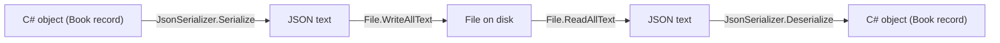
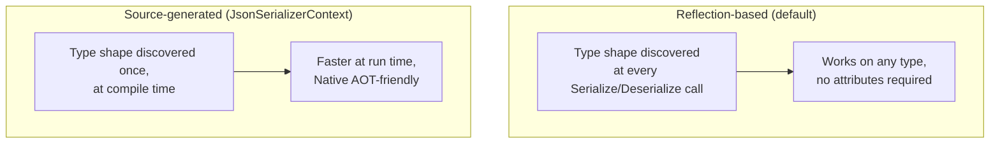

# System.Text.Json in Depth

## Introduction

Before reading this lesson, you should already be comfortable with **[Synchronous vs Asynchronous File I/O](../09-file-io-serialization/09-04-sync-vs-async-file-io.md)** and, more generally, with reading and writing plain text through `File` and `Stream`. Every file this module has written so far has held hand-built strings — a receipt template, a CSV line, a raw number. This lesson introduces `System.Text.Json`, the tool that turns real C# objects into structured, standardized text and back again, so files can hold data your program actually understands as objects rather than strings it has to re-parse by hand.

By the end of this lesson, you will be able to:

- Serialize an object to a JSON string with `JsonSerializer.Serialize` and deserialize it back with `JsonSerializer.Deserialize`
- Configure output formatting with `JsonSerializerOptions`, including indentation and property naming policy
- Explain why System.Text.Json, not Newtonsoft.Json, is .NET's built-in default JSON library
- Generate serialization code at compile time with `[JsonSerializable]` and a `JsonSerializerContext`
- Explain why source-generated serialization is faster and Native AOT-friendly compared to the default reflection-based approach

## System.Text.Json — A Layman's Perspective

Imagine you keep detailed personal notes in a shorthand only you understand — abbreviations, private symbols, notes scrawled in the margins that make perfect sense to you and to absolutely nobody else. That shorthand is exactly how an object lives in your program's memory: perfectly usable internally, but meaningless to any other system that doesn't share your program's exact internal layout. The moment you need to hand those notes to someone else — a different department, a different company, a system written in a completely different language — your private shorthand is worse than useless. You need to translate it into something universally readable: full sentences, standard formatting, no private abbreviations.

JSON is that universal, standard formatting. It's a plain-text way of writing down "this thing has a name, and the name is this value; this other thing has a quantity, and the quantity is this number" that virtually every programming language and platform on earth can read and write. `System.Text.Json` is the translator that converts your program's private shorthand — its C# objects — into that universal format, and back again on the way in.

Now consider two very different translators doing that job. The first is a skilled generalist who, handed any document at all, reads it carefully from scratch every single time, figures out its structure on the fly, and produces the translation — reliable, but a bit of setup work on every single document, even ones they've translated a hundred times before. The second translator, when told in advance "you'll be translating this exact kind of document, over and over, forever," goes away once, builds a dedicated, purpose-built translation template specifically for that document shape, and from then on just runs documents through that template — faster, and with no per-document figuring-out required, because all the figuring-out already happened once, up front.

The generalist translator is System.Text.Json's default behavior: it uses **reflection** to inspect your object's shape at runtime, every time it serializes or deserializes, figuring out the properties fresh each time it's asked. The specialist with the pre-built template is System.Text.Json's **source-generated** mode: at compile time — before your program has even run once — it generates dedicated, purpose-built translation code for your exact types, so there's no runtime figuring-out left to do at all. Both translators produce the same correct JSON. One of them just does the hard work once, in advance, instead of every single time.

## System.Text.Json — A Programming Language Perspective

`System.Text.Json` is .NET's built-in JSON library, exposed primarily through the static `JsonSerializer` class: `JsonSerializer.Serialize<T>(value)` converts an object to a JSON `string`, and `JsonSerializer.Deserialize<T>(json)` converts a JSON `string` back into an object of type `T`. `JsonSerializerOptions` configures that conversion — `WriteIndented` controls pretty-printing, and `PropertyNamingPolicy` (for example, `JsonNamingPolicy.CamelCase`) controls how .NET property names map onto JSON property names. By default, both directions rely on **reflection** to discover a type's properties and constructors at runtime. Starting with .NET 6, a **source generator** offers an alternative: a `partial class` deriving from `JsonSerializerContext`, decorated with `[JsonSerializable(typeof(T))]`, causes the compiler itself to emit dedicated serialization code for `T` at build time, with zero runtime reflection involved. `System.Text.Json` became .NET's default JSON library — displacing the long-dominant third-party Newtonsoft.Json — starting with .NET Core 3.0, built from the ground up around `Span<T>` and UTF-8 processing for lower allocations and higher throughput, and shipped in the shared framework rather than as an external dependency every project had to add itself.

## How to Serialize and Deserialize Objects with JsonSerializer

The default, reflection-based path requires no setup at all beyond calling `Serialize` and `Deserialize`; `JsonSerializerOptions` then layers on formatting choices without changing that basic shape.


*Figure 1: An object becomes JSON text, the text becomes a file, and the round trip reverses cleanly back to an equivalent object.*

```csharp
// Program.cs — .NET 10 / C# 14
using System.Text.Json;

record Book(string Title, string Author, int PublicationYear);

Book book = new("Clean Code", "Robert C. Martin", 2008);

JsonSerializerOptions options = new()
{
    WriteIndented = true,
    PropertyNamingPolicy = JsonNamingPolicy.CamelCase
};

string json = JsonSerializer.Serialize(book, options);
Console.WriteLine(json);

Book? roundTripped = JsonSerializer.Deserialize<Book>(json, options);
Console.WriteLine($"Round-tripped title: {roundTripped?.Title}");
Console.WriteLine($"Round-tripped year: {roundTripped?.PublicationYear}");
```

**Console Output:**

```text
{
  "title": "Clean Code",
  "author": "Robert C. Martin",
  "publicationYear": 2008
}
Round-tripped title: Clean Code
Round-tripped year: 2008
```

`WriteIndented` produces the two-space, multi-line layout shown above instead of one dense line, and `PropertyNamingPolicy = JsonNamingPolicy.CamelCase` lowercases the first letter of each property name — `Title` becomes `title`, `PublicationYear` becomes `publicationYear` — a common convention for JSON consumed by JavaScript-based clients. Passing the same `options` back into `Deserialize` lets System.Text.Json match those camelCase JSON names back to the record's PascalCase constructor parameters correctly, reconstructing an equivalent `Book` from plain text alone.

## Real-Time Example: Source-Generated JSON for Orders in E-Commerce Order Processing

We continue the E-Commerce Order Processing domain with `Order` and `OrderLine` records, this time serialized through a **source-generated** `JsonSerializerContext` instead of reflection — the AOT-friendly, reflection-free path this lesson calls out explicitly, and the approach a real published order-processing service running under Native AOT would actually use.

```csharp
// Program.cs — .NET 10 / C# 14 — Real-Time Example
using System.Globalization;
using System.Text.Json;
using System.Text.Json.Serialization;

string ordersDir = Path.Combine(Path.GetTempPath(), "ecommerce-json-demo");
Directory.CreateDirectory(ordersDir);
string orderPath = Path.Combine(ordersDir, "order-1001.json");

Order order = new(
    "ORD-1001",
    "Priya Sharma",
    [
        new OrderLine("Wireless Mouse", 2, 19.99m),
        new OrderLine("USB-C Hub", 1, 34.50m)
    ]);

// Source-generated serialization: no reflection at runtime, and Native AOT-friendly.
string json = JsonSerializer.Serialize(order, OrderJsonContext.Default.Order);
File.WriteAllText(orderPath, json);
Console.WriteLine(File.ReadAllText(orderPath));

Order? loaded = JsonSerializer.Deserialize(File.ReadAllText(orderPath), OrderJsonContext.Default.Order);
decimal total = loaded!.Lines.Sum(line => line.Quantity * line.UnitPrice);
Console.WriteLine($"Loaded order {loaded.OrderId} for {loaded.CustomerName}");
Console.WriteLine($"Order total: ${total.ToString("F2", CultureInfo.InvariantCulture)}");

// Clean up so the demo leaves no trace on disk.
File.Delete(orderPath);
Directory.Delete(ordersDir);

record OrderLine(string ProductName, int Quantity, decimal UnitPrice);
record Order(string OrderId, string CustomerName, List<OrderLine> Lines);

[JsonSourceGenerationOptions(WriteIndented = true)]
[JsonSerializable(typeof(Order))]
internal partial class OrderJsonContext : JsonSerializerContext
{
}
```

**Console Output:**

```text
{
  "OrderId": "ORD-1001",
  "CustomerName": "Priya Sharma",
  "Lines": [
    {
      "ProductName": "Wireless Mouse",
      "Quantity": 2,
      "UnitPrice": 19.99
    },
    {
      "ProductName": "USB-C Hub",
      "Quantity": 1,
      "UnitPrice": 34.50
    }
  ]
}
Loaded order ORD-1001 for Priya Sharma
Order total: $74.48
```

`OrderJsonContext.Default.Order` is generated entirely by the compiler from the single `[JsonSerializable(typeof(Order))]` attribute — it, and the metadata for the nested `OrderLine` type reachable through `Order.Lines`, exist as real, inspectable generated source rather than anything discovered by reflection at runtime. For an order-processing service compiled with Native AOT, where reflection over arbitrary types is unreliable or unavailable, this is not just a performance optimization — it's frequently the only serialization path that works at all.

## Reflection-Based Serialization vs Source-Generated Serialization

Both approaches call the same `JsonSerializer` methods and produce byte-for-byte identical JSON for the same input — the difference is entirely in *when* the work of understanding a type's shape happens. Reflection defers that work to every single call, at run time. Source generation moves it to a single pass at compile time, producing dedicated code the compiler bakes into the assembly. This is also the deeper reason `System.Text.Json` eclipsed Newtonsoft.Json as .NET's default: Newtonsoft.Json's model is reflection-only, with no compile-time alternative, which becomes a real liability for startup time, trimming, and Native AOT — none of which existed as first-class .NET priorities when Newtonsoft.Json first became the de facto standard.


*Figure 2: Reflection re-discovers a type's shape on every call; source generation discovers it once, before the program ever runs.*

| Aspect | Reflection-Based (default) | Source-Generated (`JsonSerializerContext`) |
|---|---|---|
| When type shape is discovered | At run time, on every call | At compile time, once |
| Setup required | None — works immediately | A `partial class` with `[JsonSerializable]` |
| Run-time performance | Slower — reflection overhead per call | Faster — no reflection at all |
| Native AOT compatibility | Limited — reflection may be trimmed or unavailable | Fully compatible — this is its primary purpose |
| Best for | Prototypes, small apps, types unknown until run time | Published services, AOT deployments, performance-sensitive paths |

## Types of JSON and Serialization Handling in .NET

`JsonSerializer`'s two call styles above are only part of System.Text.Json's surface — the rest of this module, and this module's own earlier lessons, cover the surrounding pieces:

1. **[XML Serialization](../09-file-io-serialization/09-06-xml-serialization.md)** — the older structured-data alternative to JSON, still common for legacy interop.
2. **[Working with Streams](../09-file-io-serialization/09-03-working-with-streams.md)** — `JsonSerializer.Serialize`/`Deserialize` can read from and write directly to a `Stream`, skipping an intermediate `string` entirely.
3. **[Synchronous vs Asynchronous File I/O](../09-file-io-serialization/09-04-sync-vs-async-file-io.md)** — `JsonSerializer.SerializeAsync`/`DeserializeAsync` apply this lesson's ideas without blocking a thread on disk.
4. **[Introduction to File I/O in .NET](../09-file-io-serialization/09-01-introduction-to-file-io.md)** — the `System.IO` foundation every serialization approach in this module still writes its output through.

## What You've Learned & What's Next

`JsonSerializer.Serialize` and `Deserialize` turn real C# objects into portable, standardized JSON text and back, with `JsonSerializerOptions` controlling formatting details like indentation and naming policy. The source-generated `JsonSerializerContext` path produces the same JSON through compiler-emitted code instead of runtime reflection — faster, and in Native AOT deployments, often the only option that works — which is exactly why System.Text.Json, not Newtonsoft.Json, is .NET's built-in default today.

Continue your learning journey with **[XML Serialization](../09-file-io-serialization/09-06-xml-serialization.md)**, where the same object-to-text idea is applied to the older, still widely used XML format, and where it remains the better fit than JSON.

---
*Applies to: .NET 10 / C# 14. Last reviewed 2026-08-16.*
