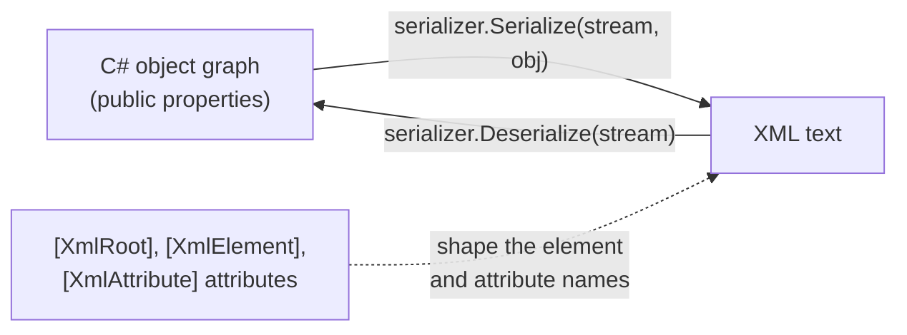
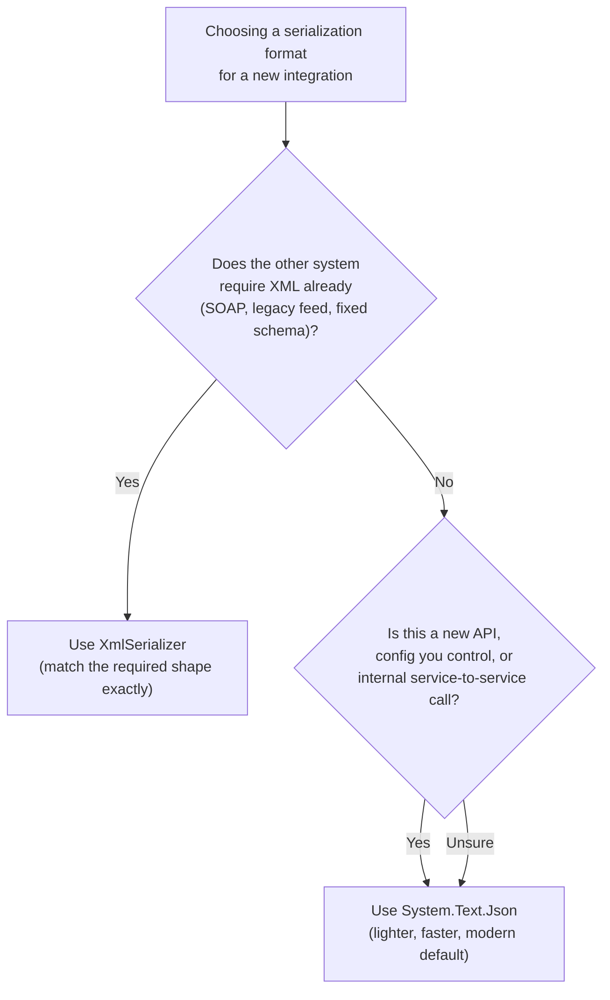

# XML Serialization

## Introduction

Before reading this lesson, you should already be comfortable with **[System.Text.Json in Depth](../09-file-io-serialization/09-05-system-text-json-in-depth.md)**, including attribute-driven customization of a serializer, source-generated contexts, and the general shape of turning objects into text and back. In this lesson we build on that same mental model — attributes that steer a serializer's output — but apply it to a format JSON has mostly displaced for new work, yet which is still very much alive: XML. You will find XML at the edges of almost every large, older organization's systems, and knowing how to produce and consume it correctly is a real, recurring skill rather than a historical curiosity.

By the end of this lesson, you will be able to:

- Serialize and deserialize objects to and from XML using `System.Xml.Serialization.XmlSerializer`
- Control the shape of generated XML with `[XmlRoot]`, `[XmlElement]`, and `[XmlAttribute]`
- Explain why XML remains the right choice for legacy system interop, certain configuration formats, and SOAP-based services
- Contrast `XmlSerializer`'s attribute model with `System.Text.Json`'s, and know when to reach for which
- Read and write an XML file safely using the temp-directory pattern established earlier in this module

## XML Serialization — A Layman's Perspective

Imagine two different companies that both need to exchange purchase orders with their suppliers. One company was founded five years ago; every partner it deals with has agreed to send order data as compact, modern text messages — lightweight, easy to read on a phone, no ceremony. The other company has been running the same core ordering system since the late 1990s, and its dozen biggest suppliers all built their receiving software around a much more formal, heavily-labeled paper form: every field boxed, every section named, every value tagged with exactly what it is and, sometimes, extra stamps in the margin recording who signed off and when. That older form is slower to read at a glance and more verbose to fill out, but it has one enormous advantage: every supplier's decades-old receiving system already knows exactly how to parse it, field by labeled field, and nobody has to touch software that has been running unattended in a back office since before some of today's developers were born.

Neither company is wrong to use the format it uses. The newer company's lightweight messages are genuinely better for what it does: fast integrations, mobile clients, developers who want to glance at a payload and understand it instantly. But if the older company tried to switch its dozen legacy suppliers over to the lightweight format tomorrow, it would mean rewriting or replacing software at every single one of those partners — software that, in many cases, nobody who still works there fully understands anymore. The formal, heavily-labeled form isn't there because anyone still thinks it's the best possible design for a new purchase order format invented today. It's there because it is the format the entire surrounding world of legacy systems already agreed on, years ago, and changing it would mean changing everyone at once.

This is exactly the position XML occupies in modern .NET development. Nobody choosing a data format from scratch today, with no legacy constraints, reaches for XML over JSON — JSON is lighter, faster to parse, and more natural in web and mobile contexts. But XML is the "formal form" that an enormous amount of existing infrastructure already speaks fluently: SOAP web services still running inside banks and insurance companies, configuration formats baked into decades-old enterprise software, and document interchange standards that predate JSON's existence entirely. `XmlSerializer` is the tool that lets a modern .NET 10 application walk up to that older world and speak its language exactly, tag for tag, without anyone on the other end needing to change a thing.

That's the bridge this lesson builds: not "XML instead of JSON," but "XML when the system on the other end of the wire has no intention of ever changing."

## XML Serialization — A Programming Language Perspective

`System.Xml.Serialization.XmlSerializer` converts .NET objects to and from XML by reflecting over a type's public fields and properties, guided by an optional set of attributes that control the resulting element and attribute names, nesting, and ordering. `[XmlRoot("Name")]` on a class sets the name of the outermost element; `[XmlElement("Name")]` on a member renders it as a nested child element (the default, if unattributed); `[XmlAttribute("Name")]` renders it as an XML attribute on its containing element instead of a child element. Unlike `System.Text.Json`, `XmlSerializer` requires a public parameterless constructor and only serializes public members — there is no equivalent to `JsonConstructor` for binding through a custom constructor. `XmlSerializer` is also unusual among .NET serializers in that it *generates and compiles a temporary serialization assembly* per type the first time it's used for that type in a process, which is why constructing one `XmlSerializer` instance per type and reusing it (rather than constructing a fresh one per call) matters for performance in long-running services.

## How to Serialize and Deserialize XML in C#

`XmlSerializer` is constructed once per type, then its `Serialize` and `Deserialize` methods do the work against any `Stream`, `TextWriter`/`TextReader`, or `XmlWriter`/`XmlReader`.


*Figure 1: `XmlSerializer` walks the object graph in one direction to produce XML text, and walks the XML back into an object graph in the other — attributes shape what the XML looks like on the wire.*

```csharp
// Program.cs — .NET 10 / C# 14
using System.Xml.Serialization;

string tempDir = Path.Combine(Path.GetTempPath(), "xml-serialization-demo");
Directory.CreateDirectory(tempDir);
string filePath = Path.Combine(tempDir, "product.xml");

try
{
    Product product = new()
    {
        Sku = "SKU-4471",
        Name = "Wireless Mouse",
        Price = 24.99m
    };

    XmlSerializer serializer = new(typeof(Product));

    using (FileStream writeStream = new(filePath, FileMode.Create))
    {
        serializer.Serialize(writeStream, product);
    }

    Console.WriteLine("--- product.xml contents ---");
    Console.WriteLine(File.ReadAllText(filePath));

    using FileStream readStream = new(filePath, FileMode.Open);
    Product? loaded = (Product?)serializer.Deserialize(readStream);
    Console.WriteLine($"Loaded: {loaded?.Sku} — {loaded?.Name} (${loaded?.Price})");
}
finally
{
    Directory.Delete(tempDir, recursive: true);
}

[XmlRoot("Product")]
public class Product
{
    [XmlAttribute("sku")]
    public string Sku { get; set; } = "";

    [XmlElement("Name")]
    public string Name { get; set; } = "";

    [XmlElement("Price")]
    public decimal Price { get; set; }
}
```

**Console Output:**

```text
--- product.xml contents ---
<?xml version="1.0" encoding="utf-8"?>
<Product xmlns:xsi="http://www.w3.org/2001/XMLSchema-instance" xmlns:xsd="http://www.w3.org/2001/XMLSchema" sku="SKU-4471">
  <Name>Wireless Mouse</Name>
  <Price>24.99</Price>
</Product>
Loaded: SKU-4471 — Wireless Mouse ($24.99)
```

Notice that `Sku` became an XML *attribute* (`sku="SKU-4471"` on the opening tag) because of `[XmlAttribute]`, while `Name` and `Price` became nested *elements* because of `[XmlElement]`. The `xmlns:xsi`/`xmlns:xsd` namespace declarations are added by `XmlSerializer` automatically and are harmless — they're standard XML Schema instance namespaces that most XML tooling expects to see, even when no schema is actually being validated against. The temp directory is created before the work and deleted in a `finally` block, so the example leaves nothing behind on disk regardless of whether it succeeds.

## Real-Time Example: Exporting a Legacy-Compatible Order Feed for E-Commerce Order Processing

We extend the E-Commerce Order Processing domain with a scenario every mid-sized retailer eventually hits: a fulfillment partner's warehouse system was integrated in 2011 and only accepts order data as XML in a specific, fixed shape — order ID as an attribute, line items as nested elements. The modern order-processing pipeline still stores orders however it likes internally; this exporter's only job is to produce XML that the legacy warehouse system can parse without any changes on its end.

```csharp
// Program.cs — .NET 10 / C# 14 — Real-Time Example
using System.Xml.Serialization;

string exportDir = Path.Combine(Path.GetTempPath(), "ecommerce-xml-export");
Directory.CreateDirectory(exportDir);
string exportPath = Path.Combine(exportDir, "warehouse-feed.xml");

try
{
    LegacyOrderFeed feed = new()
    {
        OrderId = "ORD-100294",
        Items =
        [
            new LegacyLineItem { Sku = "SKU-1001", Quantity = 2 },
            new LegacyLineItem { Sku = "SKU-2050", Quantity = 1 }
        ]
    };

    XmlSerializer serializer = new(typeof(LegacyOrderFeed));

    using (FileStream writeStream = new(exportPath, FileMode.Create))
    {
        serializer.Serialize(writeStream, feed);
    }

    Console.WriteLine("--- warehouse-feed.xml ---");
    Console.WriteLine(File.ReadAllText(exportPath));

    using FileStream readStream = new(exportPath, FileMode.Open);
    LegacyOrderFeed? parsed = (LegacyOrderFeed?)serializer.Deserialize(readStream);
    Console.WriteLine($"Parsed order {parsed?.OrderId} with {parsed?.Items.Count} line item(s):");
    foreach (LegacyLineItem item in parsed?.Items ?? [])
    {
        Console.WriteLine($"  {item.Sku} x{item.Quantity}");
    }
}
finally
{
    Directory.Delete(exportDir, recursive: true);
}

[XmlRoot("Order")]
public class LegacyOrderFeed
{
    [XmlAttribute("id")]
    public string OrderId { get; set; } = "";

    [XmlElement("LineItem")]
    public List<LegacyLineItem> Items { get; set; } = [];
}

public class LegacyLineItem
{
    [XmlAttribute("sku")]
    public string Sku { get; set; } = "";

    [XmlAttribute("qty")]
    public int Quantity { get; set; }
}
```

**Console Output:**

```text
--- warehouse-feed.xml ---
<?xml version="1.0" encoding="utf-8"?>
<Order xmlns:xsi="http://www.w3.org/2001/XMLSchema-instance" xmlns:xsd="http://www.w3.org/2001/XMLSchema" id="ORD-100294">
  <LineItem sku="SKU-1001" qty="2" />
  <LineItem sku="SKU-2050" qty="1" />
</Order>
Parsed order ORD-100294 with 2 line item(s):
  SKU-1001 x2
  SKU-2050 x1
```

The `[XmlElement("LineItem")]` attribute on the `Items` list means each `LegacyLineItem` in the collection is serialized as its own `<LineItem>` element rather than being wrapped in an extra `<Items>` container — a shape decision that matters a great deal when the warehouse's decades-old parser expects `<LineItem>` elements to appear as direct children of `<Order>`. Because `LegacyOrderFeed` and `LegacyLineItem` exist purely to match the partner's required XML shape, they stay separate from whatever richer `Order` and `OrderLineItem` types the rest of the order-processing pipeline uses internally — a small mapping step, not a redesign of the domain model.

## XML Serialization vs JSON Serialization

Both `XmlSerializer` and `System.Text.Json` do the same fundamental job — moving an object graph to and from text — but they optimize for different worlds. JSON, covered in the previous lesson, is the right default for anything new: web APIs, mobile clients, configuration your own team controls, and any place payload size and parsing speed matter. XML earns its place specifically where an external system already speaks it and has no intention of changing: SOAP services, some enterprise config formats (like `.csproj`/`.config` files themselves), and long-lived B2B data interchange agreements. Choosing between them today is rarely about which format is "better" in the abstract — it's almost always about which one the system on the other end of the integration already requires.


*Figure 2: In practice the decision is almost always driven by an external constraint, not a fresh preference — XML when something else mandates it, JSON otherwise.*

| Aspect | `XmlSerializer` (XML) | `System.Text.Json` (JSON) |
|---|---|---|
| Payload size | Larger — closing tags, attribute markup | Smaller — minimal punctuation |
| Attribute model | `[XmlRoot]`, `[XmlElement]`, `[XmlAttribute]` | `[JsonPropertyName]`, `[JsonIgnore]`, source generators |
| Constructor binding | Requires a public parameterless constructor | Supports `[JsonConstructor]` and required members |
| Typical modern use | Legacy interop, SOAP, some config formats | Web APIs, mobile clients, most new development |
| Schema validation | Mature (XSD) | Newer, less standardized (JSON Schema) |

## Types of XML APIs in .NET

`XmlSerializer` is the attribute-driven, object-mapping entry point, but .NET's XML support is broader — several of these are covered in their own dedicated lessons or are worth knowing by name:

1. **[`System.Text.Json` in Depth](../09-file-io-serialization/09-05-system-text-json-in-depth.md)** — this lesson's prerequisite, and the modern default this lesson has been contrasting XML against throughout.
2. **`XDocument` / `XElement` (LINQ to XML)** — a lower-level, document-oriented API for building or querying XML directly, useful when there's no fixed C# type to serialize to or from.
3. **`XmlReader` / `XmlWriter`** — forward-only, streaming XML access for very large documents where loading a full object graph or DOM into memory isn't practical.
4. **`DataContractSerializer`** — an alternative XML serializer (originating from WCF) with a different attribute model (`[DataContract]`/`[DataMember]`) and support for versioning and non-public members that `XmlSerializer` lacks.
5. **XML Schema (XSD) validation** — validating an XML document's structure against a formal schema before trusting its contents, common when receiving XML from external partners.

## What You've Learned & What's Next

`XmlSerializer` gives .NET a precise, attribute-driven way to produce exactly the XML shape a legacy system, SOAP service, or fixed interchange format requires — not because XML is the best format to design with today, but because so much existing infrastructure already speaks it fluently and has no reason to change. `[XmlRoot]`, `[XmlElement]`, and `[XmlAttribute]` give you the same kind of fine control over the wire format that `[JsonPropertyName]` gave you over JSON, just aimed at a different, older audience.

Continue your learning journey with **[Working with CSV Files](../09-file-io-serialization/09-07-working-with-csv-files.md)**, where we move to a third text format — one with no built-in .NET serializer at all — and look at both the manual, `StreamReader`-based approach and why production code usually reaches for a dedicated library instead.

---
*Applies to: .NET 10 / C# 14. Last reviewed 2026-08-16.*
