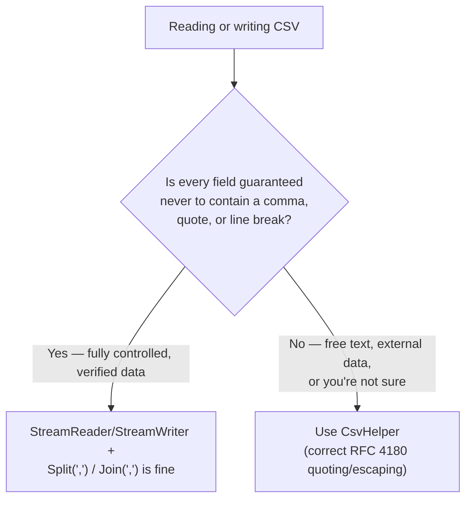

# Working with CSV Files

## Introduction

Before reading this lesson, you should already be comfortable with **[XML Serialization](../09-file-io-serialization/09-06-xml-serialization.md)** and, more broadly, with the idea from earlier in this module that a serialized format is a *contract* — something both sides must agree on precisely. CSV looks deceptively simple by comparison: no angle brackets, no braces, just commas. That simplicity is exactly what makes it dangerous to parse by hand, and this lesson exists to show you both how to do it, and why doing it by hand is rarely the right long-term call.

By the end of this lesson, you will be able to:

- Read and write a basic CSV file using `StreamReader`, `StreamWriter`, and `string.Split(',')`
- Identify the two classic pitfalls of naive CSV parsing: quoted fields containing commas, and quoted fields containing embedded newlines
- Explain why those pitfalls make a hand-rolled CSV parser risky for anything beyond a quick, controlled internal script
- Recognize when reaching for a dedicated library such as CsvHelper is the right engineering decision
- Apply CSV reading and writing to a realistic import/export scenario using the temp-directory pattern from this module

## Working with CSV Files — A Layman's Perspective

Picture a small notebook where someone is quickly jotting down a list of names and phone numbers, separating each piece of information with a comma: `Smith, John, 555-0142`. For a while this works perfectly. Anyone can read it, anyone can write it, and a simple rule — "split on the commas" — recovers the three pieces of information every time.

Then someone needs to jot down a company name that itself contains a comma, like `Smith, Jones & Co.`, and writes it straight into the same notebook without a second thought: `Smith, Jones & Co., John, 555-0142`. Now the simple "split on commas" rule breaks silently. It sees four pieces of information where there are really only three, and nobody notices until a name shows up split in half on a report weeks later, or a phone number arrives in the wrong column entirely. The person writing the notebook wasn't being careless — they just didn't realize their simple format had a hidden rule buried inside it: commas are only safe as separators if the actual data ever promises not to contain commas of its own. Nobody made that promise. It just happened to hold, until it didn't.

A careful notebook-keeper fixes this by putting quotation marks around any entry that might itself contain a comma — `"Smith, Jones & Co.", John, 555-0142` — so the reader knows to treat everything between the quotes as one single piece of information, commas and all. But that fix introduces its own new rule to get right: what if the quoted entry itself needs to contain a quotation mark, or spans multiple lines, like a multi-line shipping address crammed into one notebook entry? Handling that correctly turns "split on commas" into a small, genuine parsing problem — one with real edge cases, not just a one-line rule of thumb.

This is exactly the trap CSV lays for anyone who reaches for `line.Split(',')` on real-world data. It works beautifully in a demo where nobody's product name has a comma in it and nobody's shipping note spans two lines. It breaks — silently, without an exception, just wrong data quietly landing in the wrong column — the moment real data doesn't cooperate. The lesson isn't "never write your own CSV code"; it's "know exactly which shortcuts you're taking when you do, and know that a battle-tested library has already solved the parts you're tempted to skip."

## Working with CSV Files — A Programming Language Perspective

CSV (comma-separated values) has no single formal .NET type or built-in serializer the way JSON and XML do — it is conventionally read and written with plain text APIs: `StreamReader.ReadLine()` to read one record per line, and `string.Split(',')` to split a line into fields, with the reverse using `StreamWriter.WriteLine()` and `string.Join(",", fields)`. This naive approach is correct only under a specific, often-unstated assumption: that no field value ever contains a comma, a double quote, or a line break. The RFC 4180 convention for handling those cases wraps a field in double quotes (`"field, with comma"`) and escapes any literal double quote inside a quoted field by doubling it (`""`) — logic that a simple `Split(',')` call does not implement and will parse incorrectly. For any CSV work beyond a quick, fully-controlled script, the community-standard `CsvHelper` NuGet package implements RFC 4180 quoting/escaping correctly, along with type conversion, header mapping, and streaming for large files.

## How to Read and Write CSV Files Manually in C#

The manual approach reads naturally line-by-line and field-by-field; it is correct and adequate as long as the data genuinely never contains a comma, quote, or embedded newline inside a field.

```mermaid
flowchart LR
    A["CSV file on disk"] -->|"StreamReader.ReadLine()"| B["One line of text\nper record"]
    B -->|"line.Split(',')"| C["string[] fields"]
    C -->|"Parse into a\ntyped record"| D["In-memory objects"]
    D -->|"string.Join(\",\", fields)"| E["StreamWriter.WriteLine()"]
    E --> A2["CSV file on disk"]
```
*Figure 1: The manual round trip — split on the way in, join on the way out — works cleanly only when no field value contains the separator character itself.*

```csharp
// Program.cs — .NET 10 / C# 14
string tempDir = Path.Combine(Path.GetTempPath(), "csv-demo");
Directory.CreateDirectory(tempDir);
string filePath = Path.Combine(tempDir, "contacts.csv");

try
{
    string[] header = ["Name", "Phone"];
    (string Name, string Phone)[] contacts =
    [
        ("Ava Patel", "555-0110"),
        ("Ben Carter", "555-0142")
    ];

    using (StreamWriter writer = new(filePath))
    {
        writer.WriteLine(string.Join(",", header));
        foreach ((string name, string phone) in contacts)
        {
            writer.WriteLine(string.Join(",", name, phone));
        }
    }

    Console.WriteLine("--- contacts.csv contents ---");
    Console.WriteLine(File.ReadAllText(filePath));

    using StreamReader reader = new(filePath);
    string? headerLine = reader.ReadLine();
    Console.WriteLine($"Header: {headerLine}");

    string? line;
    while ((line = reader.ReadLine()) is not null)
    {
        string[] fields = line.Split(',');
        Console.WriteLine($"Parsed -> Name: {fields[0]}, Phone: {fields[1]}");
    }
}
finally
{
    Directory.Delete(tempDir, recursive: true);
}
```

**Console Output:**

```text
--- contacts.csv contents ---
Name,Phone
Ava Patel,555-0110
Ben Carter,555-0142

Header: Name,Phone
Parsed -> Name: Ava Patel, Phone: 555-0110
Parsed -> Name: Ben Carter, Phone: 555-0142
```

This works exactly as expected because neither `Name` nor `Phone` ever contains a comma. Now watch it break: if `Ava Patel` were replaced with the company name `Patel, Rao & Associates`, the written line would be `Patel, Rao & Associates,555-0110`, and `line.Split(',')` on read-back would produce **three** fields — `"Patel"`, `" Rao & Associates"`, and `"555-0110"` — silently shifting the phone number into `fields[2]` and corrupting every column after the comma. No exception is thrown; the data is just wrong. That silent failure mode is precisely why naive splitting is a demo-scale technique, not a production one.

## Real-Time Example: Exporting a Product Catalog for E-Commerce Order Processing

We extend the E-Commerce Order Processing domain with a recurring operational need: exporting the current product catalog to CSV for a merchandising team that reviews pricing in a spreadsheet. Product names in a real catalog routinely contain commas ("Wireless Mouse, Ergonomic Grip"), so this example shows the manual writer correctly quoting any field that needs it — and shows why a reader that only calls `Split(',')` still gets that same field wrong, motivating CsvHelper for anything beyond this quick, one-directional export.

```csharp
// Program.cs — .NET 10 / C# 14 — Real-Time Example
string exportDir = Path.Combine(Path.GetTempPath(), "ecommerce-csv-export");
Directory.CreateDirectory(exportDir);
string exportPath = Path.Combine(exportDir, "catalog-export.csv");

try
{
    List<CatalogProduct> catalog =
    [
        new("SKU-1001", "Wireless Mouse", 24.99m),
        new("SKU-1002", "Wireless Mouse, Ergonomic Grip", 34.99m),
        new("SKU-1003", "USB-C Charging Cable", 12.50m)
    ];

    using (StreamWriter writer = new(exportPath))
    {
        writer.WriteLine("Sku,Name,Price");
        foreach (CatalogProduct product in catalog)
        {
            string quotedName = product.Name.Contains(',')
                ? $"\"{product.Name}\""
                : product.Name;
            writer.WriteLine($"{product.Sku},{quotedName},{product.Price}");
        }
    }

    Console.WriteLine("--- catalog-export.csv (raw file contents) ---");
    Console.WriteLine(File.ReadAllText(exportPath));

    Console.WriteLine("--- naive Split(',') read-back ---");
    using StreamReader reader = new(exportPath);
    reader.ReadLine(); // skip header
    string? line;
    while ((line = reader.ReadLine()) is not null)
    {
        string[] fields = line.Split(',');
        Console.WriteLine($"  {fields.Length} field(s): [{string.Join(" | ", fields)}]");
    }
}
finally
{
    Directory.Delete(exportDir, recursive: true);
}

record CatalogProduct(string Sku, string Name, decimal Price);
```

**Console Output:**

```text
--- catalog-export.csv (raw file contents) ---
Sku,Name,Price
SKU-1001,Wireless Mouse,24.99
SKU-1002,"Wireless Mouse, Ergonomic Grip",34.99
SKU-1003,USB-C Charging Cable,12.50

--- naive Split(',') read-back ---
  3 field(s): [SKU-1001 | Wireless Mouse | 24.99]
  4 field(s): [SKU-1002 | "Wireless Mouse |  Ergonomic Grip" | 34.99]
  3 field(s): [SKU-1003 | USB-C Charging Cable | 12.50]
```

The writer correctly quoted `SKU-1002`'s name because it detected the embedded comma — but the naive reader has no idea those quotes mean "treat this whole thing as one field," so it still splits `"Wireless Mouse, Ergonomic Grip"` into two fields, one of which retains a stray leading quote character. In a real merchandising export, this is exactly the row that would land wrong in a spreadsheet and go unnoticed until someone asked why a price appeared in the name column. Production code faced with this would replace both the hand-rolled writer and the `Split(',')` reader with `CsvHelper`'s `CsvWriter`/`CsvReader`, which parse RFC 4180 quoting correctly in both directions with a few lines of configuration instead of hand-written escaping logic.

## Manual CSV Parsing vs a Dedicated CSV Library

Manual parsing with `Split(',')` is fine for a quick, throwaway script operating on data you fully control and have verified contains no commas, quotes, or embedded newlines. The moment CSV data comes from anywhere less controlled — a user upload, an external partner's export, free-text product names or addresses — the RFC 4180 edge cases stop being theoretical, and a dedicated library earns its dependency.


*Figure 2: The deciding question isn't file size — it's whether any field's content can ever include the characters CSV uses as structure.*

| Aspect | Manual (`Split`/`Join`) | `CsvHelper` |
|---|---|---|
| Quoted fields with commas | Not handled — silently misparsed | Handled correctly (RFC 4180) |
| Embedded newlines in a field | Not handled — breaks line-by-line reading | Handled correctly |
| Type conversion | Manual (`decimal.Parse`, etc.) | Built-in, configurable per column |
| Setup cost | Zero — no dependency | One NuGet package, small config |
| Right for | Quick scripts on fully-controlled data | Anything touching real-world or external data |

## Types of CSV Handling Approaches in .NET

CSV work in .NET spans a small range of approaches depending on how much control you have over the data and how much correctness you need:

1. **Manual `StreamReader`/`Split`** — covered in this lesson; fine for small, fully-controlled, comma-free data.
2. **`CsvHelper`** — the de facto standard third-party library for production CSV reading and writing, handling RFC 4180 quoting, type conversion, and header mapping.
3. **[`System.Text.Json` in Depth](../09-file-io-serialization/09-05-system-text-json-in-depth.md)** — worth revisiting when a partner can be persuaded to send JSON instead of CSV, sidestepping this entire class of problem.
4. **`Microsoft.VisualBasic.FileIO.TextFieldParser`** — an older, less common built-in .NET class (despite the namespace) that does handle quoted CSV fields, though `CsvHelper` is more actively maintained.
5. **Excel interop libraries (e.g. ClosedXML, EPPlus)** — worth considering when the actual requirement is "produce something a business user opens in Excel," since a `.xlsx` file sidesteps CSV's quoting ambiguity entirely.

## What You've Learned & What's Next

CSV's simplicity is exactly what makes it risky to parse by hand: `Split(',')` is correct only under an assumption — no commas, quotes, or newlines inside any field — that real-world data eventually violates, and violates silently, with no exception to catch. Manual parsing remains a reasonable choice for small, fully-controlled data, but anything touching external or free-text input belongs to `CsvHelper`, which has already solved RFC 4180 quoting correctly.

Continue your learning journey with **[FileSystemWatcher](../09-file-io-serialization/09-08-filesystemwatcher.md)**, where we shift from reading and writing files on demand to reacting automatically when files on disk are created, changed, deleted, or renamed.

---
*Applies to: .NET 10 / C# 14. Last reviewed 2026-08-16.*
