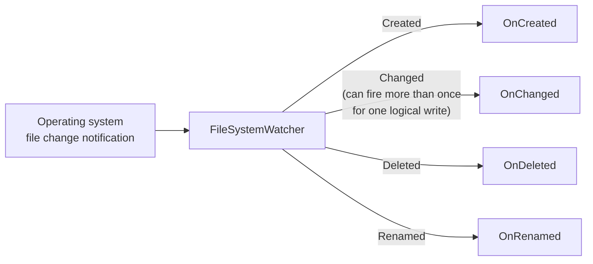
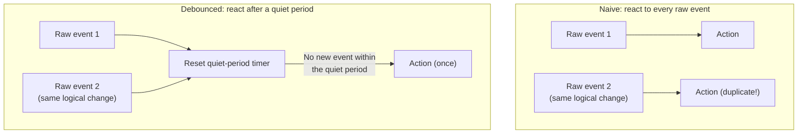

# FileSystemWatcher

## Introduction

Before reading this lesson, you should already be comfortable with **[Working with CSV Files](../09-file-io-serialization/09-07-working-with-csv-files.md)** and, more generally, with reading and writing files on demand — every lesson in this module so far has assumed *your code* decides when to open a file. This lesson flips that around: instead of your code initiating file access, the operating system tells your code when something has changed on disk, and your code reacts. That shift — from polling to being notified — is powerful, but it comes with a well-known rough edge that catches almost everyone the first time they use it.

By the end of this lesson, you will be able to:

- Set up a `FileSystemWatcher` to react to files being created, changed, deleted, and renamed
- Configure `NotifyFilter` to limit which kinds of changes raise events
- Configure `IncludeSubdirectories` to watch an entire directory tree instead of just its top level
- Explain why a single logical file write can raise more than one `Changed` event, and why that matters
- Implement a debounce pattern that collapses a burst of raw events into one meaningful action

## FileSystemWatcher — A Layman's Perspective

Imagine hiring a security guard to watch the loading dock of a warehouse, whose entire job is to radio the office the instant a delivery truck arrives, leaves, or a package gets dropped, picked up, or relabeled. This is a huge improvement over the alternative — someone in the office walking out to the dock every five minutes just to check if anything changed. The guard means the office finds out *immediately*, the moment something happens, instead of up to five minutes late.

But here's the catch nobody warns the office about on day one: the guard is extremely literal, and slightly jumpy. If a delivery driver backs a truck in, gets out, walks around to check the load, and gets back in — the guard might radio "truck arrived" once for the truck pulling in, and then radio it *again* moments later when the driver's own movement near the dock trips the guard's motion sensor a second time. To the guard, two things genuinely happened — the truck moving, and separately, a person moving near it. To the office, it sounds like two deliveries arrived when really it was one truck making one delivery. If the office's process is "every time the guard radios in a delivery, send someone out to log it," they'll end up logging the same truck twice, confusing their own inventory count in the process.

The fix isn't to fire the guard, or to tell them to stop reporting things — the fix is for the office to add a small rule of their own: "if the guard radios in the same dock twice within a few seconds, treat it as one event, not two." That's a policy the *office* enforces on top of the guard's raw reports, because the guard's job is to report everything it notices, not to decide what counts as meaningfully "one" delivery. Waiting a few quiet seconds after the last radio call before actually dispatching someone to the dock — rather than reacting to every single radio call individually — is exactly how the office avoids double-counting.

`FileSystemWatcher` is that guard. It is remarkably good at its actual job: telling your application, in near real time, that *something* happened to a file or folder it's watching. But it inherits the same literal-mindedness — a single save from a text editor, a single line appended to a log file, or a single file copy can genuinely cause the underlying operating system to report more than one raw "changed" notification for what a human would call one event. Debouncing is the small policy your application adds on top: wait for a short quiet period after the last notification before actually acting, so a burst of raw events collapses into the one meaningful action it actually represents.

## FileSystemWatcher — A Programming Language Perspective

`System.IO.FileSystemWatcher` is a component that monitors a directory (and optionally its subtree) for file system changes and raises managed events — `Created`, `Changed`, `Deleted`, `Renamed`, and `Error` — on background thread-pool threads as the underlying OS reports them. The `Path` property sets which directory to watch, `Filter`/`Filters` restricts which file names raise events (e.g. `"*.csv"`), and `IncludeSubdirectories` controls whether nested folders are watched too. `NotifyFilter`, a `[Flags]` enum (`NotifyFilters.FileName`, `.DirectoryName`, `.LastWrite`, `.Size`, `.Attributes`, and others), narrows *which kinds* of changes trigger a `Changed` event — watching only `LastWrite`, for instance, avoids spurious events from unrelated attribute changes. `EnableRaisingEvents` must be set to `true` before any events fire, and the watcher itself must be disposed (or wrapped in `using`) once no longer needed, same as any other resource in this module. Because the underlying OS notification APIs (on Windows, `ReadDirectoryChangesW`) can and do report more than one notification for a single logical write, application code that treats *every* raw `Changed` event as a distinct, independent action is a very common — and very reproducible — source of duplicate processing bugs.

## How to Watch a Directory with FileSystemWatcher in C#

`FileSystemWatcher` is set up once, wired to event handlers, and then left running for as long as the directory needs watching — most commonly for the lifetime of a background service.


*Figure 1: `FileSystemWatcher` turns raw OS notifications into four managed .NET events — `Changed` is the one most prone to firing more than once per logical write.*

```csharp
// Program.cs — .NET 10 / C# 14
string tempDir = Path.Combine(Path.GetTempPath(), "fsw-demo");
Directory.CreateDirectory(tempDir);

try
{
    using FileSystemWatcher watcher = new(tempDir)
    {
        NotifyFilter = NotifyFilters.FileName,
        IncludeSubdirectories = false,
        EnableRaisingEvents = true
    };

    using SemaphoreSlim created = new(0);
    using SemaphoreSlim renamed = new(0);
    using SemaphoreSlim deleted = new(0);

    watcher.Created += (_, e) =>
    {
        Console.WriteLine($"Created: {e.Name}");
        created.Release();
    };
    watcher.Renamed += (_, e) =>
    {
        Console.WriteLine($"Renamed: {e.OldName} -> {e.Name}");
        renamed.Release();
    };
    watcher.Deleted += (_, e) =>
    {
        Console.WriteLine($"Deleted: {e.Name}");
        deleted.Release();
    };

    string originalPath = Path.Combine(tempDir, "report.txt");
    string renamedPath = Path.Combine(tempDir, "report-final.txt");

    File.WriteAllText(originalPath, "Q3 results");
    created.Wait(TimeSpan.FromSeconds(5));

    File.Move(originalPath, renamedPath);
    renamed.Wait(TimeSpan.FromSeconds(5));

    File.Delete(renamedPath);
    deleted.Wait(TimeSpan.FromSeconds(5));

    Console.WriteLine("All expected events observed.");
}
finally
{
    Directory.Delete(tempDir, recursive: true);
}
```

**Console Output:**

```text
Created: report.txt
Renamed: report.txt -> report-final.txt
Deleted: report-final.txt
All expected events observed.
```

Each `SemaphoreSlim` blocks the main thread until its corresponding event handler — running on a separate thread-pool thread — actually fires, which keeps this example's output order deterministic despite the events arriving asynchronously. `NotifyFilters.FileName` was chosen deliberately here because this example only cares about files appearing, being renamed, and disappearing — not their content changing, which is exactly the kind of narrowing `NotifyFilter` exists for. Note that `Created`, `Renamed`, and `Deleted` reliably fire exactly once per operation in practice; `Changed` is the one event in this set with a real duplicate-firing gotcha, covered next.

The gotcha shows up the moment code assumes a single logical update produces a single `Changed` notification. Because the underlying OS can report content and metadata changes as separate notifications, a single `File.WriteAllText` call can — depending on OS, file system, and timing — raise `Changed` more than once for what your application should treat as one update. Rather than depend on an exact, non-portable count of raw OS notifications, the fix is to add a debounce layer that waits for a short quiet period after the *last* notification before acting:

```csharp
// Program.cs — .NET 10 / C# 14 — debounce pattern
using System.Collections.Concurrent;

ConcurrentQueue<DateTime> rawEvents = new();
List<string> processedActions = [];
using Timer debounceTimer = new(_ =>
{
    processedActions.Add($"Processed 1 effective change (from {rawEvents.Count} raw event(s))");
    rawEvents.Clear();
}, null, Timeout.Infinite, Timeout.Infinite);

void OnRawChanged()
{
    rawEvents.Enqueue(DateTime.UtcNow);
    debounceTimer.Change(TimeSpan.FromMilliseconds(200), Timeout.InfiniteTimeSpan);
}

// Simulate the OS reporting three raw notifications for one logical save.
OnRawChanged();
OnRawChanged();
OnRawChanged();

Thread.Sleep(400); // allow the debounce timer's quiet period to elapse

Console.WriteLine(string.Join(Environment.NewLine, processedActions));
```

**Console Output:**

```text
Processed 1 effective change (from 3 raw event(s))
```

Every call to `OnRawChanged` resets the same `Timer` to fire 200ms later, so as long as raw notifications keep arriving faster than that quiet window, the timer keeps getting pushed back and never actually runs. Only once 200ms passes with *no* new raw notification does the timer callback fire — collapsing however many raw events arrived (three, in this simulation) into exactly one processed action. This is the same shape of fix a real `FileSystemWatcher.Changed` handler needs: reset a per-file timer on every raw event, and only act when the timer actually elapses.

## Real-Time Example: A Hot-Folder Inventory Import for Library/Inventory Management

We extend the Library/Inventory Management domain with a "hot folder" pattern common in real inventory systems: staff drop CSV files into an `incoming` folder, and a background watcher picks each one up automatically, imports it, and moves it into a `processed` folder — no one has to run an import job manually. A `HashSet<string>` guards against processing the same file path twice, which matters because `Created` can occasionally be followed by a `Changed` event for the same brand-new file as the OS finishes flushing it to disk.

```csharp
// Program.cs — .NET 10 / C# 14 — Real-Time Example
string root = Path.Combine(Path.GetTempPath(), "library-hotfolder-demo");
string incomingDir = Path.Combine(root, "incoming");
string processedDir = Path.Combine(root, "processed");
Directory.CreateDirectory(incomingDir);
Directory.CreateDirectory(processedDir);

try
{
    HashSet<string> alreadyProcessed = new(StringComparer.OrdinalIgnoreCase);
    object processLock = new();
    using SemaphoreSlim itemProcessed = new(0);

    using FileSystemWatcher watcher = new(incomingDir)
    {
        Filter = "*.csv",
        NotifyFilter = NotifyFilters.FileName,
        EnableRaisingEvents = true
    };

    watcher.Created += (_, e) =>
    {
        lock (processLock)
        {
            if (!alreadyProcessed.Add(e.FullPath))
            {
                return; // already handled — guards against a duplicate raw event
            }
        }

        // Give the writer a brief moment to finish flushing before we read it.
        Thread.Sleep(50);
        string[] lines = File.ReadAllLines(e.FullPath);
        int itemCount = lines.Length - 1; // minus header row

        string destination = Path.Combine(processedDir, e.Name!);
        File.Move(e.FullPath, destination);

        Console.WriteLine($"Imported {itemCount} item(s) from {e.Name} -> moved to processed/");
        itemProcessed.Release();
    };

    string firstDrop = Path.Combine(incomingDir, "inventory-drop-001.csv");
    File.WriteAllText(firstDrop, "Sku,Quantity\nSKU-3001,50");
    itemProcessed.Wait(TimeSpan.FromSeconds(5));

    string secondDrop = Path.Combine(incomingDir, "inventory-drop-002.csv");
    File.WriteAllText(secondDrop, "Sku,Quantity\nSKU-3002,120");
    itemProcessed.Wait(TimeSpan.FromSeconds(5));

    Console.WriteLine($"Files remaining in incoming/: {Directory.GetFiles(incomingDir).Length}");
    Console.WriteLine($"Files in processed/: {Directory.GetFiles(processedDir).Length}");
}
finally
{
    Directory.Delete(root, recursive: true);
}
```

**Console Output:**

```text
Imported 1 item(s) from inventory-drop-001.csv -> moved to processed/
Imported 1 item(s) from inventory-drop-002.csv -> moved to processed/
Files remaining in incoming/: 0
Files in processed/: 2
```

Waiting on `itemProcessed` after each drop keeps the two imports deterministic and sequential in this example, but in production the watcher would simply keep running unattended, importing every file staff drop in, in whatever order they arrive. The `alreadyProcessed` guard is the same debouncing idea as the standalone example above, applied at the level of "have I already handled this exact file path," rather than a timer — a simpler, equally valid debounce technique for events keyed by a stable identifier like a file path.

## Raw Events vs Debounced Handling

Treating every raw `FileSystemWatcher` event as an independent unit of work is the single most common mistake with this API — it works perfectly in a quick demo and then double-processes files in production the first time a real editor, network copy, or antivirus scan touches the watched folder in a way that generates more than one notification. Debouncing — whether via a reset-on-every-event `Timer`, a small "already seen" set, or both — is not an optional polish step; it is the difference between a watcher that is production-safe and one that silently duplicates work.


*Figure 2: The same two raw events produce one duplicated action under naive handling, and exactly one action once a debounce layer sits between the raw events and the response.*

| Aspect | Naive (react to every event) | Debounced |
|---|---|---|
| Duplicate raw events | Each one triggers its own action | Collapsed into one action |
| Complexity | Simplest to write | Requires a timer or a seen-set |
| Safe for production? | No — risks double-processing | Yes — the standard, safe pattern |
| Typical mechanism | Direct event handler logic | `Timer` reset-on-event, or an "already processed" guard |

## Types of File System Monitoring in .NET

`FileSystemWatcher` is the primary event-driven option, but it sits alongside a few related concepts worth knowing:

1. **`NotifyFilters`** — the `[Flags]` enum (`FileName`, `DirectoryName`, `LastWrite`, `Size`, `Attributes`, `Security`, `CreationTime`) that narrows which kinds of changes raise a `Changed` event.
2. **`IncludeSubdirectories`** — set to `true` to watch an entire directory tree instead of only the top-level folder, at the cost of a higher event volume to filter through.
3. **[Working with Directories and Paths](../09-file-io-serialization/09-10-working-with-directories-and-paths.md)** — the module capstone, and the natural next step once a watcher needs to create, move, or clean up the folder structures it reacts to.
4. **Polling (`Directory.GetFiles` on a timer)** — a simpler, less real-time alternative that's often more reliable than `FileSystemWatcher` on network shares or mounted drives where native change notifications aren't well supported.
5. **`PhysicalFileProvider.Watch` (ASP.NET Core)** — a higher-level file-change abstraction built for configuration reloading, covered when the curriculum reaches ASP.NET Core configuration.

## What You've Learned & What's Next

`FileSystemWatcher` turns file system changes into managed .NET events, replacing manual polling with near-instant notification — but its `Changed` event can genuinely fire more than once for a single logical write, and code that assumes otherwise will eventually double-process a file in production. Debouncing, whether through a reset-on-event `Timer` or a simple "already seen" guard, is the standard fix, and belongs in any watcher intended to run unattended.

Continue your learning journey with **[Compression with GZip](../09-file-io-serialization/09-09-compression-with-gzip.md)**, where we return to files your code controls directly and look at trading CPU time for smaller files on disk.

---
*Applies to: .NET 10 / C# 14. Last reviewed 2026-08-16.*
