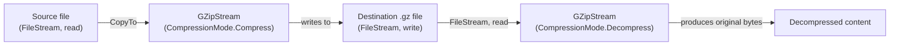
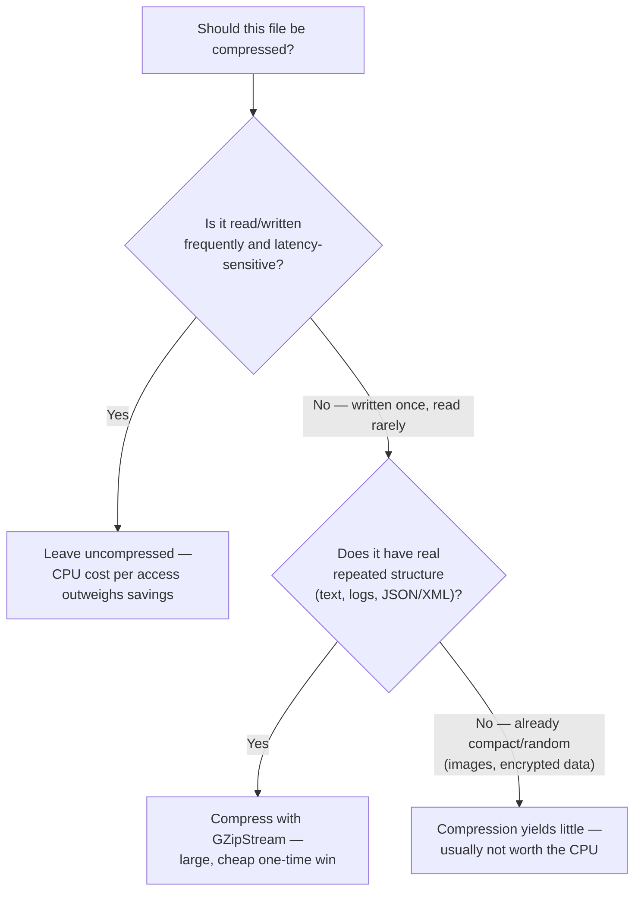

# Compression with GZip

## Introduction

Before reading this lesson, you should already be comfortable with **[FileSystemWatcher](../09-file-io-serialization/09-08-filesystemwatcher.md)** and, more broadly, with the `Stream`-based model this whole module has been building — files as streams of bytes, wrapped and combined with other streams to add behavior. This lesson introduces exactly that kind of wrapping: `GZipStream` sits on top of any other stream and transparently compresses or decompresses the bytes flowing through it, so any code that already knows how to write to a `FileStream` needs almost no changes to write compressed data instead.

By the end of this lesson, you will be able to:

- Compress a file's contents to `.gz` format using `GZipStream` wrapped around a `FileStream`
- Decompress a `.gz` file back to its original contents the same way, in reverse
- Explain the CPU-versus-storage/I-O trade-off compression represents, and when it's worth making
- Choose an appropriate `CompressionLevel` for a given workload
- Apply GZip compression to archiving transaction data in a Banking/ATM scenario

## Compression with GZip — A Layman's Perspective

Picture someone packing for a long trip who owns a vacuum-sealed storage bag — the kind you stuff clothes into and then suck all the air out of with a pump, shrinking a bulky pile of sweaters down to a fraction of its original size. It's a genuinely useful trick: the same clothes take up dramatically less room in the suitcase, which matters enormously when suitcase space is the scarce resource. But it isn't free. Sealing each bag takes a minute or two of active pumping, and unpacking at the destination means finding the pump again, unsealing the bag, and waiting for the clothes to puff back out before they're actually wearable. Nobody vacuum-seals a single pair of socks they're going to need again in ten minutes — the time spent sealing and unsealing would dwarf whatever space it saved. But for the sweaters going into long-term storage, or the winter coats only needed once a year, the trade is obviously worth it: a little active effort now, in exchange for a lot less space taken up the rest of the time.

That's the entire trade-off compression represents, and it's worth being precise about what's actually being traded. Vacuum-sealing doesn't make the clothes smaller in any permanent sense — the sweaters are exactly as bulky as they ever were, they're just squeezed into less space *for now*, at the cost of the pumping effort and the unsealing effort later. If you needed the sweater again in the next five minutes, the round trip of sealing and unsealing would cost you more time than it saved you in suitcase space. But if the sweater is going into a closet for eight months, that pumping effort was clearly worth paying once.

Data compression works on exactly this logic. A `GZipStream` is the vacuum pump: it spends CPU time now, finding patterns and repetition in a file's bytes and re-encoding them more compactly, in exchange for a smaller file sitting on disk or moving across a network later. Decompressing spends CPU time again, unpacking those bytes back to their original, usable form. For a file that's about to be archived and rarely, if ever, read again — a month-old transaction log, a completed batch export — that trade is obviously worth it: pay a little CPU once, save storage and transfer bandwidth for as long as the file sits there. For a file being read and rewritten every few seconds by an active process, the constant sealing and unsealing would cost more in CPU than it ever saved in disk space.

## Compression with GZip — A Programming Language Perspective

`System.IO.Compression.GZipStream` is a `Stream` decorator that wraps another stream — most commonly a `FileStream`, but any stream works — and transparently compresses bytes written through it, or decompresses bytes read through it, using the DEFLATE algorithm inside the standard gzip container format. Constructing a `GZipStream` in `CompressionMode.Compress` and writing to it (or copying another stream into it via `Stream.CopyTo`) produces gzip-compressed output on the underlying stream; constructing one in `CompressionMode.Decompress` and reading from it reverses the process. A `CompressionLevel` enum — `NoCompression`, `Fastest`, `Optimal`, and `SmallestSize` — controls the CPU-time-versus-compression-ratio trade-off directly: `Fastest` spends the least CPU for a smaller size reduction, `SmallestSize` spends the most CPU chasing the smallest possible output, and `Optimal` is a balanced default appropriate for most workloads. Because `GZipStream` is itself just a `Stream`, it composes with everything else this module has covered — it can wrap a `FileStream` for on-disk archives, a `NetworkStream` for compressed transfer, or even another stream that itself wraps a serializer, letting compression and serialization layer together with no special-case code.

## How to Compress and Decompress a File with GZipStream in C#

Compressing a file means opening it for reading, opening (or creating) the destination file for writing, and copying bytes from the first, through a `GZipStream` in `Compress` mode, into the second. Decompressing reverses the arrangement.


*Figure 1: `GZipStream` wraps a `FileStream` in either direction — the same stream-composition pattern used throughout this module, just adding a compression step.*

```csharp
// Program.cs — .NET 10 / C# 14
using System.IO.Compression;

string tempDir = Path.Combine(Path.GetTempPath(), "gzip-demo");
Directory.CreateDirectory(tempDir);
string sourcePath = Path.Combine(tempDir, "activity.log");
string compressedPath = Path.Combine(tempDir, "activity.log.gz");

try
{
    string logLine = "2026-08-16T09:00:00Z ATM-4471 WITHDRAWAL approved amount=200.00" + Environment.NewLine;
    string logContent = string.Concat(Enumerable.Repeat(logLine, 500));
    File.WriteAllText(sourcePath, logContent);

    using (FileStream sourceStream = new(sourcePath, FileMode.Open))
    using (FileStream destinationStream = new(compressedPath, FileMode.Create))
    using (GZipStream gzipStream = new(destinationStream, CompressionMode.Compress))
    {
        sourceStream.CopyTo(gzipStream);
    }

    long originalSize = new FileInfo(sourcePath).Length;
    long compressedSize = new FileInfo(compressedPath).Length;
    double savedPercent = 100.0 * (1 - (double)compressedSize / originalSize);

    Console.WriteLine($"Original size:   {originalSize,6} bytes");
    Console.WriteLine($"Compressed size: {compressedSize,6} bytes");
    Console.WriteLine($"Space saved:      {savedPercent:F1}%");

    using FileStream compressedIn = new(compressedPath, FileMode.Open);
    using GZipStream decompressStream = new(compressedIn, CompressionMode.Decompress);
    using StreamReader reader = new(decompressStream);
    string decompressedContent = reader.ReadToEnd();

    Console.WriteLine($"Round-trip content matches original: {decompressedContent == logContent}");
}
finally
{
    Directory.Delete(tempDir, recursive: true);
}
```

**Console Output:**

```text
Original size:    32500 bytes
Compressed size:    338 bytes
Space saved:      99.0%
Round-trip content matches original: True
```

The 500 repeated log lines compress dramatically — from 32,500 bytes down to 338 — because DEFLATE excels precisely at the kind of repetition a real log file full of similarly-shaped lines tends to have; a file of genuinely random bytes would barely shrink at all, which is a useful intuition to keep: compression ratio depends entirely on how much repeated structure the data actually contains. The decompression step confirms the round trip is lossless — the content read back matches the original exactly, byte for byte, as gzip compression always guarantees.

## Real-Time Example: Archiving Completed Transaction Batches for Banking/ATM

We extend the Banking/ATM domain with a real operational need: once a batch of ATM transactions has been fully processed, it's exported and archived rather than kept indefinitely as a plain file taking up space on the processing server. This example serializes a batch of `AtmTransaction` records to JSON — the format from earlier in this module — then compresses that JSON directly into a `.gz` archive, deleting the uncompressed working copy once archiving succeeds.

```csharp
// Program.cs — .NET 10 / C# 14 — Real-Time Example
using System.IO.Compression;
using System.Text.Json;

string archiveRoot = Path.Combine(Path.GetTempPath(), "atm-archive-demo");
string liveDir = Path.Combine(archiveRoot, "live-batches");
string archiveDir = Path.Combine(archiveRoot, "archive");
Directory.CreateDirectory(liveDir);
Directory.CreateDirectory(archiveDir);

try
{
    List<AtmTransaction> batch =
    [
        new("TXN-90001", "ATM-4471", "Withdrawal", 200.00m),
        new("TXN-90002", "ATM-4471", "Deposit", 500.00m),
        new("TXN-90003", "ATM-5502", "BalanceInquiry", 0.00m)
    ];

    string batchFileName = "batch-2026-08-16.json";
    string batchPath = Path.Combine(liveDir, batchFileName);
    File.WriteAllText(batchPath, JsonSerializer.Serialize(batch, new JsonSerializerOptions { WriteIndented = true }));

    string archivedPath = Path.Combine(archiveDir, batchFileName + ".gz");
    CompressAndArchive(batchPath, archivedPath);

    File.Delete(batchPath); // the live batch has now been safely archived

    long archivedSize = new FileInfo(archivedPath).Length;
    Console.WriteLine($"Archived {batchFileName} -> {Path.GetFileName(archivedPath)}");
    Console.WriteLine($"Compressed archive size: {archivedSize} bytes");

    List<AtmTransaction> restored = RestoreFromArchive(archivedPath);
    Console.WriteLine($"Restored {restored.Count} transaction(s) from archive:");
    foreach (AtmTransaction txn in restored)
    {
        Console.WriteLine($"  {txn.TransactionId} | {txn.AtmId} | {txn.Type} | {txn.Amount:F2}");
    }
}
finally
{
    Directory.Delete(archiveRoot, recursive: true);
}

static void CompressAndArchive(string sourcePath, string destinationPath)
{
    using FileStream sourceStream = new(sourcePath, FileMode.Open);
    using FileStream destinationStream = new(destinationPath, FileMode.Create);
    using GZipStream gzipStream = new(destinationStream, CompressionLevel.Optimal);
    sourceStream.CopyTo(gzipStream);
}

static List<AtmTransaction> RestoreFromArchive(string archivePath)
{
    using FileStream archiveStream = new(archivePath, FileMode.Open);
    using GZipStream gzipStream = new(archiveStream, CompressionMode.Decompress);
    return JsonSerializer.Deserialize<List<AtmTransaction>>(gzipStream) ?? [];
}

record AtmTransaction(string TransactionId, string AtmId, string Type, decimal Amount);
```

**Console Output:**

```text
Archived batch-2026-08-16.json -> batch-2026-08-16.json.gz
Compressed archive size: 161 bytes
Restored 3 transaction(s) from archive:
  TXN-90001 | ATM-4471 | Withdrawal | 200.00
  TXN-90002 | ATM-4471 | Deposit | 500.00
  TXN-90003 | ATM-5502 | BalanceInquiry | 0.00
```

Note the `GZipStream` constructor overload used here — `new GZipStream(destinationStream, CompressionLevel.Optimal)` — implicitly compresses, just like `CompressionMode.Compress` did in the previous example; passing a `CompressionLevel` instead of a `CompressionMode` both selects compression and tunes how hard it works. `RestoreFromArchive` passes the `GZipStream` directly into `JsonSerializer.Deserialize`, decompressing and deserializing in a single pass without ever materializing the intermediate decompressed JSON text as its own file — exactly the kind of stream composition this lesson's Programming Language Perspective described. In a real batch-processing pipeline, this archiving step would run automatically once a batch is confirmed settled, keeping the live processing directory small while retaining full transaction history in compact form for as long as compliance requires it.

## Compression On vs Compression Off

Whether to compress a given file comes down to one honest question: is CPU time cheaper here than storage or transfer bandwidth, for how this file will actually be used? Files written once and read rarely — logs, exports, backups, archives — are the clearest wins. Files under constant, latency-sensitive read/write pressure are the clearest cases to leave alone, because the CPU cost of compressing and decompressing on every access can easily outweigh whatever storage it saves.


*Figure 2: The decision hinges on access pattern first, and data structure second — compression pays off most for infrequently-accessed, structurally repetitive data.*

| Aspect | Uncompressed | GZip-Compressed |
|---|---|---|
| CPU cost | None at read/write time | Paid on every compress and decompress |
| File size | Full, original size | Often dramatically smaller for text-like data |
| Best for | Frequently accessed, latency-sensitive files | Archives, logs, backups, infrequent access |
| Effectiveness on already-compact data (images, encrypted files) | N/A | Minimal — little repeated structure left to exploit |
| API | Direct `FileStream` reads/writes | `GZipStream` wrapping a `FileStream` |

## Types of Compression Available in .NET

`GZipStream` is the most common entry point, but `System.IO.Compression` offers a few related options worth knowing:

1. **`DeflateStream`** — the raw DEFLATE algorithm without gzip's container format (header, checksum); smaller overhead than `GZipStream` but less interoperable with tools expecting a `.gz` file.
2. **`ZipArchive`** — for bundling *multiple* files into a single `.zip`, rather than compressing one stream's worth of bytes; the natural choice once "archive" means "a folder of files," not just one.
3. **`BrotliStream`** — a newer, often higher-ratio compression algorithm supported natively alongside GZip, commonly preferred for web content where the extra compression time is worth it.
4. **[`System.Text.Json` in Depth](../09-file-io-serialization/09-05-system-text-json-in-depth.md)** — the serialization step this lesson's Real-Time Example composed directly with `GZipStream`, worth revisiting for the full JSON attribute model.
5. **[Working with Directories and Paths](../09-file-io-serialization/09-10-working-with-directories-and-paths.md)** — the module capstone, where compressed archives are organized alongside the directory structures that hold them.

## What You've Learned & What's Next

`GZipStream` wraps any stream to compress or decompress the bytes flowing through it, trading CPU time now for smaller files later — a trade that pays off clearly for infrequently-accessed, structurally repetitive data like logs, exports, and archives, and pays off far less for latency-sensitive or already-compact data. Because it's just another `Stream`, it composes naturally with the `FileStream` and serialization work from earlier in this module, with no special-case plumbing required.

Continue your learning journey with **[Working with Directories and Paths](../09-file-io-serialization/09-10-working-with-directories-and-paths.md)**, the capstone of Module 09, where we bring directory creation, cross-platform path handling, and the file formats covered throughout this module together into a single, complete catalog export tool.

---
*Applies to: .NET 10 / C# 14. Last reviewed 2026-08-16.*
