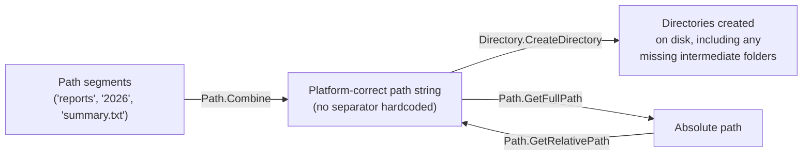
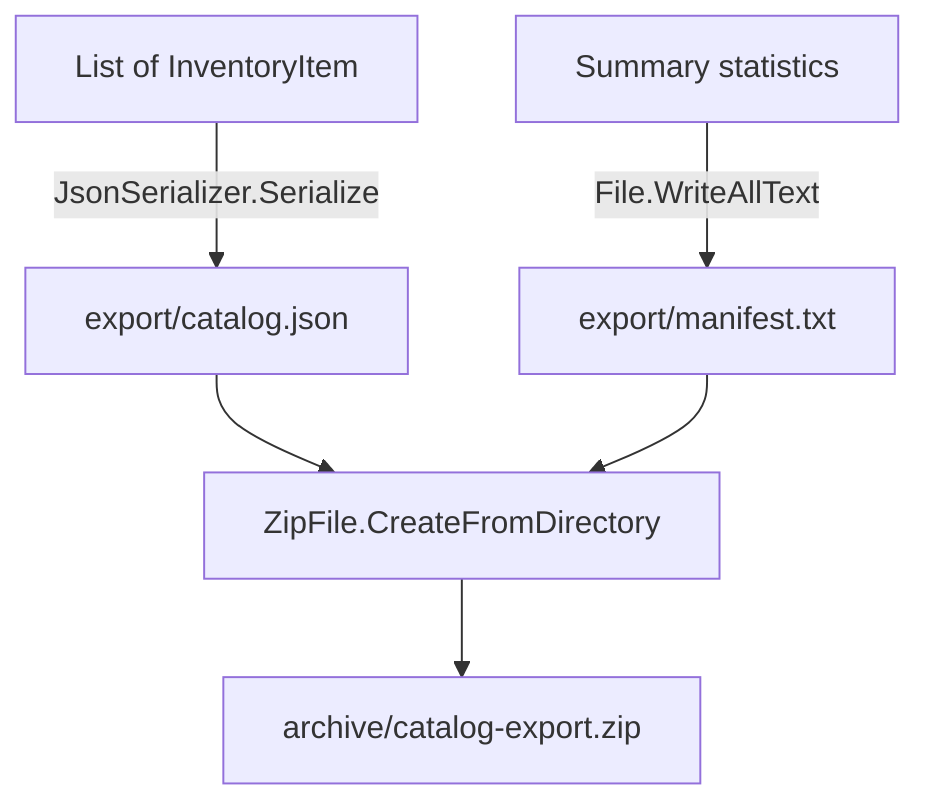
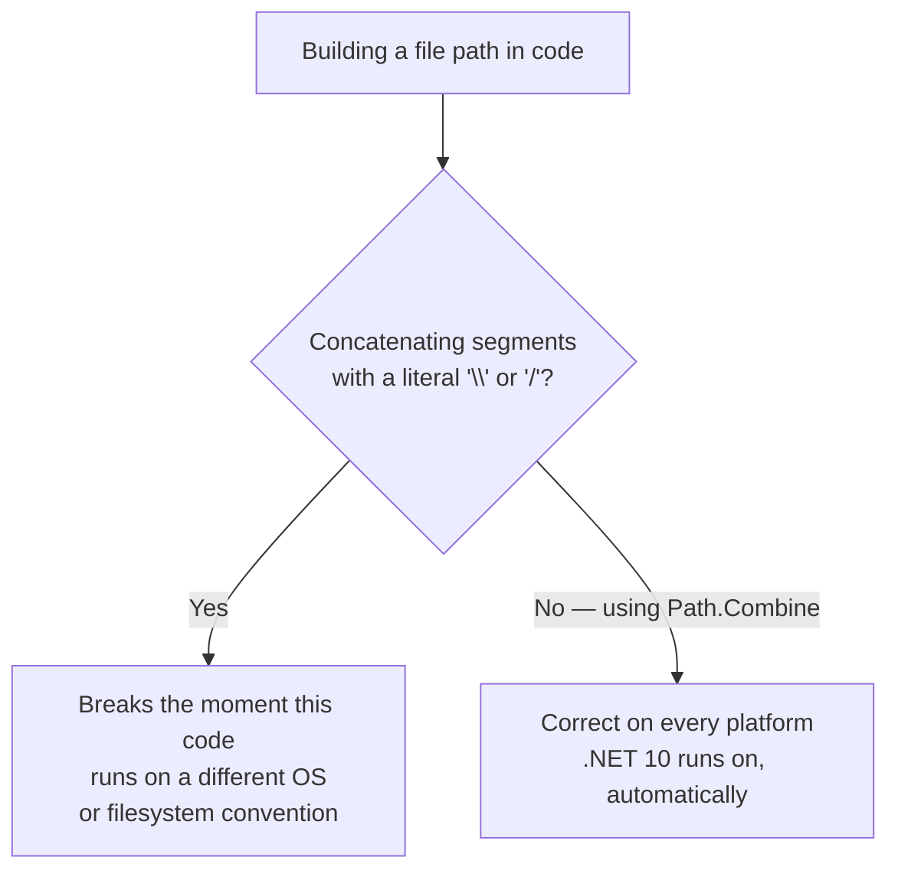

# Working with Directories and Paths

## Introduction

Before reading this lesson, you should already be comfortable with **[Compression with GZip](../09-file-io-serialization/09-09-compression-with-gzip.md)** and, really, with the entire arc of Module 09: opening and reading files and streams, choosing between synchronous and asynchronous I/O, serializing to JSON, XML, and CSV, reacting to file system events, and compressing the results. Every one of those lessons quietly depended on one more piece of plumbing that this lesson finally makes explicit: how to build the *paths* those files live at, and how to create, inspect, and organize the *directories* that contain them — correctly, regardless of which operating system the code ends up running on.

By the end of this lesson, you will be able to:

- Create, inspect, and enumerate directories using `Directory` and `DirectoryInfo`
- Build file paths safely with `Path.Combine`, never by concatenating strings with a hardcoded `\` or `/`
- Resolve relative paths to absolute ones with `Path.GetFullPath`, and reverse the process with `Path.GetRelativePath`
- Explain why hardcoding a path separator breaks cross-platform code, even on .NET's otherwise fully cross-platform runtime
- Combine directory creation, path handling, JSON export, and compression into a single capstone tool, tying together this module's Library/Inventory Management case study

## Working with Directories and Paths — A Layman's Perspective

Picture two people giving directions to the same office building. The first says: "Go to the third floor, then the second door on the left, then the desk by the window." The second says: "Go up three flights of stairs, turn left twice, then walk to the third window from the entrance." Both descriptions get someone to the same desk, but only the first one — "third floor, second door, desk by the window" — describes the *structure* of the building: floor, then room, then position within the room, each step nested cleanly inside the one before it. The second description encodes a series of physical movements that only make sense if you're standing in one specific spot facing one specific direction; change the starting point even slightly, and every single instruction becomes wrong.

A file path is a set of directions to a piece of data, and there are exactly two ways to write those directions down, mirroring the two descriptions above. Building a path by asking, structurally, "the `reports` folder, inside the `2026` folder, inside that, the file called `summary.txt`" is the first kind of description — it names each nested step, and lets whoever's actually walking the building (the operating system) fill in the specific turn-by-turn detail: whether floors are separated by a forward slash or a backslash is an implementation detail of *how that particular building's stairwells are labeled*, not something the directions themselves should have to know or care about.

Building a path by writing `"reports" + "\" + "2026" + "\" + "summary.txt"` is the second kind of description — it bakes in one specific building's stairwell-labeling convention (a backslash) directly into the directions. Follow those exact directions in a building that labels its stairwells with a forward slash instead — a Linux or macOS machine, say — and the directions simply don't resolve to anything; the "building" doesn't recognize a backslash as a floor-separator at all. The mistake isn't obvious from looking at the code, either — it works perfectly on the machine that wrote it, and only breaks the moment it runs somewhere with a different convention.

This is exactly why `Path.Combine` exists, and exactly why it matters even though .NET has run identically on Windows, macOS, and Linux for years now. `Path.Combine("reports", "2026", "summary.txt")` describes the path structurally — "this folder, inside that folder, this file" — and leaves the actual separator character up to whichever operating system's convention actually applies at run time. Writing the separator by hand is describing one specific building's stairwell layout and hoping every building the code ever runs on happens to share it. It usually does, right up until the one time it doesn't.

## Working with Directories and Paths — A Programming Language Perspective

`System.IO.Directory` exposes static methods for creating, moving, deleting, and enumerating directories (`Directory.CreateDirectory`, `Directory.GetFiles`, `Directory.GetDirectories`, `Directory.Delete`) without requiring an instance; `System.IO.DirectoryInfo` wraps the same operations as an object with cached metadata (`FullName`, `Exists`, `LastWriteTime`) and instance methods (`GetFiles()`, `GetFileSystemInfos()`), which is more efficient when performing several operations against the same directory in sequence, since `DirectoryInfo` avoids re-checking security and existence on every call the way the static `Directory` methods do. `System.IO.Path` provides purely string-based, filesystem-agnostic path manipulation: `Path.Combine` joins path segments using the current platform's correct separator (`Path.DirectorySeparatorChar` — `\` on Windows, `/` on Unix-like systems) without ever touching the disk; `Path.GetFullPath` resolves a relative path against the current working directory into an absolute one; and `Path.GetRelativePath` does the reverse, computing a relative path between two absolute ones. `Directory.CreateDirectory` is idempotent and creates every missing intermediate directory in a nested path in one call, which is why `Directory.CreateDirectory(Path.Combine(root, "reports", "2026"))` needs no separate check for whether `root` or `root/reports` already exist.

## How to Work with Directories and Paths in C#

Building a path structurally with `Path.Combine`, then handing that path to `Directory.CreateDirectory` and `DirectoryInfo`, keeps every example in this lesson — and, in spirit, every temp-directory example throughout this module — correct regardless of which operating system runs it.


*Figure 1: `Path.Combine` builds a structurally correct path without ever choosing a separator by hand; `GetFullPath`/`GetRelativePath` convert between absolute and relative forms of the same path.*

```csharp
// Program.cs — .NET 10 / C# 14
string tempDir = Path.Combine(Path.GetTempPath(), "directories-demo");
Directory.CreateDirectory(tempDir);
string nestedDir = Path.Combine(tempDir, "reports", "2026");
Directory.CreateDirectory(nestedDir); // creates all missing intermediate directories too

try
{
    File.WriteAllText(Path.Combine(nestedDir, "summary.txt"), "Q3 report");
    File.WriteAllText(Path.Combine(tempDir, "readme.txt"), "root file");

    string relativeExample = Path.Combine("reports", "2026", "summary.txt");
    Console.WriteLine($"Path.Combine result: {relativeExample}");
    Console.WriteLine($"Is that path rooted (absolute)? {Path.IsPathRooted(relativeExample)}");
    Console.WriteLine($"Is Path.GetFullPath(...) of it rooted? {Path.IsPathRooted(Path.GetFullPath(relativeExample))}");

    DirectoryInfo rootInfo = new(tempDir);
    Console.WriteLine("Top-level entries:");
    foreach (FileSystemInfo entry in rootInfo.GetFileSystemInfos().OrderBy(e => e.Name))
    {
        string kind = entry is DirectoryInfo ? "dir " : "file";
        Console.WriteLine($"  [{kind}] {entry.Name}");
    }

    Console.WriteLine("All files, recursive (relative to tempDir):");
    foreach (string filePath in Directory.GetFiles(tempDir, "*", SearchOption.AllDirectories).OrderBy(p => p))
    {
        string relative = Path.GetRelativePath(tempDir, filePath);
        Console.WriteLine($"  {relative}");
    }
}
finally
{
    Directory.Delete(tempDir, recursive: true);
}
```

**Console Output:**

```text
Path.Combine result: reports\2026\summary.txt
Is that path rooted (absolute)? False
Is Path.GetFullPath(...) of it rooted? True
Top-level entries:
  [file] readme.txt
  [dir ] reports
All files, recursive (relative to tempDir):
  readme.txt
  reports\2026\summary.txt
```

The separator in `reports\2026\summary.txt` is a backslash here because this was run on Windows — the exact same code, run on Linux or macOS, would print `reports/2026/summary.txt` instead, with zero code changes, because `Path.Combine` asked the runtime for the correct separator rather than assuming one. `Directory.CreateDirectory(nestedDir)` created both `reports` and `reports/2026` in a single call even though neither existed yet, and calling it again on an already-existing path is always safe — it simply does nothing, rather than throwing.

## Real-Time Example: A Catalog Export Tool for Library/Inventory Management

We close out the Library/Inventory Management domain — and this module — with a small but complete capstone tool: exporting the current book catalog to JSON, writing a manifest alongside it, and compressing the whole export into a single `.zip` archive for hand-off to another system. It combines directory creation, `Path.Combine`-based path handling, JSON serialization from earlier in this module, and the `System.IO.Compression` namespace introduced in the previous lesson — this time via `ZipFile`, for bundling multiple files rather than compressing a single stream.


*Figure 2 (supporting diagram): Two files land in an `export` directory built with `Path.Combine`, then `ZipFile.CreateFromDirectory` bundles the whole directory into one archive.*

```csharp
// Program.cs — .NET 10 / C# 14 — Real-Time Example
using System.IO.Compression;
using System.Text.Json;

string root = Path.Combine(Path.GetTempPath(), "library-catalog-export-demo");
string exportDir = Path.Combine(root, "export");
string archiveDir = Path.Combine(root, "archive");
Directory.CreateDirectory(exportDir);
Directory.CreateDirectory(archiveDir);

try
{
    List<InventoryItem> catalog =
    [
        new("BK-1001", "The Pragmatic Programmer", 4),
        new("BK-1002", "Clean Code", 2),
        new("BK-1003", "Design Patterns", 0)
    ];

    string catalogJsonPath = Path.Combine(exportDir, "catalog.json");
    File.WriteAllText(catalogJsonPath, JsonSerializer.Serialize(catalog, new JsonSerializerOptions { WriteIndented = true }));

    string manifestPath = Path.Combine(exportDir, "manifest.txt");
    int inStockCount = catalog.Count(item => item.Quantity > 0);
    File.WriteAllText(manifestPath, $"Exported {catalog.Count} item(s), {inStockCount} in stock, on 2026-08-16.");

    Console.WriteLine("Files written to export directory:");
    foreach (string filePath in Directory.GetFiles(exportDir).OrderBy(p => p))
    {
        Console.WriteLine($"  {Path.GetFileName(filePath)}");
    }

    string archivePath = Path.Combine(archiveDir, "catalog-export.zip");
    ZipFile.CreateFromDirectory(exportDir, archivePath, CompressionLevel.Optimal, includeBaseDirectory: false);

    long archiveSize = new FileInfo(archivePath).Length;
    Console.WriteLine($"Created archive: {Path.GetFileName(archivePath)} ({archiveSize} bytes)");

    using ZipArchive openedArchive = ZipFile.OpenRead(archivePath);
    Console.WriteLine("Archive entries:");
    foreach (ZipArchiveEntry entry in openedArchive.Entries.OrderBy(e => e.Name))
    {
        Console.WriteLine($"  {entry.Name} ({entry.Length} bytes uncompressed)");
    }
}
finally
{
    Directory.Delete(root, recursive: true);
}

record InventoryItem(string Sku, string Title, int Quantity);
```

**Console Output:**

```text
Files written to export directory:
  catalog.json
  manifest.txt
Created archive: catalog-export.zip (398 bytes)
Archive entries:
  catalog.json (265 bytes uncompressed)
  manifest.txt (46 bytes uncompressed)
```

Not one path in this tool is built with a hardcoded `\` or `/` — `root`, `exportDir`, `archiveDir`, `catalogJsonPath`, `manifestPath`, and `archivePath` are all produced by `Path.Combine`, which means this exact tool runs unchanged on a Linux build server, a macOS developer's laptop, or a Windows production box. `includeBaseDirectory: false` tells `ZipFile.CreateFromDirectory` to store `catalog.json` and `manifest.txt` at the root of the archive rather than nested inside an extra `export/` folder — a small but real detail that matters to whatever system receives and unzips this archive next. In a real library system, this is the tool an overnight job would run to hand a compact, self-contained catalog snapshot to a partner system, a backup location, or a reporting pipeline — the same shape of problem as the E-Commerce and Banking/ATM exports earlier in this module, solved with the same small set of `Directory`, `Path`, JSON, and compression building blocks.

## Hardcoded Path Strings vs Path.Combine / Path.GetFullPath

Concatenating path segments with a literal `\` or `/` looks harmless in code that only ever runs on the author's own machine — and that's exactly the trap. `Path.Combine` costs nothing extra to write and removes an entire category of bug that otherwise only surfaces the first time the code runs somewhere else: a CI build agent, a Docker container based on Linux, a teammate on macOS. `Path.GetFullPath` and `Path.GetRelativePath` round out the toolkit for converting between absolute and relative forms without ever manually inspecting or rewriting separator characters.


*Figure 3: The literal separator character is the single point of failure — remove it by construction, rather than by remembering to check for it.*

| Aspect | Hardcoded separator | `Path.Combine` / `Path.GetFullPath` |
|---|---|---|
| Cross-platform correctness | Breaks on a different OS's convention | Always correct for the running platform |
| Handles a leading/trailing separator already present | Manual, error-prone | Handled automatically |
| Readability | Looks fine until it fails | Equally readable, and safe |
| Cost to use | None saved by skipping it | None added by using it |

## Module 09 at a Glance

This capstone rests on every lesson in Module 09 — each one is worth revisiting now that they all fit together into a complete picture of file I/O and serialization in .NET:

1. **Introduction to File I/O in .NET** — the foundation this entire module, including this lesson's `Directory`/`Path` work, builds on.
2. **Reading and Writing Files** — the basic `File`/`FileStream` operations that every later lesson's temp-directory examples depended on.
3. **Working with Streams** — the composable `Stream` abstraction that `GZipStream` and every serializer in this module builds on top of.
4. **[System.Text.Json in Depth](../09-file-io-serialization/09-05-system-text-json-in-depth.md)** — the modern serialization default this capstone's catalog export used directly.
5. **[XML Serialization](../09-file-io-serialization/09-06-xml-serialization.md)** — the legacy-interop counterpart to JSON, for when the system on the other end requires it.
6. **[FileSystemWatcher](../09-file-io-serialization/09-08-filesystemwatcher.md)** — reacting automatically to the kinds of files this lesson's tool creates, rather than exporting on a fixed schedule.
7. **[Compression with GZip](../09-file-io-serialization/09-09-compression-with-gzip.md)** — this lesson's direct prerequisite, and the compression building block this capstone extended from a single stream to a whole directory via `ZipFile`.

## What You've Learned & What's Next

`Path.Combine`, `Path.GetFullPath`, and `Path.GetRelativePath` build and resolve file paths structurally, leaving the actual separator character to whichever operating system is running the code — a small habit that costs nothing and prevents an entire class of "works on my machine" bugs. `Directory` and `DirectoryInfo` create and inspect the folder structures those paths point into, and this lesson's capstone tool showed all of it working together: directories built without a single hardcoded separator, a JSON export, a manifest, and a `.zip` archive, bundled with the same case-study discipline this module has followed throughout.

Continue your learning journey with **[Introduction to ASP.NET Core on .NET 10](../10-aspnetcore/10-01-introduction-to-aspnetcore.md)**, the first lesson of Module 10, where the focus shifts from files on a single machine's disk to building web applications and APIs that serve requests over the network.

---
*Applies to: .NET 10 / C# 14. Last reviewed 2026-08-16.*
