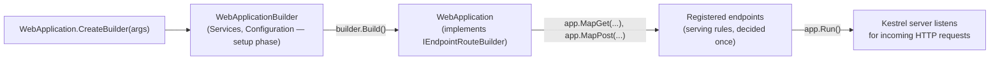
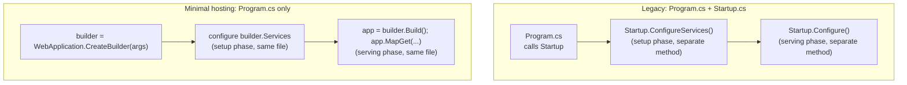

# Introduction to ASP.NET Core on .NET 10

## Introduction

Before reading this lesson, you should already be comfortable with **[Working with Directories and Paths](../09-file-io-serialization/09-10-working-with-directories-and-paths.md)** and, more broadly, with the whole of Module 09: reading and writing files, serializing data to JSON, and organizing results on disk. Every one of those lessons assumed a program that runs once, does its work, and exits. This lesson turns that assumption on its head and introduces **ASP.NET Core**, the part of .NET built for programs that stay running indefinitely, listening for requests that can arrive from anywhere on the network, at any time, from many callers at once.

By the end of this lesson, you will be able to:

- Explain what ASP.NET Core is and how it relates to .NET as a whole
- Describe the roles of `WebApplicationBuilder` and `WebApplication` in the modern hosting model
- Build and run a minimal "Hello World" web API from a handful of lines of C#
- Read the startup log a running ASP.NET Core application prints, and connect it to what actually happened
- Recognize why Minimal APIs are the recommended default starting point for new ASP.NET Core projects on .NET 10
- Preview the roadmap of topics Module 10 will cover, and how they build on one another

## ASP.NET Core — A Layman's Perspective

Imagine everything that has to happen before a restaurant can serve its first customer. Someone decides what's on the menu. Someone hires a host to greet people at the door, a kitchen staffed to cook specific dishes, and a system for matching an order that comes in ("one table for four, ordering the salmon") to the right station in the kitchen. All of that — the hiring, the menu-planning, the assignment of who handles what — happens once, during setup, before the doors ever open to the public. It would be absurd to decide, mid-service, who the head chef is going to be, or to invent a rule about how orders get routed to the grill versus the fryer while a hungry customer is standing at the counter waiting.

Once the doors open, the restaurant enters an entirely different mode. It doesn't do one thing and close for the day — it sits ready, indefinitely, for a stream of customers who show up unannounced, in whatever order they happen to arrive, each expecting to be served according to the rules that were already decided during setup. The host reads what a customer wants, matches it against the fixed menu and fixed staffing plan, and routes the request to the right place. The customer never sees or cares about the hiring and planning phase — they only experience the fast, second phase: walk in, ask for something, get served.

A web application built with ASP.NET Core follows exactly this two-phase shape, and the shape is baked directly into how you write the code. The first phase — deciding what services exist, what configuration to load, what rules govern every request — happens once, at startup, through an object conventionally called a *builder*. You tell the builder everything it needs to know while the restaurant is still empty: register a database connection here, configure logging there, decide which "stations" (endpoints, like `/api/books` or `/api/orders`) exist and what each one does when a request for it arrives. Only after all of that setup is finished do you flip the sign on the door to "open" — and from that moment forward, the application sits and waits, indefinitely, routing each incoming request to the station that was already decided upon, exactly the way a restaurant routes each order to the right kitchen station without re-deciding the menu on the fly.

This is the single most important mental model for everything in this module: **setup happens once, before anything opens; serving happens continuously, after it opens**, and the two phases use different objects and different rules precisely because they are solving different problems. Keep that restaurant in mind, because the two C# objects you are about to meet — `WebApplicationBuilder` for the planning phase, `WebApplication` for the open-for-business phase — map onto it almost exactly.

## ASP.NET Core — A Programming Language Perspective

ASP.NET Core is Microsoft's open-source, cross-platform web framework built directly on top of the .NET runtime — the same runtime, the same `System` namespace, and the same C# language you have used throughout this entire curriculum, now aimed at building HTTP servers instead of console programs. A single project can expose a JSON web API, a real-time hub, or a server-rendered web page, all using the class library and language features already familiar from Modules 01–09.

At the center of every ASP.NET Core application sits the **minimal hosting model**, exposed through two cooperating types in the `Microsoft.AspNetCore.Builder` namespace: `WebApplicationBuilder`, created by the static method `WebApplication.CreateBuilder(args)`, which exposes a `Services` collection (a dependency injection container) and a `Configuration` source for the *setup phase*; and `WebApplication`, produced by calling `builder.Build()`, which implements `IEndpointRouteBuilder` and exposes the `Map*` family of methods (`MapGet`, `MapPost`, and others covered in the next lesson) for the *serving phase*. Calling `app.Run()` starts the built-in Kestrel web server and blocks the calling thread, listening for HTTP requests until the process is shut down.

## How to Build and Run a Minimal ASP.NET Core Application

An ASP.NET Core web project on .NET 10 starts from the same `dotnet new` scaffolding you have used throughout this curriculum, just with a web-focused template (`dotnet new web`) instead of a console one. The generated `Program.cs` follows the two-phase shape from the analogy above: build, then map endpoints, then run.


*Figure 1: `WebApplicationBuilder` handles one-time setup; `WebApplication` maps endpoints and then serves requests indefinitely once `Run()` is called.*

```csharp
// Program.cs — .NET 10 / C# 14
var builder = WebApplication.CreateBuilder(args);

WebApplication app = builder.Build();

app.MapGet("/", () => "Hello, ASP.NET Core on .NET 10!");

app.Run();
```

**Console Output** (the startup log printed to the terminal when this runs with `dotnet run` — not a literal single-line trace the way a console app produces, since the process keeps running until stopped):

```text
info: Microsoft.Hosting.Lifetime[14]
      Now listening on: http://localhost:5000
info: Microsoft.Hosting.Lifetime[0]
      Application started. Press Ctrl+C to shut down.
info: Microsoft.Hosting.Lifetime[0]
      Hosting environment: Development
info: Microsoft.Hosting.Lifetime[0]
      Content root path: C:\dev\hello-aspnetcore
```

With the application sitting in that state, an actual browser tab or `curl http://localhost:5000/` produces the following exchange:

```text
GET / HTTP/1.1
Host: localhost:5000
```

```text
HTTP/1.1 200 OK
Content-Type: text/plain; charset=utf-8

Hello, ASP.NET Core on .NET 10!
```

Nothing here required a database, a controller class, or a configuration file. `WebApplication.CreateBuilder(args)` set up sensible defaults (logging, configuration from `appsettings.json` and environment variables, dependency injection) in one call; `builder.Build()` closed the setup phase and produced the object that can accept endpoint registrations; and `app.MapGet("/", ...)` registered exactly one rule — respond to `GET /` with a plain-text greeting — before `app.Run()` opened the doors and started listening.

## Real-Time Example: A Library Catalog Lookup Service

We open the Library/Inventory Management case study inside this new module with the smallest useful thing an ASP.NET Core application can do for it: expose the book catalog over HTTP so that other systems — a front-end app, a mobile client, a reporting job — can query it without needing direct access to whatever database or file the library system stores it in. This is the same shape of problem the Module 09 capstone solved by writing a JSON file to disk; the difference is that this catalog is now reachable live, over the network, by anyone permitted to call it.

```csharp
// Program.cs — .NET 10 / C# 14 — Real-Time Example
var builder = WebApplication.CreateBuilder(args);
WebApplication app = builder.Build();

List<Book> catalog =
[
    new("978-0135957059", "The Pragmatic Programmer", "David Thomas & Andrew Hunt", 3),
    new("978-0132350884", "Clean Code", "Robert C. Martin", 0),
    new("978-0201633610", "Design Patterns", "Gamma, Helm, Johnson, Vlissides", 1)
];

app.MapGet("/api/books", () => catalog);

app.MapGet("/api/books/{isbn}", (string isbn) =>
{
    Book? match = catalog.FirstOrDefault(b => b.Isbn == isbn);
    return match is not null ? Results.Ok(match) : Results.NotFound();
});

app.Run();

record Book(string Isbn, string Title, string Author, int CopiesAvailable);
```

**Console Output** (illustrative HTTP request/response pairs — the startup log from the previous example also prints, but is omitted here since the endpoint behavior is what matters):

```text
GET /api/books/978-0132350884 HTTP/1.1
Host: localhost:5000
```

```text
HTTP/1.1 200 OK
Content-Type: application/json; charset=utf-8

{"isbn":"978-0132350884","title":"Clean Code","author":"Robert C. Martin","copiesAvailable":0}
```

```text
GET /api/books/000-0000000000 HTTP/1.1
Host: localhost:5000
```

```text
HTTP/1.1 404 Not Found
```

Two small details carry a lot of weight here. First, returning the `catalog` list directly from `MapGet("/api/books", ...)` is enough to produce a JSON array — ASP.NET Core serializes the return value with `System.Text.Json` automatically, using the same serializer this curriculum's Module 09 covered in depth. Second, the second endpoint's lookup either returns `Results.Ok(match)` or `Results.NotFound()`, giving the caller an honest HTTP status code rather than always answering `200 OK` with an empty or null body — the difference between "no such book" and "here is the book, and it happens to have zero fields" matters enormously to whatever client code is calling this API.

## Minimal Hosting vs the Legacy `Startup.cs` Model

Older ASP.NET Core tutorials and codebases (pre-.NET 6) use a two-class startup pattern: a `Program.cs` that only calls into a separate `Startup` class, which in turn defines a `ConfigureServices(IServiceCollection services)` method for the setup phase and a `Configure(IApplicationBuilder app)` method for the serving phase. The minimal hosting model this lesson introduced collapses both of those methods, and both of those classes, into the single flow of `WebApplication.CreateBuilder(args)` → configure `builder` → `builder.Build()` → configure `app` → `app.Run()` — the same two phases, expressed as one continuous, top-to-bottom file instead of two classes that a reader has to mentally stitch back together.


*Figure 2: Both models perform the same two phases; minimal hosting expresses them as one continuous file instead of two cooperating classes.*

| Aspect | Legacy `Startup.cs` model | Minimal hosting (`WebApplicationBuilder`) |
|---|---|---|
| Files/classes needed for setup | `Program.cs` + `Startup.cs` | `Program.cs` only |
| Setup phase | `Startup.ConfigureServices(IServiceCollection)` | Configure `builder.Services` directly |
| Serving phase | `Startup.Configure(IApplicationBuilder)` | Configure `app` directly, then `app.MapGet`/etc. |
| "Hello World" line count | ~20+ lines across two files | 5 lines, one file |
| Status on .NET 10 | Still supported for existing/migrated projects | Default template, recommended starting point |

## Types of ASP.NET Core Application Models

ASP.NET Core is not just one kind of application — it's a family of hosting styles built on the same underlying framework, several of which this module covers directly:

1. **[Minimal APIs](../10-aspnetcore/10-02-minimal-apis.md)** — lightweight, function-based endpoints defined with `MapGet`/`MapPost`/etc., the modern default entry point as of .NET 10.
2. **[Controller-Based APIs](../10-aspnetcore/10-03-controller-based-apis.md)** — attribute-routed `[ApiController]` classes, the fuller MVC-style model many larger teams still choose.
3. **Razor Pages** — a page-focused server-rendered model for classic form-and-page web UI, outside this API-focused module's scope.
4. **Blazor** — component-based interactive UI rendered with C# instead of JavaScript, covered later in Module 15.
5. **gRPC services** — high-performance, contract-first RPC over HTTP/2, covered later in Module 14.
6. **SignalR** — real-time, bidirectional server-to-client communication, also covered later in Module 14.

## What You've Learned & What's Next

ASP.NET Core builds web applications and APIs on top of the same .NET runtime and C# language used throughout this curriculum, structured around a two-phase hosting model: `WebApplicationBuilder` for one-time setup, and `WebApplication` for continuously serving requests once `Run()` is called. A five-line `Program.cs` was enough to stand up a working web API, and the same shape scaled cleanly to a real endpoint returning JSON from the Library/Inventory Management catalog.

Continue your learning journey with **[Minimal APIs](../10-aspnetcore/10-02-minimal-apis.md)**, where we go deeper into `MapGet`, `MapPost`, `MapPut`, and `MapDelete`, route parameters, and the `IResult`/`TypedResults` types this lesson only touched briefly.

---
*Applies to: .NET 10 / C# 14. Last reviewed 2026-08-16.*
