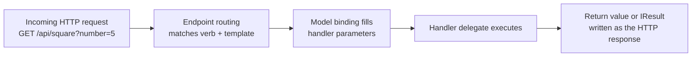
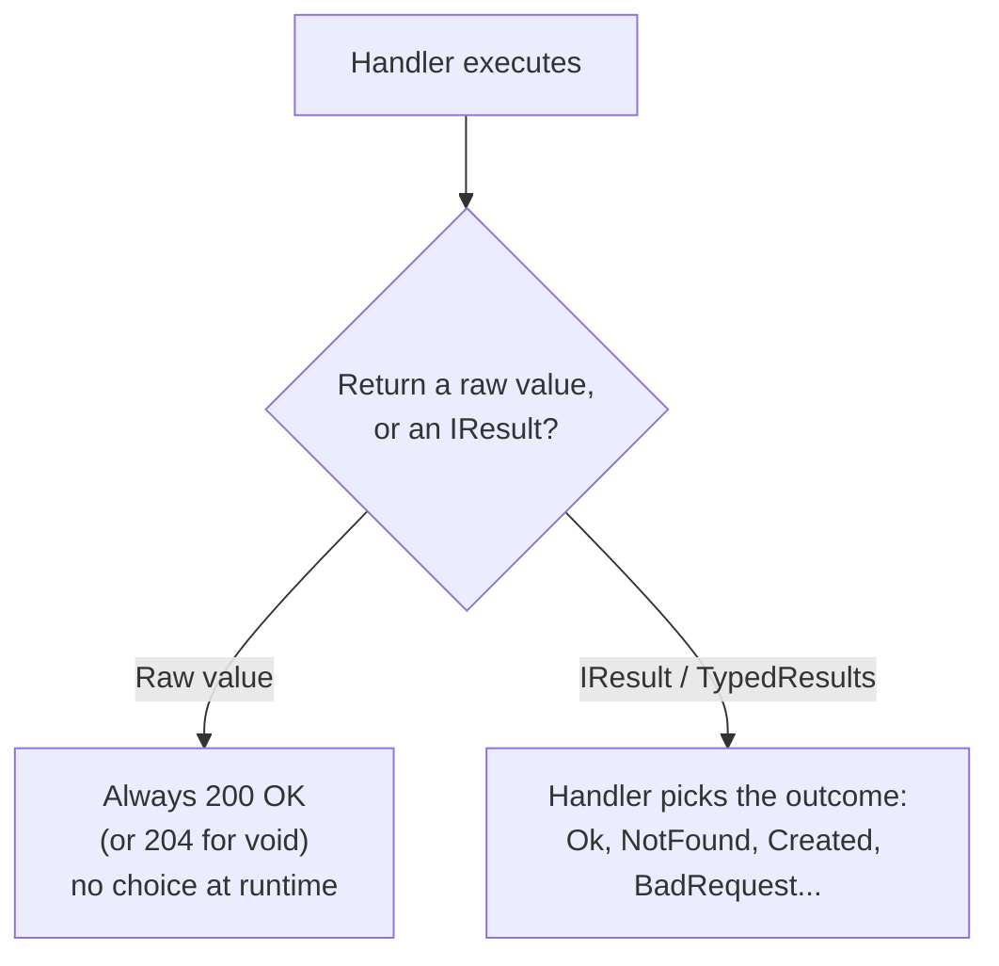

# Minimal APIs

## Introduction

Before reading this lesson, you should already be comfortable with **[Introduction to ASP.NET Core on .NET 10](../10-aspnetcore/10-01-introduction-to-aspnetcore.md)** — specifically the two-phase hosting model, and the one-line `app.MapGet("/", () => "Hello, ASP.NET Core on .NET 10!")` example that lesson ended on. That single call was your first Minimal API endpoint. This lesson expands on it: the full family of `Map*` methods, how their delegate parameters get filled in automatically, and how to return more than a bare string.

By the end of this lesson, you will be able to:

- Register endpoints for every common HTTP verb with `MapGet`, `MapPost`, `MapPut`, and `MapDelete`
- Bind route parameters, query string values, and JSON request bodies to handler parameters automatically
- Return precise HTTP responses using `Results` and `TypedResults` instead of always returning `200 OK`
- Explain why returning `IResult` instead of a raw value gives you control over status codes and headers
- Build a small in-memory E-Commerce order API supporting lookup, creation, status updates, and deletion
- Explain why Minimal APIs are the recommended default starting point for new ASP.NET Core projects on .NET 10

## Minimal APIs — A Layman's Perspective

Picture a food truck instead of a sit-down restaurant. There's no host stand, no waiter taking your order to a kitchen you can't see, no separate cashier station. There's one window. A handwritten sign lists exactly what you can ask for: "burger," "fries," "check order status." You walk up, say one of those things, the person at the window does exactly that one thing, and hands you back exactly what you asked for — cooked to order, wrapped, done. There's no ceremony layered on top of the transaction; the menu item *is* the entire interface.

A Minimal API endpoint is that food truck window, and each line like `app.MapGet("/api/orders/{orderId}", ...)` is one item on the handwritten sign. The route (`/api/orders/{orderId}`) is the thing you ask for, the HTTP verb (`GET`) is *how* you're asking for it — "can I see" versus "please make" versus "please cancel" — and the little function attached to the call is the one and only thing that happens when that specific request arrives. There's no separate class to open, no inheritance chain to trace, no convention to memorize about which method handles which request; the mapping from "what was asked for" to "what code runs" sits in one place, spelled out directly.

This directness is precisely the point, and precisely why food trucks (and Minimal APIs) can be extremely fast to build and extremely fast to reason about. If you want to know what happens when someone asks for "fries," you don't need to understand the truck's entire operating procedure — you just read the one line on the sign. If you want to know what happens on `GET /api/orders/{orderId}`, you read the one `MapGet` call, and the entire behavior for that request is right there: how the `orderId` gets pulled out of the URL, what gets looked up, and exactly what gets handed back.

The trade-off, which the next two lessons explore fully, is the same trade-off a growing food truck business eventually runs into: once the menu grows from three items to three hundred, spread across dozens of trucks run by dozens of different cooks, an unstructured handwritten sign per truck stops scaling, and a more formal, consistent kitchen operation — with standard stations, standard tickets, and standard training — starts to earn its overhead back. That formal kitchen is what a controller-based API gives you. But for a huge number of real APIs — including plenty of production systems serving real traffic — the food truck window never needs to grow into anything bigger, which is exactly why Minimal APIs are the recommended place to start.

## Minimal APIs — A Programming Language Perspective

A Minimal API endpoint is a delegate — typically a lambda expression — registered against an HTTP verb and a route template via an extension method on `IEndpointRouteBuilder`: `MapGet`, `MapPost`, `MapPut`, `MapDelete`, and `MapPatch`, one per verb. ASP.NET Core's model binding fills in the delegate's parameters by convention: a parameter name that matches a `{placeholder}` in the route template binds from the route value; a simple type (`string`, `int`, `bool`, and similar) not present in the route template binds from the query string; and a complex type (a class or record with multiple properties) binds from the JSON request body by default on verbs like `POST` and `PUT`.

A handler may return a plain value, which ASP.NET Core serializes to JSON with an automatic `200 OK` (or `204 No Content` for `void`), or it may return an `IResult` — produced by the static `Results` class or, since .NET 7, the strongly-typed `TypedResults` class — which represents an explicit HTTP response (status code, body, and headers) that ASP.NET Core writes out when the request completes. Returning `IResult` is what makes status codes like `404 Not Found` or `201 Created` possible without hand-writing to `HttpContext.Response` directly.

## How to Define and Use Minimal API Endpoints in C#

Every Minimal API request follows the same path: the routing system matches the incoming method and URL against the registered route templates, binds the matched delegate's parameters from the route, query string, or body, invokes the delegate, and writes whatever `IResult` (or serialized value) comes back.


*Figure 1: Every Minimal API call follows the same route-match, bind, execute, respond pipeline, regardless of which verb or handler is involved.*

```csharp
// Program.cs — .NET 10 / C# 14
var builder = WebApplication.CreateBuilder(args);
WebApplication app = builder.Build();

app.MapGet("/api/greet/{name}", (string name) => TypedResults.Ok($"Hello, {name}!"));

app.MapGet("/api/square", (int number) => TypedResults.Ok(number * number));

app.MapPost("/api/echo", (EchoRequest request) => TypedResults.Ok(request));

app.Run();

record EchoRequest(string Message);
```

**Console Output** (illustrative HTTP request/response pairs, not a literal console app trace — the usual startup log also prints when this runs):

```text
GET /api/greet/Ada HTTP/1.1
```
```text
HTTP/1.1 200 OK
Content-Type: application/json; charset=utf-8

"Hello, Ada!"
```

```text
GET /api/square?number=5 HTTP/1.1
```
```text
HTTP/1.1 200 OK
Content-Type: application/json; charset=utf-8

25
```

```text
POST /api/echo HTTP/1.1
Content-Type: application/json

{"message":"ping"}
```
```text
HTTP/1.1 200 OK
Content-Type: application/json; charset=utf-8

{"message":"ping"}
```

`name` in the first endpoint binds from the route segment because `{name}` appears in the template; `number` in the second binds from the query string because it's a simple type with no matching route segment; and `request` in the third binds from the JSON request body because `EchoRequest` is a multi-property type. None of that binding logic was written by hand — it followed automatically from the parameter's name and type.

## Real-Time Example: An Order API for E-Commerce Order Processing

We open the E-Commerce Order Processing case study inside this module by exposing order lookup, creation, status updates, and cancellation over HTTP — the same `Order` shape this curriculum has used since earlier modules, now reachable by a storefront, a warehouse system, or a customer support tool instead of only by code running in the same process.

```csharp
// Program.cs — .NET 10 / C# 14 — Real-Time Example
var builder = WebApplication.CreateBuilder(args);
WebApplication app = builder.Build();

List<Order> orders =
[
    new("ORD-1001", "Priya Nair", 249.50m, "Shipped"),
    new("ORD-1002", "Miguel Alvarez", 89.00m, "Pending")
];

app.MapGet("/api/orders", () => orders);

app.MapGet("/api/orders/{orderId}", (string orderId) =>
{
    Order? order = orders.FirstOrDefault(o => o.OrderId == orderId);
    return order is not null ? Results.Ok(order) : Results.NotFound();
});

app.MapPost("/api/orders", (CreateOrderRequest request) =>
{
    var order = new Order($"ORD-{1000 + orders.Count + 1}", request.CustomerName, request.Total, "Pending");
    orders.Add(order);
    return Results.Created($"/api/orders/{order.OrderId}", order);
});

app.MapPut("/api/orders/{orderId}/status", (string orderId, UpdateStatusRequest request) =>
{
    int index = orders.FindIndex(o => o.OrderId == orderId);
    if (index < 0)
    {
        return Results.NotFound();
    }

    orders[index] = orders[index] with { Status = request.Status };
    return Results.Ok(orders[index]);
});

app.MapDelete("/api/orders/{orderId}", (string orderId) =>
{
    int removed = orders.RemoveAll(o => o.OrderId == orderId);
    return removed > 0 ? Results.NoContent() : Results.NotFound();
});

app.Run();

record Order(string OrderId, string CustomerName, decimal Total, string Status);
record CreateOrderRequest(string CustomerName, decimal Total);
record UpdateStatusRequest(string Status);
```

**Console Output** (illustrative HTTP request/response pairs):

```text
POST /api/orders HTTP/1.1
Content-Type: application/json

{"customerName":"Wei Zhang","total":150.00}
```
```text
HTTP/1.1 201 Created
Location: /api/orders/ORD-1003
Content-Type: application/json; charset=utf-8

{"orderId":"ORD-1003","customerName":"Wei Zhang","total":150.00,"status":"Pending"}
```

```text
PUT /api/orders/ORD-1002/status HTTP/1.1
Content-Type: application/json

{"status":"Shipped"}
```
```text
HTTP/1.1 200 OK
Content-Type: application/json; charset=utf-8

{"orderId":"ORD-1002","customerName":"Miguel Alvarez","total":89.00,"status":"Shipped"}
```

```text
GET /api/orders/ORD-9999 HTTP/1.1
```
```text
HTTP/1.1 404 Not Found
```

Every response here carries a status code that actually means something: `201 Created` with a `Location` header pointing at the new order's own URL, `200 OK` with the updated record after a status change, and a bare `404 Not Found` for an order ID that doesn't exist — rather than, say, a `200 OK` with a `null` body that the caller has to remember to check for. Because `Order` is a record, updating a status doesn't mutate anything in place; `orders[index] with { Status = request.Status }` produces a new `Order` value with only the `Status` property changed, and that new value replaces the old one in the list — the same non-destructive update pattern records have supported since earlier modules, now driving a live API.

## Returning Raw Values vs IResult / TypedResults

A Minimal API handler is never required to return `IResult` — returning `orders` directly, as the `GET /api/orders` endpoint above does, works perfectly well and produces a `200 OK` with a serialized JSON array. But a raw return value can only ever produce that one automatic outcome. The moment an endpoint needs to say "actually, this one doesn't exist" or "this one was just created, and here's where to find it," a plain return value has no way to express that — the status code is fixed the instant you skip `IResult`.

`Results.Ok(...)`, `Results.NotFound()`, `Results.Created(...)`, and their `TypedResults` counterparts close that gap by making the outcome an explicit, inspectable value the handler chooses at runtime, based on real logic — exactly as the order-lookup and status-update endpoints above chose between `Ok` and `NotFound` depending on whether the order existed. `TypedResults` additionally returns concrete struct types (`Ok<Order>`, `NotFound`, and so on) instead of the plain `IResult` interface that `Results` returns, which gives ASP.NET Core's OpenAPI generation more precise metadata about exactly which status codes and body shapes an endpoint can produce, and gives unit tests something concrete to assert against instead of an opaque interface.


*Figure 2: A raw return value locks in one fixed outcome; returning `IResult` lets the handler's own logic choose the HTTP response.*

| Aspect | Raw return value | `IResult` / `TypedResults` |
|---|---|---|
| Status code | Always `200 OK` (or `204` for `void`) | Chosen by the handler: `200`, `201`, `404`, `400`, etc. |
| Response headers (e.g. `Location`) | Not settable | Settable via factory methods like `Results.Created` |
| OpenAPI metadata | Inferred, generic | Precise per possible outcome with `TypedResults` |
| Boilerplate | None | One extra call per branch |

## Types of IResult Factory Methods in Minimal APIs

`Results` and `TypedResults` expose a large family of factory methods; a handful cover the overwhelming majority of real endpoints:

1. **`Results.Ok(value)` / `TypedResults.Ok(value)`** — `200 OK` with a serialized JSON body.
2. **`Results.NotFound()` / `TypedResults.NotFound()`** — `404 Not Found` with no body.
3. **`Results.Created(uri, value)` / `TypedResults.Created(uri, value)`** — `201 Created` with a `Location` header and the new resource in the body.
4. **`Results.BadRequest(errors)` / `TypedResults.BadRequest(errors)`** — `400 Bad Request`, typically for failed validation.
5. **[Controller-Based APIs](../10-aspnetcore/10-03-controller-based-apis.md)** — the attribute-routed alternative to Minimal API endpoint delegates.
6. **[Minimal APIs vs Controllers](../10-aspnetcore/10-04-minimal-apis-vs-controllers.md)** — a direct decision guide between the two styles.

## What You've Learned & What's Next

`MapGet`, `MapPost`, `MapPut`, and `MapDelete` register one handler delegate per route template and HTTP verb, with parameters bound automatically from the route, the query string, or the JSON body based on name and type. Returning `IResult` — via `Results` or the strongly-typed `TypedResults` — turns a fixed, always-`200-OK` response into a handler-chosen outcome, as the E-Commerce order API's lookup, creation, update, and delete endpoints all demonstrated.

Continue your learning journey with **[Controller-Based APIs](../10-aspnetcore/10-03-controller-based-apis.md)**, where we cover the `[ApiController]`/`ControllerBase` model this lesson's food-truck analogy promised was coming for larger, more convention-heavy teams.

---
*Applies to: .NET 10 / C# 14. Last reviewed 2026-08-16.*
