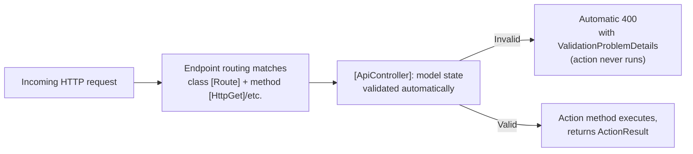
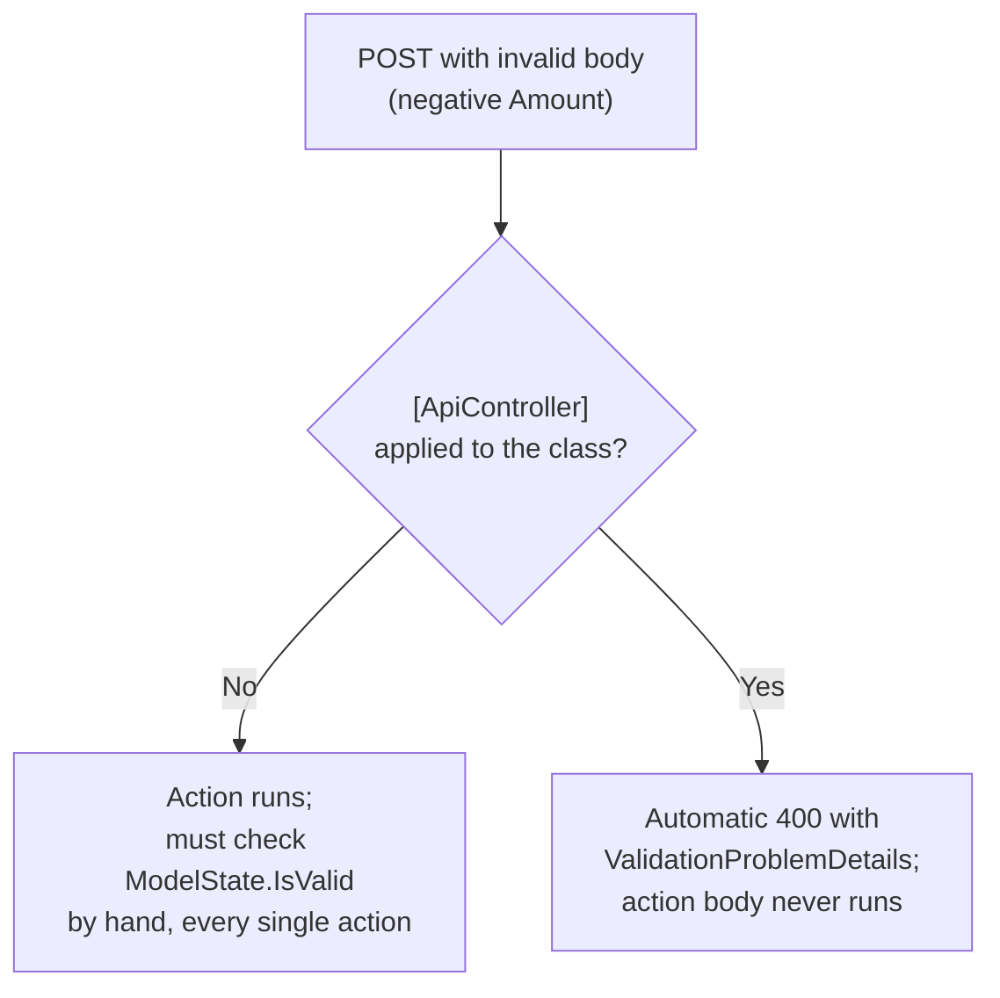

# Controller-Based APIs

## Introduction

Before reading this lesson, you should already be comfortable with **[Minimal APIs](../10-aspnetcore/10-02-minimal-apis.md)** — registering endpoints directly with `MapGet`/`MapPost`/etc. and returning `IResult`. This lesson introduces the second of ASP.NET Core's two major API styles: attribute-routed **controllers**, built on `ControllerBase` and the `[ApiController]` attribute, which organize many related endpoints into a single class instead of many separate top-level delegate registrations.

By the end of this lesson, you will be able to:

- Explain what `ControllerBase` and the `[ApiController]` attribute add to a plain C# class
- Define action methods using `[HttpGet]`, `[HttpPost]`, and `[Route]` attributes
- Register controllers in `Program.cs` with `AddControllers()` and `MapControllers()`
- Describe the automatic model validation and standardized error responses `[ApiController]` provides for free
- Recognize when the fuller MVC-style controller model earns its extra structure over a Minimal API
- Build a Banking/ATM accounts API using an `AccountsController`

## Controller-Based APIs — A Layman's Perspective

Picture a bank branch instead of the food truck from the previous lesson. A bank branch doesn't hand each teller their own handwritten sign of what to do — every teller follows the exact same official procedure book, cover to cover, regardless of which teller window a customer happens to walk up to. Deposit slips look identical no matter which teller processes them. Before any transaction is even attempted, a supervisor's standing rule kicks in automatically: if a form is missing a signature or the numbers don't add up, it gets rejected and handed back with a standard explanation slip — the teller never even starts processing an incomplete form, because the rejection happens as a matter of branch-wide policy, not because any individual teller remembered to check.

This is the deal a controller-based API offers that a Minimal API's handwritten sign doesn't: consistency enforced by the institution itself, rather than by each individual's memory and discipline. A `[Route("api/accounts")]` attribute on an `AccountsController` class is the branch's official form-numbering scheme, applied identically to every action method inside it. An `[HttpGet]` or `[HttpPost]` attribute on a method is one specific transaction type that window handles. And the `[ApiController]` attribute is the standing supervisor's rule: attach it once, to the class, and every action inside automatically gets its incoming forms checked for completeness — rejected forms never even reach the teller's hands, and the rejection slip is written in one standard, predictable format every time, regardless of which teller (which action method) issued it.

The cost of a bank branch, compared to a food truck, is real: hiring a supervisor, printing a procedure book, training every teller to follow the same forms rather than improvising. None of that pays for itself if you're only ever going to serve three customers a day from a single window. But once an operation grows to dozens of teller windows, run by dozens of different people who need to behave identically without personally re-deriving every rule from scratch, that overhead is exactly what keeps the whole branch consistent, auditable, and safe to hand off to someone new. That's the trade this lesson is really about: the same trade a growing engineering team makes when a codebase's API surface grows from a handful of endpoints into dozens, spread across a team where consistency needs to be enforced by the framework rather than by everyone remembering the same conventions.

## Controller-Based APIs — A Programming Language Perspective

`Microsoft.AspNetCore.Mvc.ControllerBase` is the base class for API controllers: it exposes helper methods like `Ok()`, `NotFound()`, and `BadRequest()` that return `IActionResult`/`ActionResult<T>`, along with access to `HttpContext`, `ModelState`, and `Request`/`Response`. Its sibling, `Controller`, derives from `ControllerBase` and additionally supports rendering Razor views — unnecessary weight for a pure JSON API, which is why API controllers inherit from `ControllerBase` directly.

The `[ApiController]` attribute, applied to the class, opts a controller into several conventions specific to Web APIs: automatic `HTTP 400` responses (with a standardized `ValidationProblemDetails` body) whenever bound model state is invalid, *before* the action method body ever runs; automatic inference of parameter binding sources (route, query, or body) without needing `[FromRoute]`/`[FromQuery]`/`[FromBody]` on every parameter; and a requirement that multipart form data be bound explicitly via `[FromForm]`, since it's excluded from that automatic inference. `[Route]` on the class and `[HttpGet]`/`[HttpPost]`/`[HttpPut]`/`[HttpDelete]` on action methods compose together to form each action's final route template.

## How to Define a Controller-Based API in C#

A controller-based API needs one extra registration step compared to Minimal APIs: `builder.Services.AddControllers()` registers the MVC framework's services, and `app.MapControllers()` tells the routing system to scan for, and register routes from, every `[ApiController]`-decorated class in the assembly.


*Figure 1: `[ApiController]` intercepts invalid requests before the action method body runs at all — a Minimal API endpoint has no equivalent automatic step.*

```csharp
// Program.cs — .NET 10 / C# 14
using Microsoft.AspNetCore.Mvc;

var builder = WebApplication.CreateBuilder(args);
builder.Services.AddControllers();

WebApplication app = builder.Build();
app.MapControllers();
app.Run();

[ApiController]
[Route("api/greetings")]
public class GreetingsController : ControllerBase
{
    [HttpGet("{name}")]
    public ActionResult<string> Get(string name) => Ok($"Hello, {name}!");
}
```

**Console Output** (illustrative HTTP request/response, not a literal console app trace — the usual startup log also prints when this runs):

```text
GET /api/greetings/Ada HTTP/1.1
```
```text
HTTP/1.1 200 OK
Content-Type: application/json; charset=utf-8

"Hello, Ada!"
```

`[Route("api/greetings")]` on the class fixes the shared prefix every action method builds on; `[HttpGet("{name}")]` on the `Get` method appends `{name}` to that prefix and restricts the action to `GET` requests. `Ok($"Hello, {name}!")` — one of `ControllerBase`'s inherited helper methods — is functionally identical to the `Results.Ok(...)`/`TypedResults.Ok(...)` calls from the previous lesson, just spelled differently because it's a base-class method rather than a static factory.

## Real-Time Example: An Accounts API for Banking/ATM

We open the Banking/ATM case study inside this module with an `AccountsController` exposing account lookup and deposits — and, more importantly, demonstrating exactly what `[ApiController]`'s automatic validation buys a banking system, where accepting a malformed deposit amount isn't a cosmetic bug, it's a correctness incident.

```csharp
// Program.cs — .NET 10 / C# 14 — Real-Time Example
using System.ComponentModel.DataAnnotations;
using Microsoft.AspNetCore.Mvc;

var builder = WebApplication.CreateBuilder(args);
builder.Services.AddControllers();

WebApplication app = builder.Build();
app.MapControllers();
app.Run();

[ApiController]
[Route("api/accounts")]
public class AccountsController : ControllerBase
{
    private static readonly List<Account> Accounts =
    [
        new("ACC-2001", 1500.00m),
        new("ACC-2002", 42.75m)
    ];

    [HttpGet("{accountNumber}")]
    public ActionResult<Account> GetByNumber(string accountNumber)
    {
        Account? account = Accounts.FirstOrDefault(a => a.AccountNumber == accountNumber);
        return account is not null ? Ok(account) : NotFound();
    }

    [HttpPost("{accountNumber}/deposit")]
    public ActionResult<Account> Deposit(string accountNumber, DepositRequest request)
    {
        int index = Accounts.FindIndex(a => a.AccountNumber == accountNumber);
        if (index < 0)
        {
            return NotFound();
        }

        Accounts[index] = Accounts[index] with { Balance = Accounts[index].Balance + request.Amount };
        return Ok(Accounts[index]);
    }
}

record Account(string AccountNumber, decimal Balance);
record DepositRequest([property: Range(0.01, double.MaxValue)] decimal Amount);
```

**Console Output** (illustrative HTTP request/response pairs):

```text
POST /api/accounts/ACC-2002/deposit HTTP/1.1
Content-Type: application/json

{"amount": -5}
```
```text
HTTP/1.1 400 Bad Request
Content-Type: application/problem+json; charset=utf-8

{
  "type": "https://tools.ietf.org/html/rfc9110#section-15.5.1",
  "title": "One or more validation errors occurred.",
  "status": 400,
  "errors": {
    "Amount": [
      "The field Amount must be between 0.01 and 1.7976931348623157E+308."
    ]
  },
  "traceId": "00-4b1c9f2e8a3d4e0f9c8b7a6d5e4f3210-00"
}
```

```text
POST /api/accounts/ACC-2002/deposit HTTP/1.1
Content-Type: application/json

{"amount": 25.00}
```
```text
HTTP/1.1 200 OK
Content-Type: application/json; charset=utf-8

{"accountNumber":"ACC-2002","balance":67.75}
```

Notice that the `-5` deposit never reached the `Deposit` action's body at all — `[property: Range(0.01, double.MaxValue)]` on `DepositRequest.Amount` failed model validation, and `[ApiController]` turned that failure into a standardized `400` before a single line of the method ran. In a real banking system, that's an entire category of "how did a negative deposit ever get this far" incident that the framework closes off by convention, for every action on every controller in the project, without a single `if` statement written by hand.

## [ApiController] Enabled vs Plain ControllerBase

A class can derive from `ControllerBase` without the `[ApiController]` attribute — it will still route requests to actions and still expose `Ok()`/`NotFound()`/`BadRequest()`. What it loses is everything `[ApiController]` adds *automatically*: without it, an invalid `DepositRequest` would bind successfully (accepting `-5` as a normal decimal), and the action method would need to check `ModelState.IsValid` itself and manually return `BadRequest(ModelState)` — logic that has to be remembered and repeated in every single action, on every single controller, across an entire codebase.


*Figure 2: `[ApiController]` moves validation enforcement from "something every action remembers to do" to "something the framework guarantees happens."*

| Aspect | Plain `ControllerBase` (no `[ApiController]`) | `ControllerBase` + `[ApiController]` |
|---|---|---|
| Invalid model state | Action runs; must check `ModelState.IsValid` manually | Automatic `400` with `ValidationProblemDetails`; action never runs |
| Binding source inference | Must specify `[FromBody]`/`[FromRoute]`/`[FromQuery]` explicitly | Inferred automatically by convention |
| Multipart form data | Bound like any other complex type | Must opt in explicitly with `[FromForm]` |
| Error response format | Whatever the action builds by hand | Standardized RFC 9110 problem-details JSON |

## Types of Controller Base Classes and Routing Attributes

Controller-based APIs are built from a small, composable set of base classes and attributes, most of which this module touches directly:

1. **`ControllerBase`** — the base class for API controllers, with no view-rendering support.
2. **`Controller`** — adds Razor view rendering on top of `ControllerBase`, for server-rendered MVC apps rather than pure APIs.
3. **`[ApiController]`** — opts a controller into automatic model validation, binding-source inference, and standardized problem-details error responses.
4. **`[Route]` / `[HttpGet]` / `[HttpPost]` / `[HttpPut]` / `[HttpDelete]`** — attribute routing on the class and its action methods.
5. **[Minimal APIs](../10-aspnetcore/10-02-minimal-apis.md)** — the lighter-weight alternative this lesson built on.
6. **[Minimal APIs vs Controllers](../10-aspnetcore/10-04-minimal-apis-vs-controllers.md)** — a direct, side-by-side decision guide between the two styles.

## What You've Learned & What's Next

`ControllerBase` provides the action-result helpers an API controller needs, and the `[ApiController]` attribute layers automatic model validation, binding-source inference, and standardized error responses on top — enforced by the framework for every action, rather than remembered by every developer. `[Route]`, `[HttpGet]`, and `[HttpPost]` compose class-level and method-level routing into each action's final URL, and the Banking/ATM `AccountsController` showed exactly what that automatic validation buys a system where a malformed request is more than a cosmetic problem.

Continue your learning journey with **[Minimal APIs vs Controllers — Comparison](../10-aspnetcore/10-04-minimal-apis-vs-controllers.md)**, where we implement the same endpoint both ways, side by side, and build a decision table for choosing between them.

---
*Applies to: .NET 10 / C# 14. Last reviewed 2026-08-16.*
