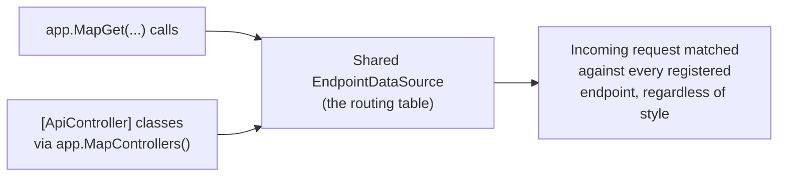
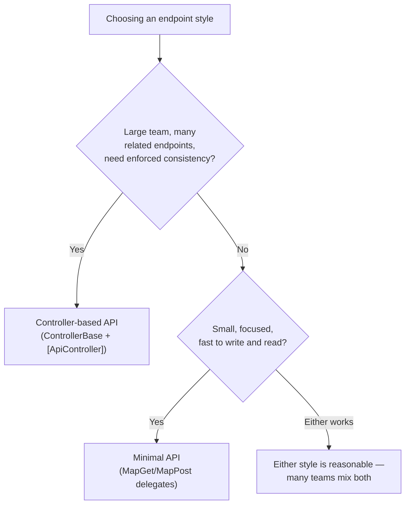

# Minimal APIs vs Controllers — Comparison

## Introduction

Before reading this lesson, you should already be comfortable with both **[Minimal APIs](../10-aspnetcore/10-02-minimal-apis.md)** and **[Controller-Based APIs](../10-aspnetcore/10-03-controller-based-apis.md)** — the two previous lessons built the exact same kind of lookup-and-mutate endpoints using each style separately. This lesson puts them next to each other, implements the same endpoint both ways, and turns the informal trade-offs from those two lessons into a decision table you can actually apply to a real project.

By the end of this lesson, you will be able to:

- Implement the same endpoint as both a Minimal API and a controller action, and confirm they produce identical HTTP responses
- Register Minimal API endpoints and controllers in the same application, and explain why that's possible
- Compare the two styles across project size, team convention preference, testability, and performance
- Apply a decision table to choose the right style for a given project, or a given endpoint
- Extend the Library/Inventory Management case study with a new checkout endpoint

## Minimal APIs vs Controllers — A Layman's Perspective

Deciding between the two styles is really the same decision as choosing whether to open a food truck or charter a full bank branch, and the right answer genuinely depends on what you're actually trying to run. A single vendor testing whether a new neighborhood wants Thai food doesn't need a leased building, a hiring plan, or a procedures manual — a food truck lets them find out within a week, for the cost of a truck and a griddle, and if the location doesn't work out, they simply drive somewhere else. Chartering a retail bank for that same test would be absurd: months of setup, a legal structure, a compliance department, all before serving a single customer.

Now flip the scenario. A retail bank with regulatory reporting obligations, dozens of physical branches, and hundreds of employees who've never met each other cannot run on handwritten signs at individual windows — if teller A's sign says something subtly different from teller B's sign three branches over, that inconsistency isn't quirky, it's a compliance incident waiting to happen. The bank branch's overhead — the procedures manual, the standing supervisor, the identical forms at every window — isn't bureaucracy for its own sake; it's the only way hundreds of people who don't personally know each other can behave identically without being individually reminded of every rule, every single day.

Here's the detail that makes this decision genuinely different from a real business choice, though: a software team doesn't have to pick exactly one. The same bank holding company can absolutely run a few community food trucks alongside its formal branches — nothing about owning branches prevents also owning trucks, because both ultimately serve the same customers through the same underlying city streets. An ASP.NET Core application is no different: `MapGet` calls and `[ApiController]` classes both compile down to the exact same routing system underneath, so a real project can — and often does — mix both styles, using controllers where a large, convention-heavy surface benefits from enforced structure, and Minimal APIs for the small, fast-moving handful of endpoints that don't need it.

## Minimal APIs vs Controllers — A Programming Language Perspective

Underneath both styles sits the same **endpoint routing** system: every `MapGet`/`MapPost` call and every `[ApiController]` action ultimately becomes a `RouteEndpoint` registered against the same `EndpointDataSource` that `app.Run()` dispatches incoming requests against. `builder.Services.AddControllers()` and `app.MapControllers()` add controller-discovered endpoints into that same collection alongside any `Map*` calls already present in `Program.cs` — which is precisely why a single application can register both styles side by side without conflict, provided their route templates don't overlap.

The practical difference is not capability — either style can bind route parameters, return typed results, and integrate with dependency injection — but *structure*: Minimal APIs express each endpoint as an independent delegate at the call site, while controllers group related endpoints into a class that can share private state, constructor-injected dependencies, and cross-cutting behavior like filters and `[ApiController]`'s automatic validation.

## How to Register Both Styles in the Same Application

Because both styles feed the same underlying routing table, mixing them requires no special configuration beyond registering both — `AddControllers()`/`MapControllers()` for the controller side, and ordinary `MapGet`/`MapPost` calls for the Minimal API side.


*Figure 1: Minimal API delegates and controller actions both register into the same routing table — the choice of style doesn't change how requests get matched.*

```csharp
// Program.cs — .NET 10 / C# 14
using Microsoft.AspNetCore.Mvc;

var builder = WebApplication.CreateBuilder(args);
builder.Services.AddControllers();

WebApplication app = builder.Build();

app.MapGet("/api/ping", () => "pong");
app.MapControllers();

app.Run();

[ApiController]
[Route("api/status")]
public class StatusController : ControllerBase
{
    [HttpGet]
    public ActionResult<string> Get() => Ok("healthy");
}
```

**Console Output** (illustrative HTTP request/response pairs — the usual startup log also prints when this runs):

```text
GET /api/ping HTTP/1.1
```
```text
HTTP/1.1 200 OK
Content-Type: application/json; charset=utf-8

"pong"
```

```text
GET /api/status HTTP/1.1
```
```text
HTTP/1.1 200 OK
Content-Type: application/json; charset=utf-8

"healthy"
```

`/api/ping` is served by a Minimal API delegate; `/api/status` is served by a controller action — both registered in the same five-line `Program.cs`, both answering `200 OK` through the same request pipeline. Nothing about choosing one style for one endpoint prevents choosing the other style for a different endpoint in the same project.

## Real-Time Example: A Checkout Endpoint for Library/Inventory Management

We extend the Library/Inventory Management `Book` catalog from the previous two lessons with a new business action — checking a book out — implemented as a Minimal API, since that's the default starting point on .NET 10 for a small, focused piece of functionality like this one.

```csharp
// Program.cs — .NET 10 / C# 14 — Real-Time Example
var builder = WebApplication.CreateBuilder(args);
WebApplication app = builder.Build();

List<Book> catalog =
[
    new("978-0135957059", "The Pragmatic Programmer", "David Thomas & Andrew Hunt", 3),
    new("978-0132350884", "Clean Code", "Robert C. Martin", 0)
];

app.MapPost("/api/books/{isbn}/checkout", (string isbn) =>
{
    int index = catalog.FindIndex(b => b.Isbn == isbn);
    if (index < 0)
    {
        return Results.NotFound();
    }

    Book book = catalog[index];
    if (book.CopiesAvailable <= 0)
    {
        return Results.Conflict($"No copies of '{book.Title}' are currently available.");
    }

    catalog[index] = book with { CopiesAvailable = book.CopiesAvailable - 1 };
    return Results.Ok(catalog[index]);
});

app.Run();

record Book(string Isbn, string Title, string Author, int CopiesAvailable);
```

**Console Output** (illustrative HTTP request/response pairs):

```text
POST /api/books/978-0135957059/checkout HTTP/1.1
```
```text
HTTP/1.1 200 OK
Content-Type: application/json; charset=utf-8

{"isbn":"978-0135957059","title":"The Pragmatic Programmer","author":"David Thomas & Andrew Hunt","copiesAvailable":2}
```

```text
POST /api/books/978-0132350884/checkout HTTP/1.1
```
```text
HTTP/1.1 409 Conflict
Content-Type: application/json; charset=utf-8

"No copies of 'Clean Code' are currently available."
```

`Results.Conflict(...)` returns `409 Conflict`, an honest signal that the request itself was well-formed but the checkout can't happen right now — a meaningfully different situation from `404 Not Found` (no such book) and worth its own status code rather than being folded into a generic error. A single focused endpoint like this one is exactly the case where a Minimal API's directness — no controller class, no extra ceremony — pays off immediately.

## Minimal APIs vs Controllers — Implementing the Same Endpoint Both Ways

The clearest way to compare the two styles is to implement the *exact same endpoint* — looking up a book by ISBN — using each one, and confirm they produce identical HTTP behavior. Only the shape of the code differs.

```csharp
// Program.cs — .NET 10 / C# 14 — Minimal API style
var builder = WebApplication.CreateBuilder(args);
WebApplication app = builder.Build();

List<Book> catalog =
[
    new("978-0135957059", "The Pragmatic Programmer", "David Thomas & Andrew Hunt", 3),
    new("978-0132350884", "Clean Code", "Robert C. Martin", 0)
];

app.MapGet("/api/books/{isbn}", (string isbn) =>
{
    Book? match = catalog.FirstOrDefault(b => b.Isbn == isbn);
    return match is not null ? Results.Ok(match) : Results.NotFound();
});

app.Run();

record Book(string Isbn, string Title, string Author, int CopiesAvailable);
```

```csharp
// Program.cs — .NET 10 / C# 14 — Controller style
using Microsoft.AspNetCore.Mvc;

var builder = WebApplication.CreateBuilder(args);
builder.Services.AddControllers();
builder.Services.AddSingleton<List<Book>>(_ =>
[
    new("978-0135957059", "The Pragmatic Programmer", "David Thomas & Andrew Hunt", 3),
    new("978-0132350884", "Clean Code", "Robert C. Martin", 0)
]);

WebApplication app = builder.Build();
app.MapControllers();
app.Run();

[ApiController]
[Route("api/books")]
public class BooksController(List<Book> catalog) : ControllerBase
{
    [HttpGet("{isbn}")]
    public ActionResult<Book> GetByIsbn(string isbn)
    {
        Book? match = catalog.FirstOrDefault(b => b.Isbn == isbn);
        return match is not null ? Ok(match) : NotFound();
    }
}

record Book(string Isbn, string Title, string Author, int CopiesAvailable);
```

**Console Output** (identical for both implementations above — illustrative HTTP request/response pairs):

```text
GET /api/books/978-0132350884 HTTP/1.1
```
```text
HTTP/1.1 200 OK
Content-Type: application/json; charset=utf-8

{"isbn":"978-0132350884","title":"Clean Code","author":"Robert C. Martin","copiesAvailable":0}
```

```text
GET /api/books/000-0000000000 HTTP/1.1
```
```text
HTTP/1.1 404 Not Found
```

Both versions bind `isbn` from the route, look it up the same way, and return the same `200`/`404` outcomes — a caller sending these exact requests could not tell which style answered them. The Minimal API version needs six lines to get to the endpoint declaration; the controller version needs a dedicated class, a constructor parameter for dependency injection, and two extra registration calls, but in exchange it gains a home for future related endpoints (`POST`, `PUT`, `DELETE` on the same `BooksController`) that can share the injected `catalog` without re-declaring it, plus every `[ApiController]` convention from the previous lesson.


*Figure 2: Team size and consistency requirements — not raw capability — drive the real-world choice between the two styles.*

| Aspect | Minimal APIs | Controllers |
|---|---|---|
| Project size / endpoint count | Best for a small-to-moderate number of endpoints | Scales better once dozens of related endpoints accumulate |
| Team convention preference | Favors teams comfortable with direct, per-endpoint code | Favors teams that want the framework to enforce shared conventions |
| Testability | Handlers are plain delegates — easy to unit test in isolation | Actions are class methods — equally testable, plus supports mocking constructor-injected dependencies |
| Performance | Marginally lower request overhead (no controller activation/model binding pipeline) | Slightly more overhead per request, generally immaterial for typical workloads |

Neither row in that table is a disqualifier on its own — plenty of large, well-run APIs use Minimal APIs throughout, and plenty of small APIs use controllers because a team is more comfortable with that structure. The .NET 10 template default leans toward Minimal APIs specifically because most new projects start small, and starting with the lighter-weight option costs nothing to grow out of later.

## Ways Teams Typically Structure This Decision

There isn't one universally correct answer, which is why real projects tend to land on one of a small number of recognizable patterns:

1. **[Minimal APIs](../10-aspnetcore/10-02-minimal-apis.md) throughout** — chosen for small services, prototypes, or teams that prefer directness over enforced structure.
2. **[Controller-Based APIs](../10-aspnetcore/10-03-controller-based-apis.md) throughout** — chosen for large, long-lived APIs where consistency across many endpoints matters more than per-endpoint brevity.
3. **A deliberate hybrid** — controllers for the large, stable core of an API; Minimal APIs for a handful of small, fast-moving endpoints added later, exactly as this lesson's `/api/ping` and `/api/status` example mixed both in one file.
4. **[Routing and Endpoints](../10-aspnetcore/10-05-routing-and-endpoints.md)** — the shared routing concepts, like route constraints and route groups, that apply to both styles equally.
5. **[The Middleware Pipeline](../10-aspnetcore/10-06-the-middleware-pipeline.md)** — the request-processing layer both styles sit on top of, regardless of which one an endpoint uses.

## What You've Learned & What's Next

Minimal APIs and controllers are two different ways of expressing endpoints on top of the exact same underlying routing system, capable of coexisting in a single application. The choice between them comes down to project size, team convention preference, testability needs, and (marginally) performance — not raw capability, since the side-by-side `GET /api/books/{isbn}` implementation produced identical behavior either way.

Continue your learning journey with **[Routing and Endpoints](../10-aspnetcore/10-05-routing-and-endpoints.md)**, where we go deeper into route templates, constraints, and route groups — concepts that apply equally whether your endpoints are Minimal API delegates or controller actions.

---
*Applies to: .NET 10 / C# 14. Last reviewed 2026-08-16.*
