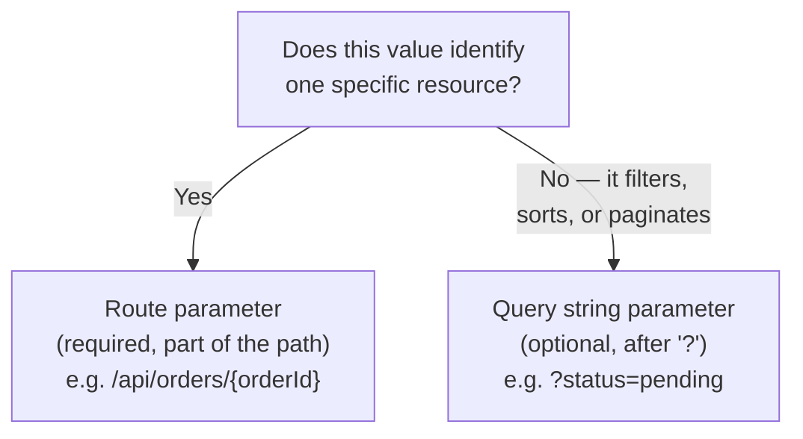

# Routing and Endpoints

## Introduction

Before reading this lesson, you should already be comfortable with **[Minimal APIs vs Controllers — Comparison](../10-aspnetcore/10-04-minimal-apis-vs-controllers.md)**, particularly the idea that both endpoint styles register into the same underlying routing table. This lesson opens that routing table up directly: how route templates and constraints control exactly which requests match, when a value belongs in the route versus the query string, and how `MapGroup` organizes many related endpoints instead of repeating the same prefix and configuration on every single one.

By the end of this lesson, you will be able to:

- Write route templates with parameters and constraints, such as `{id:int}` and `{code:regex(...)}`
- Explain when a value belongs in the route path versus the query string, and why that choice matters
- Describe `IEndpointRouteBuilder` and how both `WebApplication` and `MapGroup` implement it
- Organize related endpoints into a route group with `MapGroup`, sharing a prefix and metadata across all of them
- Explain what happens, internally, between a request arriving and a handler running
- Extend the E-Commerce Order Processing case study with a grouped, filterable orders API

## Routing and Endpoints — A Layman's Perspective

Picture the directory board at the entrance of a large shopping mall. Every store has a fixed, numbered storefront — "Unit 114," "Unit 220" — and the mall's directory maps each number to exactly one store. That numbering is a route template: a fixed pattern with one placeholder slot (the unit number) that the mall's layout fills in for every actual store. Some units have an extra rule attached beyond just having a number — an age-restricted shop won't let someone in unless their ID matches a specific format, the same way a route can refuse to match a URL segment unless it satisfies a constraint like "must be a whole number" or "must look like `AB-123`."

Now picture two different kinds of information a shopper carries around. "I want to go to Unit 114" identifies one specific, exact place — there's no ambiguity about which unit that sentence refers to, and the mall's directory is built entirely around resolving exactly that. "Show me the shoe stores that are having a sale" is a completely different kind of request — it's not asking for one exact place, it's asking the whole mall to filter and narrow down a broader set of options based on some criteria that could be present, absent, or combined with other criteria. The first kind of information is what a route parameter captures — it identifies *which one*. The second is what a query string captures — it *filters or modifies* a broader request without identifying a single specific target.

Finally, picture how a mall actually organizes its units, rather than treating every storefront as a totally independent, unrelated space. A "wing" of the mall — say, the food court, or an entire floor of children's clothing stores — often shares one main entrance, one shared set of restrooms, one shared security desk, and one shared set of opening hours, rather than requiring every single store inside that wing to individually re-establish all of that from scratch. Grouping stores into a wing doesn't change what any individual store sells — it just means the shared parts of running that wing get configured once, at the wing level, instead of once per store.

Every one of those three ideas — a fixed-position numbered slot, a constraint on what's allowed to fill that slot, and grouping a related set of storefronts under one shared configuration — maps directly onto route templates, route constraints, and `MapGroup` in ASP.NET Core. The routing system's whole job is exactly what the mall directory's job is: take an address someone hands it, and resolve it to exactly one destination, as fast and as unambiguously as possible.

## Routing and Endpoints — A Programming Language Perspective

A route template is a string containing literal segments and `{parameter}` placeholders, optionally annotated with a type constraint after a colon — `{id:int}` matches only an integer segment, `{page:int:min(1)}` chains multiple constraints, and `{code:regex(pattern)}` matches against an arbitrary regular expression. A **route parameter** binds from the specific URL path segment its placeholder occupies and, by default, is required — a missing segment simply fails to match the route at all. A **query string parameter** binds from a `?key=value` pair appended after the path and, for a nullable or default-valued handler parameter, is optional; it does not participate in route matching at all.

`IEndpointRouteBuilder` is the interface that exposes the `Map*` family of methods (`MapGet`, `MapPost`, and the rest); both `WebApplication` (from `builder.Build()`) and the `RouteGroupBuilder` returned by `MapGroup(prefix)` implement it, which is why endpoints can be mapped either directly on `app` or through a group with identical syntax. Internally, each `Map*` call registers a `RouteEndpoint` into a shared `EndpointDataSource`; when a request arrives, ASP.NET Core's routing middleware matches the request's method and path against every registered endpoint's template and constraints, selects the single best match, and hands the request to that endpoint's handler.

## How to Define Route Templates, Constraints, and Groups in C#

`MapGroup` returns a builder that behaves exactly like `app` for the purpose of calling `Map*` — the only difference is that every route registered through it is automatically prefixed, and shared configuration like tags or authorization can be attached to the group once instead of to every endpoint individually.

```mermaid
flowchart LR
    A["app.MapGroup(\"/api/items\")"] --> B["RouteGroupBuilder\n(implements IEndpointRouteBuilder)"]
    B -->|"items.MapGet(\"/{id:int}\", ...)"| C["Endpoint: GET /api/items/{id:int}"]
    B -->|"items.MapGet(\"/search\", ...)"| D["Endpoint: GET /api/items/search"]
    C --> E["Shared EndpointDataSource"]
    D --> E
```
*Figure 1: `MapGroup` returns a builder with the same `Map*` methods as `app`, just scoped under a shared prefix — both feed the same underlying endpoint collection.*

```csharp
// Program.cs — .NET 10 / C# 14
var builder = WebApplication.CreateBuilder(args);
WebApplication app = builder.Build();

var items = app.MapGroup("/api/items");

items.MapGet("/{id:int}", (int id) => $"Item #{id}");

items.MapGet("/search", (string term, int page = 1) => $"Searching for '{term}', page {page}");

items.MapGet("/by-code/{code:regex(^[A-Z][A-Z]-[0-9][0-9][0-9]$)}", (string code) => $"Looking up product code {code}");

app.Run();
```

**Console Output** (illustrative HTTP request/response pairs — the usual startup log also prints when this runs):

```text
GET /api/items/42 HTTP/1.1
```
```text
HTTP/1.1 200 OK
Content-Type: application/json; charset=utf-8

"Item #42"
```

```text
GET /api/items/abc HTTP/1.1
```
```text
HTTP/1.1 404 Not Found
```

```text
GET /api/items/search?term=widget HTTP/1.1
```
```text
HTTP/1.1 200 OK
Content-Type: application/json; charset=utf-8

"Searching for 'widget', page 1"
```

```text
GET /api/items/by-code/AB-123 HTTP/1.1
```
```text
HTTP/1.1 200 OK
Content-Type: application/json; charset=utf-8

"Looking up product code AB-123"
```

`GET /api/items/abc` returns a bare `404`, not a `400` or a server error — `abc` simply fails the `:int` constraint on `{id}`, so the routing system concludes no registered endpoint matches that request at all, the same way an entirely unregistered URL would. `page` in the search endpoint has a default value of `1` and was never supplied in the request, which is exactly the kind of optional, filtering value a query string parameter is meant for; `code` in the last endpoint had to satisfy its full regex before the route even matched, which is why an unregistered lowercase code (not shown) would also fail with a `404` rather than reaching the handler.

## Real-Time Example: A Grouped Orders API for E-Commerce Order Processing

We extend the E-Commerce Order Processing `Order` catalog from earlier in this module with a route group: every order-related endpoint now shares the `/api/orders` prefix and a shared `Orders` tag, and the listing endpoint accepts an optional `status` query string parameter to filter results — a textbook case of a value that filters a collection rather than identifying one specific order.

```csharp
// Program.cs — .NET 10 / C# 14 — Real-Time Example
var builder = WebApplication.CreateBuilder(args);
WebApplication app = builder.Build();

List<Order> orders =
[
    new("ORD-1001", "Priya Nair", 249.50m, "Shipped"),
    new("ORD-1002", "Miguel Alvarez", 89.00m, "Pending"),
    new("ORD-1003", "Wei Zhang", 150.00m, "Pending")
];

var ordersGroup = app.MapGroup("/api/orders").WithTags("Orders");

ordersGroup.MapGet("/", (string? status) =>
    status is null
        ? orders
        : orders.Where(o => o.Status.Equals(status, StringComparison.OrdinalIgnoreCase)).ToList());

ordersGroup.MapGet("/{orderId}", (string orderId) =>
{
    Order? order = orders.FirstOrDefault(o => o.OrderId == orderId);
    return order is not null ? Results.Ok(order) : Results.NotFound();
});

app.Run();

record Order(string OrderId, string CustomerName, decimal Total, string Status);
```

**Console Output** (illustrative HTTP request/response pairs):

```text
GET /api/orders?status=pending HTTP/1.1
```
```text
HTTP/1.1 200 OK
Content-Type: application/json; charset=utf-8

[
  {"orderId":"ORD-1002","customerName":"Miguel Alvarez","total":89.00,"status":"Pending"},
  {"orderId":"ORD-1003","customerName":"Wei Zhang","total":150.00,"status":"Pending"}
]
```

```text
GET /api/orders/ORD-1001 HTTP/1.1
```
```text
HTTP/1.1 200 OK
Content-Type: application/json; charset=utf-8

{"orderId":"ORD-1001","customerName":"Priya Nair","total":249.50,"status":"Shipped"}
```

```text
GET /api/orders/ORD-9999 HTTP/1.1
```
```text
HTTP/1.1 404 Not Found
```

`status` filters a collection and correctly lives in the query string — `?status=pending` doesn't identify one order, it narrows down all of them, and omitting it entirely (a plain `GET /api/orders`) still matches the same endpoint and simply returns every order. `orderId`, by contrast, identifies one exact order and correctly lives in the route path, exactly like a mall directory's unit number. `MapGroup("/api/orders")` meant neither endpoint had to repeat `/api/orders` in its own template, and `.WithTags("Orders")` — applied once, at the group level — tags both endpoints for API documentation tooling without annotating either one individually.

## Route Parameters vs Query String Parameters

The decision between the two isn't stylistic — it follows directly from what the value actually does. A value that identifies a specific resource, and without which the request doesn't make sense at all, belongs in the route: `{orderId}` in `/api/orders/{orderId}` is not optional, because "look up an order" with no order specified isn't a smaller version of the same request, it's a different request entirely (in this lesson's example, that different request — no `{orderId}` segment at all — is exactly what the listing endpoint at `/api/orders` handles). A value that narrows, sorts, or modifies a broader request — and which the request still makes complete sense without — belongs in the query string: `?status=pending` is a refinement of "list the orders," not a separate resource of its own.


*Figure 2: The value's role — identifying one resource versus refining a broader request — determines whether it belongs in the route or the query string, not personal preference.*

| Aspect | Route Parameter | Query String Parameter |
|---|---|---|
| Required by default? | Yes — a missing segment fails to match the route | No — commonly optional, with a default value |
| Role | Identifies one specific resource | Filters, sorts, or paginates a broader request |
| Can carry a constraint (`:int`, `:regex(...)`) | Yes, as part of the route template | No — validated in the handler body instead |
| Typical example | `/api/orders/{orderId}` | `/api/orders?status=pending` |

## Types of Routing Constructs in ASP.NET Core

Routing in ASP.NET Core is built from a small set of constructs, most of which this lesson (or an earlier one in this module) already covered directly:

1. **Route templates and parameters** — literal segments plus `{placeholder}` tokens, the foundation every other construct in this list builds on.
2. **Route constraints** (`:int`, `:regex(...)`, `:minlength(...)`, and others) — restrict which values a placeholder is allowed to match.
3. **Route groups (`MapGroup`)** — share a prefix and metadata across many related endpoints without repeating either.
4. **[Attribute routing](../10-aspnetcore/10-03-controller-based-apis.md)** — `[Route]`/`[HttpGet]` on controllers, composing class-level and method-level templates the same way this lesson's plain strings do.
5. **[Minimal API route mapping](../10-aspnetcore/10-02-minimal-apis.md)** — `MapGet`/`MapPost` and the rest, the style every code example in this lesson used directly.
6. **[The Middleware Pipeline](../10-aspnetcore/10-06-the-middleware-pipeline.md)** — the request-processing layer routing sits inside, which decides what runs before and after an endpoint is matched.

## What You've Learned & What's Next

Route templates and constraints determine exactly which requests match a given endpoint; route parameters identify one specific resource, while query string parameters filter or refine a broader request without identifying a single target. `MapGroup` shares a prefix and metadata across many related endpoints by returning a builder that implements the same `IEndpointRouteBuilder` interface as `app` itself — and the E-Commerce orders example showed all three ideas working together in a single, small API.

Continue your learning journey with **[The Middleware Pipeline](../10-aspnetcore/10-06-the-middleware-pipeline.md)**, where we cover what runs *before* routing even matches a request, and *after* an endpoint's handler produces its response — the layer every endpoint in this module has quietly been running inside all along.

---
*Applies to: .NET 10 / C# 14. Last reviewed 2026-08-16.*
