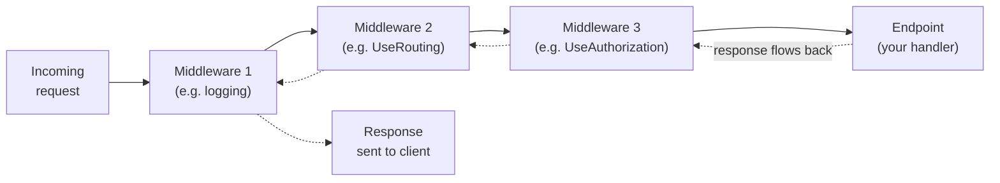
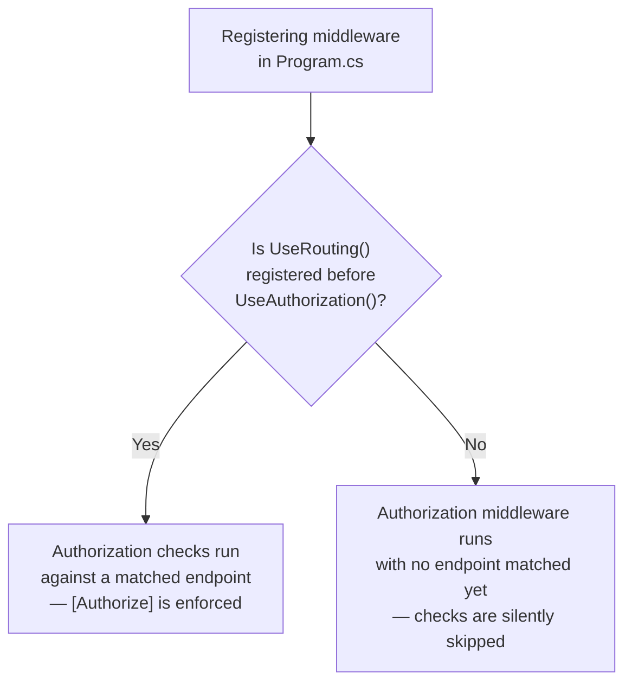

# The Middleware Pipeline

## Introduction

Before reading this lesson, you should already be comfortable with **[Routing and Endpoints](../10-aspnetcore/10-05-routing-and-endpoints.md)** — how ASP.NET Core matches an incoming request's method and path to a specific handler. Routing answers the question "which endpoint should run?" This lesson answers a different question that sits in front of it: "what happens to a request *before* it even gets to that decision, and what happens to the response on the way back out?" The answer is the **middleware pipeline** — the ordered chain of components every single request and response flows through, and the single most important piece of plumbing to understand before writing anything more advanced in ASP.NET Core.

By the end of this lesson, you will be able to:

- Explain the middleware pipeline as an ordered chain of components, each able to inspect, modify, short-circuit, or pass along a request
- Register middleware with `app.Use...` methods and predict the order in which each piece of middleware runs
- Recognize why registration order changes behavior — including the classic gotcha of registering authorization before routing
- Describe the purpose of the most common built-in middleware: `UseHttpsRedirection`, `UseStaticFiles`, `UseRouting`, and `UseAuthorization`
- Trace a single request through a multi-middleware pipeline by reading the server's log output

## The Middleware Pipeline — A Layman's Perspective

Picture an airport, not the terminal building but the sequence of checkpoints a passenger walks through between the curb and the airplane door. Check-in verifies your ticket and prints a boarding pass. Security screening inspects your bags. Passport control checks your identity documents. Finally, the gate agent scans your boarding pass one last time before letting you down the jet bridge. Each checkpoint does one focused job, and — critically — each checkpoint can either wave you through to the next one, or stop you right there and send you back, never letting you reach the gate at all.

Now notice something about the *order* of those checkpoints. It is not arbitrary. Passport control has to happen before boarding, not after — checking your identity once you're already sitting in your seat is useless, because by then it's too late to act on what you find. Security screening has to happen before you're anywhere near the aircraft, not after you land. If an airport administrator, for some reason, moved the gate agent's boarding-pass scan to *before* passport control, the practical effect wouldn't be a compile error or a crash — the airport would keep running, flights would keep boarding — but people who never should have reached the gate might slip through, because the checkpoint that was supposed to catch them ran too late to matter. The building doesn't complain. The rule quietly stops being enforced.

An HTTP request arriving at an ASP.NET Core application walks through an almost identical sequence of checkpoints, and .NET calls each one a **middleware component**. One checkpoint might redirect an insecure HTTP request to HTTPS. Another might check whether the requested file is a static asset sitting on disk and hand it back immediately. Another decides which endpoint in your code should even handle this request. Another checks whether the caller is allowed to access that endpoint at all. Each of these is registered, one after another, when the application starts up, and every request — without exception — walks through them in that exact order, checkpoint by checkpoint, until either one of them stops it or it reaches the very end, where your actual endpoint code runs and produces a response.

And just like the airport, the order genuinely matters, for exactly the same reason. The checkpoint that decides *which endpoint this request even is* has to run before the checkpoint that decides *whether the caller is allowed to reach that endpoint* — because until the first checkpoint runs, there is no endpoint to check permissions against yet. Get that order backwards, and nothing crashes. The application starts fine, most requests still work, and the bug hides in plain sight: an authorization check that runs before there's anything to authorize against simply has nothing to do, and quietly lets everyone through.

This is the mental model to carry into the rest of this lesson: the pipeline is not a bag of features that all just "happen" to a request. It is an ordered sequence you build, checkpoint by checkpoint, in exactly the order you write it in code — and that order is a design decision with real consequences, not an implementation detail.

## The Middleware Pipeline — A Programming Language Perspective

In ASP.NET Core, a **middleware component** is a piece of code with the signature `RequestDelegate` — conceptually, `Task Handle(HttpContext context)` — that either produces a response directly or delegates to the *next* middleware in the chain by invoking a `next` delegate it was handed when it was constructed. This is the **chain of responsibility** design pattern applied to HTTP: each link in the chain decides, for itself, whether to act, pass control forward, or stop the chain entirely.

You build this chain on `WebApplication` (which implements `IApplicationBuilder`) by calling `app.Use(...)` — once per middleware, in the order you want them to run. Each call appends one more link. `app.Run(...)` adds a *terminal* middleware that never calls `next` at all, because there is no "next" left to call. Framework features like static file serving, HTTPS redirection, routing, and authorization are themselves ordinary middleware, registered through convenience extension methods — `UseStaticFiles()`, `UseHttpsRedirection()`, `UseRouting()`, `UseAuthorization()` — that internally call `app.Use(...)` on your behalf. The order those extension methods are called in `Program.cs` **is** the pipeline's execution order; ASP.NET Core does not reorder or infer priority on your behalf.

## How to Build a Middleware Pipeline in C#

Every middleware registration is a single call on `app`, and the sequence of those calls, top to bottom in `Program.cs`, is the exact sequence the runtime executes for every incoming request — with the response flowing back out through the same components in reverse, since each one resumes its own code right after the line where it called `next`.


*Figure 1: A request travels forward through each middleware in registration order; the response travels back through the same chain in reverse, since each middleware resumes right after its own call to `next`.*

```csharp
// Program.cs — .NET 10 / C# 14
var builder = WebApplication.CreateBuilder(args);
builder.Services.AddAuthorization();

var app = builder.Build();

app.Use(async (context, next) =>
{
    Console.WriteLine($"-> [1] logging: entering for {context.Request.Method} {context.Request.Path}");
    await next(context);
    Console.WriteLine($"<- [1] logging: leaving with status {context.Response.StatusCode}");
});

app.UseRouting();

app.UseAuthorization();

app.MapGet("/orders/{id:int}", (int id) =>
{
    Console.WriteLine($"   [2] endpoint: producing response for order {id}");
    return Results.Ok(new { OrderId = id, Status = "Processing" });
});

app.Run();
```

Since this is a running web server rather than a console app, the "Console Output" below is the server's own log output — printed by our middleware as each request is handled — followed by the HTTP response the client actually receives, not a single top-to-bottom console trace.

**Console Output** (server log, then the client's response to `curl http://localhost:5000/orders/42`):

```text
info: Microsoft.Hosting.Lifetime[14]
      Now listening on: http://localhost:5000
-> [1] logging: entering for GET /orders/42
   [2] endpoint: producing response for order 42
<- [1] logging: leaving with status 200

HTTP/1.1 200 OK
Content-Type: application/json; charset=utf-8

{"orderId":42,"status":"Processing"}
```

Notice the order: the logging middleware's "entering" line prints first, then routing silently matches the URL to our endpoint (routing itself logs nothing here), then authorization silently allows the request through (there is no `[Authorize]` on this endpoint, so it has nothing to reject), then the endpoint runs, and finally the logging middleware's "leaving" line prints *after* the endpoint has already produced its result — because `await next(context)` doesn't return until everything downstream of it has finished.

Two other extension methods you will register in almost every real application, even though this minimal example omits them to keep the log focused: `app.UseHttpsRedirection()`, which issues a redirect for any request arriving over plain HTTP, and `app.UseStaticFiles()`, which serves files straight out of `wwwroot` and short-circuits the pipeline for any request that matches one — neither routing nor your endpoint code ever runs for a request a static file handled. Both are registered the same way, as one more link added to the same chain.

## Real-Time Example: An Order API Pipeline for E-Commerce Order Processing

We start building the E-Commerce Order Processing case study's web front end: a small ASP.NET Core API that exposes the `Order` data this domain has used in earlier modules over HTTP. This example wires up a realistic, ordered pipeline — HTTPS redirection, routing, and authorization, in the order a real production API would need them — and shows, with actual log output, exactly which checkpoints a request to `/orders` passes through and in what sequence.

```csharp
// Program.cs — .NET 10 / C# 14 — Real-Time Example
var builder = WebApplication.CreateBuilder(args);
builder.Services.AddAuthorization();

var app = builder.Build();

// Checkpoint 1: every request is logged with a correlation id, first in, last out.
app.Use(async (context, next) =>
{
    string correlationId = Guid.NewGuid().ToString("N")[..8];
    context.Items["CorrelationId"] = correlationId;
    Console.WriteLine($"-> [{correlationId}] {context.Request.Method} {context.Request.Path} received");
    await next(context);
    Console.WriteLine($"<- [{correlationId}] responded {context.Response.StatusCode}");
});

// Checkpoint 2: redirect any plain-HTTP call to HTTPS before anything else happens.
app.UseHttpsRedirection();

// Checkpoint 3: match the URL to an endpoint.
app.UseRouting();

// Checkpoint 4: now that an endpoint has been matched, check whether it may be accessed.
app.UseAuthorization();

var orders = new Dictionary<int, string>
{
    [1001] = "Shipped",
    [1002] = "Processing"
};

app.MapGet("/orders/{id:int}", (int id) =>
    orders.TryGetValue(id, out string? status)
        ? Results.Ok(new { OrderId = id, Status = status })
        : Results.NotFound(new { Message = $"Order {id} was not found." }));

app.Run();
```

**Console Output** (server log for `curl -i http://localhost:5000/orders/1001`, HTTPS redirection disabled for this local demo run):

```text
info: Microsoft.Hosting.Lifetime[14]
      Now listening on: http://localhost:5000
-> [7f3a9c1e] GET /orders/1001 received
<- [7f3a9c1e] responded 200

HTTP/1.1 200 OK
Content-Type: application/json; charset=utf-8

{"orderId":1001,"status":"Shipped"}
```

Every one of these four checkpoints exists in nearly every production ASP.NET Core API, in roughly this order: something that observes or logs every request first (so it can time and correlate the *entire* pipeline, including everything downstream), then HTTPS enforcement, then routing, then authorization — always routing before authorization, never the other way around, because authorization needs an endpoint to check permissions against. Get that one pair backwards, and the fix isn't more code — it's moving one line.

## Registering Middleware in the Right Order vs the Wrong Order

The single most common ordering mistake in ASP.NET Core is calling `app.UseAuthorization()` *before* `app.UseRouting()`. When that happens, the authorization middleware runs while the request has not yet been matched to an endpoint — there is no `[Authorize]` metadata attached to "no endpoint yet," so the authorization check has nothing to evaluate and simply passes every request straight through. The application still starts. Most requests still "work," in the sense that they return a response. But every endpoint you believed was protected by `[Authorize]` is, in practice, wide open, because the checkpoint responsible for enforcing that protection ran before there was anything for it to protect.

The fix is never to add more middleware — it's to register the two calls in the correct relative order, exactly once, and let routing run first.


*Figure 2: The relative order of `UseRouting` and `UseAuthorization` is not a style preference — reversing it silently disables every `[Authorize]` attribute in the application.*

| Aspect | `UseRouting()` before `UseAuthorization()` (correct) | `UseAuthorization()` before `UseRouting()` (bug) |
|---|---|---|
| Endpoint available to check against | Yes — routing already matched one | No — nothing has been matched yet |
| `[Authorize]` enforcement | Enforced correctly | Silently bypassed |
| Startup behavior | Runs normally | Also runs normally — no error, no warning |
| How the bug is usually found | Never, if order is correct from the start | In a security review or, worse, in production |

## Types of Middleware in ASP.NET Core

The pipeline is built from a handful of distinct middleware "shapes," each suited to a different kind of job:

1. **Inline delegate middleware** (`app.Use(async (context, next) => ...)`) — the quickest way to write one-off logic, covered next in **[Writing Custom Middleware](../10-aspnetcore/10-07-writing-custom-middleware.md)**.
2. **Conventional class-based middleware** (a class with an `InvokeAsync(HttpContext)` method, registered via `app.UseMiddleware<T>()`) — reusable, testable, and DI-friendly; also covered in the next lesson.
3. **Terminal middleware** (`app.Run(...)`) — the end of the chain; it never calls `next` because there is nothing left to call.
4. **Branching middleware** (`app.Map(...)` and `app.MapWhen(...)`) — splits the pipeline into a sub-pipeline based on the request path or a predicate.
5. **Built-in framework middleware** — `UseHttpsRedirection`, `UseStaticFiles`, `UseRouting`, `UseAuthorization`, and many more (CORS, response caching, rate limiting) covered in their own later lessons, such as **[CORS in ASP.NET Core](../10-aspnetcore/10-16-cors-in-aspnetcore.md)** and **[Rate Limiting](../10-aspnetcore/10-14-rate-limiting.md)**.
6. **Endpoint filters** — not middleware in the strictest sense, but a related mechanism for wrapping logic around individual endpoints rather than the whole pipeline, covered in **[Action Filters and Endpoint Filters](../10-aspnetcore/10-11-action-and-endpoint-filters.md)**.

## What You've Learned & What's Next

The middleware pipeline is an ordered chain of components that every request and response flows through, built one `app.Use...` call at a time in `Program.cs`, and that registration order is not cosmetic — it is the order the runtime actually executes, with real consequences for correctness and security when it's gotten wrong, as the routing-before-authorization example showed.

Continue your learning journey with **[Writing Custom Middleware](../10-aspnetcore/10-07-writing-custom-middleware.md)**, where you'll write your own middleware — both as a quick inline delegate and as a proper, reusable class — including a request-timing and logging middleware you'll extend throughout this module.

---
*Applies to: .NET 10 / C# 14. Last reviewed 2026-08-16.*
