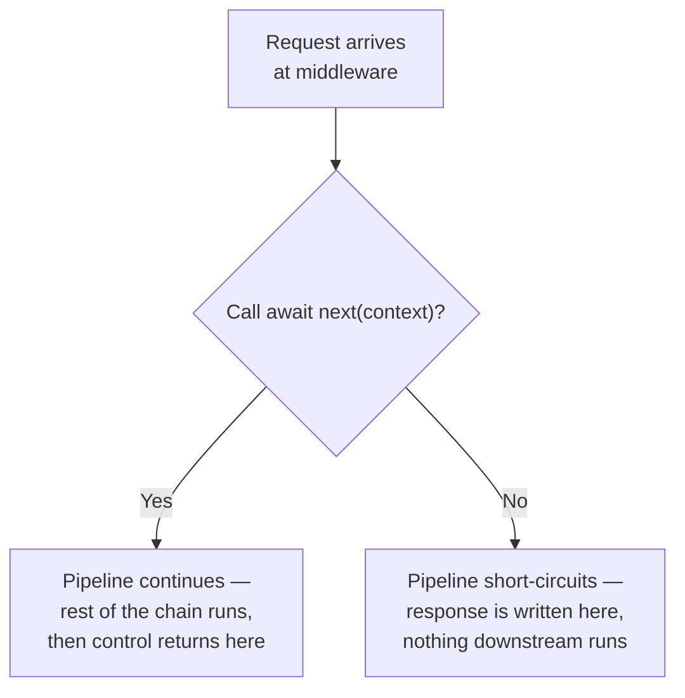
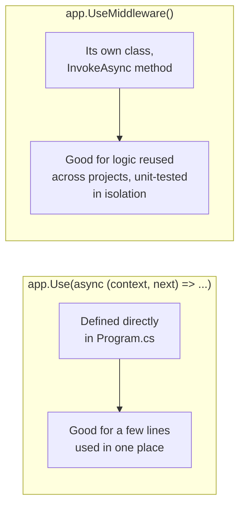

# Writing Custom Middleware

## Introduction

Before reading this lesson, you should already be comfortable with **[The Middleware Pipeline](../10-aspnetcore/10-06-the-middleware-pipeline.md)** — the idea that every request flows through an ordered chain of components, each able to inspect, modify, or short-circuit it. That lesson used only built-in middleware. This lesson teaches you to write your own: first as a quick inline delegate, then as a proper, reusable class, the way production code actually organizes cross-cutting logic like logging, timing, and request validation.

By the end of this lesson, you will be able to:

- Write an inline middleware using `app.Use(async (context, next) => ...)`
- Write a reusable, class-based middleware with an `InvokeAsync` method and register it with `app.UseMiddleware<T>()`
- Control the pipeline by calling `await next()` to continue it, or omitting that call to short-circuit it
- Build a request-timing and logging middleware that measures and reports how long each request took
- Decide when a piece of cross-cutting logic belongs in middleware rather than inside an individual endpoint

## Writing Custom Middleware — A Layman's Perspective

Think about the person who stands at the entrance of a busy restaurant kitchen, checking every plate as it goes out to the dining room. They don't cook. They don't take orders. Their entire job is to intercept every single plate, glance at it, maybe stamp a ticket with the time it left the pass, and then let it through to the server waiting on the other side of the door. If a plate looks wrong — cold, missing a garnish, plated for the wrong table — they can stop it right there and send it back to the line, and it never reaches a customer at all.

That checker didn't exist on day one. The kitchen ran without them for a while, plates going straight from cook to server. At some point, the owner needed *something* watched — how long dishes were taking, or whether the wrong order kept slipping through — and rather than retraining every single cook to also do that watching, they added exactly one new person, standing in exactly one new spot, whose only job is that one thing. Every plate still passes the same way it always did; there is just one more checkpoint in the path now, and it was added without touching how the cooks cook or how the servers serve.

Writing a custom middleware is adding that checker to your own kitchen. You are not rewriting how every endpoint works. You are inserting one focused component into the path every request already travels, and giving it exactly two choices for each request it sees: wave it through to whatever's next in line (call `next()`), or stop it right there and send a response back immediately, without ever letting it reach the kitchen behind it (don't call `next()` at all). The checker at the door who spots a clearly wrong plate doesn't ask the dining room to look at it and reject it later — they stop it immediately, right at the door, before it goes any further. That's a short-circuit: the earlier a problem is caught, the less work gets wasted carrying it further down the line.

Most of the time, though, the checker's job is simpler than rejecting plates — it's just *observing* them as they pass: noting the time, maybe writing something down, and letting every single plate through unchanged. That's exactly what a logging or timing middleware does. It doesn't change the response. It watches the request go in, lets everything downstream do its job completely undisturbed, and then, once the response comes back through on its way out, records how long the whole round trip took. The kitchen behind the door never even knows the checker exists — and that, in the end, is the real appeal of middleware: you can add an entire new capability to every request in your application without changing a single line of the endpoints that already work.

## Writing Custom Middleware — A Programming Language Perspective

A **custom middleware** is any component you add to the pipeline via `app.Use(...)` or `app.UseMiddleware<T>()`. The **inline** form is a delegate — `app.Use(async (HttpContext context, Func<Task> next) => { ... })` — defined directly in `Program.cs`, ideal for small, one-off logic that doesn't need to be shared across projects or unit-tested in isolation. The **conventional class-based** form is an ordinary class with a constructor that accepts a `RequestDelegate next` (and any singleton-lifetime services), and a method named `InvokeAsync` (or `Invoke`) that accepts `HttpContext` plus any request-scoped services resolved directly as extra parameters. ASP.NET Core discovers `InvokeAsync`/`Invoke` by convention — no interface implementation is required — and constructs the class once per application startup via `app.UseMiddleware<TMiddleware>()`. In both forms, the pipeline continues only if the middleware calls `await next(context)` (inline) or `await _next(context)` (class-based); omitting that call **short-circuits** the pipeline, and nothing registered afterward — including the endpoint itself — ever runs for that request.

## How to Write Custom Middleware in C#

Start with the inline form, since it needs no extra class and makes the short-circuit behavior explicit and easy to see in one place.


*Figure 1: Calling `next()` is a choice your middleware makes explicitly, on every request — not something the framework does automatically.*

```csharp
// Program.cs — .NET 10 / C# 14
var builder = WebApplication.CreateBuilder(args);
var app = builder.Build();

bool maintenanceMode = false;

// Inline middleware: short-circuits the entire pipeline while maintenanceMode is true.
app.Use(async (HttpContext context, Func<Task> next) =>
{
    if (maintenanceMode)
    {
        context.Response.StatusCode = StatusCodes.Status503ServiceUnavailable;
        await context.Response.WriteAsync("Service temporarily unavailable for maintenance.");
        return; // next() is never called — the pipeline stops right here
    }

    await next();
});

app.MapGet("/ping", () => "pong");

app.Run();
```

Since this is a running web server, the "Console Output" below shows the server's startup log and the client's actual HTTP response, not a console-app trace.

**Console Output** (`curl -i http://localhost:5000/ping`, with `maintenanceMode` set to `false`):

```text
info: Microsoft.Hosting.Lifetime[14]
      Now listening on: http://localhost:5000

HTTP/1.1 200 OK
Content-Type: text/plain; charset=utf-8

pong
```

With `maintenanceMode` set to `true` instead, the exact same `curl` command would receive `HTTP/1.1 503 Service Unavailable` with the maintenance message, and — because `next()` is never invoked in that branch — `/ping`'s handler would never run at all; nothing downstream even knows a request arrived.

Now the reusable, class-based form. This is the shape you'll actually use in production for anything more than a couple of lines, because it's testable in isolation and can accept its own dependencies through the constructor:

```csharp
// RequestTimingMiddleware.cs — .NET 10 / C# 14
using System.Diagnostics;

public class RequestTimingMiddleware
{
    private readonly RequestDelegate _next;
    private readonly ILogger<RequestTimingMiddleware> _logger;

    public RequestTimingMiddleware(RequestDelegate next, ILogger<RequestTimingMiddleware> logger)
    {
        _next = next;
        _logger = logger;
    }

    public async Task InvokeAsync(HttpContext context)
    {
        var stopwatch = Stopwatch.StartNew();

        await _next(context); // continue the pipeline; everything downstream runs here

        stopwatch.Stop();
        context.Response.Headers["X-Response-Time-Ms"] = stopwatch.ElapsedMilliseconds.ToString();
        _logger.LogInformation(
            "{Method} {Path} -> {StatusCode} in {ElapsedMs} ms",
            context.Request.Method, context.Request.Path, context.Response.StatusCode, stopwatch.ElapsedMilliseconds);
    }
}
```

Registering it takes one line, and — as with every middleware — where that line sits relative to the others still matters: `app.UseMiddleware<RequestTimingMiddleware>();`. Because `_next(context)` is `await`ed, the stopwatch keeps running through every single middleware and endpoint downstream, and only stops once the response has fully returned back up to this point — the class-based form works exactly the same way the inline form did, it's just organized as its own type.

## Real-Time Example: Request Timing for the E-Commerce Order API

We extend the Order API from the previous lesson with two pieces of custom middleware: `RequestTimingMiddleware`, timing and logging every request, and an inline API-key check that short-circuits any request missing the `X-Api-Key` header before it ever reaches an order lookup.

```csharp
// Program.cs — .NET 10 / C# 14 — Real-Time Example
var builder = WebApplication.CreateBuilder(args);
var app = builder.Build();

app.UseMiddleware<RequestTimingMiddleware>();

// Inline middleware: reject any request missing the required API key header.
app.Use(async (HttpContext context, Func<Task> next) =>
{
    if (!context.Request.Headers.ContainsKey("X-Api-Key"))
    {
        context.Response.StatusCode = StatusCodes.Status401Unauthorized;
        await context.Response.WriteAsync("Missing X-Api-Key header.");
        return;
    }

    await next();
});

var orders = new Dictionary<int, string>
{
    [1001] = "Shipped",
    [1002] = "Processing"
};

app.MapGet("/orders/{id:int}", (int id) =>
    orders.TryGetValue(id, out string? status)
        ? Results.Ok(new { OrderId = id, Status = status })
        : Results.NotFound());

app.Run();

public class RequestTimingMiddleware
{
    private readonly RequestDelegate _next;
    private readonly ILogger<RequestTimingMiddleware> _logger;

    public RequestTimingMiddleware(RequestDelegate next, ILogger<RequestTimingMiddleware> logger)
    {
        _next = next;
        _logger = logger;
    }

    public async Task InvokeAsync(HttpContext context)
    {
        var stopwatch = System.Diagnostics.Stopwatch.StartNew();
        await _next(context);
        stopwatch.Stop();

        context.Response.Headers["X-Response-Time-Ms"] = stopwatch.ElapsedMilliseconds.ToString();
        _logger.LogInformation(
            "{Method} {Path} -> {StatusCode} in {ElapsedMs} ms",
            context.Request.Method, context.Request.Path, context.Response.StatusCode, stopwatch.ElapsedMilliseconds);
    }
}
```

**Console Output** (server log for two calls — first without the header, then with it — against `/orders/1001`):

```text
info: Microsoft.Hosting.Lifetime[14]
      Now listening on: http://localhost:5000
info: RequestTimingMiddleware[0]
      GET /orders/1001 -> 401 in 0 ms
info: RequestTimingMiddleware[0]
      GET /orders/1001 -> 200 in 1 ms
```

Both calls were timed and logged by the exact same middleware, even though the first one never reached the order lookup at all — `RequestTimingMiddleware` was registered *before* the API-key check, so it wraps the entire remainder of the pipeline, short-circuit and all, and the `401` still shows up in the log with an accurate (near-zero) elapsed time. This is exactly the ordering discipline from the previous lesson: put timing and logging first, so it observes everything that happens after it, including every rejection.

## Inline Delegate Middleware vs Class-Based Middleware

Both forms produce identical runtime behavior — the same `RequestDelegate` shape, wired into the same pipeline, in the same order you register them. The difference is entirely about where the logic lives and how reusable and testable it is.


*Figure 2: Same pipeline slot, same contract — the choice between the two forms is about maintainability, not capability.*

| Aspect | Inline delegate (`app.Use`) | Class-based (`app.UseMiddleware<T>()`) |
|---|---|---|
| Where it lives | Directly in `Program.cs` | Its own file/class |
| Reusability across projects | Low — tied to this `Program.cs` | High — just reference the class |
| Unit-testability in isolation | Awkward | Straightforward — construct and call `InvokeAsync` directly |
| Accepting dependencies | Captured from the enclosing scope | Injected through the constructor |
| Best for | Small, one-off, app-specific logic | Anything reused, logged, or tested independently |

## Types of Custom Middleware Patterns in ASP.NET Core

1. **Inline delegate middleware** — this lesson's `app.Use(async (context, next) => ...)` form, for small, app-specific logic.
2. **Conventional class-based middleware** — this lesson's `InvokeAsync` class, registered with `app.UseMiddleware<T>()`, for anything reused or unit-tested.
3. **Factory-based `IMiddleware`** — implements `Microsoft.AspNetCore.Http.IMiddleware` explicitly and is resolved from the DI container per request rather than constructed once at startup; useful when the middleware itself needs a scoped dependency.
4. **Branch-specific middleware** — registered inside `app.Map("/admin", branch => branch.Use(...))`, applying only to requests under a specific path prefix.
5. **Endpoint filters** — a newer, endpoint-scoped alternative to middleware for logic that only needs to wrap specific routes rather than the whole pipeline, covered in **[Action Filters and Endpoint Filters](../10-aspnetcore/10-11-action-and-endpoint-filters.md)**.
6. **Exception-handling middleware** — a specialized form that wraps the rest of the pipeline in a `try`/`catch` to convert unhandled exceptions into proper HTTP error responses.

## What You've Learned & What's Next

Custom middleware — whether a quick inline delegate or a proper, reusable class with `InvokeAsync` — gives you a single, focused place to insert cross-cutting logic into every request your application handles, and the choice to call `next()` or not is the entire mechanism by which middleware controls whether the pipeline continues or stops right there.

Continue your learning journey with **[Dependency Injection and Service Lifetimes](../10-aspnetcore/10-08-di-and-service-lifetimes.md)**, where you'll see how the services your middleware and endpoints depend on get created and shared — and what goes wrong when a service is registered with the wrong lifetime.

---
*Applies to: .NET 10 / C# 14. Last reviewed 2026-08-16.*
