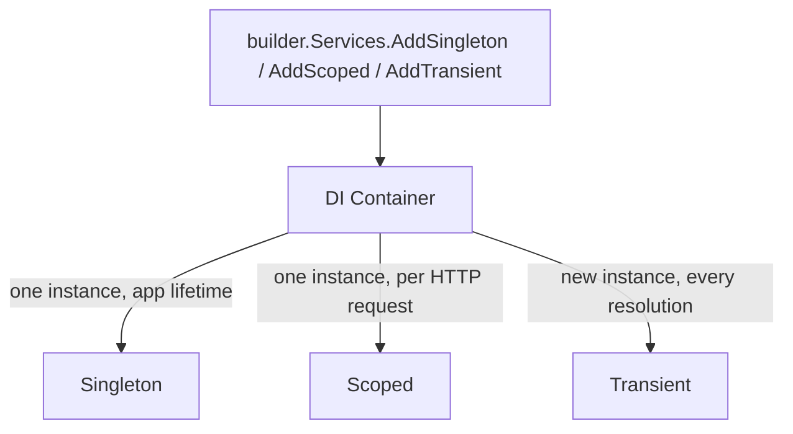
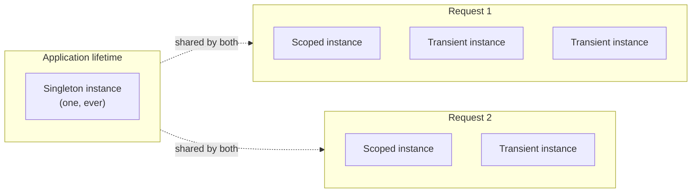

# Dependency Injection and Service Lifetimes

## Introduction

Before reading this lesson, you should already be comfortable with **[Writing Custom Middleware](../10-aspnetcore/10-07-writing-custom-middleware.md)**, including how a class-based middleware receives its dependencies through its constructor — `RequestDelegate next`, `ILogger<T> logger`, and so on. Those dependencies didn't appear by magic; they came from ASP.NET Core's built-in **dependency injection (DI) container**, the same container that supplies dependencies to every endpoint, controller, and service in your application. This lesson makes that container explicit, and covers the one decision about it that causes more production bugs than almost anything else in ASP.NET Core: choosing the wrong **service lifetime**.

By the end of this lesson, you will be able to:

- Register services with the built-in DI container using `builder.Services.AddSingleton`, `AddScoped`, and `AddTransient`
- Inject dependencies into minimal API endpoints and controller constructors
- Explain the three service lifetimes — Singleton, Scoped, and Transient — and when each instance is created and disposed
- Identify the classic bug of registering a service that should be Scoped as Singleton instead, and explain why it causes shared, corrupted state
- Choose the correct lifetime for a new service based on what state it holds and how long that state should live

## Dependency Injection and Service Lifetimes — A Layman's Perspective

Imagine three different kinds of tools in a busy hospital. The first is the building itself — one hospital, shared by every patient, every doctor, every shift, for as long as the hospital exists. There is exactly one of it, it was built once, and everyone who ever walks through the door uses that same, single building. The second is a patient's chart — a folder created the moment they check in for a specific visit, used by every nurse and doctor who sees them *during that one visit*, and then closed and filed away the moment the visit ends. A new visit next month gets a brand-new chart, even for the exact same patient. The third is a disposable glove — a nurse takes a fresh one out of the box for literally every single task, uses it once, and throws it away, never reusing the same glove for the next thing they touch, even moments later.

Those three tools have three fundamentally different lifespans, and mixing them up would be dangerous in an obvious, physical way. Nobody would try to reuse yesterday's patient chart for today's completely different patient — the chart holds *that visit's* data, and handing it to the wrong visit means every note, every measurement, every medication gets attributed to the wrong person. Nobody would treat the hospital building itself as something to recreate for every single patient — that would be absurd overhead for something that's genuinely shared and stateless from one patient's perspective. And nobody would try to make a single glove last through an entire day's shift — its whole purpose is to be used exactly once, for exactly one task, then discarded.

A service registered with ASP.NET Core's dependency injection container is exactly one of these three kinds of tools, and the "lifetime" you choose when you register it is you telling the framework which kind it is. A **Singleton** is the hospital building: one instance, created once, shared by every request for the lifetime of the entire application — perfect for something genuinely stateless, like a lookup table of shipping rates that never changes. A **Scoped** service is the patient chart: one fresh instance created at the start of *each individual HTTP request*, shared by everything that request touches, and discarded the moment that request finishes — exactly the shape you want for anything that needs to accumulate state specific to *this one request* and must never leak into the next one. A **Transient** service is the disposable glove: a brand-new instance handed out every single time anything asks for one, even multiple times within the same request — right for small, cheap, stateless helpers where sharing wouldn't help and might even hurt.

The danger, precisely mirroring the hospital, is registering the wrong kind for the job — telling the framework "this is the shared building" about something that was actually supposed to be "this visit's private chart." The framework won't stop you. It will happily hand every single request the exact same instance you told it to treat as a Singleton — and if that instance holds any state specific to one particular request, every other request sharing it will see, and can silently overwrite, that same state.

## Dependency Injection and Service Lifetimes — A Programming Language Perspective

ASP.NET Core ships with a built-in **inversion of control (IoC) container**, exposed through `builder.Services`, an `IServiceCollection`. You register a service's implementation against an interface (or its own concrete type) with one of three extension methods, each naming a **lifetime**: `AddSingleton<TInterface, TImplementation>()` creates exactly one instance for the entire application's lifetime; `AddScoped<TInterface, TImplementation>()` creates one instance per **DI scope** — and ASP.NET Core automatically creates a new scope for every incoming HTTP request; `AddTransient<TInterface, TImplementation>()` creates a new instance every time the container is asked to resolve one. Once registered, dependencies are supplied automatically through **constructor injection** — a controller's constructor, or a minimal API delegate's parameter list, simply declares the type it needs, and the container resolves and supplies it, along with anything *that* type itself depends on, recursively. Minimal API endpoints resolve services either by parameter-type inference or explicitly via `[FromServices]`, covered in the next lesson.

## How to Register and Inject Services in C#

Registration happens once, at startup, against `builder.Services`; injection happens automatically, everywhere that service is needed, without any further code at the call site beyond declaring the parameter.


*Figure 1: One registration call, three possible lifetimes — the container hands out a different instance-sharing pattern depending on which one you chose.*

The clearest way to see the difference between the three lifetimes is to register the *same* simple class three times, once under each lifetime, and inject all three into a single endpoint twice each:

```csharp
// Program.cs — .NET 10 / C# 14
var builder = WebApplication.CreateBuilder(args);

builder.Services.AddSingleton<SingletonId>();
builder.Services.AddScoped<ScopedId>();
builder.Services.AddTransient<TransientId>();

var app = builder.Build();

app.MapGet("/ids", (
    SingletonId single1, SingletonId single2,
    ScopedId scoped1, ScopedId scoped2,
    TransientId trans1, TransientId trans2) =>
{
    return Results.Ok(new
    {
        SingletonSame = single1.Id == single2.Id,
        ScopedSame = scoped1.Id == scoped2.Id,
        TransientSame = trans1.Id == trans2.Id
    });
});

app.Run();

class SingletonId { public Guid Id { get; } = Guid.NewGuid(); }
class ScopedId { public Guid Id { get; } = Guid.NewGuid(); }
class TransientId { public Guid Id { get; } = Guid.NewGuid(); }
```

Since this is a running web server, the "Console Output" below shows the server's startup log and the HTTP response, not a console-app trace.

**Console Output** (`curl http://localhost:5000/ids`):

```text
info: Microsoft.Hosting.Lifetime[14]
      Now listening on: http://localhost:5000

{"singletonSame":true,"scopedSame":true,"transientSame":false}
```

Within this *one* request, the two `SingletonId` injections are the same instance (as they would be for every other request too), the two `ScopedId` injections are the same instance (but a *different* instance than any other request would get), and the two `TransientId` injections are different instances entirely — a new one was created for each of the two parameters, even within this single request.

## Real-Time Example: A Session Bug in a Banking/ATM Balance Service

We continue the Banking/ATM case study with a small ATM balance API — and a deliberately introduced bug that shows exactly why lifetime mismatches matter. `AtmSessionContext` is meant to hold *one request's* selected account number while a (simulated, slow) balance lookup runs. It is registered as `AddSingleton` here — the bug — instead of `AddScoped`, and the demo fires two "customers'" requests concurrently to show the account number leaking from one customer's request into another's.

```csharp
// Program.cs — .NET 10 / C# 14 — Real-Time Example
var builder = WebApplication.CreateBuilder();
builder.WebHost.UseUrls("http://127.0.0.1:5299");

// BUG: registered as Singleton — one shared instance for every request, forever.
// It should be AddScoped<AtmSessionContext>() instead, since it holds per-request state.
builder.Services.AddSingleton<AtmSessionContext>();

var app = builder.Build();

app.MapGet("/atm/balance/{accountNumber}", async (string accountNumber, AtmSessionContext session) =>
{
    session.AccountNumber = accountNumber; // "select this account for the current request"
    await Task.Delay(200);                  // simulate a slow balance lookup
    return Results.Ok(new { RequestedAccount = accountNumber, SessionSawAccount = session.AccountNumber });
});

await app.StartAsync();

using var client = new HttpClient { BaseAddress = new Uri("http://127.0.0.1:5299") };

Task<string> customerA = client.GetStringAsync("/atm/balance/1001-A");
await Task.Delay(50); // Customer A's request is mid-delay when Customer B's request starts
Task<string> customerB = client.GetStringAsync("/atm/balance/2002-B");

string[] results = await Task.WhenAll(customerA, customerB);
Console.WriteLine($"Customer A's response: {results[0]}");
Console.WriteLine($"Customer B's response: {results[1]}");

await app.StopAsync();

class AtmSessionContext
{
    public string AccountNumber { get; set; } = "";
}
```

**Console Output:**

```text
info: Microsoft.Hosting.Lifetime[14]
      Now listening on: http://127.0.0.1:5299
Customer A's response: {"requestedAccount":"1001-A","sessionSawAccount":"2002-B"}
Customer B's response: {"requestedAccount":"2002-B","sessionSawAccount":"2002-B"}
```

Customer A requested account `1001-A`, but by the time A's simulated lookup finished, Customer B's concurrently running request — sharing that exact same singleton `AtmSessionContext` instance — had already overwritten `AccountNumber` with `2002-B`. Customer A's response shows `sessionSawAccount` as `2002-B`: a different customer's account number, read back during what should have been an isolated request. Changing exactly one line, `AddSingleton<AtmSessionContext>()` to `AddScoped<AtmSessionContext>()`, fixes this completely — ASP.NET Core would then create a brand-new `AtmSessionContext` for each of the two requests automatically, and neither customer's request could ever see the other's account number again. This is precisely the class of bug real production incidents are made of: a service that looks perfectly fine in every single-request test, and fails only under real concurrent load.

## Singleton vs Scoped vs Transient

Choosing between the three lifetimes comes down to one question: how long should this instance's state be allowed to live, and who should be allowed to see it?


*Figure 2: A Singleton is shared across every request; a Scoped instance is shared only within one request; a Transient instance isn't even shared within a single request.*

| Aspect | Singleton | Scoped | Transient |
|---|---|---|---|
| Instance created | Once, for the whole app | Once per HTTP request | Every time it's resolved |
| Shared across requests? | Yes — always the same instance | No — new instance per request | No — not even within a request |
| Safe to hold per-request state? | No — will leak across requests | Yes — this is its purpose | Yes, but rarely worth the overhead |
| Typical use case | Configuration, caches, stateless helpers | Anything resembling a `DbContext` or a request/session context | Small, cheap, stateless operations |
| Disposal | Disposed when the app shuts down | Disposed at the end of the request | Disposed whenever its owning scope ends |

## Types of DI Registration in ASP.NET Core

1. **`AddSingleton`** — this lesson's shared, application-lifetime registration.
2. **`AddScoped`** — this lesson's per-request registration, and the correct fix for the ATM bug above.
3. **`AddTransient`** — a fresh instance on every resolution, for small stateless helpers.
4. **Keyed services** (`AddKeyedSingleton`, `[FromKeyedServices]`) — registering multiple implementations of the same interface, distinguished by a key, resolved explicitly by that key.
5. **Factory-based registration** (`AddScoped<IFoo>(sp => new Foo(sp.GetRequiredService<Bar>()))`) — for services whose construction needs custom logic beyond a plain constructor call.
6. **Options-bound services** — services configured through strongly typed settings objects, covered in **[Configuration and the Options Pattern](../10-aspnetcore/10-19-configuration-and-options-pattern.md)**.

## What You've Learned & What's Next

The built-in DI container creates and supplies every service your endpoints and middleware depend on, and the lifetime you register a service with — `AddSingleton`, `AddScoped`, or `AddTransient` — is a promise about how long its state is allowed to live and who is allowed to share it. Break that promise, as the ATM example did, and the bug won't show up in a single test; it shows up only when two requests genuinely overlap, sharing state that should have belonged to one of them alone.

Continue your learning journey with **[Model Binding](../10-aspnetcore/10-09-model-binding.md)**, where you'll see the other half of what makes an endpoint's parameter list work: not services injected from the container, but data pulled directly from the incoming request itself.

---
*Applies to: .NET 10 / C# 14. Last reviewed 2026-08-16.*
