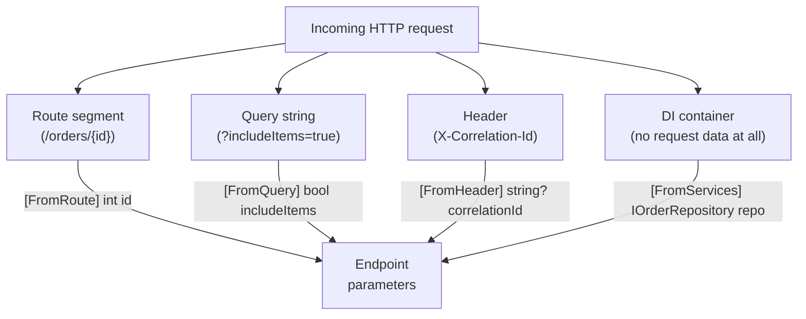
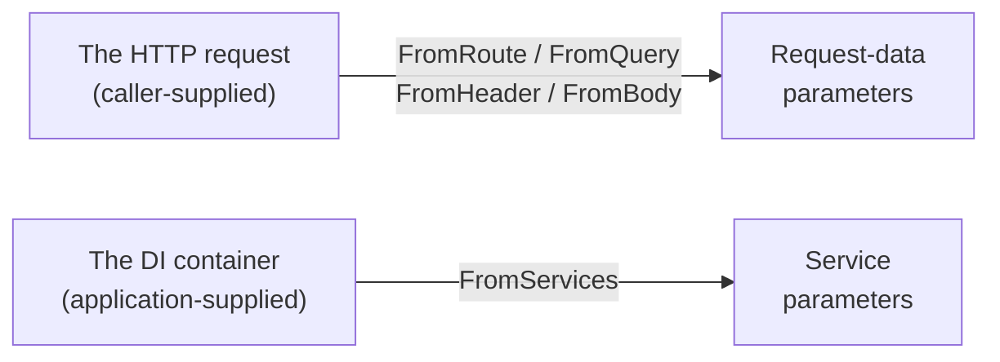

# Model Binding

## Introduction

Before reading this lesson, you should already be comfortable with **[Dependency Injection and Service Lifetimes](../10-aspnetcore/10-08-di-and-service-lifetimes.md)** — how an endpoint parameter can be satisfied automatically by the DI container. Not every parameter comes from there, though. An endpoint like `(int id, string? status, IOrderRepository repo) => ...` gets `repo` from the container, but `id` and `status` have to come from somewhere else entirely: the URL, the query string, the headers, or the body of the actual HTTP request that triggered this call. That process — inspecting an incoming request and populating an endpoint's parameters from it — is **model binding**, and it's the mechanism this lesson covers.

By the end of this lesson, you will be able to:

- Explain how ASP.NET Core decides which part of an incoming request each parameter should come from
- Bind route segments explicitly with `[FromRoute]` and implicitly by matching parameter names to route template placeholders
- Bind query string values with `[FromQuery]` and header values with `[FromHeader]`
- Bind a complex object from the JSON request body with `[FromBody]`, including nested collections
- Distinguish binding sources (`[FromRoute]`/`[FromQuery]`/`[FromBody]`) from the DI-sourced `[FromServices]` covered in the previous lesson

## Model Binding — A Layman's Perspective

Picture a customs officer at a busy border crossing, processing one traveler at a time. Before that officer can do anything, they need several completely different pieces of information, and — this is the important part — each piece comes from a *different* place, and the officer already knows exactly where to look for each one without having to ask. Your name and passport number come from the passport itself, always in the same spot on the same page. Your declared items come from a form you filled out and handed over separately. Your fingerprint comes from a scanner the officer operates themselves, not from anything you handed them at all. The officer doesn't dump everything you're carrying onto the counter and rummage through it hoping to find what they need — they know, by convention, which specific source holds which specific fact, and they go straight to it.

An ASP.NET Core endpoint faces exactly the same situation every time a request arrives, and model binding is the officer's well-trained habit of knowing where to look. A value embedded in the URL's path — the specific order number in `/orders/1001` — comes from one source: the route. A value tacked onto the end of the URL after a question mark — `?includeItems=true` — comes from a different source: the query string. A value sent as a small note attached to the request but not part of the URL at all — an API key, a correlation id — comes from yet another source: the headers. And a large, structured document describing something new the caller wants to create or submit — a whole order, with a customer name and a list of items — comes from the last source: the body of the request itself, typically as JSON.

What makes this genuinely elegant, rather than just a pile of rules to memorize, is that the officer doesn't need you to *label* each thing you hand them as "this is my passport" or "this is my customs form" — the *kind* of information and where it physically sits already tells the officer everything they need to know. ASP.NET Core works the same way by default: a simple value whose parameter name matches a route placeholder is assumed to come from the route; a simple value that doesn't match a route placeholder is assumed to come from the query string; and a complex object — something with several properties, describing structured data rather than one plain value — is assumed to come from the body. You can always be explicit and say exactly where to look with an attribute, the way you might explicitly hand the officer your form instead of waiting for them to ask, but for the common cases, the framework already knows the convention.

This is why the same four-parameter signature you write for an endpoint doesn't need any binding logic inside its body at all — by the time your code starts running, the officer has already done their job, checked every source, and handed you a fully assembled traveler's file with every field already filled in.

## Model Binding — A Programming Language Perspective

**Model binding** is the process by which ASP.NET Core maps data from an `HttpRequest` onto the parameters of an action method or minimal API delegate, before that method body ever executes. The framework infers a **binding source** for each parameter using a set of conventions — simple types matching a route template placeholder bind from the route; other simple types bind from the query string; complex reference types bind from the JSON request body by default — and those conventions can be overridden explicitly with attributes from `Microsoft.AspNetCore.Mvc`: `[FromRoute]`, `[FromQuery]`, `[FromHeader]`, `[FromBody]`, `[FromForm]`, and `[FromServices]` (the DI-sourced exception covered in the previous lesson, included here because it shares the same attribute family). These attributes work identically whether the target is a controller action or a minimal API delegate. Complex body binding uses `System.Text.Json` by default, deserializing the request body directly into the parameter's type, including nested objects and collections, using the same camelCase-to-PascalCase convention `System.Text.Json` uses everywhere else in .NET.

## How to Bind Model Data in C#

Each binding source attribute names exactly where the framework should look; when a parameter's binding source is unambiguous by convention, the attribute is optional but still valid and often clearer to a reader.


*Figure 1: Four different sources, one parameter list — model binding assembles them all before your endpoint's code runs.*

```csharp
// Program.cs — .NET 10 / C# 14
using Microsoft.AspNetCore.Mvc;

var builder = WebApplication.CreateBuilder(args);
builder.Services.AddSingleton<IOrderRepository, InMemoryOrderRepository>();
var app = builder.Build();

app.MapGet("/orders/{id:int}", (
    [FromRoute] int id,
    [FromQuery] bool includeItems,
    [FromHeader(Name = "X-Correlation-Id")] string? correlationId,
    [FromServices] IOrderRepository repository) =>
{
    Order? order = repository.FindById(id);
    if (order is null)
    {
        return Results.NotFound();
    }

    return Results.Ok(new
    {
        order.Id,
        order.CustomerName,
        Items = includeItems ? order.Items : null,
        CorrelationId = correlationId ?? "(none)"
    });
});

app.Run();

record OrderItem(string Sku, int Quantity);
record Order(int Id, string CustomerName, List<OrderItem> Items);

interface IOrderRepository
{
    Order? FindById(int id);
}

class InMemoryOrderRepository : IOrderRepository
{
    private readonly Dictionary<int, Order> _orders = new()
    {
        [501] = new Order(501, "Priya Nair", [new OrderItem("SKU-100", 2), new OrderItem("SKU-204", 1)])
    };

    public Order? FindById(int id) => _orders.GetValueOrDefault(id);
}
```

Since this is a running web server, the "Console Output" below shows the server's startup log and the actual HTTP response, not a console-app trace.

**Console Output** (`curl -i "http://localhost:5000/orders/501?includeItems=true" -H "X-Correlation-Id: corr-77"`):

```text
info: Microsoft.Hosting.Lifetime[14]
      Now listening on: http://localhost:5000

HTTP/1.1 200 OK
Content-Type: application/json; charset=utf-8

{"id":501,"customerName":"Priya Nair","items":[{"sku":"SKU-100","quantity":2},{"sku":"SKU-204","quantity":1}],"correlationId":"corr-77"}
```

`id` came from the `{id:int}` route segment, `includeItems` came from the `?includeItems=true` query string, `correlationId` came from the `X-Correlation-Id` header, and `repository` came from the DI container — four completely different sources, assembled into one parameter list, with zero binding code written inside the endpoint body itself.

## Real-Time Example: Creating an Order from a JSON Body

We extend the E-Commerce Order API with a `POST /orders` endpoint that binds a complex `CreateOrderRequest` — including a nested list of line items — directly from the JSON request body. Because `CreateOrderRequest` is a complex reference type and no other binding attribute is present, minimal APIs bind it from the body by convention; the example makes that explicit with `[FromBody]` for clarity, and also demonstrates an idempotency key read from a header alongside it.

```csharp
// Program.cs — .NET 10 / C# 14 — Real-Time Example
using Microsoft.AspNetCore.Mvc;

var builder = WebApplication.CreateBuilder(args);
var app = builder.Build();

var orders = new Dictionary<int, Order>();
int nextOrderId = 1001;

app.MapPost("/orders", (
    [FromBody] CreateOrderRequest request,
    [FromHeader(Name = "Idempotency-Key")] string? idempotencyKey) =>
{
    var order = new Order(nextOrderId++, request.CustomerName, request.Items);
    orders[order.Id] = order;

    return Results.Created($"/orders/{order.Id}", new
    {
        order.Id,
        order.CustomerName,
        LineItemCount = order.Items.Count,
        IdempotencyKey = idempotencyKey ?? "(none)"
    });
});

app.Run();

record OrderLineRequest(string Sku, int Quantity);
record CreateOrderRequest(string CustomerName, List<OrderLineRequest> Items);
record Order(int Id, string CustomerName, List<OrderLineRequest> Items);
```

**Console Output** (`curl -i -X POST http://localhost:5000/orders -H "Content-Type: application/json" -H "Idempotency-Key: idem-2026-0001" -d "{\"customerName\":\"Devon Marsh\",\"items\":[{\"sku\":\"SKU-300\",\"quantity\":1},{\"sku\":\"SKU-410\",\"quantity\":3}]}"`):

```text
info: Microsoft.Hosting.Lifetime[14]
      Now listening on: http://localhost:5000

HTTP/1.1 201 Created
Content-Type: application/json; charset=utf-8
Location: /orders/1001

{"id":1001,"customerName":"Devon Marsh","lineItemCount":2,"idempotencyKey":"idem-2026-0001"}
```

The entire nested JSON structure — a top-level object containing a list of line-item objects — was deserialized into `CreateOrderRequest` in a single step, with no manual JSON parsing anywhere in the endpoint. The `Idempotency-Key` header, meanwhile, was bound completely independently from the body, from a different part of the same request, which is exactly the point: a real order-creation endpoint routinely needs both a large structured payload *and* a handful of small out-of-band values like this, and model binding assembles all of them before a single line of business logic runs.

## `[FromServices]` vs Request-Data Binding Sources

`[FromRoute]`, `[FromQuery]`, `[FromHeader]`, and `[FromBody]` all pull a value out of the *incoming request itself* — something the caller sent. `[FromServices]` is fundamentally different: it pulls a value out of the *DI container*, something your application registered at startup, with no relationship to what the caller sent at all. Both families of attribute live in the same parameter list and look superficially similar, but they answer two entirely different questions: "what did the caller send?" versus "what does this endpoint need from the application itself?"


*Figure 2: Two independent binding pipelines feed the same parameter list — one from the caller, one from the application.*

| Aspect | `[FromRoute]` / `[FromQuery]` / `[FromHeader]` / `[FromBody]` | `[FromServices]` |
|---|---|---|
| Data source | The incoming HTTP request | The DI container |
| Varies per request? | Yes — different callers send different values | Only if the underlying service is Scoped or Transient |
| Caller controls the value? | Yes | No — the application controls it entirely |
| Typical types | Primitives, strings, DTOs | Interfaces registered with `AddSingleton`/`AddScoped`/`AddTransient` |

## Types of Model Binding Sources in ASP.NET Core

1. **`[FromRoute]`** — this lesson's route-segment binding, e.g. `{id}` in the URL template.
2. **`[FromQuery]`** — this lesson's query-string binding, e.g. `?includeItems=true`.
3. **`[FromHeader]`** — this lesson's HTTP header binding, e.g. `X-Correlation-Id`.
4. **`[FromBody]`** — this lesson's JSON request-body binding for complex types.
5. **`[FromForm]`** — binds from `application/x-www-form-urlencoded` or multipart form data, common for file uploads.
6. **`[AsParameters]`** — binds an entire group of related parameters from a single record or class in one step, useful when several route/query values belong together conceptually.

## What You've Learned & What's Next

Model binding assembles an endpoint's parameters from four independent sources — the route, the query string, the headers, and the request body — using sensible conventions that can always be made explicit with `[FromRoute]`, `[FromQuery]`, `[FromHeader]`, and `[FromBody]`, while `[FromServices]` pulls from the DI container entirely separately. Binding a value, however, says nothing about whether that value is actually *valid* — a `CreateOrderRequest` with an empty customer name binds just as successfully as a well-formed one.

Continue your learning journey with **[Model Validation](../10-aspnetcore/10-10-model-validation.md)**, where you'll add validation attributes to the request types this lesson bound, and see exactly what happens — and what you have to do yourself — when a bound value turns out to be invalid.

---
*Applies to: .NET 10 / C# 14. Last reviewed 2026-08-16.*
