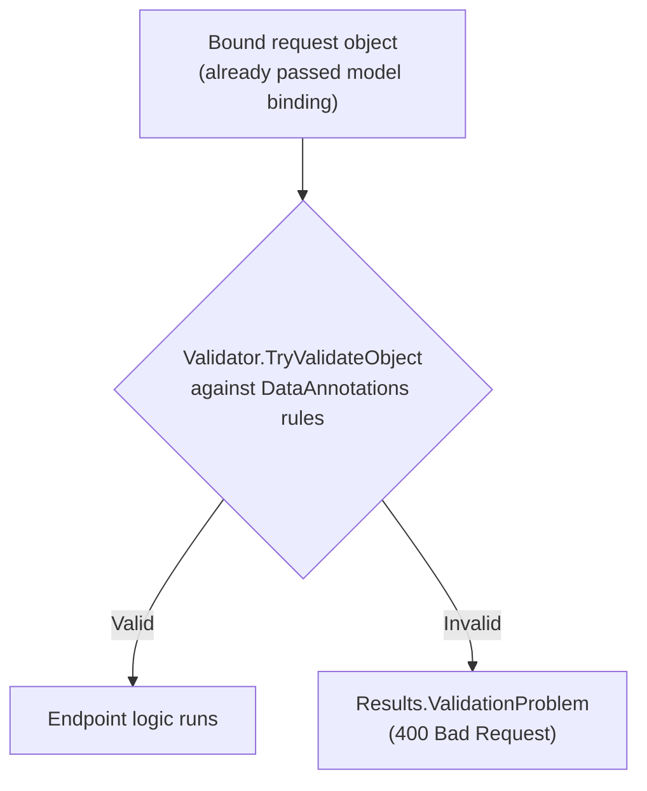
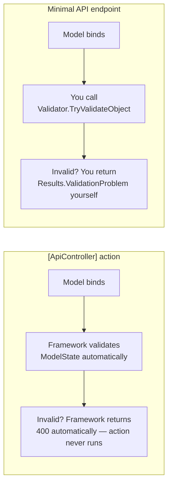

# Model Validation

## Introduction

Before reading this lesson, you should already be comfortable with **[Model Binding](../10-aspnetcore/10-09-model-binding.md)** — how ASP.NET Core populates an endpoint's parameters, including a complex `CreateOrderRequest` bound straight from a JSON body. Binding only answers "did the shape of the data match?" It says nothing about whether the *values* inside that shape make sense: a `CreateOrderRequest` with an empty customer name, or a negative quantity, binds just as successfully as a perfectly reasonable one. **Model validation** is the step that catches that, and this lesson covers how to express validation rules declaratively and how to actually enforce them, since — surprisingly to a lot of newcomers — minimal APIs don't enforce them for you automatically the way controllers do.

By the end of this lesson, you will be able to:

- Express validation rules declaratively with `System.ComponentModel.DataAnnotations` attributes: `[Required]`, `[Range]`, `[EmailAddress]`, and others
- Explain how `[ApiController]`-decorated controllers validate `ModelState` and return `400 Bad Request` automatically
- Validate a bound object manually in a minimal API using `Validator.TryValidateObject`
- Return a proper `400 Bad Request` with structured, per-field validation error details using `Results.ValidationProblem`
- Decide, for a given endpoint style, whether validation happens automatically or needs to be written explicitly

## Model Validation — A Layman's Perspective

Think about a loan application arriving at a bank. Before anyone even looks at whether this particular applicant *should* get the loan, a much more basic check happens first: is the form actually filled out properly? Is there a name in the name field, and not a blank space? Is the income field an actual number, not the word "lots"? Is the requested loan amount within some sane range — not zero, not a number with fifteen digits? None of these checks require understanding this specific applicant's finances at all. They're checks about the *shape and sanity of the data itself*, and a bank that skipped them would waste enormous effort running full financial analysis on forms that were never fillable to begin with.

Crucially, a well-run bank doesn't leave this checking to whichever loan officer happens to open the envelope that day, trusting each one to remember every rule from memory. Instead, the rules get written down once, on the form itself, right next to each field: "required," "must be between $1,000 and $500,000," "must look like a real email address." Any officer, or even an automated scanner, can then apply those same rules mechanically, without needing to understand loan underwriting at all — just needing to check the form against the rules printed on it.

`System.ComponentModel.DataAnnotations` attributes are exactly those printed rules, attached directly to the properties of the C# type that represents the incoming data — `[Required]` on the name, `[Range(1000, 500000)]` on the requested amount, `[EmailAddress]` on the contact address. You write each rule exactly once, as a small annotation sitting right next to the field it governs, and from then on, that rule travels with the data type itself rather than living inside the memory of whoever happens to be handling this particular request.

But writing the rules down is only half the job — someone still has to actually *check* the form against them before it moves any further into the process. This is where the bank analogy reveals the exact subtlety this lesson is built around: some banks have an automated front-desk scanner that checks every incoming form against its printed rules the instant it arrives, rejecting anything that fails before a human ever sees it. Other, smaller branches don't have that scanner installed — the rules are still printed on the form, but nobody automatically checks them, so unless a loan officer remembers to manually compare the form against its own rules, an invalid form can slip straight through to full underwriting. Both branches used the exact same rules, printed the exact same way — the difference was entirely about whether an automatic checking step existed at the front desk or not. ASP.NET Core controllers are the branch with the automated scanner; minimal APIs are the branch where you, the developer, have to install that scanner yourself.

## Model Validation — A Programming Language Perspective

`System.ComponentModel.DataAnnotations` provides a family of `ValidationAttribute` subclasses — `RequiredAttribute`, `RangeAttribute`, `EmailAddressAttribute`, `StringLengthAttribute`, and others — that can be applied to a type's properties (on a positional `record`, using the `[property: ...]` target specifier) to declare constraints on their values. In an MVC controller decorated with `[ApiController]`, the framework runs these validations automatically after model binding, populates `ControllerContext.ModelState` with any failures, and — because `[ApiController]` enables automatic HTTP `400` responses — short-circuits the action entirely and returns a `400 Bad Request` with a `ValidationProblemDetails` body if `ModelState` is invalid, without a single line of validation code in the action itself. Minimal API endpoints receive no such automatic step: validation has to be triggered explicitly, typically with `System.ComponentModel.DataAnnotations.Validator.TryValidateObject`, and a `400` response constructed explicitly with `Results.ValidationProblem(IDictionary<string, string[]> errors)`.

## How to Validate Bound Data in C#

Declare the rules once, on the request type, using DataAnnotations attributes; then, in a minimal API, run them explicitly against the bound instance before acting on it.


*Figure 1: Binding and validation are two separate steps — a value can bind successfully and still fail validation immediately afterward.*

```csharp
// Program.cs — .NET 10 / C# 14
using System.ComponentModel.DataAnnotations;

var builder = WebApplication.CreateBuilder(args);
var app = builder.Build();

app.MapPost("/subscribers", (SubscribeRequest request) =>
{
    var validationResults = new List<ValidationResult>();
    bool isValid = Validator.TryValidateObject(
        request, new ValidationContext(request), validationResults, validateAllProperties: true);

    if (!isValid)
    {
        var errors = new Dictionary<string, string[]>();
        foreach (ValidationResult result in validationResults)
        {
            foreach (string member in result.MemberNames)
            {
                errors[member] = [result.ErrorMessage ?? "Invalid value."];
            }
        }

        return Results.ValidationProblem(errors);
    }

    return Results.Ok(new { Message = $"Subscribed {request.Email}." });
});

app.Run();

record SubscribeRequest(
    [property: Required, EmailAddress] string Email,
    [property: Range(13, 120)] int Age);
```

Since this is a running web server, the "Console Output" below shows the server's startup log and the actual HTTP response, not a console-app trace.

**Console Output** (`curl -i -X POST http://localhost:5000/subscribers -H "Content-Type: application/json" -d "{\"email\":\"not-an-email\",\"age\":30}"`):

```text
info: Microsoft.Hosting.Lifetime[14]
      Now listening on: http://localhost:5000

HTTP/1.1 400 Bad Request
Content-Type: application/problem+json; charset=utf-8

{"type":"https://tools.ietf.org/html/rfc9110#section-15.5.1","title":"One or more validation errors occurred.","status":400,"errors":{"Email":["The Email field is not a valid e-mail address."]}}
```

`"not-an-email"` bound successfully into `SubscribeRequest.Email` — it's a perfectly ordinary string, and binding never inspects its content — but `Validator.TryValidateObject` then ran the `[EmailAddress]` rule against it, found it invalid, and the endpoint returned `Results.ValidationProblem` with a structured `errors` dictionary naming exactly which field failed and why, in the same `ProblemDetails` shape ASP.NET Core uses for every kind of error response.

## Real-Time Example: Validating an Order Request Before Creating It

We extend the E-Commerce Order API's `CreateOrderRequest` from the previous lesson with validation attributes, and add the manual validation step the minimal API version needs before an invalid order is ever created.

```csharp
// Program.cs — .NET 10 / C# 14 — Real-Time Example
using System.ComponentModel.DataAnnotations;

var builder = WebApplication.CreateBuilder(args);
var app = builder.Build();

var orders = new Dictionary<int, CreateOrderRequest>();
int nextOrderId = 2001;

app.MapPost("/orders", (CreateOrderRequest request) =>
{
    var validationResults = new List<ValidationResult>();
    bool isValid = Validator.TryValidateObject(
        request, new ValidationContext(request), validationResults, validateAllProperties: true);

    if (!isValid)
    {
        var errors = new Dictionary<string, string[]>();
        foreach (ValidationResult result in validationResults)
        {
            foreach (string member in result.MemberNames)
            {
                errors[member] = [result.ErrorMessage ?? "Invalid value."];
            }
        }

        return Results.ValidationProblem(errors);
    }

    int orderId = nextOrderId++;
    orders[orderId] = request;
    return Results.Created($"/orders/{orderId}", new { OrderId = orderId, request.CustomerName, request.Total });
});

app.Run();

record CreateOrderRequest(
    [property: Required, StringLength(100, MinimumLength = 2)] string CustomerName,
    [property: Required, EmailAddress] string CustomerEmail,
    [property: Range(1, 100)] int Quantity,
    [property: Range(0.01, 100000)] decimal Total);
```

**Console Output** (`curl -i -X POST http://localhost:5000/orders -H "Content-Type: application/json" -d "{\"customerName\":\"A\",\"customerEmail\":\"priya@example.com\",\"quantity\":0,\"total\":49.99}"`):

```text
info: Microsoft.Hosting.Lifetime[14]
      Now listening on: http://localhost:5000

HTTP/1.1 400 Bad Request
Content-Type: application/problem+json; charset=utf-8

{"type":"https://tools.ietf.org/html/rfc9110#section-15.5.1","title":"One or more validation errors occurred.","status":400,"errors":{"CustomerName":["The field CustomerName must be a string or array type with a minimum length of '2'."],"Quantity":["The field Quantity must be between 1 and 100."]}}
```

Two independent rules failed at once — `CustomerName` was too short and `Quantity` was zero, outside its declared `[Range(1, 100)]` — and `Validator.TryValidateObject` with `validateAllProperties: true` reported both in a single pass, rather than stopping at the first failure. In a real order-processing system, this check runs before a single row is written or a single downstream service (payment, inventory reservation) is called, so the cost of a bad request is contained to exactly this one, cheap, in-memory check.

## Automatic Validation in Controllers vs Manual Validation in Minimal APIs

Both styles can enforce the exact same `DataAnnotations` rules on the exact same request type — the difference is entirely about who triggers the check.


*Figure 2: Controllers validate automatically after `[ApiController]` opts in; minimal APIs require that same step to be written by hand — or centralized in a filter, as the next lesson shows.*

```csharp
// OrdersController.cs — .NET 10 / C# 14 — illustrative controller counterpart
using Microsoft.AspNetCore.Mvc;

[ApiController]
[Route("api/[controller]")]
public class OrdersController : ControllerBase
{
    [HttpPost]
    public IActionResult Create(CreateOrderRequest request)
    {
        // No manual validation call needed here: [ApiController] already checked
        // ModelState and returned 400 automatically for any invalid request.
        return Created($"/api/orders/1", request);
    }
}
```

| Aspect | `[ApiController]` action | Minimal API endpoint |
|---|---|---|
| Validation trigger | Automatic, after model binding | Manual — you call `Validator.TryValidateObject` |
| `400` response | Returned automatically, action never runs | You must construct it with `Results.ValidationProblem` |
| Code required in the handler | None | A validation block in every endpoint, unless centralized |
| Centralizing the logic | Built in | Possible via an endpoint filter — see the next lesson |

## Types of Validation in ASP.NET Core

1. **`[Required]`** — this lesson's most common rule, rejecting `null` or empty values.
2. **`[Range]`** — this lesson's numeric bounds check, as used on `Quantity` and `Total`.
3. **`[EmailAddress]` / `[Phone]` / `[Url]`** — this lesson's format-specific string checks.
4. **`[StringLength]` / `[MinLength]` / `[MaxLength]`** — length constraints on strings and collections.
5. **Custom validation attributes** — subclassing `ValidationAttribute` to express a rule no built-in attribute covers, such as cross-field checks.
6. **`IValidatableObject`** — implementing this interface directly on the model for validation logic that needs to inspect multiple properties together, rather than one attribute per property.

## What You've Learned & What's Next

`DataAnnotations` attributes let you declare validation rules once, directly on a request type, and both controllers and minimal APIs can enforce those same rules — but only controllers do it automatically. In a minimal API, calling `Validator.TryValidateObject` and returning `Results.ValidationProblem` on failure is a step you write yourself, and it's exactly the kind of repeated, cross-cutting logic that's tedious to copy into every single endpoint by hand.

Continue your learning journey with **[Action Filters and Endpoint Filters](../10-aspnetcore/10-11-action-and-endpoint-filters.md)**, where you'll see how to centralize logic like this validation check so it wraps every endpoint that needs it, without repeating the same block of code in each one.

---
*Applies to: .NET 10 / C# 14. Last reviewed 2026-08-16.*
