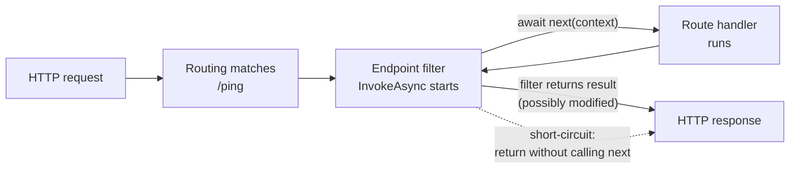
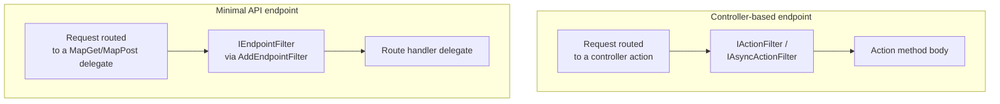

# Action Filters and Endpoint Filters

## Introduction

Before reading this lesson, you should already be comfortable with **[Model Validation](../10-aspnetcore/10-10-model-validation.md)** — in particular, the idea that ASP.NET Core gives a request a chance to be rejected *before* it reaches your handler's business logic. Model validation solves one specific version of that problem: "is this request body shaped correctly?" This lesson generalizes the idea. What if you want to log every request's timing, check an API key, or short-circuit a call for a reason that has nothing to do with the shape of the request body — and you want that logic to run for many endpoints without pasting the same six lines into every action method and every minimal API delegate?

That's what filters are for: reusable units of logic that wrap around a controller action or a minimal API endpoint, able to inspect or short-circuit the request on the way in, and inspect or rewrite the response on the way out.

By the end of this lesson, you will be able to:

- Explain what a filter is and where it sits relative to the middleware pipeline and to model binding/validation
- Implement `IActionFilter` and `IAsyncActionFilter` to wrap controller actions with cross-cutting logic
- Implement `IEndpointFilter` and use `AddEndpointFilter` to wrap minimal API route handlers
- Short-circuit a request from inside a filter, before the action or handler ever runs
- Apply a filter to a single action, an entire controller, or globally across an app
- Choose correctly between an action filter and an endpoint filter based on whether your app uses controllers or minimal APIs

## Action Filters and Endpoint Filters — A Layman's Perspective

Picture an airport security checkpoint sitting between the terminal entrance and the gates. Every passenger walks the same corridor, and at a fixed point along that corridor, the same set of checks happens to every one of them: bags go through a scanner, passengers walk through a metal detector, IDs get glanced at. The checkpoint doesn't know or care whether a given passenger is flying to Chicago or Tokyo — that's the gate agent's job, further down the corridor. The checkpoint's entire purpose is to apply one uniform layer of scrutiny to *everyone*, in one place, so that no individual gate agent has to personally re-implement bag scanning and metal detection at their own gate.

Now picture something subtler: a courthouse where certain kinds of hearings — say, anything involving a minor — get an extra step. Before the judge even calls the case, a clerk checks a box on the file confirming a guardian is present in the room, and if not, sends the case back to the waiting room without the judge ever seeing it. That's a check that applies only to a *category* of case, not to every case that walks through the courthouse doors, and — crucially — it can stop the process entirely before the "real" work (the judge hearing the case) ever begins.

Filters in ASP.NET Core are both of these things, depending on where you attach them. Attach one globally, and it behaves like the airport checkpoint: it wraps every controller action or every filtered endpoint, without any of them needing to know it exists. Attach one to a specific controller, action, or individual `MapGet`/`MapPost` call, and it behaves like the courthouse clerk: a targeted check that applies only where you've asked for it, with the power to either let the request continue toward the real handler or turn it back immediately with a response of its own — a 400, a 401, a cached result — without the handler's business logic ever running at all.

The corridor itself — the sequence a request walks from "arrived" to "handled" to "response sent" — is the *middleware pipeline*, which you met a few lessons ago and which wraps the entire application. Filters live one level further in, wrapping specifically the point where routing has already matched a request to *this* controller action or *this* minimal API delegate, but that action or delegate hasn't run yet. That's the detail that makes filters more convenient than writing custom middleware for many cross-cutting concerns: a filter already knows which action or endpoint it's wrapping, has access to the bound and validated arguments, and can be applied surgically to one action instead of every request the whole app receives.

## Action Filters and Endpoint Filters — A Programming Language Perspective

An **action filter** is any type implementing `IActionFilter` (synchronous, with `OnActionExecuting`/`OnActionExecuted`) or `IAsyncActionFilter` (a single `OnActionExecutionAsync(ActionExecutingContext, ActionExecutionDelegate)` method) from `Microsoft.AspNetCore.Mvc.Filters`. It participates in the MVC filter pipeline, which runs strictly for controller-based actions, after model binding and validation but before the action method body executes. Setting `context.Result` inside `OnActionExecuting` (or skipping the call to `next()` in the async variant) short-circuits the pipeline: the action method never runs, and the assigned result becomes the response.

An **endpoint filter** is any type implementing `IEndpointFilter` (`Microsoft.AspNetCore.Http`), with a single method, `InvokeAsync(EndpointFilterInvocationContext, EndpointFilterDelegate)`, introduced for minimal APIs in .NET 7 and still the current mechanism in .NET 10. It's attached per-endpoint with `.AddEndpointFilter<TFilter>()` or `.AddEndpointFilter(async (context, next) => ...)` on the result of `MapGet`/`MapPost`/etc., and can inspect `context.Arguments`, short-circuit by returning a result without calling `next`, or wrap the call to `next(context)` to inspect or transform the response.

## How to Use Endpoint Filters in Minimal APIs

An endpoint filter is the more modern, lighter-weight mechanism of the two, and it composes naturally with minimal APIs' functional style: `next` is a delegate you call (or don't) to continue the pipeline, and whatever it returns — or whatever you return instead — becomes the endpoint's result.


*Figure 1: An endpoint filter wraps the route handler. It can inspect the call before `next`, inspect or replace the result after `next`, or skip `next` entirely to short-circuit.*

```csharp
// Program.cs — .NET 10 / C# 14
using System.Diagnostics;

var builder = WebApplication.CreateBuilder(args);
var app = builder.Build();

app.MapGet("/ping", () => Results.Ok(new PingResponse("pong")))
   .AddEndpointFilter(async (context, next) =>
   {
       Stopwatch stopwatch = Stopwatch.StartNew();
       object? result = await next(context);
       stopwatch.Stop();

       context.HttpContext.Response.Headers["X-Elapsed-Ms"] =
           stopwatch.ElapsedMilliseconds.ToString();

       Console.WriteLine(
           $"[{context.HttpContext.Request.Method}] {context.HttpContext.Request.Path} " +
           $"-> {stopwatch.ElapsedMilliseconds}ms");

       return result;
   });

app.Run();

record PingResponse(string Message);
```

Because this example is an ASP.NET Core app rather than a console app, "output" means what appears in the server's terminal and what the client receives over HTTP — not a single linear console trace. Both are shown below.

**Console Output (server terminal, after a request arrives):**

```text
[GET] /ping -> 1ms
```

**HTTP Response (what a client sees, e.g. via `curl -i http://localhost:5000/ping`):**

```text
HTTP/1.1 200 OK
Content-Type: application/json; charset=utf-8
X-Elapsed-Ms: 1

{"message":"pong"}
```

The filter runs on *every* request to `/ping` because it's attached directly to that endpoint's registration, but it never touches `/ping`'s neighbors — nothing else needs to know the filter exists. `await next(context)` is the line that actually invokes the route handler; everything before it runs on the way in, everything after it runs on the way out, and the `X-Elapsed-Ms` header proves the filter touched the response after the handler had already produced its result.

## Real-Time Example: Guarding the Orders API in E-Commerce Order Processing

We extend the `Order` domain from earlier ASP.NET Core lessons with an `OrdersController` that needs two cross-cutting checks applied consistently: every request must carry a valid, positive order ID before the controller action is trusted to run at all, and every request's timing should be logged — without either check being copy-pasted into every action. This is exactly the scenario action filters exist for: `OrderIdValidationFilter` short-circuits invalid requests with a `400`, and `RequestTimingFilter` wraps the whole action to measure and log elapsed time, applied globally so it covers every controller in the app automatically.

```csharp
// Program.cs — .NET 10 / C# 14 — Real-Time Example
using System.Diagnostics;
using Microsoft.AspNetCore.Mvc;
using Microsoft.AspNetCore.Mvc.Filters;

var builder = WebApplication.CreateBuilder(args);

builder.Services.AddControllers(options =>
{
    options.Filters.Add<RequestTimingFilter>(); // applies globally, every controller
});

var app = builder.Build();
app.MapControllers();
app.Run();

record Order(int OrderId, string CustomerName, decimal Total);

[ApiController]
[Route("api/orders")]
public class OrdersController : ControllerBase
{
    private static readonly Dictionary<int, Order> Orders = new()
    {
        [1001] = new Order(1001, "Priya Nair", 149.50m),
        [1002] = new Order(1002, "Wei Zhang", 89.00m)
    };

    [HttpGet("{id:int}")]
    [ServiceFilter(typeof(OrderIdValidationFilter))]
    public ActionResult<Order> GetOrder(int id)
    {
        return Orders.TryGetValue(id, out Order? order)
            ? Ok(order)
            : NotFound(new { message = $"Order {id} was not found." });
    }
}

// Attribute-based filter, resolved per request via [ServiceFilter]
public class OrderIdValidationFilter(ILogger<OrderIdValidationFilter> logger) : IActionFilter
{
    public void OnActionExecuting(ActionExecutingContext context)
    {
        if (context.ActionArguments.TryGetValue("id", out object? value) &&
            value is int id && id <= 0)
        {
            logger.LogWarning("Rejected invalid order id: {Id}", id);
            context.Result = new BadRequestObjectResult(
                new { message = "Order id must be a positive integer." });
        }
    }

    public void OnActionExecuted(ActionExecutedContext context) { }
}

// Global filter, registered once in AddControllers, applies to every action
public class RequestTimingFilter(ILogger<RequestTimingFilter> logger) : IActionFilter
{
    private Stopwatch _stopwatch = new();

    public void OnActionExecuting(ActionExecutingContext context) => _stopwatch = Stopwatch.StartNew();

    public void OnActionExecuted(ActionExecutedContext context)
    {
        _stopwatch.Stop();
        logger.LogInformation(
            "{Action} completed in {ElapsedMs}ms with status {StatusCode}",
            context.ActionDescriptor.DisplayName,
            _stopwatch.ElapsedMilliseconds,
            (context.Result as ObjectResult)?.StatusCode ?? 200);
    }
}
```

`OrderIdValidationFilter` also needs one line of registration, `builder.Services.AddScoped<OrderIdValidationFilter>();`, since `[ServiceFilter]` resolves it from DI rather than constructing it directly — omitted above only for brevity, required in the real project.

**Console Output (server log, `GET /api/orders/-5`):**

```text
warn: OrderIdValidationFilter[0]
      Rejected invalid order id: -5
info: RequestTimingFilter[0]
      OrdersController.GetOrder (WebApi) completed in 0ms with status 400
```

**HTTP Response:**

```text
HTTP/1.1 400 Bad Request
Content-Type: application/json; charset=utf-8

{"message":"Order id must be a positive integer."}
```

`GetOrder`'s body never ran for the `-5` request — `context.Result` was already set by `OnActionExecuting`, so the MVC pipeline skipped straight to producing the response. `RequestTimingFilter` still logged the outcome, because a global filter wraps the *entire* action pipeline, including short-circuited requests, which is precisely why timing and auditing filters are usually registered globally rather than per action.

## Action Filters vs. Endpoint Filters

The two mechanisms solve the same problem for two different hosting styles, and the dividing line is simply which one your endpoint is built with. `IActionFilter`/`IAsyncActionFilter` only run for requests routed to a controller action — they're part of the MVC filter pipeline and rely on MVC-specific context (`ActionExecutingContext`, model state, action descriptors). `IEndpointFilter` runs for any endpoint registered through the routing system, which in practice today means minimal API route handlers; it has no dependency on MVC and works with the more generic `EndpointFilterInvocationContext`. A controller-based app cannot attach `IEndpointFilter` to its controller actions, and a pure minimal API app has no MVC pipeline for `IActionFilter` to plug into — pick the filter type that matches how the endpoint itself was declared.


*Figure 2: Two parallel filter pipelines — which one applies is decided entirely by whether the endpoint is a controller action or a minimal API delegate.*

| Aspect | `IActionFilter` / `IAsyncActionFilter` | `IEndpointFilter` |
|---|---|---|
| Applies to | Controller actions (MVC pipeline) | Minimal API route handlers |
| Introduced | Since early ASP.NET Core (MVC) | .NET 7, current in .NET 10 |
| Registration | `[ServiceFilter]`, `[TypeFilter]`, or `options.Filters.Add<T>()` | `.AddEndpointFilter<T>()` or an inline lambda on the route builder |
| Access to arguments | `ActionExecutingContext.ActionArguments` | `EndpointFilterInvocationContext.Arguments` |
| Short-circuit mechanism | Set `context.Result` (skip calling `next` in async form) | Return a result without calling `next` |

## Types of Filters in ASP.NET Core

Action and endpoint filters are the two most commonly reached-for filter types, but ASP.NET Core's MVC pipeline includes several sibling interfaces worth knowing by name:

1. **`IActionFilter` / `IAsyncActionFilter`** — wrap the controller action itself; covered above.
2. **`IResultFilter` / `IAsyncResultFilter`** — wrap the *execution of the result* (e.g. serializing an `ObjectResult` to JSON), running after the action filter but around result production specifically.
3. **`IExceptionFilter` / `IAsyncExceptionFilter`** — catch unhandled exceptions thrown by an action, scoped to MVC rather than the whole app; for app-wide exception handling, see **[Writing Custom Middleware](../10-aspnetcore/10-07-writing-custom-middleware.md)**.
4. **`IEndpointFilter`** — the minimal API equivalent covered above, attached via **[Minimal APIs](../10-aspnetcore/10-02-minimal-apis.md)**' fluent `Map*` return value.
5. **`[ServiceFilter]` / `[TypeFilter]` attributes** — apply an `IActionFilter` implementation resolved through **[Dependency Injection and Service Lifetimes](../10-aspnetcore/10-08-di-and-service-lifetimes.md)** to a specific action or controller.
6. **Global filters via `MvcOptions.Filters`** — registered once against **[The Middleware Pipeline](../10-aspnetcore/10-06-the-middleware-pipeline.md)**'s MVC stage, applying to every controller action in the app, as `RequestTimingFilter` did above.

## What You've Learned & What's Next

Filters give you a place to put cross-cutting logic — logging, timing, validation, short-circuiting — exactly once, instead of at the top of every action method or every minimal API delegate. `IActionFilter`/`IAsyncActionFilter` are the controller-based mechanism; `IEndpointFilter` is the minimal API equivalent introduced in .NET 7 and still current; both can inspect a request before the real handler runs and both can short-circuit it entirely.

Continue your learning journey with **[API Versioning](../10-aspnetcore/10-12-api-versioning.md)**, where we look at how to evolve an API's contract over time without breaking the clients already depending on it.

---
*Applies to: .NET 10 / C# 14. Last reviewed 2026-08-16.*
