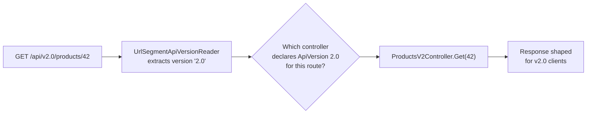
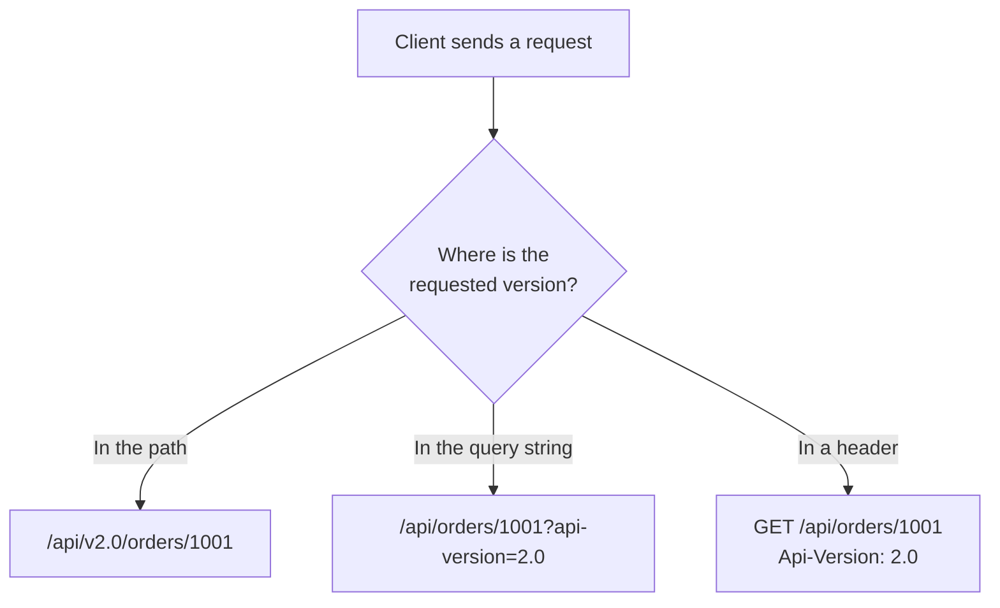

# API Versioning

## Introduction

Before reading this lesson, you should already be comfortable with **[Action Filters and Endpoint Filters](../10-aspnetcore/10-11-action-and-endpoint-filters.md)** — in particular, the idea that a request can be routed to different logic depending on something other than just its URL path and HTTP method. This lesson applies that same flexibility to a much more common real-world problem: your API's contract *will* need to change over time — a field renamed, a response shape restructured, a field removed entirely — and some of those changes will break clients who are still calling the API exactly the way it worked last year. API versioning is how you make that kind of change without breaking them.

By the end of this lesson, you will be able to:

- Explain why APIs need explicit versioning rather than just changing the contract in place
- Distinguish the three common versioning strategies: URL segment, query string, and header-based
- Configure the `Asp.Versioning` package to read a client's requested version and route accordingly
- Apply `[ApiVersion]` to controllers and read the version from a URL segment like `/v2/products`
- Run two versions of the same logical endpoint side by side, each returning a different response shape
- Choose the right versioning strategy for a given API's clients and constraints

## API Versioning — A Layman's Perspective

Imagine a neighborhood bakery that has served the same walk-up counter for ten years, with the same laminated menu bolted to the wall: "Sourdough Loaf — $6." One day the bakery changes its sourdough recipe entirely — a longer fermentation, a different flour blend — and quietly reprints the same menu card with the same name and the same price. Regulars who've been ordering "the usual" for years get handed a loaf that tastes, feels, and slices differently than what they expected, with no warning that anything changed at all. Some won't mind. Some will feel like they were sold something other than what they asked for, because, in every way that matters to them, they were.

Contrast that with a bakery that handles the same recipe change differently: it keeps the original recipe running under the original name, "Classic Sourdough — $6," and introduces the new recipe as a genuinely new item, "Sourdough Reserve — $7," on the same menu. Regulars who keep ordering "Classic Sourdough" get exactly what they've always gotten. Anyone who wants to try the new recipe orders the new item by its new name. Nothing broke for anyone, and the bakery still got to move forward — it just didn't erase the old thing to do it.

That second bakery is running two versions of its product side by side, and it needs some way for a customer to say which one they want. It could put them at physically different counters — walk up to the left window for Classic, the right window for Reserve (this is the URL segment approach: `/v1/products` versus `/v2/products`, a different "address" for each version). It could keep one counter but have the customer write their preference on the order slip before handing it to the cashier (a query string: `/products?api-version=2.0`, an extra instruction riding along with an otherwise identical request). Or it could have the customer simply say a code word to the same cashier at the same counter — "the Reserve, please" — without the storefront itself looking any different at all (a header: `Api-Version: 2.0`, invisible in the URL, present only in the request's metadata).

All three get the customer the version they actually want. None of them force every existing customer to be surprised by a silent substitution. That's the entire discipline of API versioning: when a contract must change in a way that would break existing callers, don't replace the old contract in place — publish the new one alongside it, and give callers an explicit, deliberate way to opt into it.

## API Versioning — A Programming Language Perspective

The `Asp.Versioning.Http` and `Asp.Versioning.Mvc` NuGet packages (the actively maintained successors to the older `Microsoft.AspNetCore.Mvc.Versioning`) add first-class API version support to ASP.NET Core. `services.AddApiVersioning(options => ...)` registers the versioning services and configures an `ApiVersionReader` — `UrlSegmentApiVersionReader`, `QueryStringApiVersionReader`, `HeaderApiVersionReader`, or `MediaTypeApiVersionReader` — that determines where an incoming request's requested version is read from. Controllers declare which version(s) they serve with the `[ApiVersion(1.0)]` attribute, and a route template segment written as `{version:apiVersion}` binds to whichever reader is configured. `options.AssumeDefaultVersionWhenUnspecified` and `options.DefaultApiVersion` control what happens when a client omits a version entirely, and `options.ReportApiVersions = true` adds an `api-supported-versions` response header advertising every version the matched endpoint set supports — useful for clients discovering what's available without reading documentation.

## How to Version an API with URL Segments in C#

URL segment versioning is the most visible and most commonly adopted strategy, because the version is part of the address itself — easy to see in logs, easy to bookmark, and impossible for a client to "forget" to send. Two controllers share the same route template but declare different `[ApiVersion]` values; the version reader matches the `{version:apiVersion}` segment of the URL to the right one.


*Figure 1: The version segment is read before routing finishes, and it's the deciding factor in which controller actually handles the request.*

```csharp
// Program.cs — .NET 10 / C# 14
// NuGet packages: Asp.Versioning.Mvc
using Asp.Versioning;

var builder = WebApplication.CreateBuilder(args);
builder.Services.AddControllers();
builder.Services
    .AddApiVersioning(options =>
    {
        options.DefaultApiVersion = new ApiVersion(1.0);
        options.AssumeDefaultVersionWhenUnspecified = true;
        options.ReportApiVersions = true;
        options.ApiVersionReader = new UrlSegmentApiVersionReader();
    })
    .AddMvc(); // enables [ApiVersion] and version-aware route matching on controllers

var app = builder.Build();
app.MapControllers();
app.Run();

[ApiController]
[ApiVersion(1.0)]
[Route("api/v{version:apiVersion}/products")]
public class ProductsController : ControllerBase
{
    [HttpGet("{id:int}")]
    public IActionResult Get(int id) =>
        Ok(new { id, name = "Wireless Mouse" }); // v1 shape: no price field
}

[ApiController]
[ApiVersion(2.0)]
[Route("api/v{version:apiVersion}/products")]
public class ProductsV2Controller : ControllerBase
{
    [HttpGet("{id:int}")]
    public IActionResult Get(int id) =>
        Ok(new { id, name = "Wireless Mouse", price = 24.99m }); // v2 adds price
}
```

Because this is an ASP.NET Core app, "output" is the HTTP request/response exchange rather than a console trace.

**HTTP Response — `GET /api/v1.0/products/42`:**

```text
HTTP/1.1 200 OK
Content-Type: application/json; charset=utf-8
api-supported-versions: 1.0, 2.0

{"id":42,"name":"Wireless Mouse"}
```

**HTTP Response — `GET /api/v2.0/products/42`:**

```text
HTTP/1.1 200 OK
Content-Type: application/json; charset=utf-8
api-supported-versions: 1.0, 2.0

{"id":42,"name":"Wireless Mouse","price":24.99}
```

Both controllers share the same route template, `api/v{version:apiVersion}/products`, and the same HTTP method and path shape otherwise — the only thing distinguishing them is the `[ApiVersion]` attribute, which the version reader uses to pick the matching controller for a given request's version segment. A client that never updates its code and keeps requesting `v1.0` keeps getting the exact same response shape it always has, forever, even after `v2.0` ships.

## Real-Time Example: Versioning the Orders API in E-Commerce Order Processing

We continue building on the `Order` type and `OrdersController` introduced in the previous lesson on action filters. The original `GetOrder` action returned `OrderId`, `CustomerName`, and `Total`. A new requirement — surfacing an order's fulfillment status to clients — would normally mean adding a `Status` field directly onto the existing response, which is safe for clients that ignore unknown fields but genuinely breaks any strongly-typed client that deserializes the response into a fixed-shape model expecting exactly three fields. Versioning lets the richer shape ship as `v2.0` while `v1.0` keeps returning exactly what it always has.

```csharp
// Program.cs — .NET 10 / C# 14 — Real-Time Example
using Asp.Versioning;
using Microsoft.AspNetCore.Mvc;

var builder = WebApplication.CreateBuilder(args);
builder.Services.AddControllers();
builder.Services
    .AddApiVersioning(options =>
    {
        options.DefaultApiVersion = new ApiVersion(1.0);
        options.AssumeDefaultVersionWhenUnspecified = true;
        options.ReportApiVersions = true;
        options.ApiVersionReader = new UrlSegmentApiVersionReader();
    })
    .AddMvc();

var app = builder.Build();
app.MapControllers();
app.Run();

enum OrderStatus { Pending, Shipped, Delivered }

record OrderV1(int OrderId, string CustomerName, decimal Total);
record OrderV2(int OrderId, string CustomerName, decimal Total, OrderStatus Status);

[ApiController]
[ApiVersion(1.0)]
[Route("api/v{version:apiVersion}/orders")]
public class OrdersController : ControllerBase
{
    [HttpGet("{id:int}")]
    public ActionResult<OrderV1> GetOrder(int id) =>
        Ok(new OrderV1(id, "Priya Nair", 149.50m));
}

[ApiController]
[ApiVersion(2.0)]
[Route("api/v{version:apiVersion}/orders")]
public class OrdersV2Controller : ControllerBase
{
    [HttpGet("{id:int}")]
    public ActionResult<OrderV2> GetOrder(int id) =>
        Ok(new OrderV2(id, "Priya Nair", 149.50m, OrderStatus.Shipped));
}
```

**HTTP Response — `GET /api/v1.0/orders/1001`:**

```text
HTTP/1.1 200 OK
Content-Type: application/json; charset=utf-8

{"orderId":1001,"customerName":"Priya Nair","total":149.50}
```

**HTTP Response — `GET /api/v2.0/orders/1001`:**

```text
HTTP/1.1 200 OK
Content-Type: application/json; charset=utf-8

{"orderId":1001,"customerName":"Priya Nair","total":149.50,"status":"Shipped"}
```

The action filters from the previous lesson — `OrderIdValidationFilter` and `RequestTimingFilter` — still apply to both versioned controllers without any changes, because filters operate on the MVC pipeline as a whole and don't care which `[ApiVersion]` a controller declares. In a real storefront, the mobile app team might stay on `v1.0` for months after `v2.0` ships to the web team, and both keep working against the same running service, with no coordination required beyond agreeing on which version segment each team's client requests.

## URL Segment vs. Query String vs. Header-Based Versioning

Choosing a strategy is mostly about who your clients are and how visible you want versioning to be. URL segment versioning is the most explicit and cache-friendly — a CDN or reverse proxy can cache `/v1/products/42` and `/v2/products/42` as entirely distinct resources without any special configuration, since they're different URLs. Query string versioning keeps the base path stable and is easy for a client to bolt on without restructuring existing calls, but it means `/products/42` and `/products/42?api-version=2.0` are technically the same resource with different representations, which some caching layers handle less cleanly. Header-based versioning keeps URLs completely uniform — appealing for REST purists who feel that a resource's identity shouldn't change just because its representation does — but it's invisible in server logs and harder for a developer to test with a plain browser address bar.


*Figure 2: The same logical request, expressed three different ways — the version reader you configure decides which of these your API actually accepts.*

| Aspect | URL Segment | Query String | Header |
|---|---|---|---|
| Visibility | Highest — visible in every log line and URL | Medium — visible in URL, easy to overlook | Lowest — invisible unless headers are inspected |
| Caching behavior | Cleanest — distinct URLs are distinct cache keys | Workable, but caches must vary by query string | Requires cache configuration to vary by header |
| Ease of manual testing | Highest — works from a plain browser address bar | High — still just a URL | Lowest — requires a tool that sets custom headers |
| Reader type | `UrlSegmentApiVersionReader` | `QueryStringApiVersionReader` | `HeaderApiVersionReader` |

## Types of API Version Readers in Asp.Versioning

`Asp.Versioning` ships several `IApiVersionReader` implementations beyond the URL segment reader used above, and they can even be combined:

1. **`UrlSegmentApiVersionReader`** — reads the version from a route template segment, as shown throughout this lesson.
2. **`QueryStringApiVersionReader`** — reads the version from a query string parameter, e.g. `?api-version=2.0`, configurable by parameter name.
3. **`HeaderApiVersionReader`** — reads the version from a custom request header, e.g. `Api-Version: 2.0`.
4. **`MediaTypeApiVersionReader`** — reads the version embedded in an `Accept` header's media type, e.g. `application/json;v=2.0`, for teams following strict content-negotiation conventions.
5. **`ApiVersionReader.Combine(...)`** — accepts a version from any of several readers, useful during a migration window while clients transition from one strategy to another.
6. **Deprecating a version with `[Obsolete]`-style `Deprecated` flags** — `[ApiVersion(1.0, Deprecated = true)]` keeps `v1.0` callable while flagging it as sunsetting in the `api-supported-versions`/`api-deprecated-versions` response headers, giving clients advance warning before it's removed.

## What You've Learned & What's Next

API versioning exists so that a breaking change to your contract doesn't have to mean a breaking change for every client depending on the old one — publish the new shape alongside the old, under an explicit version, and let clients opt in on their own schedule. `Asp.Versioning` supports three common strategies for signaling which version a client wants — URL segment, query string, and header — and `[ApiVersion]` combined with a `{version:apiVersion}` route segment is enough to run several versions of the same logical endpoint side by side in one running application.

Continue your learning journey with **[Health Checks](../10-aspnetcore/10-13-health-checks.md)**, where we look at how an ASP.NET Core app reports its own operational status — and the status of the dependencies it relies on — to the infrastructure running it.

---
*Applies to: .NET 10 / C# 14. Last reviewed 2026-08-16.*
