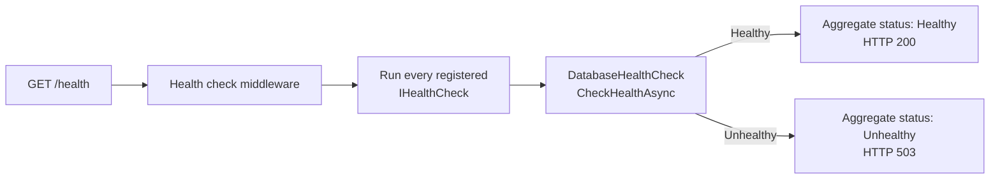
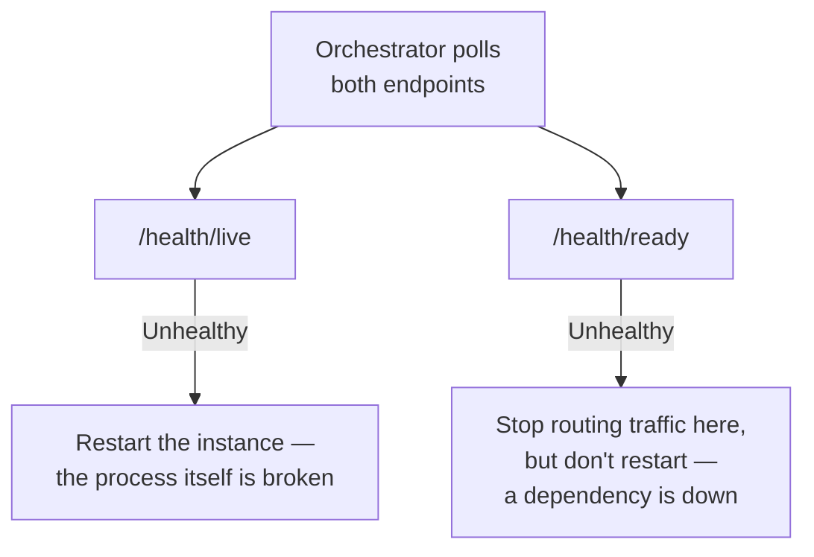

# Health Checks

## Introduction

Before reading this lesson, you should already be comfortable with **[API Versioning](../10-aspnetcore/10-12-api-versioning.md)** — and, more generally, with the idea that ASP.NET Core apps expose endpoints that answer questions on demand. This lesson introduces a special category of endpoint that doesn't return business data at all — it answers one question, continuously, for the benefit of whatever infrastructure is running your app: *is this instance actually working right now?*

That question sounds trivial until you notice how many different things "working" can mean. A process can be running, accepting connections, and returning `200 OK` for every request, while its database connection has silently died an hour ago — from the outside, that looks identical to a perfectly healthy service, right up until every request that touches the database starts failing. Health checks exist to surface exactly that gap.

By the end of this lesson, you will be able to:

- Explain what a health check reports and why "the process is running" isn't the same as "the app is healthy"
- Register health checks with `AddHealthChecks()` and expose them with `MapHealthChecks("/health")`
- Write a custom `IHealthCheck` that verifies a downstream dependency like a database or an external API
- Distinguish liveness checks from readiness checks and explain why the distinction matters
- Explain why health check endpoints matter to container orchestrators like Kubernetes, foreshadowing later modules on containers and Azure

## Health Checks — A Layman's Perspective

Picture the engine room of a large cargo ship. Every critical system down there — the main engine, the fuel pumps, the cooling loop, the electrical generators — has its own gauge, and a chief engineer walks the room checking each one individually. But up in the wheelhouse, the captain doesn't have time to interpret a wall of forty gauges while steering through a shipping lane. Instead, there's a single indicator light on the captain's console: green means every system the engineer cares about is within safe operating range, red means something down there needs attention *right now*. The light doesn't tell the captain which gauge failed — it tells the captain whether it's safe to keep this ship doing what it's currently doing.

That single light is only trustworthy because of what feeds it: it isn't wired directly to "is the ship's hull still floating" (which would almost never turn red, right up until catastrophe), it's wired to a rollup of every subsystem that actually needs to be working for the ship to function as a cargo ship — engines, pumps, generators, and yes, the hull too. A ship that's technically still floating but has a dead main engine is not "healthy" in any sense the captain cares about, even though "still floating" is technically true.

This is exactly the gap that matters for a running application. A web server process can be alive, listening on its port, and returning HTTP responses — the equivalent of "still floating" — while the database it depends on for every real request has been unreachable for the last twenty minutes. From outside the process, nothing looks wrong; the moment anyone actually asks it to do real work, everything fails. A *health check* is the application's own indicator light: a single endpoint that rolls up the status of the process itself and the critical things it depends on — its database, an external payment gateway, a message queue — into one simple, machine-readable verdict.

And crucially, that indicator light isn't just for a human to glance at occasionally. On a cargo ship, an automated safety system might be watching that same light continuously, ready to slow the engines or divert to the nearest port the instant it turns red, without waiting for a human to notice. In a modern deployment, that automated watcher is a container orchestrator: something is polling your app's health check endpoint every few seconds, and it will act on what it sees — restarting a crashed instance, or routing traffic away from one that's unhealthy but hasn't crashed — long before a human operator would have looked at a dashboard.

## Health Checks — A Programming Language Perspective

`Microsoft.Extensions.Diagnostics.HealthChecks` provides `IHealthCheck`, an interface with a single method, `CheckHealthAsync(HealthCheckContext, CancellationToken)`, returning a `HealthCheckResult` with a status of `Healthy`, `Degraded`, or `Unhealthy`, plus an optional description and exception. `builder.Services.AddHealthChecks()` registers the health check service and returns an `IHealthChecksBuilder`, against which `.AddCheck<TCheck>(name, tags: ...)` or `.AddCheck(name, () => HealthCheckResult.Healthy())` register individual checks. `app.MapHealthChecks("/health")` (from `Microsoft.AspNetCore.Diagnostics.HealthChecks`) exposes an endpoint that runs every registered check and returns an aggregate `HTTP 200` if every check is `Healthy`, or `503 Service Unavailable` if any is `Unhealthy`. `MapHealthChecks` can be called multiple times with different route paths and a `HealthCheckOptions.Predicate` filtering which tagged checks run at each path — the mechanism behind separating liveness from readiness, covered later in this lesson.

## How to Register and Expose Health Checks in C#

A minimal health check needs nothing beyond `AddHealthChecks()` and `MapHealthChecks()`, but a genuinely useful one verifies something real — here, a stand-in for a database connectivity check, implemented as a custom `IHealthCheck`.


*Figure 1: `/health` runs every registered check and rolls the results up into a single HTTP status code.*

```csharp
// Program.cs — .NET 10 / C# 14
using Microsoft.Extensions.Diagnostics.HealthChecks;

var builder = WebApplication.CreateBuilder(args);

builder.Services.AddHealthChecks()
    .AddCheck<DatabaseHealthCheck>("database");

var app = builder.Build();
app.MapHealthChecks("/health");
app.Run();

public class DatabaseHealthCheck : IHealthCheck
{
    public Task<HealthCheckResult> CheckHealthAsync(
        HealthCheckContext context, CancellationToken cancellationToken = default)
    {
        bool databaseIsReachable = true; // stand-in for a real connectivity probe
        return Task.FromResult(databaseIsReachable
            ? HealthCheckResult.Healthy("Database connection is responsive.")
            : HealthCheckResult.Unhealthy("Database connection failed."));
    }
}
```

Because this is an ASP.NET Core app, the meaningful "output" is the HTTP response `/health` returns, not a console trace.

**HTTP Response — `GET /health` (database reachable):**

```text
HTTP/1.1 200 OK
Content-Type: text/plain

Healthy
```

**HTTP Response — `GET /health` (database unreachable):**

```text
HTTP/1.1 503 Service Unavailable
Content-Type: text/plain

Unhealthy
```

The default response writer is deliberately terse — just the aggregate status as plain text — because the most common consumer of `/health` isn't a human, it's an orchestrator that only cares about the HTTP status code. A `503` is the signal that matters; the body is almost incidental. Later in this lesson, a custom `ResponseWriter` produces a richer JSON body for the cases where a human — or a monitoring dashboard — does want to see the detail.

## Real-Time Example: Health Checks for a Banking/ATM Core Service

We extend the Banking/ATM domain with a core banking API that two things must be true for it to be genuinely healthy: its accounts database must be reachable, and the external payment gateway it calls to settle card transactions must be responding. Either dependency failing means the service cannot correctly process withdrawals, even though the ASP.NET Core process itself is running perfectly fine — precisely the gap this lesson opened with.

```csharp
// Program.cs — .NET 10 / C# 14 — Real-Time Example
using Microsoft.Extensions.Diagnostics.HealthChecks;

var builder = WebApplication.CreateBuilder(args);

builder.Services.AddHttpClient("PaymentGateway", client =>
{
    client.BaseAddress = new Uri("https://payments.example-bank.internal/");
    client.Timeout = TimeSpan.FromSeconds(3);
});

builder.Services.AddHealthChecks()
    .AddCheck<AccountsDatabaseHealthCheck>("accounts-database", tags: ["ready"])
    .AddCheck<PaymentGatewayHealthCheck>("payment-gateway", tags: ["ready"]);

var app = builder.Build();

app.MapHealthChecks("/health", new HealthCheckOptions
{
    ResponseWriter = async (httpContext, report) =>
    {
        httpContext.Response.ContentType = "application/json";
        var payload = new
        {
            status = report.Status.ToString(),
            checks = report.Entries.Select(entry => new
            {
                name = entry.Key,
                status = entry.Value.Status.ToString(),
                description = entry.Value.Description
            })
        };
        await httpContext.Response.WriteAsJsonAsync(payload);
    }
});

app.Run();

public class AccountsDatabaseHealthCheck : IHealthCheck
{
    public Task<HealthCheckResult> CheckHealthAsync(
        HealthCheckContext context, CancellationToken cancellationToken = default)
    {
        bool canReachDatabase = true; // stand-in for a real SQL connectivity probe
        return Task.FromResult(canReachDatabase
            ? HealthCheckResult.Healthy("Accounts database reachable.")
            : HealthCheckResult.Unhealthy("Accounts database connection failed."));
    }
}

public class PaymentGatewayHealthCheck(IHttpClientFactory httpClientFactory) : IHealthCheck
{
    public async Task<HealthCheckResult> CheckHealthAsync(
        HealthCheckContext context, CancellationToken cancellationToken = default)
    {
        try
        {
            using HttpClient client = httpClientFactory.CreateClient("PaymentGateway");
            HttpResponseMessage response = await client.GetAsync("healthz", cancellationToken);
            return response.IsSuccessStatusCode
                ? HealthCheckResult.Healthy("Payment gateway responded.")
                : HealthCheckResult.Degraded($"Payment gateway returned {(int)response.StatusCode}.");
        }
        catch (Exception ex)
        {
            return HealthCheckResult.Unhealthy("Payment gateway unreachable.", ex);
        }
    }
}
```

**HTTP Response — `GET /health` (payment gateway timing out):**

```text
HTTP/1.1 503 Service Unavailable
Content-Type: application/json

{"status":"Unhealthy","checks":[{"name":"accounts-database","status":"Healthy","description":"Accounts database reachable."},{"name":"payment-gateway","status":"Unhealthy","description":"Payment gateway unreachable."}]}
```

Notice that `accounts-database` reporting `Healthy` doesn't save the aggregate result — `HealthCheckResult` aggregation treats `Unhealthy` as contagious across the whole report, which is the correct behavior here: an ATM network can't safely tell customers "everything's fine" if card settlement is down, even though balance lookups against the (healthy) accounts database would still work. In production, this endpoint is exactly what a container orchestrator or Azure App Service health probe would poll every few seconds, pulling any instance reporting `Unhealthy` out of the traffic rotation automatically.

## Liveness Probes vs. Readiness Probes

Not every "am I okay" question deserves the same answer, and conflating the two is a common source of outages made worse rather than better by health checks. A **liveness** check answers "is this process still functioning, or should it be killed and restarted?" — it should check almost nothing beyond the process itself, because a false positive here causes an orchestrator to restart a perfectly good instance for a problem a restart can't fix (like a temporarily slow downstream API). A **readiness** check answers "should this instance currently receive traffic?" — it's the one that should check dependencies like a database or payment gateway, because an instance whose database is unreachable genuinely shouldn't receive requests right now, even though restarting it wouldn't fix a database that's down for everyone.


*Figure 2: The same instance, answering two different questions — mixing them up causes an orchestrator to take the wrong corrective action.*

| Aspect | Liveness Probe | Readiness Probe |
|---|---|---|
| Question answered | Is the process itself functioning? | Should this instance receive traffic right now? |
| What it checks | Little to nothing beyond the process running | Real dependencies: database, external APIs, queues |
| Failure response | Orchestrator restarts the instance | Orchestrator stops routing traffic, no restart |
| Route example | `/health/live` | `/health/ready` |
| Filtered via | `MapHealthChecks` with no tag filter, or an empty check set | `HealthCheckOptions.Predicate` matching a `"ready"` tag |

## Types of Health Check Configurations in ASP.NET Core

Health checks in ASP.NET Core scale from a single always-healthy stub up through checks provided by entire community packages:

1. **Inline checks** — `AddCheck(name, () => HealthCheckResult.Healthy())`, useful for a quick smoke-test endpoint before real dependency checks exist.
2. **Custom `IHealthCheck` implementations** — the `AccountsDatabaseHealthCheck` and `PaymentGatewayHealthCheck` classes above, for dependency-specific logic.
3. **Tagged checks with `MapHealthChecks` predicates** — the mechanism behind separating `/health/live` from `/health/ready`, shown in the comparison above.
4. **`AddDbContextCheck<TContext>()`** — a built-in EF Core integration that pings a registered `DbContext`'s connection, covered once Module 11 introduces **Entity Framework Core**.
5. **Community checks (`AspNetCore.HealthChecks.*` packages)** — pre-built `IHealthCheck` implementations for SQL Server, Redis, RabbitMQ, and dozens of other dependencies, maintained outside the core ASP.NET Core repo.
6. **Container and cloud probes consuming `/health`** — Kubernetes and Azure App Service poll endpoints exactly like the ones built in this lesson; see **Container Health Checks and Readiness Probes** (../15-containers-blazor-maui/15-15-container-health-checks.md) once containers are introduced.

## What You've Learned & What's Next

A health check endpoint answers a question a plain "the server responded" never can: not just "is the process running," but "is it actually capable of doing its job right now, including everything it depends on to do that job." `AddHealthChecks()` and `MapHealthChecks()` are enough to wire that up, custom `IHealthCheck` implementations let you verify real dependencies like a database or a payment gateway, and separating liveness from readiness keeps an orchestrator from taking the wrong corrective action when something goes wrong.

Continue your learning journey with **[Rate Limiting](../10-aspnetcore/10-14-rate-limiting.md)**, where we look at protecting an API from being overwhelmed — whether by a genuine traffic spike or by abuse — using the built-in rate limiting middleware.

---
*Applies to: .NET 10 / C# 14. Last reviewed 2026-08-16.*
