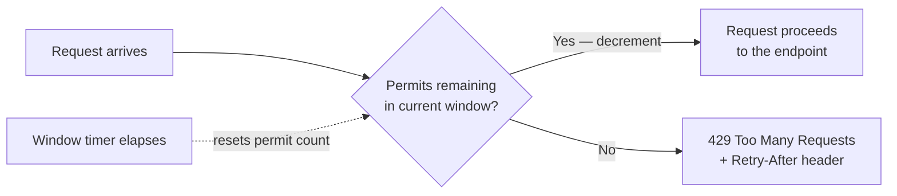
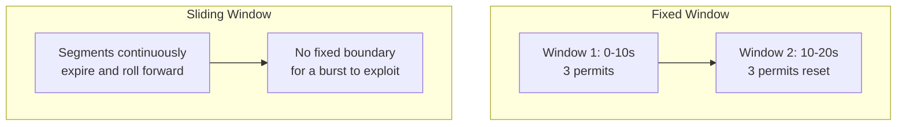

# Rate Limiting

## Introduction

Before reading this lesson, you should already be comfortable with **[Health Checks](../10-aspnetcore/10-13-health-checks.md)** — and, more broadly, with the idea that an ASP.NET Core app has an obligation not just to answer requests correctly, but to keep answering them reliably under real-world conditions. Health checks address one threat to reliability: a dependency quietly failing. This lesson addresses a different one: too many requests arriving too quickly, whether from a genuine traffic spike, a misbehaving client stuck in a retry loop, or a deliberate attempt to abuse an endpoint — a brute-force PIN guesser hammering an ATM's withdrawal endpoint is a textbook example we'll use directly in this lesson's case study.

By the end of this lesson, you will be able to:

- Explain why an API needs rate limiting even when every individual request it receives is perfectly well-formed
- Register rate limiting policies using `AddRateLimiter` and the `Microsoft.AspNetCore.RateLimiting` middleware
- Apply a fixed window, sliding window, token bucket, or concurrency limiter policy to specific endpoints
- Partition a rate limiting policy per client (e.g. per account number or per IP address) rather than globally
- Distinguish fixed window from sliding window limiting and explain the "boundary burst" problem the sliding window solves

## Rate Limiting — A Layman's Perspective

Picture a subway station at rush hour with a bank of turnstiles at the entrance. Each turnstile can physically only let one person through at a time, and there's a natural mechanical pause between each click of the mechanism — a person simply cannot force their way through faster than the turnstile allows, no matter how much of a hurry they're in. That pause isn't there to be rude to any individual commuter; it's there because the platform on the other side has a finite capacity, and letting everyone shove through simultaneously the instant a crowded train arrives would create a crush that's dangerous for everyone, commuters and station staff alike. The turnstile doesn't care whether someone's trying to get through quickly because they're late for a job interview or because they're testing how fast they can shove through fifty times in a row — it enforces the same pace either way.

Now picture two different ways a transit authority could design that turnstile's rule. The first: "each turnstile resets its counter at the top of every minute, and allows exactly thirty people through per minute." That sounds reasonable until you notice what happens right at the boundary — fifty-nine seconds into one minute, thirty people rush through in the last second, and one second later, the counter resets and another thirty rush through immediately after. Sixty people got through in two real seconds, technically obeying "thirty per minute" the whole time, because the rule only ever looked at fixed, non-overlapping one-minute blocks. The second design: "at any given moment, look back over the *previous* sixty seconds — however that window is currently positioned — and never allow more than thirty people through within it." That version has no exploitable seam; there's no instant where the counter conveniently resets and a burst sneaks through, because the sixty-second window is always sliding forward with the current moment rather than snapping cleanly to the clock.

Both approaches are legitimate ways to answer "how many people can pass through here per minute," and transit authorities really do choose between designs like these based on how much they're willing to spend on more sophisticated counting equipment versus how much burst behavior at the boundary they're willing to tolerate. A simpler, cheaper turnstile that resets on the clock is good enough for a station that just needs *some* throttling; a station that's specifically trying to prevent coordinated rushes right at the boundary needs the more sophisticated, continuously-sliding version.

Rate limiting in an API is the exact same idea, aimed at requests instead of commuters: a rule that caps how many requests a given client can make in a given span of time, enforced automatically and impartially, regardless of whether the client exceeding it is a legitimate application having a busy moment or a script deliberately trying to brute-force its way past a login form or an ATM's PIN check. And just like the turnstile, the *shape* of that rule — a fixed window that resets on the clock, or a continuously sliding one — has real consequences for exactly how much burst behavior sneaks through at the edges.

## Rate Limiting — A Programming Language Perspective

`Microsoft.AspNetCore.RateLimiting`, built on the runtime's `System.Threading.RateLimiting` primitives and part of ASP.NET Core since .NET 7 (still the current, recommended mechanism in .NET 10), adds rate limiting as ordinary middleware via `builder.Services.AddRateLimiter(options => ...)` and `app.UseRateLimiter()`. Named policies are registered against the `RateLimiterOptions` with `AddFixedWindowLimiter(name, options)`, `AddSlidingWindowLimiter(name, options)`, `AddTokenBucketLimiter(name, options)`, or `AddConcurrencyLimiter(name, options)`, and applied to a controller action with `[EnableRateLimiting("policyName")]` or to a minimal API endpoint with `.RequireRateLimiting("policyName")`. `options.OnRejected` customizes the response returned when a client exceeds its limit — by default an empty `503`, though `429 Too Many Requests` (the HTTP-standard status for this exact situation) is the far more common choice in practice, typically paired with a `Retry-After` header. Limiters can key their counters per client using a `PartitionedRateLimiter`, so that one abusive client hitting its limit doesn't throttle every other client sharing the same endpoint.

## How to Apply a Fixed Window Rate Limit in C#

A fixed window limiter is the simplest policy to reason about: a fixed number of permits, replenished entirely at the start of each window. It's registered once, then attached to whichever endpoints need it.


*Figure 1: A fixed window limiter tracks one counter per window; every request either consumes a permit or is rejected outright.*

```csharp
// Program.cs — .NET 10 / C# 14
using System.Threading.RateLimiting;
using Microsoft.AspNetCore.RateLimiting;

var builder = WebApplication.CreateBuilder(args);

builder.Services.AddRateLimiter(options =>
{
    options.RejectionStatusCode = StatusCodes.Status429TooManyRequests;
    options.AddFixedWindowLimiter("fixed", fixedOptions =>
    {
        fixedOptions.Window = TimeSpan.FromSeconds(10);
        fixedOptions.PermitLimit = 3;
        fixedOptions.QueueLimit = 0;
    });
});

var app = builder.Build();
app.UseRateLimiter();

app.MapGet("/ping", () => Results.Ok(new { message = "pong" }))
   .RequireRateLimiting("fixed");

app.Run();
```

This is an ASP.NET Core app, so "output" means the HTTP responses a client receives across several requests in quick succession — not a console trace.

**HTTP Responses — four `GET /ping` requests within the same 10-second window:**

```text
Request 1: HTTP/1.1 200 OK   {"message":"pong"}
Request 2: HTTP/1.1 200 OK   {"message":"pong"}
Request 3: HTTP/1.1 200 OK   {"message":"pong"}
Request 4: HTTP/1.1 429 Too Many Requests
```

The fourth request is rejected before `/ping`'s handler ever runs — the middleware sits ahead of routing's endpoint invocation, so a throttled request never touches the application's actual logic at all. `QueueLimit = 0` means a rejected request fails immediately rather than waiting for a permit to free up; a nonzero queue limit would instead hold a limited number of excess requests briefly, releasing them as permits become available.

## Real-Time Example: Throttling ATM Withdrawal Attempts per Account

We extend the Banking/ATM domain with the exact scenario this lesson opened with: an ATM withdrawal endpoint that must resist a script rapidly guessing PINs or hammering a stolen card number, without punishing every *other* customer using the network at the same time. A global rate limit would be the wrong tool here — it would throttle every customer collectively the moment traffic got busy. What's needed is a limit *partitioned per account number*, so each account gets its own independent allowance.

```csharp
// Program.cs — .NET 10 / C# 14 — Real-Time Example
using System.Threading.RateLimiting;
using Microsoft.AspNetCore.RateLimiting;

var builder = WebApplication.CreateBuilder(args);

builder.Services.AddRateLimiter(options =>
{
    options.RejectionStatusCode = StatusCodes.Status429TooManyRequests;

    options.AddPolicy("per-account-withdrawal", httpContext =>
    {
        string accountNumber = httpContext.Request.RouteValues["accountNumber"] as string ?? "unknown";
        return RateLimitPartition.GetSlidingWindowLimiter(accountNumber, _ => new SlidingWindowRateLimiterOptions
        {
            Window = TimeSpan.FromMinutes(1),
            SegmentsPerWindow = 4,
            PermitLimit = 3,
            QueueLimit = 0
        });
    });
});

var app = builder.Build();
app.UseRateLimiter();

app.MapPost("/atm/accounts/{accountNumber}/withdraw", (string accountNumber, WithdrawalRequest request) =>
{
    // Business logic would debit the account here.
    return Results.Ok(new WithdrawalResponse(accountNumber, request.Amount, "Approved"));
}).RequireRateLimiting("per-account-withdrawal");

app.Run();

record WithdrawalRequest(decimal Amount);
record WithdrawalResponse(string AccountNumber, decimal Amount, string Status);
```

**HTTP Responses — four withdrawal attempts against account `ACC-4471` within one minute:**

```text
Attempt 1: HTTP/1.1 200 OK   {"accountNumber":"ACC-4471","amount":100,"status":"Approved"}
Attempt 2: HTTP/1.1 200 OK   {"accountNumber":"ACC-4471","amount":100,"status":"Approved"}
Attempt 3: HTTP/1.1 200 OK   {"accountNumber":"ACC-4471","amount":100,"status":"Approved"}
Attempt 4: HTTP/1.1 429 Too Many Requests
```

**HTTP Response — a simultaneous request against a different account, `ACC-9902`:**

```text
HTTP/1.1 200 OK
{"accountNumber":"ACC-9902","amount":50,"status":"Approved"}
```

`RateLimitPartition.GetSlidingWindowLimiter` keys an independent limiter instance per partition key — here, the account number extracted from the route — so `ACC-4471` being throttled after three rapid attempts has no effect whatsoever on `ACC-9902`'s allowance. This is precisely the difference between rate limiting as a blunt, global brake and rate limiting as a targeted defense: every legitimate customer keeps a full, independent allowance, while a script hammering one specific account number hits a wall after three attempts within any rolling minute — a meaningful obstacle against exactly the kind of automated PIN-guessing or card-testing abuse a real ATM network has to defend against.

## Fixed Window vs. Sliding Window Rate Limiting

The layman's-perspective turnstile analogy maps directly onto these two policies' actual behavior. A fixed window limiter resets its permit count entirely at the start of each window boundary — cheap to compute, but vulnerable to a burst timed right at the seam between two windows, where a client can consume a full window's allowance twice in quick succession. A sliding window limiter divides the window into smaller segments and continuously expires the oldest segment as time moves forward, so there's no fixed boundary for a burst to exploit — the "look-back" window is always the most recent full span, not a span anchored to the clock.


*Figure 2: A fixed window's clean reset boundary is exactly what a sliding window trades a little extra bookkeeping to eliminate.*

| Aspect | Fixed Window | Sliding Window |
|---|---|---|
| Boundary burst risk | High — up to 2x the limit right at a window seam | Low — no fixed seam to exploit |
| Computational cost | Lowest — a single counter per window | Higher — tracks multiple segments per window |
| Configuration type | `FixedWindowRateLimiterOptions` | `SlidingWindowRateLimiterOptions` (adds `SegmentsPerWindow`) |
| Best suited for | Coarse, low-stakes throttling | Abuse-resistant limits on sensitive endpoints |

## Types of Rate Limiter Policies in ASP.NET Core

The `Microsoft.AspNetCore.RateLimiting` middleware ships four limiter algorithms, each suited to a different kind of traffic shape:

1. **Fixed Window Limiter** (`AddFixedWindowLimiter`) — the simplest policy, covered in the How-To section above; a fixed permit count per clock-aligned window.
2. **Sliding Window Limiter** (`AddSlidingWindowLimiter`) — the boundary-burst-resistant refinement used in the Real-Time Example, dividing each window into segments.
3. **Token Bucket Limiter** (`AddTokenBucketLimiter`) — permits accumulate ("refill") at a steady rate up to a capacity, allowing occasional bursts while capping sustained throughput; well suited to APIs that expect occasional legitimate spikes.
4. **Concurrency Limiter** (`AddConcurrencyLimiter`) — caps the number of requests *in flight simultaneously* rather than requests over time, protecting an endpoint that's expensive per-request (e.g. a report generator) regardless of how quickly requests arrive.
5. **Partitioned policies via `RateLimitPartition`** — any of the above, keyed per client (by account number, API key, or IP address) rather than applied globally, as shown in this lesson's Real-Time Example.
6. **Global limiters via `options.GlobalLimiter`** — a single policy applied to every request in the app before endpoint-specific policies are even considered, useful as a coarse, outermost defense layer.

## What You've Learned & What's Next

Rate limiting protects an API from being overwhelmed — by genuine traffic spikes or deliberate abuse — without requiring any change to the endpoints themselves; `AddRateLimiter` and `UseRateLimiter` wire the middleware in, and named policies decide the actual throttling behavior. Fixed window limiting is simple but exploitable at window boundaries; sliding window closes that gap at some extra computational cost; token bucket and concurrency limiters address burst tolerance and per-request cost respectively; and partitioning any of them per client turns a blunt global brake into a targeted defense that doesn't punish well-behaved users for someone else's abuse.

Continue your learning journey with **[Output and Response Caching](../10-aspnetcore/10-15-output-and-response-caching.md)**, where we look at avoiding repeated work altogether for requests whose answer hasn't changed since the last time someone asked.

---
*Applies to: .NET 10 / C# 14. Last reviewed 2026-08-16.*
