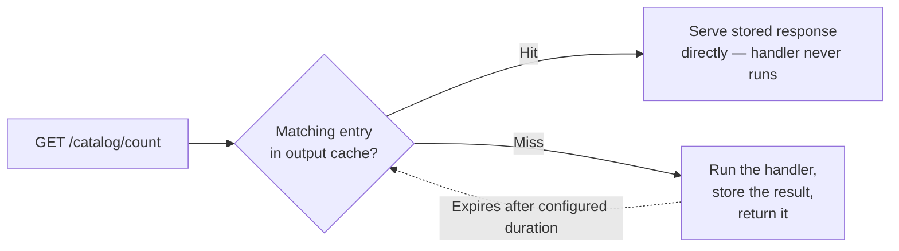
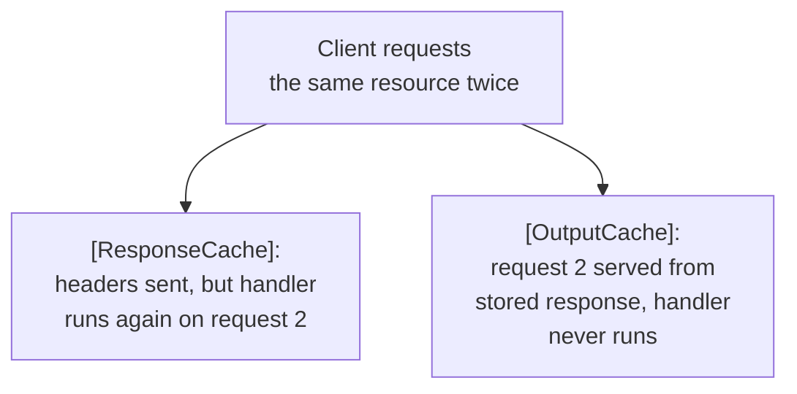

# Output and Response Caching

## Introduction

Before reading this lesson, you should already be comfortable with **[Rate Limiting](../10-aspnetcore/10-14-rate-limiting.md)** — and, more broadly, with the theme these last few lessons have shared: keeping an API healthy and responsive under real-world load without changing what it actually does for legitimate callers. Rate limiting protects a server by refusing excess work. This lesson takes a different, often more effective angle on the same underlying goal: for a large share of requests, the server doesn't need to refuse the work *or* redo it — because it already computed the exact same answer a moment ago, and nothing has changed since.

By the end of this lesson, you will be able to:

- Explain the difference between caching a response on the server and merely instructing clients how long they may reuse one
- Register and apply the modern `OutputCache` middleware with `AddOutputCache()`, `UseOutputCache()`, and `[OutputCache]`
- Vary a cached response by query string parameters so different query values aren't served each other's cached output
- Evict cached entries by tag when the underlying data changes, rather than waiting for a fixed expiration
- Contrast `[OutputCache]`/`UseOutputCache()` with the older `[ResponseCache]` attribute and explain when each is the right tool

## Output and Response Caching — A Layman's Perspective

Picture a library's front desk fielding the same question dozens of times a day: "what's on this month's staff-picks shelf?" The librarian has two very different ways to handle that. The first: keep a single, freshly typed-up sheet sitting right there at the desk, and whenever someone asks, just hand them a photocopy of that sheet — no need to walk back to the stacks, recount which books are currently displayed, or retype anything. The librarian only needs to update that master sheet when the staff-picks shelf itself actually changes, which might be once a week. Every question asked in between gets answered instantly, from the same already-prepared sheet, regardless of who's asking or how many people ask.

The second way looks similar from a patron's side but works completely differently underneath. Instead of keeping a copy at the desk, the librarian actually does walk back and regenerate the answer every single time — but hands the patron a receipt stamped "this list is accurate through 5 PM today," and quietly assumes that if the same patron comes back an hour later and still has that receipt in hand, they'll trust it themselves and not bother asking again. The library did the work every time a *different* patron asked, and simply trusted patrons to self-police whether their own copy was still current.

The difference matters enormously once you notice it. In the first approach, the library itself holds one authoritative, reusable answer, and the *librarian* decides when it's time to make a fresh one — a hundred patrons asking in the same hour costs the library exactly one unit of real work. In the second approach, the library never actually stops doing the work for every new asker; it just hands out an expiration stamp and hopes the honor system reduces *repeat* askers, which does nothing at all for the hundred *different* patrons who each show up asking for the first time within that same hour.

This is exactly the difference between caching a response on the server and merely telling clients how long they're allowed to reuse one. The first approach — the library keeping its own master copy and handing out photocopies — is what output caching does: the server itself stores a computed response and serves that stored copy directly for matching requests, with zero re-execution of the underlying logic, benefiting *every* caller who asks while the cached copy is still fresh, not just one caller re-asking. The second approach — the stamped receipt — is what response caching via HTTP headers does: it's an instruction riding along with the response, telling the browser, a CDN, or a proxy how long *they* may treat this specific response as still valid, without the origin server keeping any copy of its own at all. Both are legitimate and often used together — but only one of them actually saves the server from repeating its own work.

## Output and Response Caching — A Programming Language Perspective

**Output caching**, added in .NET 7 and still the current, more capable mechanism in .NET 10, is provided by `Microsoft.AspNetCore.OutputCaching`: `builder.Services.AddOutputCache(options => ...)` registers the cache store (in-memory by default, via `IOutputCacheStore`) and any named policies, `app.UseOutputCache()` adds the middleware, and `[OutputCache]` (on MVC actions) or `.CacheOutput()` (on a minimal API's `RouteHandlerBuilder`) marks specific endpoints as cacheable. Policies can vary the cache key by query string (`VaryByQueryKeys`), header, or route value, set an expiration, and attach tags for targeted eviction via `IOutputCacheStore.EvictByTagAsync`. The cached artifact is the actual response body, stored server-side (or in a distributed store such as Redis) and served directly for matching subsequent requests, bypassing the endpoint's logic entirely.

The older `[ResponseCache]` attribute (`Microsoft.AspNetCore.Mvc`), by contrast, stores nothing on the server at all — it only sets HTTP response headers like `Cache-Control` and `Vary`, which downstream browsers, CDNs, and proxies may (or may not) honor. It still runs the action's full logic on every single request; it just tells *other* parties how they're allowed to cache what comes back.

## How to Cache Output with `[OutputCache]` in C#

A minimal output-cached endpoint needs the cache service registered, the middleware added, and the policy applied — after which repeated identical requests never touch the handler at all.


*Figure 1: A cache hit bypasses the endpoint's logic entirely — the stored response is what's returned, not a freshly computed one.*

```csharp
// Program.cs — .NET 10 / C# 14
var builder = WebApplication.CreateBuilder(args);
builder.Services.AddOutputCache();

var app = builder.Build();
app.UseOutputCache();

int callCount = 0;

app.MapGet("/catalog/count", () =>
{
    callCount++;
    return Results.Ok(new { totalBooks = 128, handlerInvocations = callCount });
}).CacheOutput(policy => policy.Expire(TimeSpan.FromSeconds(30)));

app.Run();
```

This is an ASP.NET Core app, so "output" is a sequence of HTTP responses to repeated requests, not a console trace.

**HTTP Responses — three `GET /catalog/count` requests within the same 30-second window:**

```text
Request 1: HTTP/1.1 200 OK   {"totalBooks":128,"handlerInvocations":1}
Request 2: HTTP/1.1 200 OK   {"totalBooks":128,"handlerInvocations":1}
Request 3: HTTP/1.1 200 OK   {"totalBooks":128,"handlerInvocations":1}
```

`handlerInvocations` stays at `1` across all three requests — the second and third never ran the delegate at all; the output cache served the exact stored response from the first call. Only once the 30-second expiration elapses would a fourth request actually re-execute the handler and increment the counter to `2`.

## Real-Time Example: Caching a Book Catalog Search in Library/Inventory Management

We extend the Library/Inventory Management domain with a `GET /catalog/search` endpoint that searches the book catalog by category — a query that's cheap in this simplified example but stands in for a genuinely expensive one in a real system (a full-text search across a large catalog, say). Different categories must not share a cached result with each other, so the policy varies the cache key by the `category` query parameter; and because the catalog changes when books are added, the cache entries are tagged `"catalog"` so a write can evict every cached search result in one call rather than waiting out a fixed expiration.

```csharp
// Program.cs — .NET 10 / C# 14 — Real-Time Example
using Microsoft.AspNetCore.OutputCaching;

var builder = WebApplication.CreateBuilder(args);
builder.Services.AddOutputCache(options =>
{
    options.AddPolicy("catalog-search", policy => policy
        .Expire(TimeSpan.FromMinutes(10))
        .SetVaryByQuery("category")
        .Tag("catalog"));
});

var app = builder.Build();
app.UseOutputCache();

List<InventoryItem> catalog =
[
    new("BK-1001", "The Pragmatic Programmer", "Software"),
    new("BK-1002", "Clean Code", "Software"),
    new("BK-1003", "The Hobbit", "Fiction")
];

app.MapGet("/catalog/search", (string category) =>
{
    var matches = catalog.Where(item =>
        item.Category.Equals(category, StringComparison.OrdinalIgnoreCase));
    return Results.Ok(matches);
}).CacheOutput("catalog-search");

app.MapPost("/catalog/items", async (InventoryItem item, IOutputCacheStore cacheStore) =>
{
    catalog.Add(item);
    await cacheStore.EvictByTagAsync("catalog", default); // invalidate every cached search
    return Results.Created($"/catalog/items/{item.Sku}", item);
});

app.Run();

record InventoryItem(string Sku, string Title, string Category);
```

**HTTP Response — `GET /catalog/search?category=Software` (first request, cache miss):**

```text
HTTP/1.1 200 OK
Content-Type: application/json; charset=utf-8

[{"sku":"BK-1001","title":"The Pragmatic Programmer","category":"Software"},{"sku":"BK-1002","title":"Clean Code","category":"Software"}]
```

**HTTP Response — `GET /catalog/search?category=Fiction` (different query value, independently cached):**

```text
HTTP/1.1 200 OK
Content-Type: application/json; charset=utf-8

[{"sku":"BK-1003","title":"The Hobbit","category":"Fiction"}]
```

**HTTP Response — `POST /catalog/items` adding a new Software title, then re-running the Software search:**

```text
POST response: HTTP/1.1 201 Created  {"sku":"BK-1004","title":"Refactoring","category":"Software"}
Search response (post-eviction): HTTP/1.1 200 OK
[{"sku":"BK-1001","title":"The Pragmatic Programmer","category":"Software"},{"sku":"BK-1002","title":"Clean Code","category":"Software"},{"sku":"BK-1004","title":"Refactoring","category":"Software"}]
```

Without `SetVaryByQuery("category")`, the very first search — regardless of which category it requested — would get cached and then served back to every subsequent search for any category, which would be a correctness bug disguised as a performance win. And without the tag-based eviction, the newly added "Refactoring" title wouldn't appear in the Software search results until the 10-minute expiration finally elapsed, even though the catalog had already changed — exactly the kind of stale-data complaint a real library patron or librarian would notice immediately.

## `[OutputCache]` / `UseOutputCache()` vs. the Older `[ResponseCache]` Attribute

The two mechanisms look superficially similar — both are ways of saying "this endpoint's response can be reused" — but they operate at entirely different layers. `[ResponseCache]` only ever sets response headers; it has no server-side storage, no `IOutputCacheStore`, and no ability to vary by query key with the granularity `[OutputCache]` offers, nor any tag-based eviction. It still runs your endpoint's full logic on every request — it just adds `Cache-Control` headers hoping something downstream honors them. `[OutputCache]`, by contrast, genuinely intercepts matching requests before they reach your handler at all, which is the difference that actually saves server-side compute.


*Figure 2: Only one of these two attributes actually stops the server from doing the work a second time.*

| Aspect | `[OutputCache]` / `UseOutputCache()` | `[ResponseCache]` |
|---|---|---|
| Where the response is stored | Server-side (in-memory or distributed store) | Nowhere — client/proxy only, via headers |
| Introduced | .NET 7, current in .NET 10 | Early ASP.NET Core, largely legacy now |
| Saves server-side compute on a cache hit | Yes — handler doesn't run | No — handler still runs every time |
| Vary by query/header | Fine-grained (`SetVaryByQuery`, `SetVaryByHeader`) | Only via the blunter `VaryByQueryKeys` on the attribute |
| Targeted invalidation | Yes, via tags (`EvictByTagAsync`) | No — only time-based expiration |

## Types of Output Caching Configuration in ASP.NET Core

Output caching scales from a single default policy up to fully tag-driven invalidation across many endpoints:

1. **Base policy** — the defaults configured directly in `AddOutputCache(options => ...)`, applied to any endpoint opting in without a named policy.
2. **Named policies** (`AddPolicy`) — the `"catalog-search"` policy above, reusable across multiple endpoints that share the same caching rules.
3. **`[OutputCache]` attribute** — applies a policy to an MVC controller action, mirroring `.CacheOutput()` for minimal APIs.
4. **`VaryByQueryKeys` / `SetVaryByHeader`** — ensures requests that differ only by a specific query parameter or header get independently cached entries rather than sharing one.
5. **Tag-based eviction** (`EvictByTagAsync`) — invalidates every cache entry sharing a tag the moment underlying data changes, used in this lesson's Real-Time Example.
6. **Distributed output cache stores** — swapping the default in-memory `IOutputCacheStore` for a Redis-backed one so multiple server instances share one cache; see **[Azure Cache for Redis](../16-azure-for-dotnet-developers/16-26-azure-cache-for-redis.md)** once distributed caching infrastructure is introduced.

## What You've Learned & What's Next

Output caching stores an actual response on the server and serves it directly to matching requests, saving real compute for *every* caller while the cached entry stays fresh — a meaningfully different guarantee than the older `[ResponseCache]` attribute, which only sets headers instructing clients and proxies how long they personally may reuse a response, without saving the server any work at all. `AddOutputCache()`, `UseOutputCache()`, and `.CacheOutput()`/`[OutputCache]` are the modern toolkit, and varying by query key plus tag-based eviction keep cached data both correctly partitioned and correctly invalidated when the underlying data actually changes.

Continue your learning journey with **[CORS in ASP.NET Core](../10-aspnetcore/10-16-cors-in-aspnetcore.md)**, where we look at controlling which browser-based origins are allowed to call your API at all.

---
*Applies to: .NET 10 / C# 14. Last reviewed 2026-08-16.*
