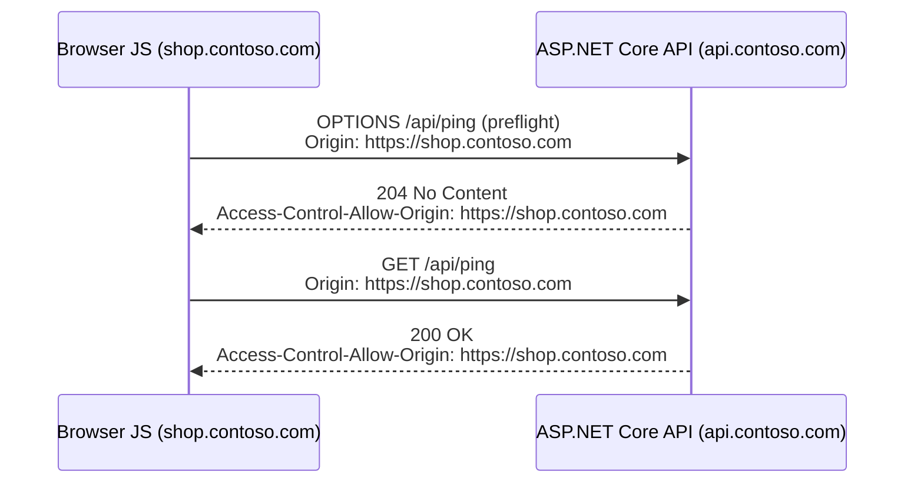
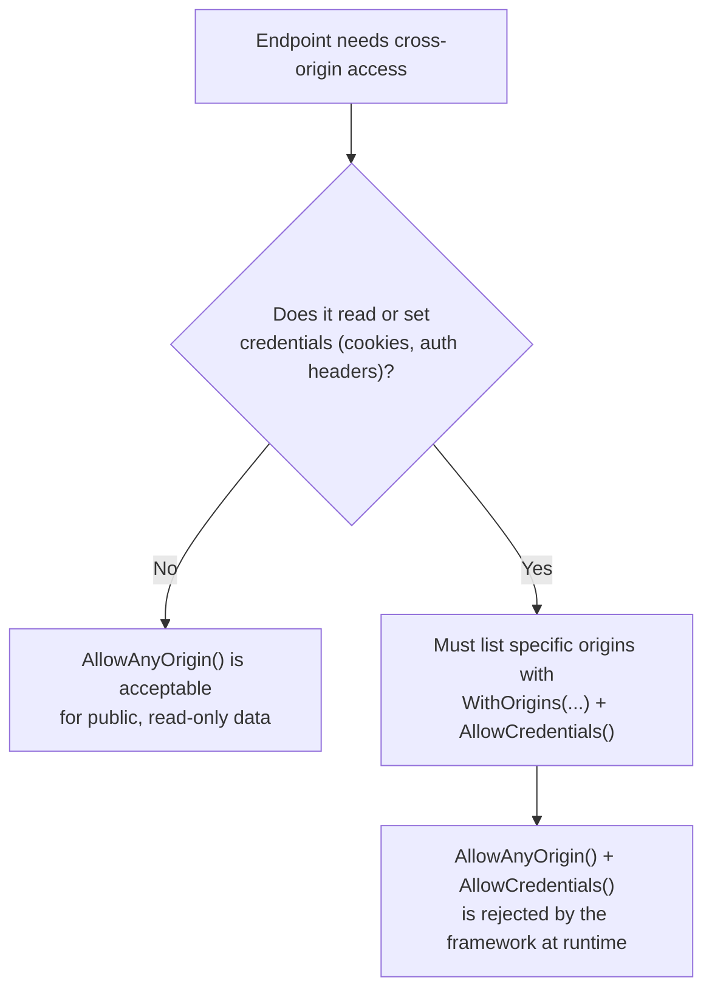

# CORS in ASP.NET Core

## Introduction

Before reading this lesson, you should already be comfortable with **[Output and Response Caching](../10-aspnetcore/10-15-output-and-response-caching.md)**, and more broadly with the idea that an ASP.NET Core app is a pipeline of middleware sitting in front of your endpoints. This lesson adds one more piece of middleware to that pipeline — but one that exists to answer a question your server never actually gets asked directly: "should the browser sitting in front of this user be allowed to hand this response back to the JavaScript that requested it?" That question, and the browser-enforced rule it answers, is called Cross-Origin Resource Sharing, or CORS.

By the end of this lesson, you will be able to:

- Explain the same-origin policy and why *browsers*, not servers, enforce it
- Recognize a CORS preflight request and understand when the browser sends one
- Configure CORS in ASP.NET Core with `AddCors` and `UseCors`, including multiple named policies
- Diagnose the classic "it works in Postman but fails in the browser" symptom
- Explain why `AllowAnyOrigin()` combined with credentials is a production security hazard

## CORS — A Layman's Perspective

Imagine a large corporate office tower with dozens of tenant companies, each occupying a different floor. Every floor has its own reception desk, and every reception desk keeps a list of outside companies whose couriers are allowed to walk in and pick up a package on that tenant's behalf. If a courier badge shows they work for "Acme Deliveries" and Acme isn't on floor 12's approved list, the floor 12 receptionist simply won't hand the package over — even if the courier is standing right there, even if the package is sitting on the desk in plain view, and even if the courier's employer is a completely legitimate business. The rule isn't about whether the courier *can physically reach* the package. It's about whether floor 12 has explicitly said "yes, deliveries hired by this other company are allowed to carry things out of here."

Now here's the detail that trips almost everyone up the first time they meet this rule: the security guard enforcing it works for the *building*, not for floor 12. The building's own security policy says, by default, "nobody from outside this floor's approved list leaves with a package, full stop" — and that policy applies no matter which floor the courier claims to represent. Floor 12 can loosen the rule for specific outside companies by literally telling the front desk "Acme Deliveries is fine," but floor 12 cannot bypass the guard, because the guard isn't floor 12's employee to command. The guard is watching on behalf of *whoever the courier is actually working for* — the end recipient of that package matters more, from a policy standpoint, than the floor handing it out.

This is precisely the shape of the same-origin policy that every web browser enforces. When JavaScript running on `https://shop.contoso.com` tries to fetch data from `https://api.contoso.com`, the browser is the security guard, and it is watching that transaction on behalf of the person sitting at the keyboard — not on behalf of either server. By default, the browser refuses to hand the API's response back to the storefront's JavaScript unless the API explicitly says, via response headers, "responses to `https://shop.contoso.com` are allowed to be read by that origin's scripts." Configuring CORS on the ASP.NET Core side is the equivalent of the API telling its own front desk which outside "floors" — which origins — are on the approved list.

And here's the part that makes the office-tower analogy earn its keep: if a courier who works *directly for floor 12* — someone with no browser, no same-origin policy, no receptionist standing between them and the shelf — simply walks up and takes the package themselves, none of this applies. That's exactly what a tool like Postman or `curl` does when it calls your API: it isn't a browser, it enforces no same-origin policy, and it will happily show you the full response even from an origin your CORS policy would have blocked. That single fact explains nearly every "it works in Postman but not in my web app" bug report anyone building a browser-facing API will eventually receive.

## CORS — A Programming Language Perspective

CORS is a browser-enforced security mechanism defined by a W3C specification, implemented entirely through HTTP request and response headers — it is not a server-side authorization check and grants no protection against non-browser clients. In ASP.NET Core, the `Microsoft.AspNetCore.Cors` middleware participates in the request pipeline to inspect the `Origin` header on incoming requests and, when permitted, attach headers such as `Access-Control-Allow-Origin` to the response. Configuration happens in two steps: `builder.Services.AddCors(options => ...)` registers one or more named `CorsPolicy` objects with the DI container during startup, and `app.UseCors(policyName)` inserts the CORS middleware into the pipeline — conventionally placed after `UseRouting` and before endpoint execution, so it can act on every matched endpoint, or overridden per endpoint with `RequireCors(policyName)` on minimal API route groups or `[EnableCors(policyName)]` on controllers.

## How to Configure CORS in ASP.NET Core

For any cross-origin request that isn't a simple `GET`/`HEAD`/`POST` with only standard headers, the browser first sends an automatic, invisible "preflight" — an `OPTIONS` request asking the server, in effect, "if I sent the real request, would you allow it?" Only if the server's answer is yes does the browser send the actual request at all.


*Figure 1: The browser silently sends a preflight `OPTIONS` request before the real request; only an allowed origin gets the header that lets the browser release the response to JavaScript.*

```csharp
// Program.cs — .NET 10 / C# 14
var builder = WebApplication.CreateBuilder(args);

const string StorefrontPolicy = "StorefrontPolicy";

builder.Services.AddCors(options =>
{
    options.AddPolicy(StorefrontPolicy, policy =>
    {
        policy.WithOrigins("https://shop.contoso.com")
              .WithMethods("GET", "POST")
              .AllowAnyHeader();
    });
});

var app = builder.Build();

app.UseCors(StorefrontPolicy);

app.MapGet("/api/ping", () => new { status = "ok", utc = DateTime.UtcNow })
   .RequireCors(StorefrontPolicy);

app.Run();
```

**Console Output** *(this is an ASP.NET Core app — "console output" here means the actual HTTP traffic, not a literal console-app trace):*

```text
--> OPTIONS /api/ping HTTP/1.1
    Host: api.contoso.com
    Origin: https://shop.contoso.com
    Access-Control-Request-Method: GET

<-- HTTP/1.1 204 No Content
    Access-Control-Allow-Origin: https://shop.contoso.com
    Access-Control-Allow-Methods: GET, POST
    Vary: Origin

--> GET /api/ping HTTP/1.1
    Host: api.contoso.com
    Origin: https://shop.contoso.com

<-- HTTP/1.1 200 OK
    Access-Control-Allow-Origin: https://shop.contoso.com
    Content-Type: application/json
    Vary: Origin

    {"status":"ok","utc":"2026-08-16T09:41:07.1120000Z"}
```

`RequireCors(StorefrontPolicy)` scopes the policy to this one endpoint rather than every route in the app, which matters once an API serves more than one frontend. The `Vary: Origin` header tells any intermediate cache (including the response cache from the previous lesson) that the response varies by requesting origin, so a cached response for one storefront is never accidentally served to a different, disallowed one.

## Real-Time Example: Two Frontends, Two CORS Policies, for E-Commerce Order Processing

We continue building on the order-processing API from earlier ASP.NET Core lessons. In a real deployment, two separate browser-based frontends call this API from two different origins: the public storefront at `https://shop.contoso.com`, which only ever needs to read product and order-status data, and the internal admin dashboard at `https://admin.contoso.com`, which also needs to cancel orders. Rather than one permissive policy for everyone, we register a named policy per caller and apply the narrower one only where it's needed.

```csharp
// Program.cs — .NET 10 / C# 14 — Real-Time Example
var builder = WebApplication.CreateBuilder(args);

const string StorefrontPolicy = "StorefrontPolicy";
const string AdminDashboardPolicy = "AdminDashboardPolicy";

builder.Services.AddCors(options =>
{
    options.AddPolicy(StorefrontPolicy, policy =>
        policy.WithOrigins("https://shop.contoso.com")
              .WithMethods("GET")
              .AllowAnyHeader());

    options.AddPolicy(AdminDashboardPolicy, policy =>
        policy.WithOrigins("https://admin.contoso.com")
              .WithMethods("GET", "POST", "DELETE")
              .AllowAnyHeader()
              .AllowCredentials()); // admin dashboard sends an auth cookie
});

var app = builder.Build();
app.UseCors();

var orders = new List<Order>
{
    new(1001, "Alicia Keys", 249.99m, "Shipped"),
    new(1002, "Marcus Chen", 89.50m, "Processing")
};

app.MapGet("/api/orders/{id:int}", (int id) =>
       orders.FirstOrDefault(o => o.Id == id) is { } order
           ? Results.Ok(order)
           : Results.NotFound())
   .RequireCors(StorefrontPolicy);

app.MapDelete("/api/orders/{id:int}", (int id) =>
{
    Order? order = orders.FirstOrDefault(o => o.Id == id);
    if (order is null)
    {
        return Results.NotFound();
    }

    orders.Remove(order);
    return Results.Ok(new { cancelled = id });
}).RequireCors(AdminDashboardPolicy);

app.Run();

record Order(int Id, string CustomerName, decimal Total, string Status);
```

**Console Output** *(HTTP traffic, from the storefront and admin origins respectively):*

```text
--> GET /api/orders/1001 HTTP/1.1
    Origin: https://shop.contoso.com

<-- HTTP/1.1 200 OK
    Access-Control-Allow-Origin: https://shop.contoso.com
    {"id":1001,"customerName":"Alicia Keys","total":249.99,"status":"Shipped"}

--> DELETE /api/orders/1002 HTTP/1.1
    Origin: https://shop.contoso.com

<-- HTTP/1.1 403 Forbidden
    (no Access-Control-Allow-Origin header — the browser blocks this before
     the response body is ever exposed to the storefront's JavaScript)

--> DELETE /api/orders/1002 HTTP/1.1
    Origin: https://admin.contoso.com
    Cookie: auth=eyJhbGciOi...

<-- HTTP/1.1 200 OK
    Access-Control-Allow-Origin: https://admin.contoso.com
    Access-Control-Allow-Credentials: true
    {"cancelled":1002}
```

The storefront can read order status but was never granted the `DELETE` method on its policy, so a compromised or buggy storefront script simply cannot cancel an order — the restriction is enforced by the browser itself, before the response body ever reaches storefront JavaScript. The admin dashboard's policy allows `DELETE` and, because it needs to send an authentication cookie cross-origin, sets `AllowCredentials()` alongside one specific, hardcoded origin. That pairing is deliberate, and it is the only safe way to use credentials with CORS.

## AllowAnyOrigin() vs an Explicit Origin Allowlist

It's tempting, especially while debugging a "CORS error" during development, to reach for `policy.AllowAnyOrigin()` and make the problem disappear. For a public, read-only, unauthenticated endpoint, that can be a reasonable choice. The moment credentials — cookies, `Authorization` headers passed automatically, client certificates — are involved, it stops being safe, and .NET actively refuses to combine `AllowAnyOrigin()` with `AllowCredentials()` at runtime specifically to prevent this mistake: any website on the internet would otherwise be able to make authenticated requests using a logged-in user's own session cookie, and read the response.


*Figure 2: Credentials force a hard fork — either a specific origin allowlist, or no credentials at all.*

| Aspect | `AllowAnyOrigin()` | Explicit origin allowlist (`WithOrigins(...)`) |
|---|---|---|
| Who can call the API from a browser | Any website, unrestricted | Only the origins listed |
| Compatible with `AllowCredentials()` | No — throws at runtime | Yes |
| Appropriate for | Public, anonymous, read-only APIs | Any endpoint touching cookies, sessions, or auth headers |
| Risk if misconfigured | Cross-site data exposure via a logged-in victim's session | Low — a typo in the allowlist just breaks *your own* frontend |

## Types of CORS Configuration in ASP.NET Core

1. **Default (permissive) policy** — one unnamed policy registered with `AddDefaultPolicy` and applied app-wide via a parameterless `UseCors()` call, suited to APIs with a single known frontend.
2. **Named policies** — multiple policies registered by name and selected per endpoint or controller, as used throughout this lesson for the storefront vs. admin split.
3. **Per-endpoint opt-in** — `RequireCors("PolicyName")` on minimal API routes, or `[EnableCors("PolicyName")]` on controller actions; see **[Controller-Based APIs](../10-aspnetcore/10-03-controller-based-apis.md)** for the attribute-based equivalent.
4. **Preflighted vs. simple requests** — determined automatically by the browser based on HTTP method and headers used, not something you configure directly, but something your policy's `WithMethods`/`WithHeaders` choices directly affect.
5. **Credentialed CORS** — allowing cookies or auth headers cross-origin via `AllowCredentials()`, which forbids wildcard origins entirely, as shown in this lesson's admin dashboard policy.
6. **CORS as middleware** — `UseCors` is itself one more entry in the middleware pipeline; see **[Writing Custom Middleware](../10-aspnetcore/10-07-writing-custom-middleware.md)** for how ordering rules like "before endpoint execution" generalize to middleware you write yourself.

## What You've Learned & What's Next

CORS is a rule the *browser* enforces on behalf of the user, not a security boundary your server controls directly — your server's only job is to answer, via response headers, which origins are allowed to read the response. `AddCors` and `UseCors` configure that answer, named policies let different frontends get different permissions, and credentials force a hard requirement for an explicit origin allowlist rather than a wildcard.

Continue your learning journey with **[OpenAPI and Swagger](../10-aspnetcore/10-17-openapi-and-swagger.md)**, where we cover generating a machine-readable description of this same API and exploring it interactively — including how a Swagger UI page calling your API is itself just another cross-origin caller subject to everything covered in this lesson.

---
*Applies to: .NET 10 / C# 14. Last reviewed 2026-08-16.*
