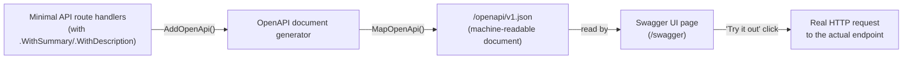
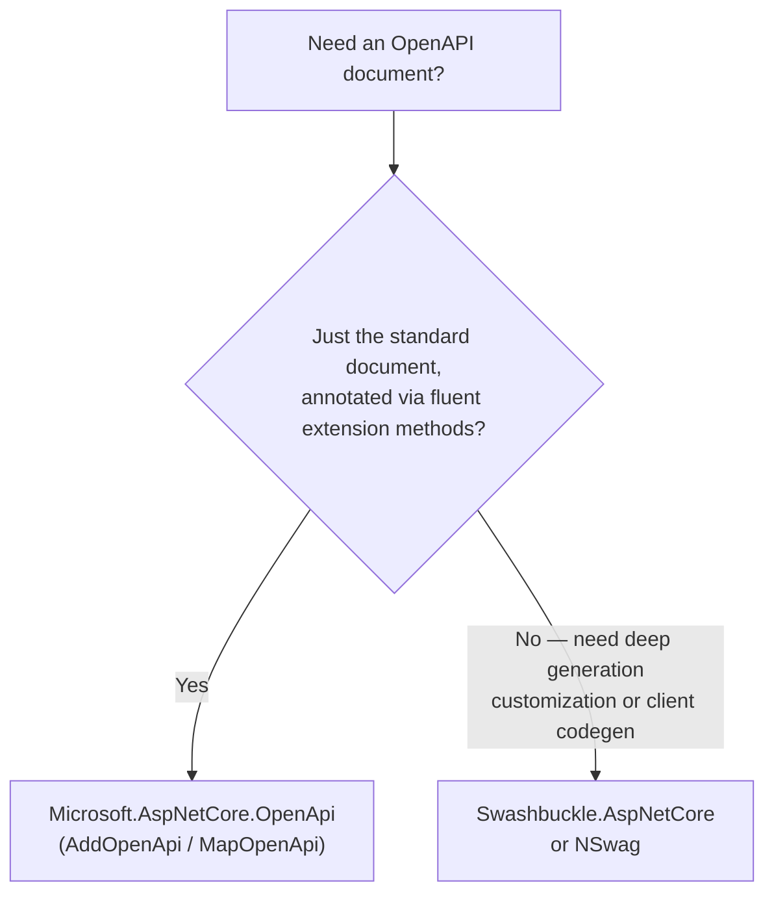

# OpenAPI and Swagger

## Introduction

Before reading this lesson, you should already be comfortable with **[CORS in ASP.NET Core](../10-aspnetcore/10-16-cors-in-aspnetcore.md)** and, by now, with building endpoints that other applications — browsers, mobile apps, other services — call over HTTP. Every one of those callers eventually asks the same question: "what exactly can I send this API, and what will it send back?" Answering that question by hand, in a document someone has to remember to update, doesn't scale. This lesson covers generating that answer automatically, straight from your code, as a machine-readable OpenAPI document, and exposing it through an interactive Swagger UI page.

By the end of this lesson, you will be able to:

- Explain what an OpenAPI document is and why tooling consumes it instead of prose documentation
- Generate an OpenAPI document with .NET's built-in `AddOpenApi`/`MapOpenApi`, with no Swashbuckle dependency required for basic scenarios
- Add an interactive Swagger UI page that reads that generated document
- Annotate endpoints with summaries, descriptions, and example values so the generated document is actually useful
- Identify when a third-party package like Swashbuckle or NSwag still earns its place alongside the built-in generator

## OpenAPI and Swagger — A Layman's Perspective

Picture a restaurant with two different menus. The first is the kitchen's own internal reference sheet: every dish, listed with its precise ingredient list, exact preparation steps, allergen codes, and plating instructions, written in a terse shorthand that only another kitchen — or a well-trained ordering system — could parse quickly. The second is the laminated menu handed to a customer at the table: the same dishes, described in plain language, with photos, prices, and a friendly description of what's in the dish and how spicy it is. Both menus describe the exact same food. They just serve two completely different audiences, and neither one is "more correct" than the other — they're translations of the same underlying truth into the form whoever's reading needs.

An OpenAPI document is the kitchen's internal reference sheet: a structured, exhaustively precise JSON description of every endpoint your API exposes — every route, every parameter, every possible response shape and status code — written not for a human to casually read, but for *tooling* to parse reliably. A code generator can read it and produce a fully-typed client library. A testing tool can read it and generate example requests automatically. And Swagger UI is the laminated table menu: a web page that reads that same structured document and renders it as something a human can actually browse, click through, and try out — filling in parameters, hitting "Execute," and watching the real request and response appear right there in the browser, without ever opening a separate HTTP client tool.

The crucial thing both menus share with their software counterparts is that they're generated *from* the same source, not maintained as two separate, hand-written documents that quietly drift out of sync. A restaurant that keeps its printed menu and its kitchen's actual dish list as two unrelated pieces of paper eventually serves a customer a dish that's been discontinued, or forgets to mention a new one. An API whose documentation is hand-written prose, separate from the code, suffers the identical fate — someone renames a field, forgets to update the docs, and every client written against the old description starts failing in ways that look like a mystery until someone finally re-reads the actual source code. Generating the OpenAPI document directly from the endpoints themselves — their routes, their parameter types, their declared response types — closes that gap by construction: the "menu" cannot drift from the "kitchen," because they are, quite literally, produced from the same set of ingredients.

## OpenAPI and Swagger — A Programming Language Perspective

The OpenAPI Specification (formerly known as the Swagger specification) is a language-agnostic, JSON- or YAML-based schema for describing an HTTP API's routes, parameters, request/response bodies, and status codes. Starting in .NET 9 and continuing in .NET 10, ASP.NET Core ships built-in OpenAPI document generation via the `Microsoft.AspNetCore.OpenApi` package: `builder.Services.AddOpenApi()` registers the generator, and `app.MapOpenApi()` exposes the resulting document — by default at `/openapi/v1.json` — reflecting over your minimal API route handlers and controller actions to infer parameter types, route templates, and response shapes. This built-in generator covers the document itself; it does not include a visual UI. "Swagger UI" refers specifically to the interactive HTML/JavaScript page that reads an OpenAPI document and renders it — commonly added via the `Swashbuckle.AspNetCore.SwaggerUI` package pointed at the built-in generator's JSON endpoint, so no Swashbuckle *generation* code is required, only its UI.

## How to Generate and Expose an OpenAPI Document in .NET

Wiring this up is two independent steps: generating the document, and rendering it. Keeping them separate is exactly what lets the built-in generator handle the first step while a UI package of your choosing handles the second.


*Figure 1: The generator and the UI are two separate steps — the JSON document is the single source of truth both the UI and any other tooling read from.*

```csharp
// Program.cs — .NET 10 / C# 14
// PackageReference: Microsoft.AspNetCore.OpenApi, Swashbuckle.AspNetCore.SwaggerUI
var builder = WebApplication.CreateBuilder(args);
builder.Services.AddOpenApi();

var app = builder.Build();

app.MapOpenApi(); // exposes /openapi/v1.json

app.UseSwaggerUI(options =>
{
    options.SwaggerEndpoint("/openapi/v1.json", "Sample API v1");
});

app.MapGet("/api/status", () => new { status = "healthy" })
   .WithSummary("Returns a simple health status.")
   .WithDescription("Used by uptime monitors; always returns 200 OK when the app is running.");

app.Run();
```

**Console Output** *(HTTP traffic — the actual document returned, trimmed to the relevant endpoint):*

```text
--> GET /openapi/v1.json HTTP/1.1

<-- HTTP/1.1 200 OK
    Content-Type: application/json

    {
      "openapi": "3.0.1",
      "info": { "title": "Sample API", "version": "1.0" },
      "paths": {
        "/api/status": {
          "get": {
            "summary": "Returns a simple health status.",
            "description": "Used by uptime monitors; always returns 200 OK when the app is running.",
            "responses": {
              "200": { "description": "OK" }
            }
          }
        }
      }
    }
```

Navigating to `/swagger` in a browser renders that same document as a clickable page listing `GET /api/status`, with the summary and description shown right in the UI, and an "Execute" button that fires the real request and displays the real `200 OK` response — no separate HTTP client needed to explore the API by hand.

## Real-Time Example: Documenting a Library/Inventory Management API

We continue building on the Library/Inventory Management domain, this time documenting a small catalog API so that both a partner integration team and this project's own frontend developers can explore it without reading the source code. Each endpoint gets a summary and description via `.WithSummary()`/`.WithDescription()`, and the response shape is declared explicitly with `.Produces<T>()` so the generated document describes exactly what a caller gets back, including on a "not found" path.

```csharp
// Program.cs — .NET 10 / C# 14 — Real-Time Example
var builder = WebApplication.CreateBuilder(args);
builder.Services.AddOpenApi();

var app = builder.Build();
app.MapOpenApi();
app.UseSwaggerUI(options => options.SwaggerEndpoint("/openapi/v1.json", "Library Catalog API v1"));

var catalog = new List<Book>
{
    new("978-0135957059", "The Pragmatic Programmer", 4),
    new("978-0132350884", "Clean Code", 0)
};

app.MapGet("/api/books/{isbn}", (string isbn) =>
    catalog.FirstOrDefault(b => b.Isbn == isbn) is { } book
        ? Results.Ok(book)
        : Results.NotFound(new { message = $"No book with ISBN {isbn}." }))
   .WithSummary("Look up a single book by ISBN.")
   .WithDescription("Returns the book's title and current available quantity, or 404 if the ISBN is unknown.")
   .Produces<Book>(StatusCodes.Status200OK)
   .Produces(StatusCodes.Status404NotFound);

app.Run();

record Book(string Isbn, string Title, int AvailableQuantity);
```

**Console Output** *(HTTP traffic against the running API):*

```text
--> GET /api/books/978-0135957059 HTTP/1.1

<-- HTTP/1.1 200 OK
    Content-Type: application/json

    {"isbn":"978-0135957059","title":"The Pragmatic Programmer","availableQuantity":4}

--> GET /api/books/978-0000000000 HTTP/1.1

<-- HTTP/1.1 404 Not Found
    Content-Type: application/json

    {"message":"No book with ISBN 978-0000000000."}
```

With `.Produces<Book>()` and `.Produces(404)` declared, the generated OpenAPI document lists both possible response shapes for `GET /api/books/{isbn}`, and Swagger UI shows both as selectable examples — so a partner team integrating against this catalog can see, without asking anyone, exactly what a missing ISBN looks like on the wire, rather than discovering it by trial and error against a live environment.

## Built-in Microsoft.AspNetCore.OpenApi vs. Swashbuckle.AspNetCore

The built-in generator and Swashbuckle solve overlapping but not identical problems. The built-in `Microsoft.AspNetCore.OpenApi` package is lean, ships as part of the standard .NET 9/10 toolchain, and needs no configuration beyond `AddOpenApi`/`MapOpenApi` to produce a correct document — which is why it's now the default starting point rather than reaching for Swashbuckle's full generator on day one. Swashbuckle.AspNetCore remains the more feature-rich, longer-established option when you need deep customization of the generation process itself (custom schema filters, operation filters, XML-comment integration) rather than just its Swagger UI component, and NSwag goes a step further by also generating typed C#/TypeScript client code from the same document.


*Figure 2: Both approaches produce a standard OpenAPI document; the choice is about how much customization or extra tooling (client generation) you need around it.*

| Aspect | Built-in `Microsoft.AspNetCore.OpenApi` | Swashbuckle.AspNetCore |
|---|---|---|
| Ships with | .NET 9/10 SDK templates, minimal setup | Separate, well-established NuGet package |
| Document generation | `AddOpenApi()` + `MapOpenApi()` | `AddSwaggerGen()` |
| Swagger UI | Not included — pair with a UI package | Included (`UseSwaggerUI`) |
| Customization depth | Good for common cases via fluent extension methods | Deeper (operation/schema filters, XML comments) |
| Client code generation | No | No (pair with NSwag for that) |

## Types of OpenAPI Tooling in .NET

1. **Built-in document generation** — `AddOpenApi`/`MapOpenApi`, the default starting point since .NET 9, covered throughout this lesson.
2. **Swashbuckle.AspNetCore** — the long-standing third-party package, still the deeper-customization option and a common source of the Swagger UI page itself.
3. **NSwag** — an alternative that also generates strongly-typed client SDKs from the same OpenAPI document.
4. **Minimal API annotations** — `.WithSummary()`, `.WithDescription()`, `.Produces<T>()` fluent calls, as used in both examples above; see **[Minimal APIs](../10-aspnetcore/10-02-minimal-apis.md)**.
5. **Controller-based annotations** — XML doc comments and `[ProducesResponseType]` attributes serve the same purpose for controller actions; see **[Controller-Based APIs](../10-aspnetcore/10-03-controller-based-apis.md)**.
6. **Versioned OpenAPI documents** — a separate document per API version, so consumers of `v1` and `v2` see only the routes relevant to them; see **[API Versioning](../10-aspnetcore/10-12-api-versioning.md)**.

## What You've Learned & What's Next

An OpenAPI document is a structured, tooling-readable description of your API, generated directly from your endpoints rather than maintained by hand — .NET's built-in `AddOpenApi`/`MapOpenApi` produces that document with no Swashbuckle generation step required, and a Swagger UI page turns it into something a human can browse and try interactively.

Continue your learning journey with **[Background Services with IHostedService](../10-aspnetcore/10-18-ihostedservice-background-services.md)**, where we shift from request/response endpoints to long-running work that runs alongside your web app rather than in response to any single HTTP call.

---
*Applies to: .NET 10 / C# 14. Last reviewed 2026-08-16.*
