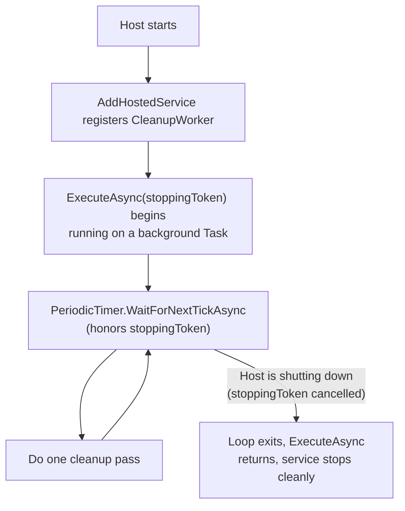
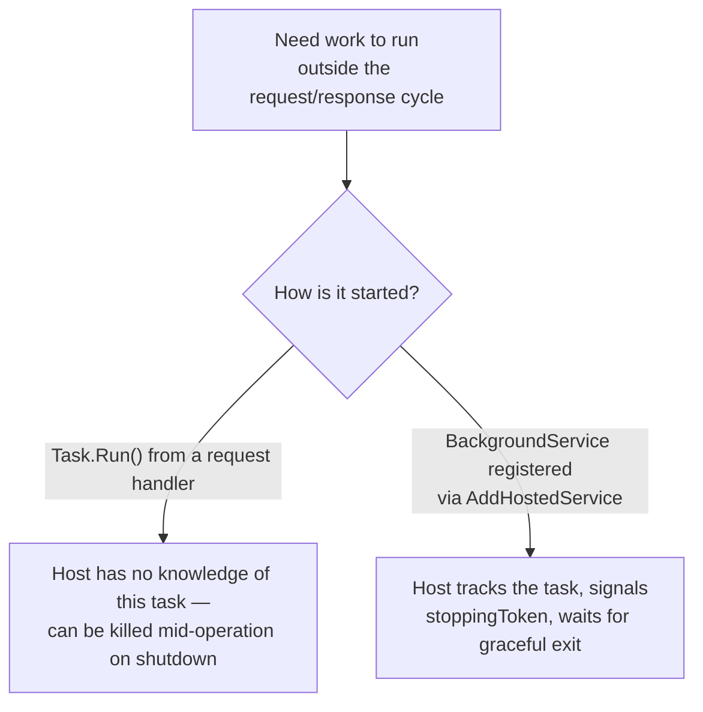

# Background Services with IHostedService

## Introduction

Before reading this lesson, you should already be comfortable with **[OpenAPI and Swagger](../10-aspnetcore/10-17-openapi-and-swagger.md)** and, more generally, with the request/response shape every lesson so far has assumed: a client sends a request, an endpoint handles it, a response goes back, done. Not all useful work fits that shape. Some work needs to happen continuously, on its own schedule, regardless of whether any HTTP request ever arrives — and this lesson covers how ASP.NET Core hosts that kind of work, correctly, alongside the web app, using `IHostedService` and its convenience base class `BackgroundService`.

By the end of this lesson, you will be able to:

- Explain what `IHostedService` is and how hosted services differ from request-handling endpoints
- Implement a long-running background service by deriving from `BackgroundService` and overriding `ExecuteAsync`
- Honor the `CancellationToken` passed into `ExecuteAsync` so the service shuts down gracefully rather than being killed mid-operation
- Use `IHostApplicationLifetime` to react to application startup and shutdown events from anywhere in the app
- Register a hosted service in DI with `AddHostedService<T>()` and understand its lifetime relative to the rest of the host

## Background Services — A Layman's Perspective

Picture a large retail store with an automatic sprinkler system installed in its rooftop garden. The store's front-of-house staff — the cashiers, the greeters, the people answering customer questions — only work while the store is open, responding one customer at a time, one request at a time. The sprinkler system doesn't work that way at all. It runs on its own clock, watering the garden every few hours, entirely independent of whether the store has any customers in it, whether it's the middle of a Tuesday afternoon rush or three in the morning with the doors locked. Nobody has to "ask" the sprinklers to run; they simply do, continuously, for as long as the building has power.

Now suppose the building's power is being shut off for the night, on a schedule, so the whole electrical system can be inspected. Cutting power at a random instant to a sprinkler mid-cycle is fine if all it's doing is spraying water — but what if it's actually running a slower, multi-stage process: draining one zone's water pressure gauge, recording the reading, and only then moving to the next zone. Interrupt it at exactly the wrong moment, and the gauge reading gets lost, or worse, a valve gets left open. A well-designed system doesn't just get unplugged; it gets a signal — "power is going down in ten seconds, wrap up whatever cycle you're in" — and it uses that warning to finish its current step cleanly before stopping, rather than being cut off mid-motion.

This is exactly the problem `IHostedService` solves for a .NET application. The front-of-house work — handling HTTP requests — is what every earlier lesson in this module has focused on. A hosted service is the rooftop sprinkler: a piece of work that starts when the application starts, runs on its own independent schedule for as long as the application is alive, and needs to be told, explicitly, when the application is about to shut down, so it can finish its current step and stop cleanly rather than being killed mid-operation. That warning arrives as a `CancellationToken`, and a well-written background service checks it constantly — at the top of every loop iteration, before every long-running step — precisely so that when the signal comes, it can stop gracefully instead of leaving something half-finished, like a valve stuck open on a database write or a partially-applied batch of updates.

The connection back to actual code is direct: any recurring job your application needs to run for its entire lifetime — cleaning up expired records, polling a queue, recalculating a nightly report — is exactly this rooftop-sprinkler shape of problem, and `IHostedService`/`BackgroundService` is .NET's built-in answer to hosting it correctly, side by side with the request-handling web app, sharing its shutdown signal rather than living as some unrelated, unmanaged background thread.

## Background Services — A Programming Language Perspective

`IHostedService` is an interface in `Microsoft.Extensions.Hosting` with two methods, `StartAsync(CancellationToken)` and `StopAsync(CancellationToken)`, that the .NET Generic Host calls automatically as part of application startup and shutdown. `BackgroundService` is an abstract base class that implements `IHostedService` for you, reducing the surface you write to a single method — `protected abstract Task ExecuteAsync(CancellationToken stoppingToken)` — which the host runs as a background `Task` for as long as the application is alive; `StopAsync` on `BackgroundService` signals `stoppingToken` and awaits that task, giving it a bounded grace period to finish. Hosted services are registered in the same DI container as the rest of the app via `builder.Services.AddHostedService<TWorker>()`, and multiple hosted services can coexist, each started and stopped in sequence by the host. `IHostApplicationLifetime`, injectable anywhere, exposes `ApplicationStarted`, `ApplicationStopping`, and `ApplicationStopped` cancellation tokens for reacting to the same lifecycle from outside a hosted service entirely.

## How to Build a Background Service in ASP.NET Core

A `BackgroundService` subclass typically loops for the application's entire lifetime, awaiting a delay or a timer tick, doing one unit of work, and checking the cancellation token before repeating — never running an unbounded operation with no way to stop mid-flight.


*Figure 1: The service loops for the app's lifetime, but every wait point checks the same cancellation token the host signals on shutdown.*

```csharp
// Program.cs — .NET 10 / C# 14
var builder = WebApplication.CreateBuilder(args);
builder.Services.AddHostedService<CleanupWorker>();

var app = builder.Build();
app.MapGet("/", () => "App is running.");
app.Run();

public sealed class CleanupWorker(ILogger<CleanupWorker> logger) : BackgroundService
{
    protected override async Task ExecuteAsync(CancellationToken stoppingToken)
    {
        logger.LogInformation("Cleanup worker starting.");

        using var timer = new PeriodicTimer(TimeSpan.FromSeconds(30));
        try
        {
            while (await timer.WaitForNextTickAsync(stoppingToken))
            {
                logger.LogInformation("Running cleanup pass at {Time}", DateTimeOffset.UtcNow);
                // ...actual cleanup work would go here...
            }
        }
        catch (OperationCanceledException)
        {
            // Expected when stoppingToken fires during WaitForNextTickAsync — not an error.
        }

        logger.LogInformation("Cleanup worker stopping.");
    }
}
```

**Console Output** *(this is an ASP.NET Core app — "console output" here means the actual startup/shutdown log lines the app writes, not a literal console-app trace):*

```text
info: CleanupWorker[0]
      Cleanup worker starting.
info: Microsoft.Hosting.Lifetime[14]
      Now listening on: http://localhost:5000
info: Microsoft.Hosting.Lifetime[0]
      Application started. Press Ctrl+C to shut down.
info: CleanupWorker[0]
      Running cleanup pass at 2026-08-16T09:00:00.0000000+00:00
info: Microsoft.Hosting.Lifetime[0]
      Application is shutting down...
info: CleanupWorker[0]
      Cleanup worker stopping.
```

`PeriodicTimer.WaitForNextTickAsync(stoppingToken)` both waits for the next tick *and* observes cancellation in the same call, throwing `OperationCanceledException` the instant shutdown begins rather than waiting out the full 30-second interval first — which is exactly why the shutdown line appears immediately after "shutting down" rather than up to 30 seconds later.

## Real-Time Example: A Nightly Interest Accrual Worker for Banking/ATM

We continue building on the Banking/ATM domain's `Account` model. A real bank doesn't calculate interest in response to an HTTP request — it runs a batch process, on a schedule, against every account, independent of whatever traffic the customer-facing API is handling at the same time. Here, a `BackgroundService` applies a small interest accrual to every savings account on a fixed interval, uses `IHostApplicationLifetime` to log when a shutdown begins, and honors `stoppingToken` so an in-progress batch finishes its current account before stopping.

```csharp
// Program.cs — .NET 10 / C# 14 — Real-Time Example
var builder = WebApplication.CreateBuilder(args);
builder.Services.AddSingleton<AccountLedger>();
builder.Services.AddHostedService<InterestAccrualWorker>();

var app = builder.Build();
app.MapGet("/accounts", (AccountLedger ledger) => ledger.Accounts);
app.Run();

public sealed record Account(string AccountNumber, string Owner, decimal Balance, decimal AnnualRatePercent);

public sealed class AccountLedger
{
    public List<Account> Accounts { get; } =
    [
        new("ACC-4471", "Priya Nair", 12_500.00m, 2.4m),
        new("ACC-5502", "Diego Alvarez", 3_800.00m, 1.8m)
    ];
}

public sealed class InterestAccrualWorker(
    AccountLedger ledger,
    IHostApplicationLifetime lifetime,
    ILogger<InterestAccrualWorker> logger) : BackgroundService
{
    protected override async Task ExecuteAsync(CancellationToken stoppingToken)
    {
        lifetime.ApplicationStopping.Register(() =>
            logger.LogInformation("Shutdown signaled — finishing current accrual pass, then stopping."));

        using var timer = new PeriodicTimer(TimeSpan.FromSeconds(10));
        try
        {
            while (await timer.WaitForNextTickAsync(stoppingToken))
            {
                for (int i = 0; i < ledger.Accounts.Count; i++)
                {
                    stoppingToken.ThrowIfCancellationRequested();

                    Account account = ledger.Accounts[i];
                    decimal dailyInterest = account.Balance * (account.AnnualRatePercent / 100m) / 365m;
                    ledger.Accounts[i] = account with { Balance = account.Balance + dailyInterest };

                    logger.LogInformation(
                        "Accrued {Interest:C} for {AccountNumber}, new balance {Balance:C}",
                        dailyInterest, account.AccountNumber, ledger.Accounts[i].Balance);
                }
            }
        }
        catch (OperationCanceledException)
        {
            logger.LogInformation("Interest accrual worker stopped cleanly.");
        }
    }
}
```

**Console Output** *(startup/shutdown log lines from a running instance):*

```text
info: Microsoft.Hosting.Lifetime[0]
      Application started. Press Ctrl+C to shut down.
info: InterestAccrualWorker[0]
      Accrued $0.82 for ACC-4471, new balance $12,500.82
info: InterestAccrualWorker[0]
      Accrued $0.19 for ACC-5502, new balance $3,800.19
info: Microsoft.Hosting.Lifetime[0]
      Application is shutting down...
info: InterestAccrualWorker[0]
      Shutdown signaled — finishing current accrual pass, then stopping.
info: InterestAccrualWorker[0]
      Interest accrual worker stopped cleanly.
```

`stoppingToken.ThrowIfCancellationRequested()` inside the per-account loop means an in-progress batch stops between accounts rather than mid-calculation on one, and the `ApplicationStopping.Register` callback gives an early, explicit log line the moment shutdown *begins* — useful in a real system for alerting or for flushing any buffered writes before the process actually exits.

## BackgroundService vs. Task.Run() Fired from a Request Handler

It's common, especially under deadline pressure, to kick off "background" work by calling `Task.Run(...)` from inside a controller action or minimal API handler and returning a response immediately, without awaiting it. This looks like it solves the same problem `BackgroundService` solves, and for a brief demo, it might even appear to work. It isn't the same thing, and the difference shows up exactly when it matters most: during shutdown.


*Figure 2: The host only knows how to wait for work it's aware of — an unregistered `Task.Run` call is invisible to the shutdown sequence.*

| Aspect | `Task.Run()` from a request handler | `BackgroundService` via `AddHostedService` |
|---|---|---|
| Host awareness | None — the host doesn't know the task exists | Full — the host starts and stops it explicitly |
| Graceful shutdown | Not honored; can be killed mid-operation | `stoppingToken` gives it a chance to finish cleanly |
| Runs independent of any request | No — tied to whichever request happened to start it | Yes — runs for the app's entire lifetime |
| DI scope handling | Reuses (and can misuse) the request's own scoped services | Manages its own scope via `IServiceScopeFactory` if needed |

## Types of Hosted Background Work in .NET

1. **`IHostedService` (raw interface)** — implement `StartAsync`/`StopAsync` directly when you need precise control over both lifecycle events.
2. **`BackgroundService` (base class)** — the common case, covered throughout this lesson, reducing the surface to one `ExecuteAsync` loop.
3. **Timed/periodic workers** — using `PeriodicTimer` as shown here, for work that runs on a fixed interval.
4. **Queue-processing workers** — a `BackgroundService` that drains a `Channel<T>` fed by request handlers, decoupling "accept the work" from "do the work."
5. **`IHostApplicationLifetime` hooks without a hosted service** — registering callbacks on `ApplicationStarted`/`ApplicationStopping` directly from other services, for lighter-weight lifecycle reactions.
6. **DI-scoped work inside a singleton worker** — a `BackgroundService` is itself typically a singleton, so it must request an `IServiceScopeFactory` to safely resolve scoped services; see **[Dependency Injection and Service Lifetimes](../10-aspnetcore/10-08-di-and-service-lifetimes.md)** for why that distinction matters.

## What You've Learned & What's Next

`IHostedService` and its `BackgroundService` base class let long-running work — a cleanup pass, a nightly interest accrual batch — run alongside an ASP.NET Core app for its entire lifetime, started and stopped by the same host that manages the web server, rather than as an untracked, unmanaged thread. Honoring the `CancellationToken` passed into `ExecuteAsync` is what turns "killed mid-operation" into "finished cleanly," and `IHostApplicationLifetime` extends that same shutdown awareness to any other service in the app.

Continue your learning journey with **[Configuration and the Options Pattern](../10-aspnetcore/10-19-configuration-and-options-pattern.md)**, where we cover how a service like today's interest accrual worker gets its interval, its rate, and other settings from configuration rather than a hardcoded constant.

---
*Applies to: .NET 10 / C# 14. Last reviewed 2026-08-16.*
