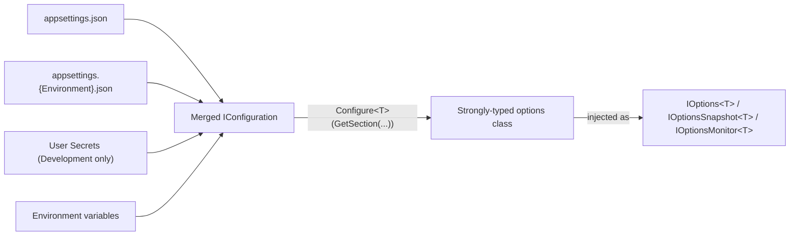
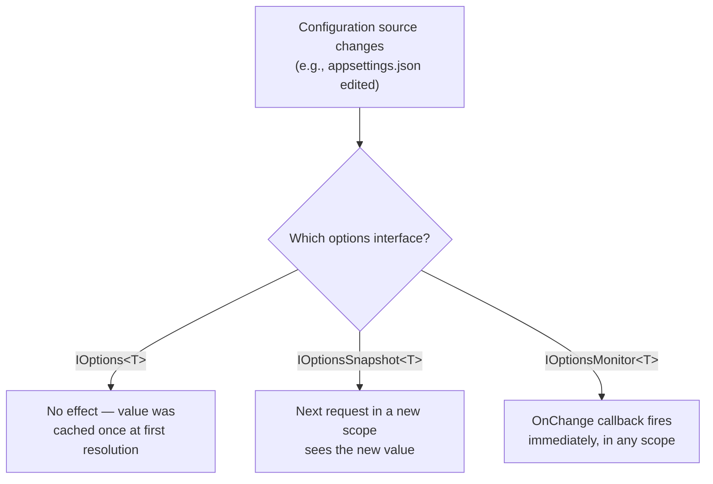

# Configuration and the Options Pattern

## Introduction

Before reading this lesson, you should already be comfortable with **[Background Services with IHostedService](../10-aspnetcore/10-18-ihostedservice-background-services.md)**. That lesson's interest accrual worker ran on a fixed, hardcoded ten-second interval — which is fine for a lesson, but no real service ships with its schedule, its API keys, or its business thresholds baked directly into the source code. This lesson covers where those values actually live: `appsettings.json` and the other configuration sources ASP.NET Core layers on top of it, read either loosely through `IConfiguration` or, far more commonly in real code, bound to strongly-typed settings classes through the Options pattern.

By the end of this lesson, you will be able to:

- Explain the configuration provider layering order — `appsettings.json`, environment-specific JSON, user secrets, environment variables — and why later providers override earlier ones
- Read configuration values directly through `IConfiguration`
- Bind a configuration section to a strongly-typed POCO using the Options pattern
- Distinguish `IOptions<T>`, `IOptionsSnapshot<T>`, and `IOptionsMonitor<T>`, and know when each is the right choice
- Use user secrets to keep sensitive local-development values out of source control

## Configuration and the Options Pattern — A Layman's Perspective

Picture a company's dress code policy. The employee handbook, printed once and handed to everyone on their first day, lays out the baseline rule: "business casual, Monday through Friday." Later, the marketing department pins a memo to its own floor's bulletin board: "on client-visit days, marketing wears business formal instead." Neither document contradicts the other in full — the memo doesn't rewrite the entire handbook, it just overrides the one line about dress code, for one specific floor, while every other policy in the handbook (working hours, break-room rules, whatever else the handbook covers) still applies exactly as printed. Then, on one specific Tuesday, a floor manager sends a last-minute message: "today only, casual dress is fine — we're doing warehouse inventory." That message overrides the memo, which overrode the handbook, and it does so for exactly one day, leaving the handbook and the memo both perfectly intact and back in effect the moment that Tuesday ends.

This is precisely how an ASP.NET Core app builds its configuration. `appsettings.json` is the printed handbook — the baseline settings that ship with the app. `appsettings.Production.json` (or `.Development.json`) is the department memo — an environment-specific override layered on top, changing only the keys it explicitly mentions and leaving everything else from the base file untouched. Environment variables, set at deployment time by whoever's actually running the container or the server, are the floor manager's last-minute message — the final word, overriding both files, without anyone needing to edit a checked-in file to make that override happen. Each layer is a targeted patch over the one beneath it, not a wholesale replacement, which is exactly why a production `appsettings.Production.json` file is typically tiny: it only needs to state the handful of values that actually differ from the base handbook, not repeat the entire thing.

There's one more piece of this analogy worth drawing out: the handbook is a document every new hire reads and every visitor could, in principle, glance at — it's not confidential. But a company's actual database password, or the API key for its payment processor, is not something that belongs anywhere near a document handed out on day one and stored in a shared filing cabinet everyone can open. That's the role user secrets play during local development: a settings store that lives entirely outside the project folder, on the individual developer's own machine, specifically so a real API key never ends up committed to source control by accident, checked into a shared repository, and then quietly leaked the moment that repository becomes public or gets forked by someone who shouldn't have had it.

Once those layered settings are assembled, reading them one loose string at a time — "go find the key called `PaymentGateway:ApiKey` in this giant merged dictionary" — works, but it's fragile and easy to typo. The Options pattern is the equivalent of translating that entire assembled policy document into a proper, structured form with a specific field for each rule, so the rest of the application interacts with "the dress code setting," a named, typed thing, rather than re-reading and re-parsing the raw handbook text every single time it needs to know the rule.

## Configuration and the Options Pattern — A Programming Language Perspective

`IConfiguration` in ASP.NET Core is built by a `ConfigurationBuilder` that aggregates multiple providers, added in a specific order by `WebApplication.CreateBuilder`: `appsettings.json`, then `appsettings.{EnvironmentName}.json`, then user secrets (only when the environment is `Development`), then environment variables, then command-line arguments — each provider's keys override any matching key from a provider added earlier, merged hierarchically using colon-delimited keys such as `PaymentGateway:ApiKey`, which environment variables express using a double-underscore convention (`PaymentGateway__ApiKey`) since most shells don't allow colons in variable names. The Options pattern binds a configuration section to a POCO via `builder.Services.Configure<TOptions>(builder.Configuration.GetSection("SectionName"))`, registering it for dependency injection as `IOptions<TOptions>` — resolved once and cached for the app's lifetime — `IOptionsSnapshot<TOptions>` — recomputed per scope, so a new HTTP request sees a config file change without an app restart — or `IOptionsMonitor<TOptions>` — a singleton that also exposes an `OnChange` callback for reacting to a reload the instant it happens, from anywhere, without waiting for a new scope at all.

## How to Bind Configuration to a Strongly-Typed Options Class

Binding starts with a section in `appsettings.json`, a matching POCO with properties named to line up with that section's keys, and a single `Configure<T>` call at startup — after that, the rest of the app depends on the typed class, never on raw configuration strings.


*Figure 1: Four layered sources merge into one `IConfiguration`, which is then bound once into a typed class rather than read as loose strings throughout the app.*

```json
// appsettings.json
{
  "PaymentGateway": {
    "ApiKey": "sandbox-key-0000",
    "TimeoutSeconds": 30
  }
}
```

```csharp
// Program.cs — .NET 10 / C# 14
var builder = WebApplication.CreateBuilder(args);
builder.Services.Configure<PaymentGatewayOptions>(
    builder.Configuration.GetSection("PaymentGateway"));

var app = builder.Build();

app.MapGet("/api/payment-gateway/settings", (IOptions<PaymentGatewayOptions> options) =>
    new { timeoutSeconds = options.Value.TimeoutSeconds });

app.Run();

public sealed class PaymentGatewayOptions
{
    public string ApiKey { get; set; } = string.Empty;
    public int TimeoutSeconds { get; set; }
}
```

**Console Output** *(this is an ASP.NET Core app — "console output" here means the actual HTTP request/response, not a literal console-app trace):*

```text
--> GET /api/payment-gateway/settings HTTP/1.1

<-- HTTP/1.1 200 OK
    Content-Type: application/json

    {"timeoutSeconds":30}
```

The endpoint never reads `"PaymentGateway:TimeoutSeconds"` as a raw string anywhere — it depends only on `PaymentGatewayOptions.TimeoutSeconds`, a normal C# `int` property. Setting an environment variable named `PaymentGateway__TimeoutSeconds=5` before starting the app would change this response to `{"timeoutSeconds":5}` with no code change at all, because environment variables are layered on top of `appsettings.json` in the provider order described above. Note that `ApiKey` is deliberately never returned from this endpoint — binding a sensitive value into a typed options class doesn't make it safe to expose; that judgment call still belongs to you.

## Real-Time Example: Live-Reloadable Shipping Rules for E-Commerce Order Processing

We continue building on the E-Commerce Order Processing domain. The storefront's free-shipping threshold and per-order item limit are exactly the kind of values a business team wants to tune without redeploying the app — and because the default JSON configuration provider watches its file for changes, `IOptionsSnapshot<T>` picks up an edited `appsettings.json` on the very next request, with no restart required.

```json
// appsettings.json
{
  "OrderProcessing": {
    "FreeShippingThreshold": 50.00,
    "MaxItemsPerOrder": 20
  }
}
```

```csharp
// Program.cs — .NET 10 / C# 14 — Real-Time Example
var builder = WebApplication.CreateBuilder(args);
builder.Services.Configure<OrderProcessingOptions>(
    builder.Configuration.GetSection("OrderProcessing"));

var app = builder.Build();

app.MapGet("/api/orders/shipping-quote/{orderTotal:decimal}",
    (decimal orderTotal, IOptionsSnapshot<OrderProcessingOptions> options) =>
    {
        OrderProcessingOptions settings = options.Value;
        bool freeShipping = orderTotal >= settings.FreeShippingThreshold;
        decimal shippingFee = freeShipping ? 0m : 6.99m;

        return new
        {
            orderTotal,
            freeShippingThreshold = settings.FreeShippingThreshold,
            shippingFee,
            freeShipping
        };
    });

app.Run();

public sealed class OrderProcessingOptions
{
    public decimal FreeShippingThreshold { get; set; }
    public int MaxItemsPerOrder { get; set; }
}
```

**Console Output** *(two requests, with `appsettings.json`'s `FreeShippingThreshold` edited from `50.00` to `35.00` on disk in between — no restart):*

```text
--> GET /api/orders/shipping-quote/40.00 HTTP/1.1

<-- HTTP/1.1 200 OK
    {"orderTotal":40.00,"freeShippingThreshold":50.00,"shippingFee":6.99,"freeShipping":false}

    (appsettings.json edited on disk: FreeShippingThreshold changed to 35.00)

--> GET /api/orders/shipping-quote/40.00 HTTP/1.1

<-- HTTP/1.1 200 OK
    {"orderTotal":40.00,"freeShippingThreshold":35.00,"shippingFee":0,"freeShipping":true}
```

The exact same order total of `40.00` gets a different shipping quote on the second call, purely because the underlying JSON file changed — `IOptionsSnapshot<OrderProcessingOptions>` re-evaluates the section once per request scope, so the business team can adjust the free-shipping threshold in a config file (or, in production, through whatever mechanism updates the deployed configuration) without anyone touching code or restarting the service.

## IOptions\<T\> vs IOptionsSnapshot\<T\> vs IOptionsMonitor\<T\>

All three read from the same bound configuration section; they differ only in *when* that binding is (re-)evaluated and how a running app finds out about a change.


*Figure 2: The same change reaches each consumer on a different schedule — never, next-request, or immediately.*

| Aspect | `IOptions<T>` | `IOptionsSnapshot<T>` | `IOptionsMonitor<T>` |
|---|---|---|---|
| Lifetime | Singleton | Scoped | Singleton |
| Picks up config file changes | No — cached at first use | Yes — per new scope/request | Yes — immediately, via `OnChange` |
| Usable inside another singleton | Yes | No (scoped-in-singleton is a lifetime mismatch) | Yes |
| Typical use | Settings that truly never change at runtime | Per-request settings in a web app, as shown above | Long-lived services (like a `BackgroundService`) that need live updates |

## Types of Configuration Sources and Binding in .NET

1. **Raw `IConfiguration` access** — `configuration["PaymentGateway:ApiKey"]` or `configuration.GetValue<int>("PaymentGateway:TimeoutSeconds")`, useful for one-off reads but easy to typo.
2. **The Options pattern** — binding a section to a POCO, as used throughout this lesson, for compile-time-checked, IntelliSense-friendly settings.
3. **User secrets** — `dotnet user-secrets set "PaymentGateway:ApiKey" "..."`, stored outside the project folder, active only in the `Development` environment.
4. **Environment variables** — the double-underscore key convention, typically the final override layer in containerized or cloud deployments.
5. **Options validation** — `ValidateDataAnnotations()` or a custom `IValidateOptions<T>` on the same `OptionsBuilder<T>` returned by `Configure<T>`, catching a missing or malformed setting at startup rather than at first use; conceptually the same discipline as **[Model Validation](../10-aspnetcore/10-10-model-validation.md)** applied to configuration instead of request bodies.
6. **`IOptionsMonitor<T>.OnChange`** — a live-update callback, most useful inside a long-lived singleton or a `BackgroundService` like the one in the previous lesson, which needs to notice a changed setting without waiting for a new DI scope.

## What You've Learned & What's Next

`IConfiguration` merges `appsettings.json`, environment-specific JSON, user secrets, and environment variables into one layered settings source, with each later provider overriding only the keys it explicitly sets. The Options pattern turns that merged, loosely-typed source into a proper C# class, and the choice between `IOptions<T>`, `IOptionsSnapshot<T>`, and `IOptionsMonitor<T>` determines whether — and how quickly — a running app notices when those settings change underneath it.

Continue your learning journey with **[Logging in ASP.NET Core](../10-aspnetcore/10-20-logging-in-aspnetcore.md)**, where we cover the `ILogger` calls this lesson's examples have already been quietly relying on, and how to configure what gets logged, where, and at what severity.

---
*Applies to: .NET 10 / C# 14. Last reviewed 2026-08-16.*
