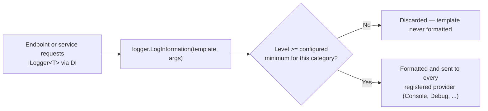

# Logging in ASP.NET Core

## Introduction

Before reading this lesson, you should already be comfortable with **[Configuration and the Options Pattern](../10-aspnetcore/10-19-configuration-and-options-pattern.md)** — in particular, how `appsettings.json`, environment-specific overrides, and strongly typed options all flow through the same configuration system at startup. Logging in ASP.NET Core turns out to be configured through that exact same system, which is why it belongs right here: once you know how to shape configuration for your own settings, shaping it for the framework's built-in `ILogger<T>` is almost the same skill applied to a different section of the same JSON file. This lesson also reaches back further, to Module 05's **[Logging Exceptions — Best Practices](../05-exception-handling/05-10-logging-exceptions-best-practices.md)**, and shows that the `ILogger<T>` you used there for a console application is the *exact same abstraction* every ASP.NET Core app is already using — you've simply never seen where it comes from or how to steer it until now.

By the end of this lesson, you will be able to:

- Obtain an `ILogger<T>` in a minimal API endpoint or any DI-registered class, without constructing one by hand
- Choose the correct log level (`Trace` through `Critical`) for a given situation
- Write structured log messages with named placeholders in a message template, and explain why that beats string interpolation
- Configure minimum log levels per category, and swap logging providers, entirely from `appsettings.json`
- Read a real ASP.NET Core console log and understand what each line is telling you
- Apply structured logging to a realistic order-placement endpoint in the E-Commerce Order Processing case study

## Logging in ASP.NET Core — A Layman's Perspective

Picture an air traffic control tower. Every controller in that tower is required to keep a running log of what happens on their shift — but not every event gets written down with the same urgency, and not every event gets written down the same way. A plane taxiing normally from gate to runway is routine; if it gets logged at all, it's a quiet notation nobody needs to see unless something goes wrong later and an investigator wants the full timeline. A near-miss on the runway, on the other hand, gets a loud, immediate entry that every supervisor in the building sees the moment it happens. Both entries exist on the same shared logbook, but the tower has an agreed-upon system of *severity* — routine notes, cautions, and emergencies — so that the people reading the log later can filter for what actually matters to them without wading through every taxi and takeoff.

Now picture how those entries actually get written. A sloppy controller might scrawl a free-form sentence: "Plane near runway 2 had an issue around 3, dealt with it, flight was Delta something." That sentence technically records that something happened, but if you wanted to search a year of logbooks for every incident on "runway 2," or every incident involving "Delta" flights, or every incident that happened between 3:00 and 3:15, you'd be out of luck — the useful facts are buried inside a sentence built for humans to read once, not for a system to search later. A well-trained controller instead fills out a form with labeled fields: `Runway: 2`, `Flight: DL447`, `Time: 15:03`, `Severity: Caution`. Nothing about the underlying event changed — but now every one of those facts is its own labeled, searchable field, and a thousand incident forms can be filtered, sorted, and counted by any one of them instantly.

ASP.NET Core's logging system works on exactly these two ideas at once. First, every log entry carries a severity — the same "routine, caution, emergency" idea, formalized into six named levels — so that a production system can be told, in one place, "only show me caution and above," and quietly drop the routine notes without anyone having to delete them from the code. Second, every log entry is written as a *form with labeled fields* rather than a free-form sentence: instead of writing "Order 4821 placed" as one flattened string, you write a template — "Order {OrderId} placed" — and hand the `OrderId` value in separately, so it stays a distinct, searchable field in whatever system eventually stores that log line, rather than disappearing into a paragraph of text.

The tower's logbook is also just one physical object sitting on a desk — but nothing stops the tower from also wiring a copy of every entry straight to a monitoring screen down the hall, or to a printer, or to an archive room, all from the same act of writing the entry once. ASP.NET Core's logging *providers* are that wiring: the same `LogInformation` call can simultaneously reach a developer's console window, a debug window, and — in a production system — a centralized log-aggregation service, all without the code that wrote the log entry knowing or caring which of those destinations exist. Whoever configures the tower decides where the copies go; the controller filling out the form doesn't need to know or think about it at all.

## Logging in ASP.NET Core — A Programming Language Perspective

`Microsoft.Extensions.Logging` — the same abstraction Module 05 introduced for a plain console app — is wired into ASP.NET Core's dependency injection container automatically the moment `WebApplication.CreateBuilder` runs, with no extra registration required. Any class resolved through DI, and any minimal API endpoint delegate, can request an `ILogger<T>` as a parameter, where `T` becomes the log entry's *category* — conventionally the requesting class's own type, so log output can be filtered by which part of the application produced it. `ILogger<T>.LogInformation`, `LogWarning`, `LogError`, and the rest each accept a message *template* containing named placeholders (`{OrderId}`), followed by the values that fill them — never an interpolated string — which keeps every value available as a distinct, queryable field rather than collapsed into one string, and, as a secondary benefit, means the template's arguments are formatted only if the entry's level actually passes the configured minimum, avoiding wasted work for filtered-out `LogDebug` or `LogTrace` calls. Configuration for logging — minimum levels per category, and which providers are active — is read from the standard `IConfiguration` pipeline covered in the previous lesson, conventionally under a `Logging` section in `appsettings.json`.

## How to Use ILogger&lt;T&gt; in ASP.NET Core

Getting a working, filtered, structured log out of a minimal API takes no explicit setup at all — `WebApplication.CreateBuilder` already registers a console logging provider by default, reading its minimum levels from `appsettings.json`. All that's left is asking for an `ILogger<T>` and writing a template instead of an interpolated string.


*Figure 1: The category and level are checked before the template is ever formatted — a filtered-out `LogDebug` call costs almost nothing.*

```csharp
// Program.cs — .NET 10 / C# 14
var builder = WebApplication.CreateBuilder(args);
var app = builder.Build();

app.MapGet("/api/ping", (ILogger<Program> logger) =>
{
    int requestId = Random.Shared.Next(1000, 9999);
    logger.LogInformation("Ping received. RequestId: {RequestId}", requestId);
    return Results.Ok(new { requestId, status = "pong" });
});

app.Run();
```

This lesson's "Console Output" blocks show what an ASP.NET Core app actually prints — startup log lines and the log lines a request triggers — rather than a plain console app's `Console.WriteLine` trace, since that is what running this code produces.

**Console Output** *(startup, then after a `GET /api/ping` request arrives):*

```text
info: Microsoft.Hosting.Lifetime[14]
      Now listening on: http://localhost:5000
info: Microsoft.Hosting.Lifetime[0]
      Application started. Press Ctrl+C to shut down.
info: Microsoft.Hosting.Lifetime[0]
      Hosting environment: Development
info: Microsoft.Hosting.Lifetime[0]
      Content root path: C:\src\PingDemo
info: Program[0]
      Ping received. RequestId: 4821
```

**HTTP Response** *(for the request that produced the log line above):*

```text
HTTP/1.1 200 OK
Content-Type: application/json; charset=utf-8

{"requestId":4821,"status":"pong"}
```

The first four lines come from the host itself, logged under the `Microsoft.Hosting.Lifetime` category before your code ever runs. The fifth line is this endpoint's own `LogInformation` call, logged under the `Program` category — ASP.NET Core derives that category name directly from the `T` in `ILogger<T>`. Nothing in the code chose "Program" as a string; it fell out of `ILogger<Program>` automatically, which is exactly what makes filtering by category possible later.

Minimum levels and which providers are active are both controlled from configuration, not code:

```json
{
  "Logging": {
    "LogLevel": {
      "Default": "Information",
      "Microsoft.AspNetCore": "Warning"
    },
    "Console": {
      "LogToStandardErrorThreshold": "Error"
    }
  }
}
```

`"Default": "Information"` means `LogInformation` and above are emitted for every category unless overridden; `"Microsoft.AspNetCore": "Warning"` quiets the framework's own routine per-request logging down to warnings and above, which is why a default project's console isn't flooded with a line for every single incoming request. Adding a provider — say, `Microsoft.Extensions.Logging.Debug` for the Visual Studio Debug window, or a third-party sink like Serilog — is a one-line call in `Program.cs` (`builder.Logging.AddDebug()`); the categories and levels configured in `appsettings.json` apply to every provider that's active, without duplicating that configuration per provider.

## Real-Time Example: Structured Order Logging in E-Commerce Order Processing

We extend the E-Commerce Order Processing case study with an `OrderService`, registered in DI and resolved by a minimal API endpoint that accepts a new order request. Every step of validating and placing the order is logged with a message template — never an interpolated string — and the appsettings-driven minimum level for this specific category is turned down to `Debug`, so its internal validation step becomes visible without touching a single line of code.

```mermaid
sequenceDiagram
    participant Client
    participant Endpoint as POST /api/orders
    participant OrderService
    participant Logger as ILogger&lt;OrderService&gt;
    Client->>Endpoint: CreateOrderRequest
    Endpoint->>OrderService: PlaceOrder(customerId, sku, quantity)
    OrderService->>Logger: LogDebug("Validating order request...")
    OrderService->>Logger: LogInformation("Order {OrderId} placed...") or LogWarning(...)
    OrderService-->>Endpoint: OrderResult
    Endpoint-->>Client: 201 Created or 400 Bad Request
```
*Figure 2: Every step of `PlaceOrder` writes a structured log entry before the HTTP response is even built.*

```csharp
// Program.cs — .NET 10 / C# 14 — Real-Time Example
var builder = WebApplication.CreateBuilder(args);
builder.Services.AddSingleton<OrderService>();
var app = builder.Build();

app.MapPost("/api/orders", (CreateOrderRequest request, OrderService orderService) =>
{
    OrderResult result = orderService.PlaceOrder(request.CustomerId, request.Sku, request.Quantity);
    return result.Success
        ? Results.Created($"/api/orders/{result.OrderId}", result)
        : Results.BadRequest(result);
});

app.Run();

record CreateOrderRequest(string CustomerId, string Sku, int Quantity);
record OrderResult(bool Success, string? OrderId, string Message);

class OrderService(ILogger<OrderService> logger)
{
    private static int _nextOrderNumber = 5000;

    public OrderResult PlaceOrder(string customerId, string sku, int quantity)
    {
        logger.LogDebug(
            "Validating order request for customer {CustomerId}, SKU {Sku}, quantity {Quantity}",
            customerId, sku, quantity);

        if (quantity <= 0)
        {
            logger.LogWarning(
                "Rejected order for customer {CustomerId}: invalid quantity {Quantity}",
                customerId, quantity);
            return new OrderResult(false, null, "Quantity must be greater than zero.");
        }

        string orderId = $"ORD-{_nextOrderNumber++}";
        logger.LogInformation(
            "Order {OrderId} placed for customer {CustomerId}: {Quantity} x {Sku}",
            orderId, customerId, quantity, sku);

        return new OrderResult(true, orderId, "Order placed successfully.");
    }
}
```

`appsettings.json` turns on the extra `LogDebug` visibility for just this one category:

```json
{
  "Logging": {
    "LogLevel": {
      "Default": "Information",
      "Microsoft.AspNetCore": "Warning",
      "OrderService": "Debug"
    }
  }
}
```

**HTTP Requests and Console Output** *(two requests: a valid order, then an invalid quantity):*

```text
POST /api/orders   { "customerId": "CUST-772", "sku": "SKU-4090", "quantity": 3 }

dbug: OrderService[0]
      Validating order request for customer CUST-772, SKU SKU-4090, quantity 3
info: OrderService[0]
      Order ORD-5000 placed for customer CUST-772: 3 x SKU-4090
--> HTTP/1.1 201 Created  Location: /api/orders/ORD-5000

POST /api/orders   { "customerId": "CUST-772", "sku": "SKU-4090", "quantity": 0 }

dbug: OrderService[0]
      Validating order request for customer CUST-772, SKU SKU-4090, quantity 0
warn: OrderService[0]
      Rejected order for customer CUST-772: invalid quantity 0
--> HTTP/1.1 400 Bad Request
```

Because the `OrderId`, `CustomerId`, `Sku`, and `Quantity` values were passed as separate template arguments rather than interpolated into a sentence, a real log-aggregation backend receiving these entries in production could answer questions like "how many orders were placed for SKU-4090 today" or "show me every rejected order for CUST-772" by filtering on those fields directly — a search that a flattened, interpolated string would make far harder. Turning on `Debug` for just the `OrderService` category, without touching code, is exactly the kind of targeted, temporary visibility a real support incident calls for.

## String Interpolation vs Structured Logging with Message Templates

It's tempting to write `logger.LogInformation($"Order {orderId} placed")` — it compiles, and it looks identical on screen to the template version. The difference is invisible in the console and enormous everywhere else a log entry might end up. An interpolated string is fully built *before* `LogInformation` is even called, which means the cost of formatting it is paid even if the category's minimum level would have discarded the entry anyway. A message template defers formatting until after the level check passes, and — just as importantly — keeps `orderId` around as its own named value in the resulting log entry, rather than baking it irreversibly into one block of text.

```mermaid
flowchart TB
    Start["Writing a log statement"] --> Q1{"Interpolated string,\nor message template?"}
    Q1 -->|"$\"Order {orderId} placed\""| Bad["Formatted immediately, always —\norderId is now unrecoverable text"]
    Q1 -->|"\"Order {OrderId} placed\", orderId"| Good["Formatted only if the level passes —\nOrderId stays a queryable field"]
```
*Figure 3: The template version is not just a style preference — it changes both when formatting happens and what survives in the final log entry.*

| Aspect | String interpolation | Structured message template |
|---|---|---|
| When arguments are formatted | Immediately, every time the line executes | Only if the category/level check passes |
| Value queryability downstream | Lost — flattened into one text blob | Preserved as a separate named field per placeholder |
| Readability in code | Looks identical at a glance | Looks identical at a glance |
| Recommended by `Microsoft.Extensions.Logging` | No — and most analyzers flag it | Yes — this is the pattern the API is designed around |

## Types of Logging Concepts in ASP.NET Core

Several related pieces round out what this lesson introduced, some of which get their own deeper treatment elsewhere in the curriculum:

1. **Log levels (`LogTrace` through `LogCritical`)** — the same six-level severity scale from Module 05, now filterable per category through `appsettings.json` rather than hardcoded.
2. **Logging providers (Console, Debug, EventSource, and external sinks like Serilog or Application Insights)** — one `ILogger<T>` call, fanned out to every provider registered at startup.
3. **Log scopes (`ILogger.BeginScope`)** — a way to attach a shared value, such as a request or correlation ID, to every log entry written inside a block of code, without repeating it in every template.
4. **[Configuration and the Options Pattern](../10-aspnetcore/10-19-configuration-and-options-pattern.md)** — the same `appsettings.json`-driven configuration pipeline this lesson's `Logging` section rides on directly.
5. **[Logging Exceptions — Best Practices](../05-exception-handling/05-10-logging-exceptions-best-practices.md)** — this lesson's direct ancestor, covering how to log the full exception object rather than just its message.
6. **`[LoggerMessage]` source-generated logging** — a compile-time alternative to calling `LogInformation` directly, generating a strongly typed logging method that avoids boxing arguments, useful on the hottest logging paths in a high-throughput API.

## What You've Learned & What's Next

`ILogger<T>` in ASP.NET Core is the same abstraction you already used in Module 05, now wired automatically through dependency injection and configured, end to end, from `appsettings.json`: log levels decide what gets through, structured message templates keep every value queryable instead of flattened into text, and providers decide where the result ends up. Getting comfortable reading a real startup and request log — rather than only ever printing to a console app's stdout — is a skill every one of the remaining ASP.NET Core lessons will lean on.

Continue your learning journey with **[Razor Pages and Static Files](../10-aspnetcore/10-21-razor-pages-and-static-files.md)**, where we shift from logging what an API does to serving actual pages and static content directly from an ASP.NET Core app.

---
*Applies to: .NET 10 / C# 14. Last reviewed 2026-08-16.*
